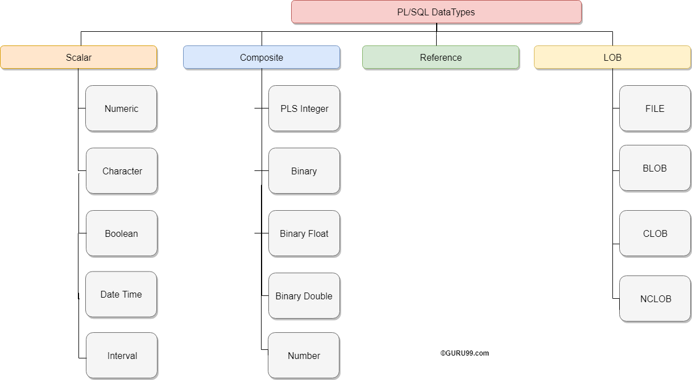
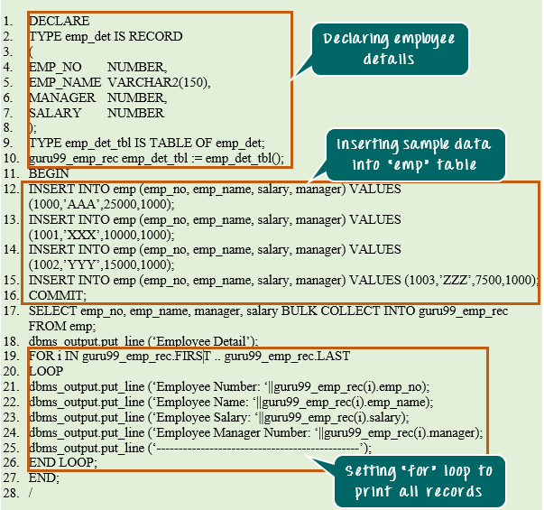
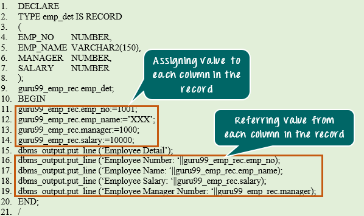
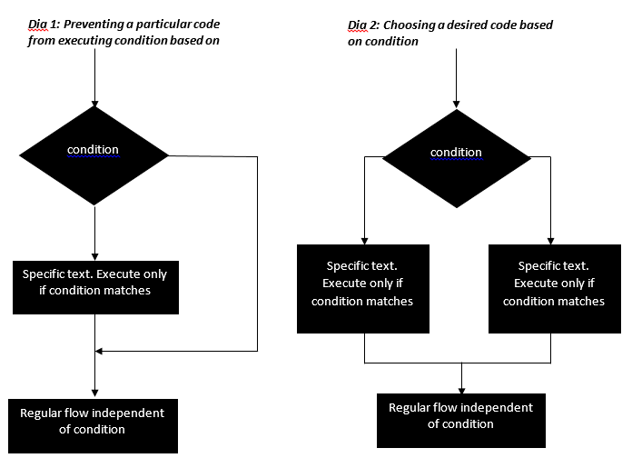
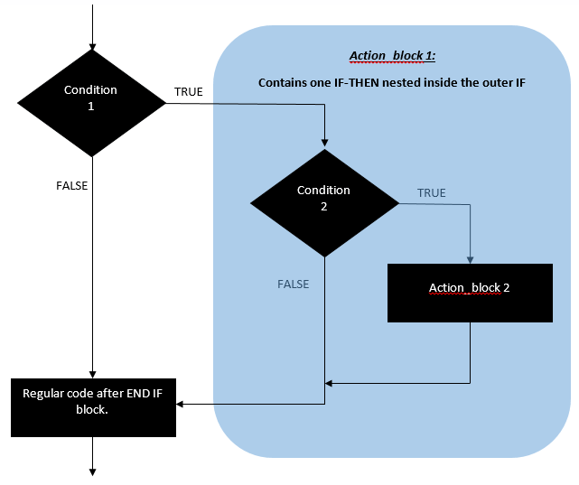
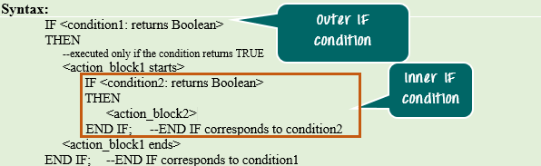
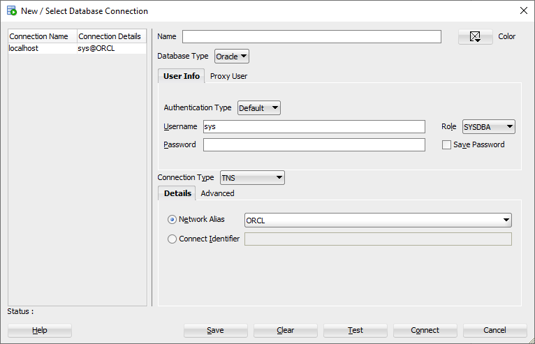
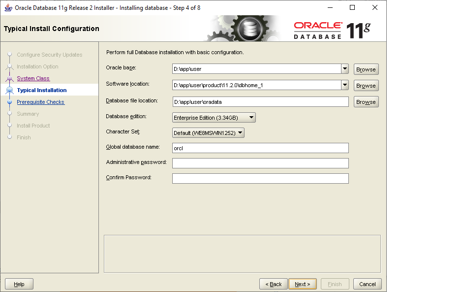

- [PL/ SQL Block: STRUCTURE, Syntax, ANONYMOUS Example](#pl-sql-block-structure-syntax-anonymous-example)
	- [Block Structure](#block-structure)
	- [What is PL/SQL Datatypes?](#what-is-plsql-datatypes)
	- [CHARACTER Data Type:](#character-data-type)
	- [NUMBER Data Type:](#number-data-type)
	- [BOOLEAN Data Type:](#boolean-data-type)
	- [DATE Data Type:](#date-data-type)
	- [LOB Data Type:](#lob-data-type)
	- [Data storing in Variables](#data-storing-in-variables)
- [Oracle PL/SQL Collections: Varrays, Nested & Index by Tables](#oracle-plsql-collections-varrays-nested--index-by-tables)
	- [What is Collection?](#what-is-collection)
	- [Varrays](#varrays)
	- [Nested Tables](#nested-tables)
	- [Index-by-table](#index-by-table)
	- [Constructor and Initialization Concept in Collections](#constructor-and-initialization-concept-in-collections)
	- [Collection Methods](#collection-methods)
	- [What is Record Type?](#what-is-record-type)
	- [What are Decision-Making Statements?](#what-are-decision-making-statements)
	- [IF-THEN Statement](#if-then-statement)
	- [IF-THEN-ELSE Statement](#if-then-else-statement)
	- [IF-THEN-ELSIF Statement](#if-then-elsif-statement)
	- [NESTED-IF Statement](#nested-if-statement)
	- [Summary](#summary)
- [Oracle PL/SQL: CASE Statement with Examples](#oracle-plsql-case-statement-with-examples)
	- [What is CASE Statement?](#what-is-case-statement)
	- [SEARCHED CASE Statement](#searched-case-statement)

---

### concat2

Toan tu ||
https://www.techonthenet.com/oracle/functions/concat2.php

We can concatenate a space character using the `||` operator.

For example:

```
SELECT CONCAT(CONCAT(CONCAT('A', 'B'),'C'),'D')
FROM dual;
Result: 'ABCD'

SELECT 'Dave' || ' ' || 'Anderson'
FROM dual;
Result: 'Dave Anderson'
```

### get date from sys oracle

```sql
SELECT
  TO_CHAR(SYSDATE, 'yyyy/mm/dd hh24:mi:ss') SYS_DATE
FROM
  DUAL

```

### Replace

```sql
SELECT
  REPLACE( 'This is a test', 'is', 'IS' )
FROM
  dual;

```

https://www.oracletutorial.com/

https://www.guru99.com/loops-pl-sql.html

## Tip in sql developers

https://stackoverflow.com/questions/7887413/printing-the-value-of-a-variable-in-sql-developer

You need to turn on dbms_output. In Oracle SQL Developer:

1. Show the DBMS Output window (View->DBMS Output).
2. Press the "+" button at the top of the Dbms Output window and then select an open database connection in the dialog that opens.

In SQL\*Plus:

```sql
 SET SERVEROUTPUT ON
```

---

TOOLS > PREFERENCES, then expand CODE EDITOR and then select **LINE** GUTTER. You can check **SHOW LINE NUMBERS**

To clear the SQL window you can use:

```sql
clear screen;
```

which can also be shortened to

```sql
cl scr;
```

# PL/ SQL Block: STRUCTURE, Syntax, ANONYMOUS Example

## Block Structure

PL/SQL blocks have a pre-defined structure in which the code is to be grouped. Below are different sections of PL/SQL blocks.

1. Declaration section
2. Execution section
3. Exception-Handling section

The below picture illustrates the different PL/SQL block and their section order.

[](https://www.guru99.com/images/PL-SQL/110215_0632_BlocksinPLS1.png)

```
DECLARE --optional
    <declarations>

BEGIN   --mandatory
    <executable statements. At least one executable statement is mandatory>

EXCEPTION --optional
    <exception handles>

END;   --mandatory
/
```

**Note:** A block should always be followed by '/' which sends the information to the compiler about the end of the block.

---

Loop

```sql
DECLARE
a NUMBER:=1;
BEGIN
dbms_output.put_line('Program started.');
LOOP
dbms_output.put_line(a);
a:=a+1;
EXIT WHEN a>5;
END LOOP;
dbms_output.put_line('Program completed');
END;
/
```

## What is PL/SQL Datatypes?

Following is the diagram of different Data Types in PL/SQL

[](https://www.guru99.com/images/1/plsql_datatype.png)

In this tutorial, you will learn-

- [CHARACTER Data Type](https://www.guru99.com/pl-sql-data-types.html#1)
- [NUMBER Data Type](https://www.guru99.com/pl-sql-data-types.html#2)
- [BOOLEAN Data Type](https://www.guru99.com/pl-sql-data-types.html#3)
- [DATE Data Type](https://www.guru99.com/pl-sql-data-types.html#4)
- [LOB Data Type](https://www.guru99.com/pl-sql-data-types.html#5)

## CHARACTER Data Type:

This data type basically stores alphanumeric characters in string format.

The literal values should always be enclosed in single quotes while assigning them to CHARACTER data type.

This character data type is further classified as follows:

- CHAR Data type (fixed string size)
- VARCHAR2 Data type (variable string size)
- VARCHAR Data type
- NCHAR (native fixed string size)
- NVARCHAR2 (native variable string size)
- LONG and LONG RAW

| Data Type            | Description                                                                                                                                                                                                                                                                                                                                                                                                                                                                                                                                                                                                                           | Syntax                                                                                                                                                                                                                                                                                                                                                                                                                                                           |
| :------------------- | :------------------------------------------------------------------------------------------------------------------------------------------------------------------------------------------------------------------------------------------------------------------------------------------------------------------------------------------------------------------------------------------------------------------------------------------------------------------------------------------------------------------------------------------------------------------------------------------------------------------------------------ | :--------------------------------------------------------------------------------------------------------------------------------------------------------------------------------------------------------------------------------------------------------------------------------------------------------------------------------------------------------------------------------------------------------------------------------------------------------------- |
| **CHAR**             | This data type stores the string value, and the size of the string is fixed at the time of declaring the variable. <br /><br />Oracle sẽ được chèn khoảng trắng vào biến nếu biến không chiếm toàn bộ kích thước đã được khai báo cho nó, do đó, Oracle sẽ phân bổ bộ nhớ cho kích thước khai báo ngay cả khi biến đó không chiếm hết. <br />The size restriction for this data type is 1-2000 bytes.<br />CHAR data type is more appropriate to use where ever fixed the size of data will be handled.                                                                                                                               | `grade CHAR; manager CHAR (10):= 'guru99';`<br />**Syntax Explanation:** The first declaration statement declared the variable 'grade' of CHAR data type with the maximum size of 1 byte (default value).<br />The second declaration statement declared the variable 'manager' of CHAR data type with the maximum size of 10 and assigned the value 'guru99' which is of 6 bytes. Oracle will allocate the memory of 10 bytes rather than 6 bytes in this case. |
| **VARCHAR2**         | This data type stores the string, but the length of the string is not fixed. The size restriction for this data type is 1-4000 bytes for table column size and 1-32767 bytes for variables.The size is defined for each variable at the time of variable declaration.But Oracle will allocate memory only after the variable is defined, i.e., Oracle will consider only the actual length of the string that is stored in a variable for memory allocation rather than the size that has been given for a variable in the declaration part.It is always good to use VARCHAR2 instead of CHAR data type to optimize the memory usage. | `manager VARCHAR2(10) := ‘guru99';`**Syntax Explanation:** The above declaration statement declared the variable 'manager' of VARCHAR2 data type with the maximum size of 10 and assigned the value 'guru99' which is of 6 bytes. Oracle will allocate memory of only 6 bytes in this case.                                                                                                                                                                      |
| **VARCHAR**          | This is synonymous with the VARCHAR2 data type. It is always a good practice to use VARCHAR2 instead of VARCHAR to avoid behavioral changes.                                                                                                                                                                                                                                                                                                                                                                                                                                                                                          | `manager VARCHAR(10) := ‘guru99';`**Syntax Explanation:** The above declaration statement declared the variable 'manager' of VARCHAR data type with the maximum size of 10 and assigned the value 'guru99' which is of 6 bytes. Oracle will allocate memory of only 6 bytes in this case. (Similar to VARCHAR2)                                                                                                                                                  |
| **NCHAR**            | This data type is same as CHAR data type, but the character set will of the national character set. This character set can be defined for the session using NLS_PARAMETERS.The character set can be either UTF16 or UTF8.The size restriction is 1-2000 bytes.                                                                                                                                                                                                                                                                                                                                                                        | `native NCHAR(10);`**Syntax Explanation:** The above declaration statement declares the variable 'native' of NCHAR data type with the maximum size of 10.The length of this variable depends upon the (number of lengths) per byte as defined in the character set.                                                                                                                                                                                              |
| **NVARCHAR2**        | This data type is same as VARCHAR2 data type, but the character set will be of the national character set.This character set can be defined for the session using NLS_PARAMETERS.The character set can be either UTF16 or UTF8.The size restriction is 1-4000 bytes.                                                                                                                                                                                                                                                                                                                                                                  | `Native var NVARCHAR2(10):='guru99';`**Syntax Explanation:** The above declaration statement declares the variable 'Native_var' of NVARCHAR2 data type with the maximum size of 10.                                                                                                                                                                                                                                                                              |
| **LONG and LONGRAW** | This data type is used to store large text or raw data up to the maximum size of 2GB.These are mainly used in the data dictionary.LONG data type is used to store character set data, while LONG RAW is used to store data in binary format.LONG RAW data type accepts media objects, images, etc. whereas LONG works only on data that can be stored using character set.                                                                                                                                                                                                                                                            | `Large_text LONG; Large_raw LONG RAW;`**Syntax Explanation:** The above declaration statement declares the variable 'Large_text' of LONG data type and 'Large_raw' of LONG RAW data type.**Note:** Using LONG data type is not recommended by Oracle. Instead, LOB data type should be preferred.                                                                                                                                                                |

## NUMBER Data Type:

This data type stores fixed or floating point numbers up to 38 digits of precision. This data type is used to work with fields which will contain only number data. The variable can be declared either with precision and decimal digit details or without this information. Values need not enclose within quotes while assigning for this data type.

```
A NUMBER(8,2);
B NUMBER(8);
C NUMBER;
```

**Syntax Explanation:**

- In the above, the first declaration declares the variable 'A' is of number data type with total precision 8 and decimal digits 2.
- The second declaration declares the variable 'B' is of number data type with total precision 8 and no decimal digits.
- The third declaration is the most generic, declares variable 'C' is of number data type with no restriction in precision or decimal places. It can take up to a maximum of 38 digits.

## BOOLEAN Data Type:

This data type stores the logical values. It represents either TRUE or FALSE and mainly used in conditional statements. Values need not enclose within quotes while assigning for this data type.

```
Var1 BOOLEAN;
```

**Syntax Explanation:**

- In the above, variable 'Var1' is declared as BOOLEAN data type. The output of the code will be either true or false based on the condition set.

## DATE Data Type:

This data type stores the values in date format, as date, month, and year. Whenever a variable is defined with DATE data type along with the date it can hold time information and by default time information is set to 12:00:00 if not specified. Values need to enclose within quotes while assigning for this data type.

The standard Oracle time format for input and output is 'DD-MON-YY' and it is again set at NLS_PARAMETERS (NLS_DATE_FORMAT) at the session level.

```
newyear DATE:='01-JAN-2015';
current_date DATE:=SYSDATE;
```

**Syntax Explanation:**

- In the above, variable 'newyear' is declared as DATE data type and assigned the value of Jan 1st, 2015 date.
- The second declaration declares the variable current_date as DATE data type and assigned the value with current system date.
- Both these variable holds the time information.

## LOB Data Type:

This data type is mainly used to store and manipulate large blocks of unstructured data's like images, multimedia files, etc. Oracle prefers LOB instead of the a LONG data type as it is more flexible than the LONG data type. The below are the few main advantage of LOB over LONG data type.

- The number of column in a table with LONG data type is limited to 1, whereas a table has no restriction on a number of columns with LOB data type.
- The data interface tool accepts LOB data type of the table during data replication, but it omits LONG column of the table. These LONG columns need to be replicated manually.
- The size of the LONG column is 2GB, whereas LOB can store up to 128 TB.
- Oracle is constantly improving the LOB data type in each of their releases according to the modern requirement, whereas LONG data type is constant and not getting many updates.

So, it is always good to use LOB data type instead of the LONG data type. Following are the different LOB data types. They can store up to the size of 128 terabytes.

1. BLOB
2. CLOB and NCLOB
3. BFILE

| Data Type          | Description                                                                                                                                                                                                                                                                                                                         | Syntax                                                                                                        |
| :----------------- | :---------------------------------------------------------------------------------------------------------------------------------------------------------------------------------------------------------------------------------------------------------------------------------------------------------------------------------- | :------------------------------------------------------------------------------------------------------------ |
| **BLOB**           | This data type stores the LOB data in the binary file format up to the maximum size of 128 TB. This doesn't store data based on the character set details, so that it can store the unstructured data such as multimedia objects, images, etc.                                                                                      | `Binary_data BLOB;`**Syntax Explanation:**In the above, variable 'Binary_data' is declared as a BLOB.         |
| **CLOB and NCLOB** | CLOB data type stores the LOB data into the character set, whereas NCLOB stores the data in the native character set. Since these data types use character set based storage, these cannot store the data like multimedia, images, etc. that cannot be put into a character string. The maximum size of these data types is 128 TB. | `Charac_data CLOB;`**Syntax Explanation:**In the above, variable 'Charac_data' is declared as CLOB data type. |
| **BFILE**          | BFILE are the data types that stored the unstructured binary format data outside the database as an operating-system file.The size of BFILE is to a limited operating system, and they are read-only files and can't be modified.                                                                                                   |                                                                                                               |

https://www.guru99.com/pl-sql-data-types.html

## Data storing in Variables

Khai báo trong vùng khai báo

**Syntax**

```
<variable_name> <datatype> := <default_value>;
```

The above syntax shows how to declare the variable and assign value in the declarative section.

```
<Yariable_name> <datatype>;
<variable name> := <value>;
```

# Oracle PL/SQL Collections: Varrays, Nested & Index by Tables

## What is Collection?

A Collection is an ordered group of elements of particular data types. It can be a collection of simple data type or complex data type (like user-defined or record types).

In the collection, each element is identified by a term called **"subscript."** Each item in the collection is assigned with a unique subscript. The data in that collection can be manipulated or fetched by referring to that unique subscript.

Collections are classified based on the structure, subscript, and storage as shown below.

- Index-by-tables (also known as Associative Array)
- Nested tables
- Varrays

## Varrays

Varray is a collection method in which the size of the array is fixed. The array size cannot be exceeded than its fixed value. The subscript of the Varray is of a numeric value. Following are the attributes of Varrays.

- Upper limit size is fixed
- Populated sequentially starting with the subscript '1'

- This collection type is always dense, i.e. we cannot delete any array elements. Varray can be deleted as a whole, or it can be trimmed from the end.
- Since it always is dense in nature, it has very less flexibility.
- It is more appropriate to use when the array size is known and to perform similar activities on all the array elements.
- The subscript and sequence always remain stable, i.e. the subscript and count of the collection is always same.
- They need to be initialized before using them in programs. Any operation (except EXISTS operation) on an uninitialized collection will throw an error.
- It can be created as a database object, which is visible throughout the database or inside the subprogram, which can be used only in that subprogram.

The below figure will explain the memory allocation of Varray (dense) diagrammatically.

| Subscript | 1   | 2   | 3   | 4   | 5   | 6   | 7   |
| --------- | --- | --- | --- | --- | --- | --- | --- |
| Value     | Xyz | Dfv | Sde | Cxs | Vbc | Nhu | Qwe |

**Syntax for VARRAY:**

```
TYPE <type_name> IS VARRAY (<SIZE>) OF <DATA_TYPE>;
```

- In the above syntax, type_name is declared as VARRAY of the type 'DATA_TYPE' for the given size limit. The data type can be either simple or complex type.

## Nested Tables

A Nested table is a collection in which the size of the array is not fixed. It has the numeric subscript type. Below are more descriptions about nested table type.

- The Nested table has no upper size limit.
- Since the upper size limit is not fixed, the collection, memory needs to be extended each time before we use it. We can extend the collection using 'EXTEND' keyword.
- Populated sequentially starting with the subscript '1'.
- This collection type can be of both **dense and sparse**, i.e. we can create the collection as a dense, and we can also delete the individual array element randomly, which make it as sparse.
- It gives more flexibility regarding deleting the array element.
- It is stored in the system generated database table and can be used in the select query to fetch the values.
- The subscript and sequence are not stable, i.e. the subscript and the count of the array element can vary.
- They need to be initialized before using them in programs. Any operation (except EXISTS operation) on the uninitialized collection will throw an error.
- It can be created as a database object, which is visible throughout the database or inside the subprogram, which can be used only in that subprogram.

The below figure will explain the memory allocation of Nested Table (dense and sparse) diagrammatically. The black colored element space denotes the empty element in a collection i.e. sparse.

| Subscript     | 1   | 2   | 3   | 4   | 5   | 6   | 7   |
| ------------- | --- | --- | --- | --- | --- | --- | --- |
| Value (dense) | Xyz | Dfv | Sde | Cxs | Vbc | Nhu | Qwe |
| Value(sparse) | Qwe |     | Asd | Afg |     | Asd | Wer |

**Syntax for Nested Table:**

```
TYPE <tvpe name> IS TABLE OF <DATA TYPE>;
```

- In the above syntax, type_name is declared as Nested table collection of the type 'DATA_TYPE'. The data type can be either simple or complex type.

## Index-by-table

Index-by-table is a collection in which the array size is not fixed. Unlike the other collection types, in the index-by-table collection the subscript can consist be defined by the user. Following are the attributes of index-by-table.

- The subscript can of integer or strings. At the time of creating the collection, the subscript type should be mentioned.
- These collections are not stored sequentially.
- They are always sparse in nature.
- The array size is not fixed.
- They cannot be stored in the database column. They shall be created and used in any program in that particular session.
- They give more flexibility in terms of maintaining subscript.
- The subscripts can be of negative subscript sequence also.
- They are more appropriate to use for relatively smaller collective values in which the collection can be initialized and used within the same subprograms.
- They need not be initialized before start using them.
- It cannot be created as a database object. It can only be created inside the subprogram, which can be used only in that subprogram.
- BULK COLLECT cannot be used in this collection type as the subscript should be given explicitly for each record in the collection.

The below figure will explain the memory allocation of Nested Table (sparse) diagrammatically. The black colored element space denotes the empty element in a collection i.e. sparse.

| Subscript (varchar) | FIRST | SECOND | THIRD | FOURTH | FIFTH | SIXTH | SEVENTH |
| ------------------- | ----- | ------ | ----- | ------ | ----- | ----- | ------- |
| Value(sparse)       | Qwe   |        | Asd   | Afg    |       | Asd   | Wer     |

**Syntax for Index-by-Table**

```
TYPE <type_name> IS TABLE OF <DATA_TYPE> INDEX BY VARCHAR2 (10);
```

- In the above syntax, type_name is declared as an index-by-table collection of the type 'DATA_TYPE'. The data type can be either simple or complex type. The subsciprt/index variable is given as VARCHAR2 type with maximum size as 10.

## Constructor and Initialization Concept in Collections

Constructors are the in-built function provided by the oracle that has the same name as of the object or collections. They are executed first whenever object or collections are getting referred for the first time in a session. Below are the important details of constructor in collection context:

- For collections, these constructors should be called explicitly to initialize it.
- Both Varray and Nested tables need to be initialized through these constructors before getting referred into the program.
- Constructor implicitly extends the memory allocation for a collection (except Varray), hence constructor can also assign the variables to the collections.
- Assigning values to the collection through constructors will never make the collection sparse.

## Collection Methods

Oracle provides many functions to manipulate and to work with the collections. These functions are very much useful in the program to determine and to modify the different attribute of the collections. The Following table will give the different functions and their description.

| **Method**   | **Description**                                                                                                                                                                                       | **SYNTAX**                                 |
| ------------ | ----------------------------------------------------------------------------------------------------------------------------------------------------------------------------------------------------- | ------------------------------------------ |
| EXISTS (n)   | This method will return Boolean results. It will return 'TRUE' if the nth element exists in that collection, else it will return FALSE. Only EXISTS functions can be used in uninitialized collection | <collection_name>.EXISTS(element_position) |
| COUNT        | Gives the total count of the elements present in a collection                                                                                                                                         | <collection_name>.COUNT                    |
| LIMIT        | It returns the maximum size of the collection. For Varray, it will return the fixed size that has been defined. For Nested table and Index-by-table, it gives NULL                                    | <collection_name>.LIMIT                    |
| FIRST        | Returns the value of the first index variable(subscript) of the collections                                                                                                                           | <collection_name>.FIRST                    |
| LAST         | Returns the value of the last index variable(subscript) of the collections                                                                                                                            | <collection_name>.LAST                     |
| PRIOR (n)    | Returns precedes index variable in a collection of the nth element. If there is no precedes index value NULL is returned                                                                              | <collection_name>.PRIOR(n)                 |
| NEXT (n)     | Returns succeeds index variable in a collection of the nth element. If there is no succeeds index value NULL is returned                                                                              | <collection_name>.NEXT(n)                  |
| EXTEND       | Extends one element in a collection at the end                                                                                                                                                        | <collection_name>.EXTEND                   |
| EXTEND (n)   | Extends n elements at the end of a collection                                                                                                                                                         | <collection_name>.EXTEND(n)                |
| EXTEND (n,i) | Extends n copies of the ith element at the end of the collection                                                                                                                                      | <collection_name>.EXTEND(n,i)              |
| TRIM         | Removes one element from the end of the collection                                                                                                                                                    | <collection_name>.TRIM                     |
| TRIM (n)     | Removes n elements from the end of collection                                                                                                                                                         | <collection_name>.TRIM (n)                 |
| DELETE       | Deletes all the elements from the collection. Makes the collection empty                                                                                                                              | <collection_name>.DELETE                   |
| DELETE (n)   | Deletes the nth element from the collection. If the nth element is NULL, then this will do nothing                                                                                                    | <collection_name>.DELETE(n)                |
| DELETE (m,n) | Deletes the element in the range mth to nth in the collection                                                                                                                                         | <collection_name>.DELETE(m,n)              |

**Example1: Record Type at Subprogram level**

In this example, we are going to see how to populate the collection using 'BULK COLLECT' and how to refer the collection data.

[](https://www.guru99.com/images/PL-SQL/110215_0744_ComplexData11.png)

```sql
DECLARE
TYPE emp_det IS RECORD
(
EMP_NO NUMBER,
EMP_NAME VARCHAR2(150),
MANAGER NUMBER,
SALARY NUMBER
);
TYPE emp_det_tbl IS TABLE OF emp_det; guru99_emp_rec emp_det_tbl:= emp_det_tbl();
BEGIN
INSERT INTO emp (emp_no,emp_name, salary, manager) VALUES (1000,’AAA’,25000,1000);
INSERT INTO emp (emp_no,emp_name, salary, manager) VALUES (1001,'XXX’,10000,1000);
INSERT INTO emp (emp_no, emp_name, salary, manager) VALUES (1002,'YYY',15000,1000);
INSERT INTO emp (emp_no,emp_name,salary, manager) VALUES (1003,’ZZZ’,'7500,1000);
COMMIT;
SELECT emp no,emp_name,manager,salary BULK COLLECT INTO guru99_emp_rec
FROM emp;
dbms_output.put_line (‘Employee Detail');
FOR i IN guru99_emp_rec.FIRST..guru99_emp_rec.LAST
LOOP
dbms_output.put_line (‘Employee Number: '||guru99_emp_rec(i).emp_no);
dbms_output.put_line (‘Employee Name: '||guru99_emp_rec(i).emp_name);
dbms_output.put_line (‘Employee Salary:'|| guru99_emp_rec(i).salary);
dbms_output.put_line(‘Employee Manager Number:'||guru99_emp_rec(i).manager);
dbms_output.put_line('--------------------------------');
END LOOP;
END;
/
```

**Code Explanation:**

- **Code line 2-8**: Record type 'emp_det' is declared with columns emp_no, emp_name, salary and manager of data type NUMBER, VARCHAR2, NUMBER, NUMBER.
- **Code line 9:** Creating the collection 'emp_det_tbl' of record type element 'emp_det'
- **Code line 10:** Declaring the variable 'guru99_emp_rec' as 'emp_det_tbl' type and initialized with null constructor.
- **Code line 12-15:** Inserting the sample data into the 'emp' table.
- **Code line 16:** Committing the insert transaction.
- **Code line 17:** Fetching the records from 'emp' table and populating the collection variable as a bulk using the command "BULK COLLECT". Now the variable 'guru99_emp_rec' contains all the record that are present in the table 'emp'.
- **Code line 19-26:** Setting the 'FOR' loop using to print all the records in the collection one-by-one. The collection method FIRST and LAST is used as lower and higher limit of the loop.

**Output**: As you can see in the above screenshot when the above code is executed you will get the following output

```
shellEmployee Detail
Employee Number: 1000
Employee Name: AAA
Employee Salary: 25000
Employee Manager Number: 1000
----------------------------------------------
Employee Number: 1001
Employee Name: XXX
Employee Salary: 10000
Employee Manager Number: 1000
----------------------------------------------
Employee Number: 1002
Employee Name: YYY
Employee Salary: 15000
Employee Manager Number: 1000
----------------------------------------------
Employee Number: 1003
Employee Name: ZZZ
Employee Salary: 7500
Employee Manager Number: 1000
----------------------------------------------
```

## What is Record Type?

A Record type is a complex data type which allows the programmer to create a new data type with the desired column structure.

```
DECLARE
TYPE <type_name> IS RECORD
(
<columnl> <datatype>,
);
BEGIN
<execution_section>;
END;
```

In the syntax, we are creating the record type named "type_name" only inside the subprogram.

In both declaration method, the way of defining the column and data type is similar.

```sql
DECLARE
TYPE emp_det IS RECORD
(
EMP_NO NUMBER,
EMP_NAME VARCHAR2(150),
MANAGER NUMBER,
SALARY NUMBER
);
guru99_emp_rec emp_det;
BEGIN
guru99_emp_rec.emp_no:= 1001;
guru99_emp_rec.emp_name:='XXX';
guru99_emp_rec.manager:= 1000;
guru99_emp_rec.salary:=10000;

dbms_output.put_line ('Employee Detail:');
dbms_output.put_line ('Employee Number: '||guru99_emp_rec.emp_no);
dbms_output.put_line ('Employee Name: '||guru99_emp_rec.emp_name);
dbms_output.put_line ('Employee Salary: ' ||guru99_emp_rec.salary);
dbms_output.put_line ('Employee Manager Number: '||guru99_emp_rec.manager);
END;
/
```

[](https://www.guru99.com/images/PL-SQL/110215_0744_ComplexData4.png)

**Output:**

```
Employee Detail
Employee Number: 1001
Employee Name: XXX
Employee Salary: 10000
Employee Manager Number: 1000
```

## What are Decision-Making Statements?

Decision making statements are those who will decide the flow-control of[ SQL ](https://www.guru99.com/sql.html)statements based on the conditions. It gives the programmer a better control of preventing a particular code from executing (diagram 1) or choosing a desired code based on the condition (diagram 2). Below is the pictorial representation of the "Decision Making Statement".

[](https://www.guru99.com/images/PL-SQL/110215_0814_PLSQLDecisi1.png)

Decision Making Statement Diagram

**Types of Decision Making Statements:**

Oracle provides the following types of decision making statements.

- IF-THEN
- IF-THEN-ELSE
- IF-THEN-ELSIF
- NESTED-IF
- CASE
- SEARCHED CASE

In this tutorial, you will learn-

- [Introduction to Decision Making Statements](https://www.guru99.com/pl-sql-decision-making-statements.html#1)
- [IF-THEN Statement](https://www.guru99.com/pl-sql-decision-making-statements.html#2)
- [IF-THEN-ELSE Statement](https://www.guru99.com/pl-sql-decision-making-statements.html#3)
- [IF-THEN-ELSIF Statement](https://www.guru99.com/pl-sql-decision-making-statements.html#4)
- [NESTED-IF Statement](https://www.guru99.com/pl-sql-decision-making-statements.html#5)

## IF-THEN Statement

The IF-THEN statement is mainly used to execute a particular section of codes only when the condition is satisfied.

The condition should yield Boolean (True/False). It is a basic conditional statement which will allow the ORACLE to execute/skip a particular piece of code based on the pre-defined conditions.

**Syntax for IF THEN Statements:**

```sql
IF <condition: returns Boolean>
THEN
 -executed only if the condition returns TRUE
 <action_block>
END if;
```

- In the above syntax, keyword 'IF' will be followed by a condition which evaluates to 'TRUE'/'FALSE'.
- The control will execute the <action_block> only if the condition returns <TRUE>.
- In the case of condition evaluates to <FALSE> then, SQL will skip the <action_block>, and it will start executing the code next to 'END IF' block.

**Note:** Whenever condition evaluated to 'NULL', then SQL will treat 'NULL' as 'FALSE'.

**Example 1**: In this example, we are going to print a message when the number is greater than 100. For that, we will execute the following code

To print a message when a number has value more than 100, we execute the following code.

```sql
DECLARE
a NUMBER :=10;
BEGIN
dbms_output.put_line('Program started.' );
IF( a > 100 ) THEN
dbms_output.put_line('a is greater than 100');
END IF;
dbms_output.put_line('Program completed.');
END;
/

cl screen;
```

**Code Output:**

```
Program started.
Program completed.
```

**Example 2:** In this example, we are going to print a message if a given alphabet is present in English vowels (A, E, I, O, U).

To print a message when the given character is Vowel, we execute the following code.

```sql
DECLARE
a CHAR(1) :='u';
BEGIN
IF UPPER(a) in ('A','E','I','0','U' ) THEN
dbms_output.put_line('The character is in English Vowels');
END IF;
END;
/
```

**Code Output:**

```
The character is in English Vowels
```

## IF-THEN-ELSE Statement

- The IF-THEN-ELSE statement is mainly used to select between two alternatives based on the condition.
- Below is the syntax representation of IF-THEN-ELSE statement.

**Syntax for IF-THEN-ELSE Statements:**

```sql
IF <condition: returns Boolean>
THEN
	-executed only if the condition returns TRUE
	<action_blockl>
ELSE
	-execute if the condition failed (returns FALSE)
	<action_block2>
END if;
```

- In the above syntax, keyword 'IF' will be followed by a condition which evaluates to 'TRUE'/'FALSE'.
- The control will execute the <action_block1> only if the condition returns <TRUE>.
- In case of condition evaluates to <FALSE> then, SQL will execute <action_block2>.
- In any case, one of the two action blocks will be executed.

**Note:** Whenever condition evaluates to 'NULL', then SQL will treat 'NULL' as 'FALSE'.

**Example 1**: In this example, we are going to print message whether the given number is odd or even.

```sql
DECLARE
a NUMBER:=11;
BEGIN
dbms_output.put_line ('Program started');
IF( mod(a,2)=0) THEN
dbms_output.put_line('a is even number' );
ELSE
dbms_output.put_line('a is odd number1');
END IF;
dbms_output.put_line ('Program completed.');
END;
/
```

**Code Output:**

```
Program started.
a is odd number
Program completed.
```

## IF-THEN-ELSIF Statement

- The IF-THEN-ELSIF statement is mainly used where one alternative should be chosen from a set of alternatives, where each alternative has its own conditions to be satisfied.
- The first conditions that return <TRUE> will be executed, and the remaining conditions will be skipped.
- The IF-THEN-ELSIF statement may contain 'ELSE' block in it. This 'ELSE' block will be executed if none of the conditions is satisfied.

**Note**: ELSE block is optional in this conditional statement. If there is no ELSE block, and none of the condition satisfied, then the controller will skip all the action block and start executing the remaining part of the code.

**Syntax for IF-THEN-ELSIF Statements:**

```sql
IF <conditionl: returns Boolean>
THEN
-executed only if the condition returns TRUE <
action_blockl>
ELSIF <condition2 returns Boolean> <
action_block2>
ELSIF <condition3:returns Boolean> <
action_block3>
ELSE —optional
<action_block_else>
END if;
```

- In the above syntax, the control will execute the <action_block1> only if the condition1 returns <TRUE>.
- If condition1 is not satisfied, then the controller will check for condition2.
- The controller will exit from the IF-statement in the following two cases.
  - When the controller found any condition that returns <TRUE>. In this case, the corresponding action_block will be executed and the controller will exit this IF-statement block and will start executing the remaining code.
  - When none of the conditions satisfied, the then controller will execute ELSE block if present, then will exit from the IF-statement.

**Note:** Whenever condition evaluates to 'NULL', then SQL will treat 'NULL' as 'FALSE'.

**Example 1:** Without ELSE block

In this example, we are going to print the grade based on the given marks without else condition (mark >= 70 Grade A, mark >=40 and mark<70 Grade B, mark >=35 and mark<40 Grade C).

```sql
DECLARE
mark NUMBER :=55;
BEGIN
dbms_output.put_line('Program started.' );
IF( mark >= 70) THEN
dbms_output.put_line('Grade A');
ELSIF(mark >= 40 AND mark < 70) THEN
dbms_output.put_line('Grade B');
ELSIF(mark >=35 AND mark < 40) THEN
dbms_output.put_line('Grade C');
END IF;
dbms_output.put_line('Program completed.');
END;
/
```

**Code Output:**

```
Program started.
Grade B
Program completed.
```

**Example 2**: With ELSE block

In this example, we are going to print the grade based on the given marks with else condition (mark >= 70 Grade A, mark >=40 and mark<70 Grade B, mark >=35 and mark<40 Grade C, else 'No Grade').

```sql
DECLARE
mark NUMBER :=25;
BEGIN
dbms_output.put_line('Program started.' );
IF( mark >= 70) THEN
dbms_output.put_line('Grade A');
ELSIF(mark >= 40 AND mark < 70) THEN
dbms_output.put_line('Grade B');
ELSIF(mark >=35 AND mark < 40) THEN
dbms_output.put_line('Grade C');
ELSE
dbms_output.put_line('No Grade');
END IF;
dbms_output.put_line('Program completed.' );
END;
/
```

**Code Output:**

```sql
Program started.
No Grade
Program completed.
```

## NESTED-IF Statement

- The NESTED-IF statement is basically allowed programmers to place one or more 'IF' condition inside another 'IF' condition's <action_block> other than normal statements.
- Each 'IF' condition should have a separate 'END IF' statement which marks the end-of-scope of that particular <action_block>.
- The 'IF' statement will consider the nearest 'END IF' statement as an endpoint for that particular condition.
- The pictorial representation for NESTED-IF is shown below diagram.

[](https://www.guru99.com/images/PL-SQL/110215_0814_PLSQLDecisi11.png)

[](https://www.guru99.com/images/PL-SQL/110215_0814_PLSQLDecisi12.png)

```sql
IF <conditionl: returns Boolean>
THEN
	—executed only if the condition returns TRUE
	<action block1 starts>
	IF <condition2: returns Boolean>
	THEN
	<action_block2>
	END IF; —END IF corresponds to condition2
<action_blockl ends>
END IF; —END IF corresponds to condition1
```

**Syntax Explanation:**

- In the above syntax, the outer IF contains one more IF statement in its action block.
- The condition1 returns <TRUE>, then control will be executing <action_block1> and checks the condition2.
- If condition2 also returns <TRUE>, then <action_block2> will also be executed.
- In case of condition2 evaluates to <FALSE> then, SQL will skip the <action_block2>.

Here we are going to see an example of Nested If –

**Example of Nested- If Statement: Greatest of three number**

In this example, we are going to print the greatest of three numbers by using Nested-If statement. The numbers will be assigned in the declare part, as you can see in the code below, i.e Number= 10,15 and 20 and the maximum number will be fetched using nested-if statements.

```sql
DECLARE
a NUMBER :=10;
b NUMBER :=15;
c NUMBER :=20;
BEGIN
dbms_output.put_line('Program started.' );
IF( a > b)THEN
/*Nested-if l */
	dbms_output.put_line('Checking Nested-IF 1');
	IF( a > c ) THEN
	dbms_output.put_line('A is greatest');
	ELSE
	dbms_output.put_line('C is greatest');
	END IF;
ELSE
/*Nested-if2 */
	dbms_output.put_line('Checking Nested-IF 2' );
	IF( b > c ) THEN
	dbms_output.put_line('B is greatest' );
	ELSE
	dbms_output.put_line('C is greatest' );
	END IF;
END IF;
dbms_output.put_line('Program completed.' );
END;
/
```

**Output of code:**

```
Program started.
Checking Nested-IF 2
C is greatest
Program completed.
```

## Summary

In this chapter, we have learned the different decision-making statements and their syntax and examples. Below table gives the summary of various conditional statements that we have discussed.

| **TYPE**      | **DESCRIPTION**                                                                                                                                                                                                              | **USAGE**                                                  |
| ------------- | ---------------------------------------------------------------------------------------------------------------------------------------------------------------------------------------------------------------------------- | ---------------------------------------------------------- |
| IF-THEN       | Checks for a Boolean condition, if TRUE code in 'THEN' block will be executed.                                                                                                                                               | To skip,/execute a particular code based on the condition. |
| IF-THEN-ELSE  | Checks for a Boolean condition, if TRUE code in 'THEN' block will be executed, if false code in 'ELSE' block is executed.                                                                                                    | Most appropriate in 'THIS-OR-THAT' condition.              |
| IF-THEN-ELSIF | Checks for a Boolean condition in sequential order. The first block in the sequence which returns TRUE condition will be executed. If none of the conditions in the sequence is TRUE, then code in 'ELSE' block is executed. | Used to choose from more than two alternatives mostly.     |
| NESTED-IF     | Allows one or more IF-THEN or IF-THEN-ELSIF statement inside another IF-THEN or IF-THEN-ELSIF statement(s).                                                                                                                  | Mainly used in nested condition situation.                 |

# Oracle PL/SQL: CASE Statement with Examples

## What is CASE Statement?

A CASE statement is similar to IF-THEN-ELSIF statement that selects one alternative based on the condition from the available options.

**Syntax:**

```
CASE (expression)
 WHEN <valuel> THEN action_blockl;
 WHEN <value2> THEN action_block2;
 WHEN <value3> THEN action_block3;
 ELSE action_block_default;
END CASE;
```

- In the above syntax, the expression will return a value that could be of any type (variable, number, etc.).
- Each 'WHEN' clause is treated as an alternatives which have <value> and <action_block>.
- The 'WHEN' clause which matches the value as that of the expression will be selected, and the corresponding <action_block> will be executed.
- 'ELSE' block is optional which hold the <action_block_default> that needs to be executed when none of the alternatives match the expression value.
- The 'END' marks the end of the CASE statement, and it is a mandatory part of the CASE.

**Example 1:** Arithmetic Calculation using Case

In this example, we are going to do arithmetic calculation between two numbers 55 and 5.

```sql
DECLARE
a NUMBER :=55;
b NUMBER :=5;
arth_operation VARCHAR2(20) :='MULTIPLY';
BEGIN
dbms_output.put_line('Program started.' );
CASE (arth_operation)
WHEN 'ADD' THEN dbms_output.put_line('Addition of the numbers are: '|| a+b );
WHEN 'SUBTRACT' THEN dbms_output.put_line('Subtraction of the numbers are: '||a-b );
WHEN 'MULTIPLY' THEN dbms_output.put_line('Multiplication of the numbers are: '|| a*b
);
WHEN 'DIVIDE' THEN dbms_output.put_line('Division of the numbers are:'|| a/b);
ELSE dbms_output.put_line('No operation action defined. Invalid operation');
END CASE;
dbms_output.put_line('Program completed.' );
END;
/
```

**Code Output:**

```
Program started.
Multiplication of the numbers are: 275
Program completed.
```

## SEARCHED CASE Statement

The SEARCHED CASE statement is similar to the CASE statement, rather than using the selector to select the alternative, SEARCHED CASE will directly have the expression defined in the WHEN clause.

- The first WHEN clause that satisfies the condition will be executed, and the controller will skip the remaining alternatives.

**Syntax:**

```
CASE
WHEN <expression1> THEN action_blockl;
WHEN <expression2> THEN action_block2;
WHEN <expression3> THEN action_block3;
ELSE action_block_default;
END CASE;
```

- In the above syntax, each WHEN clause has the separate <expression> and <action_block>.
- The WHEN clause for which the expression returns TRUE will be executed.
- 'ELSE' block is optional which hold the <action_block_default> that needs to be executed when none of the alternatives satisfies.
- The 'END' marks the end of the CASE statement and, it is a mandatory part of CASE.

**Example 1:** Arithmetic Calculation using Searched Case

In this example, we are going to do arithmetic calculation between two numbers 55 and 5.

```sql
DECLARE a NUMBER :=55;
b NUMBER :=5;
arth_operation VARCHAR2(20) :='DIVIDE';
BEGIN
dbms_output.put_line('Program started.' );
CASE
WHEN arth_operation = 'ADD'
THEN dbms_output.put_line('Addition of the numbers are: '||a+b );
WHEN arth_operation = 'SUBTRACT'
THEN dbms_output.put_line('Subtraction of the numbers are: '|| a-b);
WHEN arth_operation = 'MULTIPLY'
THEN dbms_output.put_line('Multiplication of the numbers are: '|| a*b );
WHEN arth_operation = 'DIVIDE'
THEN dbms_output.put_line('Division of the numbers are: '|| a/b );
ELSE dbms_output.put_line('No operation action defined. Invalid operation');
END CASE;
dbms_output.put_line('Program completed.' );
END;
/
```

**Code Output:**

```
Program started.
Division of the numbers are: 11
Program completed.
```

---

win64_11gR2_database_1of2
VirtualBox-6.1.0-135406-Win
sqldeveloper-19.2.1.247.2212-no-jre
mysql-installer-community-8.0.16.0






