# How to Install Docker on Ubuntu?

https://morioh.com/p/ac53e9609def?fbclid=IwAR0Xs-cuzWglUGCnAJusrgV8foCTl7BJrmBEcQvym18UqQPDeph1e7CGOOo

https://viblo.asia/p/streaming-videos-server-su-dung-nginx-rtmp-va-hls-maGK7q4Llj2?fbclid=IwAR1XsysEQ9rJWUX3rvu45e-pIk2RuRw4ybxojN499ILPVMt-uBuGX-1ZbXU

https://viblo.asia/p/docker-chua-biet-gi-den-biet-dung-phan-1-lich-su-ByEZkWrEZQ0

https://ltvnads.xyz/OpZdP

## Docker là gì?

- Build ship deloy any application, anywhere

- Batteries included but replaceable

Image: khuôn mẫu chứa các file cần để tạo ra container, chứa các tài nguyên có sẵn, không tiếp cận được CPU, memory,..

Container: tồn tại như host trên 1 địa chỉ IP như obj

Docker engine: Tạo và chạy container, chạy lênh trong chế độ daemon, Linux trở thành máy chủ docker, Container được deloy chạy xóa bỏ via remote client

Docker daemon : Tiến trình chạy ngầm quản lý các container

Docker client: Kiểm soát hầu hết các workflow của docker, giao tiếp vs máy chủ docker thông qua daemon

Docker Hub(Registry): chứa các component Docker, đóng vai trò ship cho phép lưu, SD tìm kiếm các image

Ưu: độc lập cơ đông deloy, snapshot, kiểm soát tài nguyên

## 03 - Cơ chế hoạt động của Docker_


# Docker for windows

[https://www.lynda.com/Docker-tutorials/Why-you-need-Docker-containers/761947/5001691-4.html?srchtrk=index%3a2%0alinktypeid%3a2%0aq%3adocker%0apage%3a1%0as%3arelevance%0asa%3atrue%0aproducttypeid%3a2](https://www.lynda.com/Docker-tutorials/Why-you-need-Docker-containers/761947/5001691-4.html?srchtrk=index%3a2 linktypeid%3a2 q%3adocker page%3a1 s%3arelevance sa%3atrue producttypeid%3a2)

Docker Hub: container content marketpalce

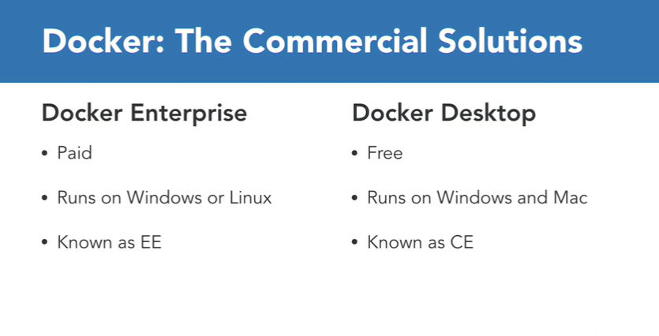  

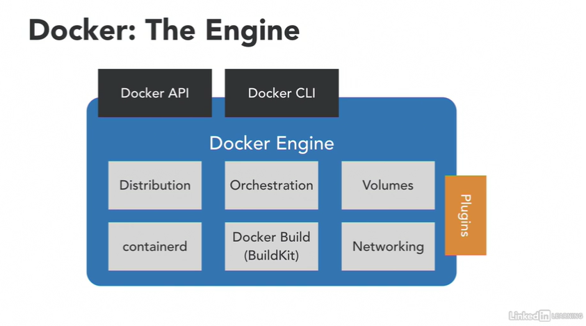  

Docker Engine is made of a number of those different open-source project 

Docker desktop: được design để chạy trên window 10

Icon góc dưới màn hình, chọn Kitematic để dễ dàng download container từ tool

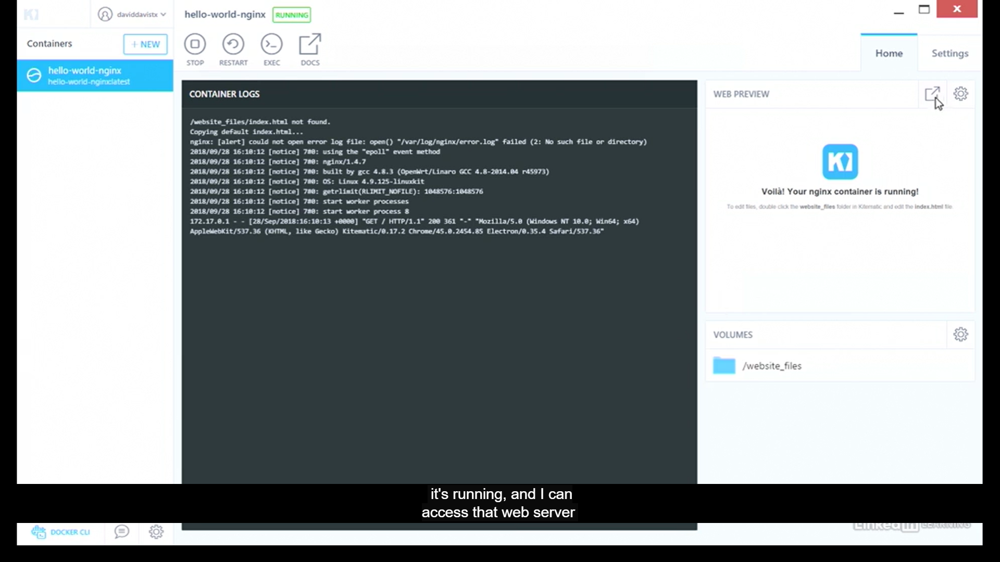  

Sau đó ấn vào web review để xem direct 

https://docs.docker.com/engine/reference/commandline/ps/

## Command line

Tiếp tục bước ở trên, List containers: 

`docker ps`

Run a command in a new container

`docker run hello-world`

## Container

- flexible with app
- lightweight share with host kernel
- interchangeable: easily update
- portable: move local laptop to cloud ...
- Scalable: remove add

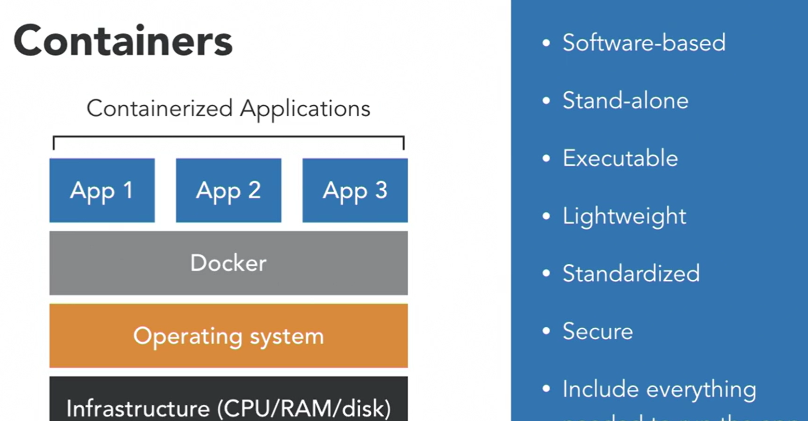  

Sự khác nhau giữa VM and Container: Không cần cài local OS


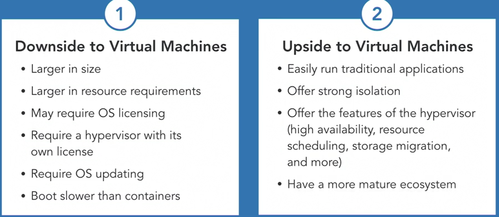  

## Image

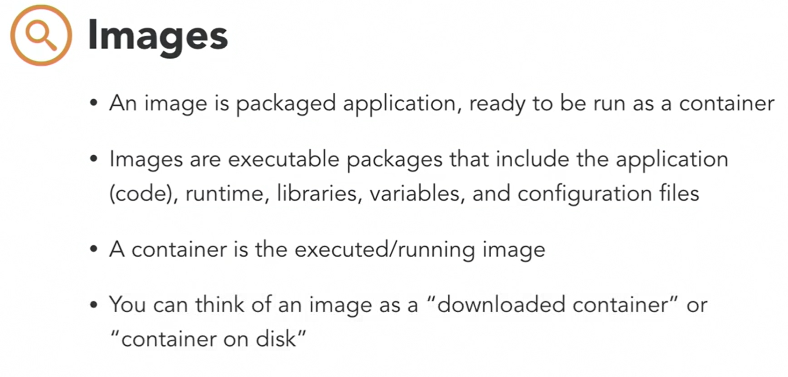  

Docker run images => create container

https://docs.docker.com/docker-for-windows/

Condition: https://docs.docker.com/docker-for-windows/install/

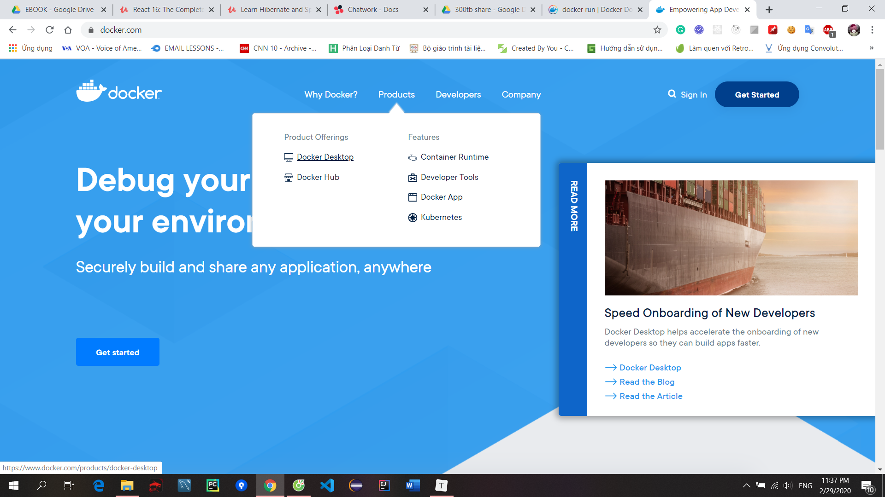

Chọn docker desktop/ edge

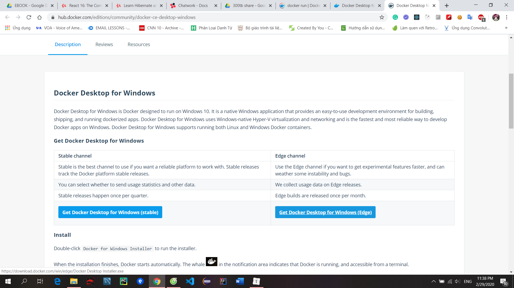  

Docker ID: phuong1020 pass: duyphuong1020

## Install kitematic

Giải nén thư mục vừa tải vào C:\Program Files\Docker\Kitematic

Kitematic là folder tạo mới

## Kubernetes

is a docker orchestration tool, is not configurable

Nếu sử dụng linux thì nó sẽ được tự động tick không cần phải vào setting chọn

https://docs.docker.com/docker-for-windows/kubernetes/

Docker Desktop includes a standalone Kubernetes server and client, as well as Docker CLI integration. The Kubernetes server runs locally within your Docker instance, is not configurable, and is a single-node cluster.

The Kubernetes server runs within a Docker container on your local system, and is only for local testing. When Kubernetes support is enabled, you can deploy your workloads, in parallel, on Kubernetes, Swarm, and as standalone containers. Enabling or disabling the Kubernetes server does not affect your other workloads.

## Running on Windows and Linux container

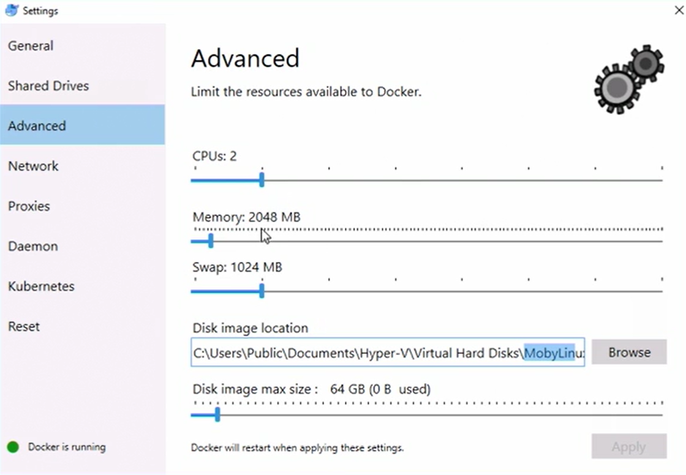  

Để run linux container bạn có thể Right click/ switch to windows/ linux ...

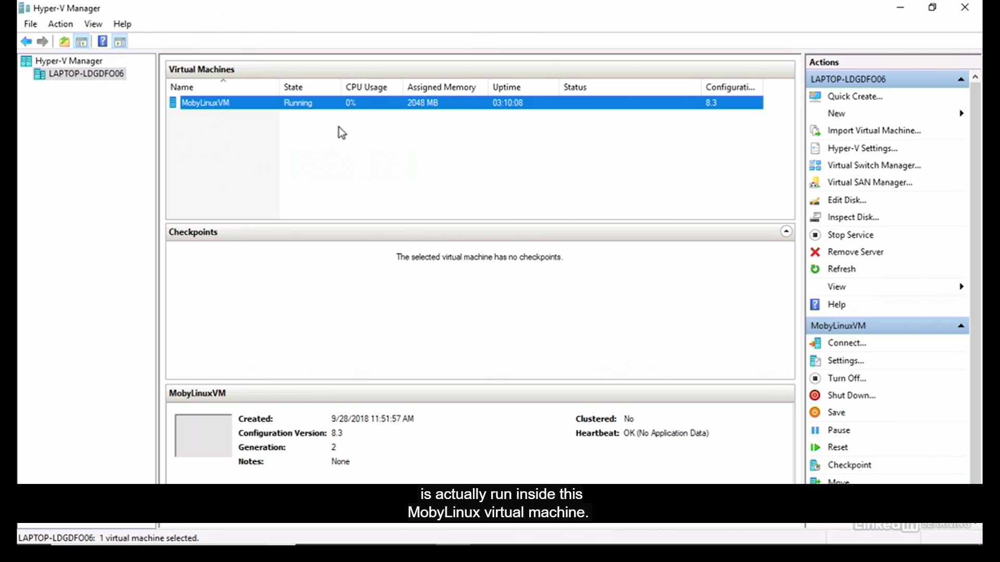  

Mỗi container chạy trên windows => sẽ được tải và chạy trên linux vào hyper V để xem

```shell
docker run -it unbutu bash
ls
ls -l
# print dir in linux to check
ps -ef
# print process running is bash
exit 

docker images ls
```

## Deloy windows container

https://docs.microsoft.com/en-us/virtualization/windowscontainers/

https://docs.microsoft.com/en-us/virtualization/windowscontainers/samples

https://hub.docker.com/search?q=&type=image

https://docs.microsoft.com/en-us/virtualization/windowscontainers/quick-start/run-your-first-container


# Docker for java

https://github.com/arun-gupta/docker-for-java

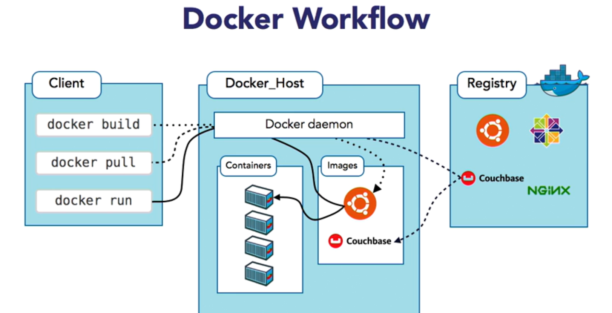  

# Build and Deploy a Spring Boot App on Kubernetes

https://www.youtube.com/watch?v=EZolJ4lNiYc&feature=youtu.be&fbclid=IwAR1-EPox3mhW-rEh9VwI9HGz2OwTxMgDTZclBy2PBHila9OOZIL_plkSzqg