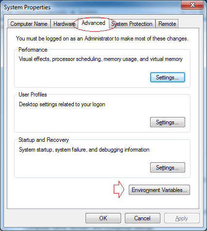
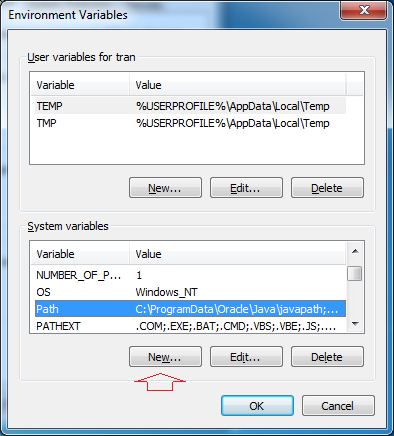
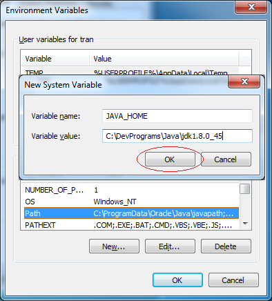
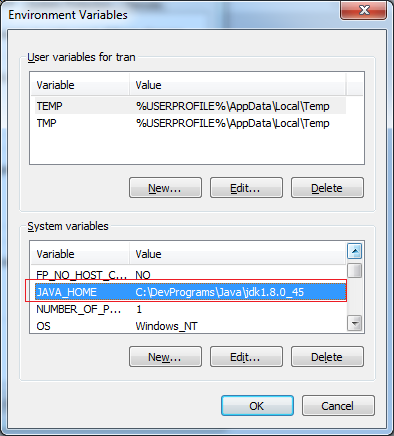
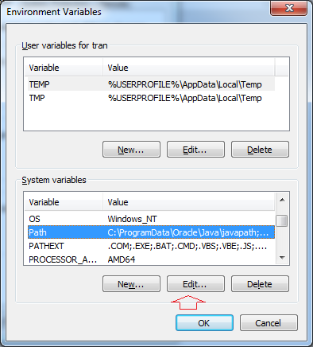
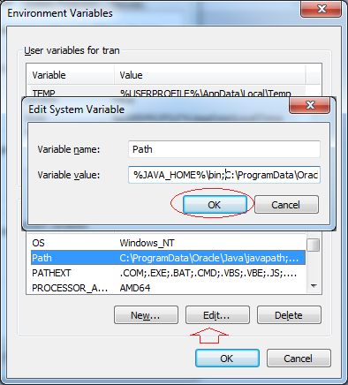
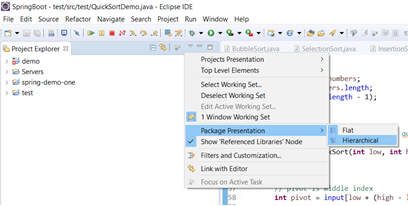
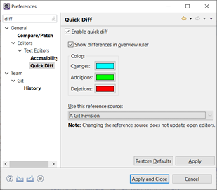
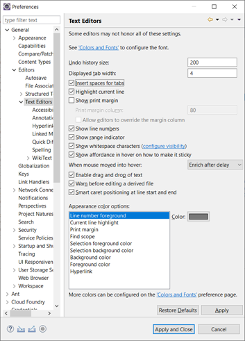

 
# Java

# Spring & Hibernate for Beginners (includes Spring Boot)

## 1.	Introduction and Setup(pdf)
 
Nhấn New để tạo mới một biến môi trường có tên **JAVA_HOME**.


Nhập vào đường dẫn tới thư mục JDK.
•	Variable name: JAVA_HOME
•	Variable value: C:\DevPrograms\Java\jdk1.8.0_45
 
  
Tiếp theo sửa đổi biến môi trường path


 
Thêm vào phía trước giá trị của biến môi trường path:
```
%JAVA_HOME%\bin;
``` 
 
Bạn đã cài đặt và cấu hình Java thành công.
Check: java -version
Cách expand xem list file:
  
Quick diff
  
  

-	https://studyeasy.org/java/arithmetic-operators/
-	Cách import vào project trên eclipse: https://www.youtube.com/watch?v=fiuSckgjdmY&feature=youtu.be
-	Cài inteliji file new project/ Hello word project
-	Import eclipse project into inteliji: New/ Project from existing sources…/ chọn import project from external model/ rồi next

 

 

 
-	Sau đó xóa các file desktop.ini
-	Lợi ích của tính đa hình là có thể tạo 1 List<Animals> mà k cần biết các object ở trong vì nó kế thừa lớp Animals
-	Types of nested class


1. Spring Overview
2. Downloading the Source Code and PDF Files
Download Source Code:
This only includes the source files, no JAR files. You will need to add JAR files separately on your own. 
http://www.luv2code.com/downloads/udemy-spring-hibernate/spring-hibernate-source-code-v26.zip
---
Download PDF Files
All slides which are shown during the course are available also as a reference and can be downloaded here:
http://www.luv2code.com/download-spring-hibernate-pdfs
Setting eclipse
http://www.luv2code.com/eclipse/
Cài JDK
http://www.luv2code.com/install-java
2.	Spring core framework
Core container : Factory for creating bean and manage bean dependences
3. Setting Up Your Development Environment
Install apache: https://tomcat.apache.org/
 

Chọn version Tomcat9/ Chọn 32-bit/64-bit Windows Service Installer
Sau đó cài đặt Apache :
 

Lưu ý : phải chọn full, và nhập tên và pass cho admin 

 

Bỏ chọn Show Readme và click Finish

 

Verify install bằng cách vào link: http://localhost:8080/
 
Như vậy bạn đã cài đặt thành công!
 

Vào windows gõ service:
 

Install eclipse: chọn download packages => eclipse for 
 

Try the Eclipse Installer 2019 06 R
The easiest way to install and update your Eclipse Development Environment.
4. Connecting Tomcat to Eclipse
Connect apache to eclipse
Vào tab server của eclipse/ chọn click link to add new server/ chọn Apache/ Tomcat 09/ rồi chọn đường link ở trong ổ C

 

5. Downloading Spring 5 JAR Files – Overview
Open perspective:

 

Thêm thủ công vào http://www.luv2code.com/downloadspring =>
http://repo.spring.io/release/org/springframework/spring/
chọn version release ở dưới cùng rồi chọn spring-framework-5.1.8.RELEASE-dist.zip  để tải
Tạo project java bình thường, sau đó tạo thư mục lib rồi copy tất các các thư viện trong lib đã tải paste vào
Right click/ properties/ Java build path/ libraries/ classpath/ ấn add jar rồi chon đến thư mục lib trong project mà ta vừa tạo chọn hết tất cả các file

 

Nếu đúng sẽ xuất hiện Referenced libraries:

 

Mở perspective(ta project..): vào windows/ perspective
4. Spring Inversion of Control - XML Configuration
1. What is Inversion of Control
The approach of outsourcing the construction and management of objects
Kịch bản: pdf
2. Code Demo - Rough Prototype Part 1
Tạo interface để implement: 
Spring Container
Primary functions
• Create and manage objects (Inversion of Control)
• Inject object’s dependencies (Dependency Injection)
IOC & XML Configuration
Ioc: tạo và quản lý object(xem pdf)
Tạo interface Coach(HLV) và các môn thể thao tương ứng => làm sao để dễ dàng chuyển đổi giữa các môn thể thao và không phải code cứng mà chỉ dùng file config
Xem tiếp file 12-spring-ioc-basics-overview

Spring Development Process
1. Configure your Spring Beans
2. Create a Spring Container
3. Retrieve Beans from Spring Container

3 ways to config Spring container: 12-spring-ioc-basics-overview.pdf

FAQ: What is a Spring Bean?
A "Spring Bean" is simply a Java object.
When Java objects are created by the Spring Container, then Spring refers to them as "Spring Beans".
Spring Beans are created from normal Java classes .... just like Java objects.
Here's a blurb from the Spring Reference Manual
 
Source: https://docs.spring.io/spring/docs/current/spring-framework-reference/core.html#beans-introduction
Source: spring-hibernate-source-code-v26\01-spring-core-5\spring-demo-one\starter-files copy file applicationContext.xml để bắt đầu project ioc
Why do we specify the Coach interface in getBean()?
For example:
Coach theCoach = context.getBean("myCoach", Coach.class); 
Answer
When we pass the interface to the method, behind the scenes Spring will cast the object for you.
context.getBean("myCoach", Coach.class)  
Practice Activity #1 - Inversion of Control with XML Configuration
Practice Activity #1 - Inversion of Control with XML Configuration
1.	Define a new implementation for the Coach interface. You can use whatever sport you would like.
2.	Reference your new implementation in the Spring config file.
3.	Test your application to verify you are retrieving information from your new Coach implementation.
   
You can check your code against the solution. The solution is available here:
http://www.luv2code.com/downloads/udemy-spring-hibernate/solution-practice-activities.zip
Nếu scope là prototype thì nó trỏ cùng 1 object khi get nhiều lần từ bean

 
Add logging
HEADS UP - Add Logging Messages in Spring 5.1
The Problem
In Spring 5.1, the Spring Development team changed the logging levels internally. As a result, by default you will no longer see the red logging messages at the INFO level. This is different than in the videos.
 
The Solution
If you would like to configure your app to show similar logging messages as in the video, you can make the following updates listed below. Note, you will not see the EXACT same messages, since the Spring team periodically changes the text of the internal logging messages. However, this should give you some additional logging data.
 
Overview of the steps
1. Create a bean to configure the parent logger and console handler
2. Configure the bean in the Spring XML config file
Detailed Steps
1. Create a bean to configure the parent logger and console handler
This class will set the parent logger level for the application context. It will also set the logging level for console handler. It sets the logger level to FINE. For more detailed logging info, you can set the logging level to level to FINEST.  You can read more about the logging levels at http://www.vogella.com/tutorials/Logging/article.html
This class also has an init method to handle the actual configuration. The init method is executed after the bean has been created and dependencies injected.
File: MyLoggerConfig.java
1.	package com.luv2code.springdemo;
2.	 
3.	import java.util.logging.ConsoleHandler;
4.	import java.util.logging.Level;
5.	import java.util.logging.Logger;
6.	import java.util.logging.SimpleFormatter;
7.	 
8.	import org.springframework.context.annotation.AnnotationConfigApplicationContext;
9.	 
10.	public class MyLoggerConfig {
11.	 
12.		private String rootLoggerLevel;
13.		private String printedLoggerLevel;
14.		
15.		public void setRootLoggerLevel(String rootLoggerLevel) {
16.			this.rootLoggerLevel = rootLoggerLevel;
17.		}
18.	 
19.		public void setPrintedLoggerLevel(String printedLoggerLevel) {
20.			this.printedLoggerLevel = printedLoggerLevel;
21.		}
22.	 
23.		public void initLogger() {
24.	 
25.			// parse levels
26.			Level rootLevel = Level.parse(rootLoggerLevel);
27.			Level printedLevel = Level.parse(printedLoggerLevel);
28.			
29.			// get logger for app context
30.			Logger applicationContextLogger = Logger.getLogger(AnnotationConfigApplicationContext.class.getName());
31.	 
32.			// get parent logger
33.			Logger loggerParent = applicationContextLogger.getParent();
34.	 
35.			// set root logging level
36.			loggerParent.setLevel(rootLevel);
37.			
38.			// set up console handler
39.			ConsoleHandler consoleHandler = new ConsoleHandler();
40.			consoleHandler.setLevel(printedLevel);
41.			consoleHandler.setFormatter(new SimpleFormatter());
42.			
43.			// add handler to the logger
44.			loggerParent.addHandler(consoleHandler);
45.		}
46.		
47.	}
---
2. Configure the bean in the Spring XML config file
In your XML config file, add the following bean entry. Make sure to list this as the first bean so that it is initialized first. Since the bean is initialized first, then you will get all of the logging traffic. If you move it later in the config file after the other beans, then you will miss out on some of the initial logging messages.
File: applicationContext.xml (snippet)
1.	<!-- 
2.		Add a logger config to see logging messages.		
3.		- For more detailed logs, set values to "FINEST"
4.		- For info on logging levels, see: http://www.vogella.com/tutorials/Logging/article.html
5.	 -->
6.	    <bean id="myLoggerConfig" class="com.luv2code.springdemo.MyLoggerConfig" init-method="initLogger">
7.	    	<property name="rootLoggerLevel" value="FINE" />
8.	    	<property name="printedLoggerLevel" value="FINE"/>
9.	    </bean>
---
Source code is available here. : https://gist.github.com/darbyluv2code/cfb16c2fd1825a947d8faca3724b47a9
Run config: maven clean, install
 
Sau đó run application
5. Spring Dependency Injection - XML Configuration
Các nguyên tắc đảo ngược phụ thuộc.
Client ủy quyền để gọi cho đối tượng khác có trách nhiệm cung cấp các phụ thuộc của nó
Ví dụ như request car thì car factory sẽ inject các component của nó vào để tạo thành object
Spring Injection Types(pdf)
• Constructor Injection
• Setter Injection(Phải có hàm khởi tạo không tham số)
Injecting Literal Values
Development Process - Constructor Injection
1. Define the dependency interface and class
2. Create a constructor in your class for injections
3. Configure the dependency injection in Spring config file
FAQ: What is the purpose for the no arg constructor?
Question:
I was wondering why you created a no arg constructor? I thought that they are implied by Java and only required when you also have an overloaded constructor. Or is this a Spring specific thing?
---
Answered by: Oleksandr Palamarchuk
When you don’t define any constructor in your class, compiler defines default one for you, however when you declare any constructor (in your example you have already defined a parameterized constructor), compiler doesn’t do it for you.
Since you have defined a constructor in class code, compiler didn’t create default one. While creating object you are invoking default one, which doesn’t exist in class code. Then the code gives an compilation error.
Development Process - Setter Injection
1. Create setter method(s) in your class for injections( must create no-arg constructor)
2. Configure the dependency injection in Spring config file
Injecting Literal Values
Development Process
1. Create setter method(s) in your class for injections
2. Configure the injection in Spring config file
Question:
For the CricketCoach example with Setter Injection, why do we use the CricketCoach class instead of the Coach interface?
Answer:
The getTeam() method is only defined in the CricketCoach class. It is not part of the Coach interface.
As a result, you would need the following code:
    CricketCoach theCricketCoach = context.getBean("myCricketCoach", CricketCoach.class); 
---
The Coach interface has two methods: getDailyWorkout and getDailyFortune
The CricketCoach class has four methods: getDailyWorkout, getDailyFortune, getTeam and setTeam
---
When you retrieve a bean from the Spring container using the Coach interface:
    Coach theCricketCoach = context.getBean("myCricketCoach", Coach.class); 
You only have access to the methods defined in the Coach interface: getDailyWorkout and getDailyFortune. Even though the actual implementation has additional methods, you only have visibility to methods that are defined at the Coach interface level.
---
When you retrieve a bean from the Spring container using the CricketCoach class:
    CricketCoach theCricketCoach = context.getBean("myCricketCoach", CricketCoach.class); 
You have access to the methods defined in the Coach interface: getDailyWorkout and getDailyFortune.
ALSO, you have access to the additional methods defined in the CricketCoach class: getTeam, setTeam.
---
The bottom line is it depends on how you retrieve the object and assign it ... that determines the visibility you have to the methods.
Injecting Values from a Properties File
1. Create Properties File
2. Load Properties File in Spring config file
3. Reference values from Properties File
Practice Activity #2 - Dependency Injection with XML Configuration
1. Define a new implementation for the FortuneService.
    a. When the getFortune() method is called it should return a random fortune from the array.
    b. Your fortune service should define three fortunes in an array. 
2. Inject your new dependency into your Coach implementation.
3. Test your application to verify you are retrieving random fortunes.

Compare your code to the solution. The solution is available here:
- http://www.luv2code.com/downloads/udemy-spring-hibernate/solution-practice-activities.zip
6. Spring Bean Scopes and Lifecycle
Spring Container creates only one instance of the bean, by default
• It is cached in memory
• All requests for the bean
• will return a SHARED reference to the SAME bean
Explicitly Specify Bean Scope and type  - pdf
4. Bean Lifecycle
1. Define your methods for init and destroy
2. Configure the method names in Spring config file

Bean Lifecycle Methods / Hooks
• You can add custom code during bean initialization
• Calling custom business logic methods
• Setting up handles to resources (db, sockets, file etc)
 
• You can add custom code during bean destruction
• Calling custom business logic method
• Clean up handles to resources (db, sockets, files etc)
 
Special Note about init and destroy Method Signatures
When using XML configuration, I want to provide additional details regarding the method signatures of the init-method  and destroy-method .
Access modifier
The method can have any access modifier (public, protected, private)
Return type
The method can have any return type. However, "void' is most commonly used. If you give a return type just note that you will not be able to capture the return value. As a result, "void" is commonly used.
Method name
The method can have any method name.
Arguments
The method can not accept any arguments. The method should be no-arg.
There is a subtle point you need to be aware of with "prototype" scoped beans.
For "prototype" scoped beans, Spring does not call the destroy method.  Gasp!  
---
In contrast to the other scopes, Spring does not manage the complete lifecycle of a prototype bean: the container instantiates, configures, and otherwise assembles a prototype object, and hands it to the client, with no further record of that prototype instance.
Thus, although initialization lifecycle callback methods are called on all objects regardless of scope, in the case of prototypes, configured destruction lifecycle callbacks are not called. The client code must clean up prototype-scoped objects and release expensive resources that the prototype bean(s) are holding. 

---
This also applies to both XML configuration and Annotation-based configuration.
7. Spring Configuration with Java Annotations - Inversion of Control
1. Annotations Overview - Component Scanning
Development Process
1. Enable component scanning in Spring config file
2. Add the @Component Annotation to your Java classes
3. Retrieve bean from Spring container

@Component(“beanID”)
5. Default Component Names - Overview
8. Spring Configuration with Java Annotations - Dependency Injection
1. Constructor Injection - Overview
For dependency injection, Spring can use auto wiring
• Spring will look for a class that matches the property
• matches by type: class or interface
• Spring will inject it automatically … hence it is autowired
Autowiring Injection Types
• Constructor Injection
• Setter Injection
• Field Injections
Development Process - Constructor Injection
1. Define the dependency interface and class
2. Create a constructor in your class for injections
3. Configure the dependency injection with @Autowired Annotation
Question
I have finished the video "Constructor Injection - Writing Code part2".
I have commented the Autowired annotation. But still it worked. How did it work?
    //@Autowired
    public TennisCoach(FortuneService theFortuneService) {
        System.out.println(" theFortuneService " + theFortuneService);
        fortuneService = theFortuneService;
    }
===
Answer
This is a new feature of Spring 4.3.
Here is the snippet from the Spring Docs.
Section 1.9.2: Autowired
As of Spring Framework 4.3, an @Autowired annotation on such a constructor is no longer necessary if the target bean only defines one constructor to begin with. However, if several constructors are available, at least one must be annotated to teach the container which one to use.
I personally prefer to use the @Autowired annotation because it makes the code more readable. But as mentioned, the @Autowired is not required for this scenario.
---
See link to the docs.
https://docs.spring.io/spring/docs/current/spring-framework-reference/core.html#beans-autowired-annotation
6. Setter Injection - Overview
1. Create setter method(s) in your class for injections (có constructor)
2. Configure the dependency injection with @Autowired Annotation
8. Method Injection
Giống như setter injection 
9. Field Injection - Overview
Configure the dependency injection with Autowired Annotation
✤ Applied directly to the field(hàm tạo)
✤ No need for setter methods
11. Which Injection Type Should You Use
12. Qualifiers for Dependency Injection - Overview
Nếu có nhiều interface
Annotations - Default Bean Names ... and the Special Case
In general, when using Annotations, for the default bean name, Spring uses the following rule.
If the annotation's value doesn't indicate a bean name, an appropriate name will be built based on the short name of the class (with the first letter lower-cased).
For example:
HappyFortuneService --> happyFortuneService
---
However, for the special case of when BOTH the first and second characters of the class name are upper case, then the name is NOT converted.
For the case of RESTFortuneService
RESTFortuneService --> RESTFortuneService
No conversion since the first two characters are upper case.
Behind the scenes, Spring uses the Java Beans Introspector to generate the default bean name. Here's a screenshot of the documentation for the key method.
 
Also, here's a link to the documentation.
- https://docs.oracle.com/javase/8/docs/api/java/beans/Introspector.html#decapitalize(java.lang.String)
---
As always, you can give explicity names to your beans.
@Component("foo")
public class RESTFortuneService .... {
    
}
Then you can access it using the name of "foo". Nothing tricky to worry about :-)
Hope this helps. Happy Coding! :-)
@Qualifier is a nice feature, but it is tricky when used with Constructors.
The syntax is much different from other examples and not exactly intuitive.  Consider this the "deep end of the pool" when it comes to Spring configuration LOL :-)
 You have to place the @Qualifier annotation inside of the constructor arguments. 
Here's an example from our classroom example. I updated it to make use of constructor injection, with @Autowired and @Qualifier. Make note of the code in bold below:
---
package com.luv2code.springdemo;
import org.springframework.beans.factory.annotation.Autowired;

import org.springframework.beans.factory.annotation.Qualifier;
import org.springframework.stereotype.Component;
@Component
public class TennisCoach implements Coach {
    private FortuneService fortuneService;
    // define a default constructor
    public TennisCoach() {
        System.out.println(">> TennisCoach: inside default constructor");
    }
    
    @Autowired
    public TennisCoach(@Qualifier("randomFortuneService") FortuneService theFortuneService) {
        System.out.println(">> TennisCoach: inside constructor using @autowired and @qualifier");
        
        fortuneService = theFortuneService;
    }
       
    
    /*
    @Autowired
    public void doSomeCrazyStuff(FortuneService theFortuneService) {
        System.out.println(">> TennisCoach: inside doSomeCrazyStuff() method");
        fortuneService = theFortuneService;
    }
    */
    
    /*
    @Autowired
    public TennisCoach(FortuneService theFortuneService) {
        fortuneService = theFortuneService;
    }
    */
    
    @Override
    public String getDailyWorkout() {
        return "Practice your backhand volley";
    }
    @Override
    public String getDailyFortune() {
        return fortuneService.getFortune();
    }
}
---
For detailed documentation on using @Qualified with Constructors, see this link in the Spring Reference Manual
https://docs.spring.io/spring/docs/current/spring-framework-reference/core.html#beans-autowired-annotation-qualifiers
FAQ: How to inject properties file using Java annotations

Answer:
This solution will show you how inject values from a properties file using annotatons. The values will no longer be hard coded in the Java code.
1. Create a properties file to hold your properties. It will be a name value pair.  
New text file:  src/sport.properties
foo.email=myeasycoach@luv2code.com
foo.team=Silly Java Coders
Note the location of the properties file is very important. It must be stored in src/sport.properties
2. Load the properties file in the XML config file.
File: applicationContext.xml
Add the following lines:
    <context:property-placeholder location="classpath:sport.properties"/>  
This should appear just after the <context:component-scan .../> line
3. Inject the properties values into your Swim Coach: SwimCoach.java
   
@Value("${foo.email}")
private String email;
    
@Value("${foo.team}")
private String team;
---
DOWNLOAD FULL SOURCE CODE
You can download entire code from here:
- http://www.luv2code.com/downloads/spring-hibernate/spring-props-annotation-demo.zip
9. Spring Configuration with Java Annotations - Bean Scopes and Lifecycle Methods
1. @Scope Annotation – Overview
Default scope is singleton
 

2. @Scope Annotation - Write Some Code
Here is a subtle point you need to be aware of with "prototype" scoped beans.
For "prototype" scoped beans, Spring does not call the @PreDestroy method.  Gasp!  
I didn't know this either until I dug through the Spring reference manual researching a student's question.
Here is the answer from the Spring reference manual. Section 7.5.2
https://docs.spring.io/spring/docs/current/spring-framework-reference/core.html#beans-factory-scopes-prototype
---
In contrast to the other scopes, Spring does not manage the complete lifecycle of a
prototype bean: the container instantiates, configures, and otherwise assembles a
prototype object, and hands it to the client, with no further record of that prototype
instance.
Thus, although initialization lifecycle callback methods are called on all objects regardless of scope, in the case of prototypes, configured destruction lifecycle callbacks are not called. The client code must clean up prototype-scoped objects and release expensive resources that the prototype bean(s) are holding. 
To get the Spring container to release resources held by prototype-scoped beans, try using a custom bean post-processor, which holds a reference to beans that need to be cleaned up.
---
This also applies to XML configuration.

3. Bean Lifecycle Method Annotations – Overview
Development Process
1. Define your methods for init and destroy
2. Add annotations: @PostConstruct and @PreDestroy

Special Note about @PostConstruct and @PreDestroy Method Signatures
I want to provide additional details regarding the method signatures of @PostContruct and @PreDestroy methods.
Access modifier
The method can have any access modifier (public, protected, private)
Return type
The method can have any return type. However, "void' is most commonly used. If you give a return type just note that you will not be able to capture the return value. As a result, "void" is commonly used.
Method name
The method can have any method name.
Arguments
The method can not accept any arguments. The method should be no-arg.

HEADS UP - FOR JAVA 9, 10 and 11 USERS - @PostConstruct and @PreDestroy
If you are using Java 9, 10 or 11, then you will encounter an error when using @PostConstruct and @PreDestroy in your code.
These are the steps to resolve it. Come back to the lecture if you hit the error. 
Error
Eclipse is unable to import @PostConstruct or @PreDestroy
This happens because of Java 9 and higher. 
When using Java 9 and higher, javax.annotation has been removed from its default classpath. That's why we Eclipse can't find it.
---
Solution
1. Download the javax.annotation-api-1.2.jar from 
http://central.maven.org/maven2/javax/annotation/javax.annotation-api/1.2/javax.annotation-api-1.2.jar
2. Copy the JAR file to the lib folder of your project
---
Use the following steps to add it to your Java Build Path.
3. Right-click your project, select Properties
4. On left-hand side, click Java Build Path
5. In top-center of dialog, click Libraries
6. Click Classpath and then Click Add JARs ...
7. Navigate to the JAR file <your-project>/lib/javax.annotation-api-1.2.jar
8. Click OK then click Apply and Close
Eclipse will perform a rebuild of your project and it will resolve the related build errors.

10. Spring Configuration with Java Code (no xml)
1. Spring Configuration with Java Code (no xml) – Overview
Instead of configuring Spring container using XML
Configure the Spring container with Java code
Development Process
1. Create a Java class and annotate as @Configuration
2. Add component scanning support: @ComponentScan (optional)
3. Read Spring Java configuration class
4. Retrieve bean from Spring container

4.	Defining Spring Beans with Java Code (no xml) - Overview
Question:
During All Java Configuration, how does the @Bean annotation work in the background?

Answer
This is an advanced concept. But I'll walk through the code line-by-line.
For this code:
  @Bean 
  public Coach swimCoach() {   
   SwimCoach mySwimCoach = new SwimCoach();   
   return mySwimCoach; 
  }
At a high-level, Spring creates a bean component manually. By default the scope is singleton. So any request for a "swimCoach" bean, will get the same instance of the bean since singleton is the default scope.

However, let's break it down line-by-line
@Bean

The @Bean annotation tells Spring that we are creating a bean component manually. We didn't specify a scope so the default scope is singleton.
 public Coach swimCoach(){
This specifies that the bean will bean id of "swimCoach". The method name determines the bean id. The return type is the Coach interface. This is useful for dependency injection. This can help Spring find any dependencies that implement the Coach interface.
The @Bean annotation will intercept any requests for "swimCoach" bean. Since we didn't specify a scope, the bean scope is singleton. As a result, it will give the same instance of the bean for any requests.

 SwimCoach mySwimCoach = new SwimCoach();
This code will create a new instance of the SwimCoach.

 return mySwimCoach;
This code returns an instance of the swimCoach.
----

Now let's step back and look at the method in it's entirety.
 @Bean 
 public Coach swimCoach() {   
   SwimCoach mySwimCoach = new SwimCoach();   
   return mySwimCoach; 
 }

It is important to note that this method has the @Bean annotation. The annotation will intercept ALL calls to the method "swimCoach()". Since no scope is specified the @Bean annotation uses singleton scope. Behind the scenes, during the @Bean interception, it will check in memory of the Spring container (applicationContext) and see if this given bean has already been created.
If this is the first time the bean has been created then it will execute the method as normal. It will also register the bean in the application context. So that is knows that the bean has already been created before. Effectively setting a flag.
The next time this method is called, the @Bean annotation will check in memory of the Spring container (applicationContext) and see if this given bean has already been created. Since the bean has already been created (previous paragraph) then it will immediately return the instance from memory. It will not execute the code inside of the method. Hence this is a singleton bean.
The code for
 SwimCoach mySwimCoach = new SwimCoach(); 
 return mySwimCoach;
is not executed for subsequent requests to the method public Coach swimCoach() . This code is only executed once during the initial bean creation since it is singleton scope.

That explains how @Bean annotation works for the swimCoach example.
====
Now let's take it one step further.
Here's your other question
>> Please explain in detail whats happening behind the scene for this statement.
return new SwimCoach(sadFortuneService())

The code for this question is slightly different. It is injecting a dependency.
In this example, we are creating a SwimCoach and injecting the sadFortuneService().
         // define bean for our sad fortune service
        @Bean
        public FortuneService sadFortuneService() {
            return new SadFortuneService();
        }
        
        // define bean for our swim coach AND inject dependency
        @Bean
        public Coach swimCoach() {
            SwimCoach mySwimCoach = new SwimCoach(sadFortuneService());
            
            return mySwimCoach;
        }

Using the same information presented earlier
The code
        // define bean for our sad fortune service
        @Bean
        public FortuneService sadFortuneService() {
            return new SadFortuneService();
        }

In the code above, we define a bean for the sad fortune service. Since the bean scope is not specified, it defaults to singleton.
Any calls for sadFortuneService, the @Bean annotation intercepts the call and checks to see if an instance has been created. First time through, no instance is created so the code executes as desired. For subsequent calls, the singleton has been created so @Bean will immediately return with the singleton instance.

Now to the main code based on your question.
return new SwimCoach(sadFortuneService())
This code creates an instance of SwimCoach. Note the call to the method sadFortuneService(). We are calling the annotated method above. The @Bean will intercept and return a singleton instance of sadFortuneService. The sadFortuneService is then injected into the swim coach instance.

This is effectively dependency injection. It is accomplished using all Java configuration (no xml).
---
This concludes the line-by-line discussion of the source code. All of the behind the scenes work.
I hope this clears your doubt. :-)
8. Injecting Values from Properties File – Overview
FAQ: Problems with Injecting Values - Value not returning from ${foo.email}
Question
I am running the code for Java Configuration and injecting values from props file. However, I'm getting:
${foo.email}
${foo.team}
Instead of the actual property values. How can I resolve this?
Answer
This is an issue with Spring versions.
If you are using Spring 4.2 and lower, you will need to add the code in bold.
---
package com.luv2code.springdemo;
import org.springframework.context.annotation.Bean;
import org.springframework.context.annotation.Configuration;
import org.springframework.context.annotation.PropertySource;
import org.springframework.context.support.PropertySourcesPlaceholderConfigurer;
@Configuration
// @ComponentScan("com.luv2code.springdemo")
@PropertySource("classpath:sport.properties")
public class SportConfig {
    
    // add support to resolve ${...} properties
    @Bean
    public static PropertySourcesPlaceholderConfigurer
                    propertySourcesPlaceHolderConfigurer() {
        
        return new PropertySourcesPlaceholderConfigurer();
    }
    
    // define bean for our sad fortune service
    @Bean
    public FortuneService sadFortuneService() {
        return new SadFortuneService();
    }
    
    // define bean for our swim coach AND inject dependency
    @Bean
    public Coach swimCoach() {
        SwimCoach mySwimCoach = new SwimCoach(sadFortuneService());
        
        return mySwimCoach;
    }
    
}
----
In Spring 4.3 and higher, they removed this requirement. As a result, you don't need this code.
In the video, I show Spring 4.3, that's why this code is not displayed.
Let me know if that clears it up.
:-)
11. Spring MVC - Building Spring Web Apps
https://docs.spring.io/spring/docs/current/spring-framework-reference/web.html
1. Spring MVC Overview
2. Spring MVC - Behind the Scenes
https://docs.spring.io/spring/docs/current/spring-framework-reference/web.html#mvc-view
3. Development Environment Checkpoint
In the following videos for Spring MVC, I provide a collection of starter files.
Download these files from the link below.
http://www.luv2code.com/downloads/udemy-spring-hibernate/solution-code-spring-mvc-config-files.zip
You will need these in the following videos.
Cheers :-)
5. Spring MVC Configuration - Overview
6. Spring MVC Configuration - JAR Files
File/ New/ Dynamic web project/Finish
Copy jar files vào thư mục  WebContent/ WEB-INF/ lib
Copy thêm 2 file jstl
 

7. Spring MVC Configuration - Config Files
Paste 2 file .xml vào WEB-INF
Tạo folder view trong WEB-INF
Question:
How to configure the Spring Dispatcher Servlet using all Java Code (no xml)?
Answer:
Good question!
For Spring MVC, we cover all Java config (no xml) later in the course, complete with videos/explanation and everything.
However, if you just need the code, here are the steps
1. Delete the files: web.xml file and spring-mvc-demo-servlet.xml files
2. Create a new Java package: com.luv2code.springdemo.config
3. Add the following Java files in your package
File: DemoAppConfig.java
package com.luv2code.springdemo.config;

import org.springframework.context.annotation.Bean;
import org.springframework.context.annotation.ComponentScan;
import org.springframework.context.annotation.Configuration;
import org.springframework.web.servlet.ViewResolver;
import org.springframework.web.servlet.config.annotation.EnableWebMvc;
import org.springframework.web.servlet.view.InternalResourceViewResolver;

@Configuration
@EnableWebMvc
@ComponentScan(basePackages="com.luv2code.springdemo")
public class DemoAppConfig {

	// define a bean for ViewResolver

	@Bean
	public ViewResolver viewResolver() {
		
		InternalResourceViewResolver viewResolver = new InternalResourceViewResolver();
		
		viewResolver.setPrefix("/WEB-INF/view/");
		viewResolver.setSuffix(".jsp");
		
		return viewResolver;
	}
	
}
---
File: MySpringMvcDispatcherServletInitializer.java
package com.luv2code.springdemo.config;

import org.springframework.web.servlet.support.AbstractAnnotationConfigDispatcherServletInitializer;

public class MySpringMvcDispatcherServletInitializer extends AbstractAnnotationConfigDispatcherServletInitializer {

	@Override
	protected Class<?>[] getRootConfigClasses() {
		// TODO Auto-generated method stub
		return null;
	}

	@Override
	protected Class<?>[] getServletConfigClasses() {
		return new Class[] { DemoAppConfig.class };
	}

	@Override
	protected String[] getServletMappings() {
		return new String[] { "/" };
	}

}
4. Test your app
Your app should work as desired.
---
I also uploaded a full project implementation with code here
https://drive.google.com/open?id=1_5__2SggzgFHt7Rs2YYsv5JHRVX5Orq3
---
For a discussion on how this code works, you can skip ahead to the following video
Video 403 - Spring MVC All Java Config
https://www.udemy.com/spring-hibernate-tutorial/learn/v4/t/lecture/8355870?start=148
Skip ahead to time marker [02:28]
---
let me know if you need anything else.
:-)
12. Spring MVC - Creating Controllers and Views
1. Creating a Spring Home Controller and View – Overview
Development Process
1. Create Controller class
2. Define Controller method
3. Add Request Mapping to Controller method
4. Return View Name
5. Develop View Page
- Khi chạy vào run as/ run on server/ chọn server Tomcat/ tick Always use this server….
JUST A HEADS UP ...
IN THE VIDEOS YOUR SPRING MVC CONTROLLER CODE MAY NOT WORK
THIS IS AN ECLIPSE CACHING BUG
IF YOUR CONTROLLER DOESN'T WORK THEN TRY THE STEPS BELOW
----
Question:  HELP! My Spring MVC Controller is not working. What to do?
Answer:
Debug Tip #0: Make sure you are accessing the correct URL
You need to access the correct URL, localhost:8080/spring-mvc-demo/
Note: Do not attempt to run the JSP files directly. This will not work due to MVC.
---
Debug Tip #1: Make Sure your Package Names is consistent
The Spring configuration file used in the videos expects for your controller to be in the package:
package com.luv2code.springdemo.mvc;
Make sure your controller is this package.

----
Debug Tip #2:  Reimport Project into Eclipse
Sometimes the Eclipse project settings can become corrupted. One possible solution is to remove the Eclipse project  and reimport into Eclipse.
Here are the steps.
1. Remove the project from Eclipse.
 
2. Open the project in file system and remove the files/ folders except src and WebContent.
 

3. Open the project in Eclipse again using File > Import ... > General > Existing Projects into Workspace
4.  Check the project properties(Right click on the project and click on Properties),
5. Check the Java Build Path, Java Compiler and Project Facets and make sure that the Java version is same in all the windows.
 

  
5. Build the project and try again.
----

Debug Tip #3: Clear Tomcat Cache
This is normally a caching issue with the cache.
Here are some steps to clear the Eclipse cache and Tomcat cache.
1. In the Server's tab in Eclipse, Stop the Tomcat server
2. Right-click the server and select "Clean..."
3. Right-click the server again and select "Clean Tomcat Work Directory..."
---
4. In the Eclipse, select the top-level menu option, Project > Clean ...
5. Be sure your project is selected and click Ok
6. Restart Eclipse
Retest your application. If you continue to have problems try Debug Tip #2
---
Debug Tip #4: Import the Project in  a new workspace
1. Copy your project to a new directory on your computer like, c:\foobar
2. In Eclipse, open a new workspace: Create a new workspace in Eclipse: File > Switch Workspace > Other ... > give any name
3. In Eclipse, import the project
3a. Use File > Import > General > Existing Projects into Workspace
3b. Browse to directory: c:\foobar
4. In your new workspace, add a reference to the Tomcat server
5. Test your app in the new workspace
---
If you still have problems, then post your code to the classroom discussion forum.
Be sure to include the following files:
- spring-mvc-demo-servlet.xml
- your controller .java
- your view page .jsp
Can't Start Tomcat - Ports are in Use
You may have a problem starting Tomcat. You may see this ugly error message about ports in use.
 

Solution
You can use the troubleshooting tips below.
Troubleshooting Tip #1
1. Exit Eclipse
2. Open a web web browser and visit, http://localhost:8080
3. If you see a "Tomcat" web page then that means Tomcat is running as a Windows service. To stop Tomcat running as a Windows services, open your Windows Control Panel. Find the service "Apache Tomcat" and stop it.
4. If you don't see a "Tomcat" web page, then stop the appropriate process displayed.

--
Troubleshooting Tip #2 - GUI Option
Steps to free port which is already used to run Tomcat server in Eclipse
1. On MS Windows, select Start > All Programs  > Accessories > System Tools >Resource Monitor
2. Expand the Network Tab
3. Move to the section for Listening Ports
4. Look in the Port column and scroll to find entry for port 8080
5. Select the given process and delete/kill the process
6. Return back to Eclipse and start the Tomcat Server, it should start up now.

---
Troubleshooting Tip #3 - Command-Line Option
Steps to free port which is already used to run Tomcat server in Eclipse
For example , suppose 8080 port is used , we need to make free 8080 to run tomcat

Step 1: (open the CMD command)
C:\Users\username>netstat -o -n -a | findstr 0.0:8080
TCP    0.0.0.0:3000      0.0.0.0:0              LISTENING       3116
Now , we can see that LISTENING port is 3116 for 8080 ,
We need to kill 3116 now

Step 2:
C:\Users\username>taskkill /F /PID 3116

Step 3:  Return back to Eclipse and start the Tomcat Server, it should start up now.

====
Mac/Linux SOLUTION
Step 0: Exit Eclipse
Step 1: Open a terminal window

Step 2: Enter the following command to find the process id
lsof -i :8080
This will give output of the application that is running on port 8080

Step 3: Enter the following command to kill the process
kill $(lsof -t -i :8080) 

Step 4:  Return back to Eclipse and start the Tomcat Server, it should start up now.
How Does Component Scan Work - Your Package Names are Different!
Question
How does component scan work in this example? You have different package names.
You listed the component scan package as: com.luv2code.springdemo
But the our MVC controllers are defined in com.luv2code.springdemo.mvc
Answer
For the Spring attribute:  base-package="com.luv2code.springdemo"
Spring will recursively scan for components starting at the base package: "com.luv2code.springdemo"
When I say "recursive", it means that Spring will start at the base package and scan all sub packages.
The package com.luv2code.springdemo.mvc is a sub package because of naming structure, just like folders on a file system.
As a result, it will be included in the scan.

7. Reading HTML Form Data – Overview
11. Adding Data to the Spring Model - Overview
Question
How do I use CSS, JavaScript and Images in a Spring MVC Web App?
Answer
Here are the steps on how to access static resources in a Spring MVC. For example, you can use this to access images, css, JavaScript files etc.
Any static resource is processed as a URL Mapping in Spring MVC. You can configure references to static resources in the spring-mvc-demo-servlet.xml.
In my example, I'm going to have the following directory structure:
 

I chose to put everything in the "resources" directory. But you can use any name for "resources", such as "assets", "foobar" etc. Also, you can give any name that you want for the subdirectories under "resources".
---
Step 1: Add the following entry to your Spring MVC configuration file: spring-mvc-demo-servlet.xml
You can place this entry anywhere in your Spring MVC config file.
<mvc:resources mapping="/resources/**" location="/resources/"></mvc:resources> 
Step 2: Now in your view pages, you can access the static files using this syntax:
 
You need to use the JSP expression ${pageContext.request.contextPath} to access the correct root directory for your web application.
Apply the same technique for reading CSS and JavaScript.
---
Here's a full example that reads CSS, JavaScript and images.
<!DOCTYPE html> <html>
<head>
    <link rel="stylesheet" type="text/css"          
            href="${pageContext.request.contextPath}/resources/css/my-test.css">
    <script src="${pageContext.request.contextPath}/resources/js/simple-test.js"></script>
</head>
<body>
<h2>Spring MVC Demo - Home Page</h2>
<a href="showForm">Plain Hello World</a>
<br><br>

<br><br>
<input type="button" onclick="doSomeWork()" value="Click Me"/>
</body>
</html>
---
Source code for this example are available here:
- https://gist.github.com/darbyluv2code/9a09543a226baeedc04b9a5037ca52ec
Bonus: Deploying your App to Tomcat as a Web Application Archive (WAR) file
When you deploy your Java web apps, you can make use of a Web Application Archive (WAR) file.
The Web Application Archive (WAR) file is a compressed version of your web application. It uses the zip file format but the file has the .war extension.
If you are using Eclipse, then the best way to visualize it is think of your "WebContent" directory being compressed as a zip file with the .war extension.
This includes all of your web pages, images, css etc. It also includes the WEB-INF directory which includes your classes in WEB-INF/classes and supporting JAR files in WEB-INF/lib.
The WAR file format is part of the Java EE / Servlet specification. As a result, all Java EE servers support this format (ie jboss, weblogic, websphere, glassfish and tomcat).
Below, I provide steps on how to create a WAR file in Eclipse. I also show how to deploy the WAR file on Tomcat.
---
1. In Eclipse, stop Tomcat
2. Right-click your project and select Export > WAR File
3. In the Destination field, enter: <any-directory>/mycoolapp.war
4. Outside of Eclipse, start Tomcat
- If you are using MS Windows, then you should find it on the Start menu
5. Make sure Tomcat is up and running by visiting: http://localhost:8080
6. Deploy your new WAR file by copying it to <tomcat-install-directory>\webapps
Give it about 10-15 seconds to make the deployment. You'll know the deployment is over because you'll see a new folder created in webapps ... with your WAR file name.
7. Visit your new app. If your war file was: mycoolapp.war then you can access it with:  http://localhost:8080/mycoolapp/
13. Spring MVC - Request Params and Request Mappings
1. Binding Request Params – Overvie
2. Binding Request Params - Write Some Code
3. Controller Level Request Mapping - Overview
FAQ: 
Question: Can you please clarify how /hello is getting appended to the jsp file action for "processForm"?
Answer
You can use "processForm" because it is a relative path to the controller "/hello" request mapping. Here is how it works.
1. When you wish to view the form, the HTML link points to "hello/showForm". This calls the controller and it displays the form.
2. At this point the browser URL/path is: http://localhost:8080/spring-mvc-demo/hello
3. The HTML form uses "processForm" for the form action. Notice that it does not have a forward slash, as a result, this will be relative to the current browser URL. Since the current browser URL is 
http://localhost:8080/spring-mvc-demo/hello
Then the actual form URL submission will send it to
http://localhost:8080/spring-mvc-demo/hello/processForm
The part in bold with map to the controller with top-level request mapping "/hello" and then map to request mapping in that class "/processForm"
The key here is relative path of showing the form and then submitting to relative path.
14. Spring MVC - Form Tags and Data Binding
1. Spring MVC Form Tags Overview
http://luv2code.com/spring-mvc-form-tags
Spring MVC Form Tags 
• Form tags will generate HTML for you :-)
Form Tags
form:form => main form container
form:input 	text field
form:textarea 	multi-line text field
form:checkbox 	check box
form:radiobutton 	radio buttons
form:select 	drop down list
more ….	
How To Reference Spring MVC Form Tags
• Specify the Spring namespace at beginning of JSP file
<%@ taglib prefix="form" uri="http://www.springframework.org/tags/form" %>
2. Text Fields - Overview
6. Drop-Down Lists - Overview
Question: 
How to use properties file to load country options
Answer:
This solution will show you how to place the country options in a properties file. The values will no longer be hard coded in the Java code.
1. Create a properties file to hold the countries. It will be a name value pair.  Country code is name. Country name is the value.
New text file:  WEB-INF/countries.properties
BR=Brazil 
FR=France 
CO=Colombia 
IN=India
Note the location of the properties file is very important. It must be stored in WEB-INF/countries.properties
2. Update header section for Spring config file
We are going to use a new set of Spring tags for <util>. As a result, you need to update the header information in the Spring config file.
File: spring-mvc-dmo-servlet.xml
Remove the previous header and add this.
<?xml version="1.0" encoding="UTF-8"?>
<beans xmlns="http://www.springframework.org/schema/beans" 
        xmlns:context="http://www.springframework.org/schema/context" 
        xmlns:mvc="http://www.springframework.org/schema/mvc" 
        xmlns:util="http://www.springframework.org/schema/util" 
        xmlns:xsi="http://www.w3.org/2001/XMLSchema-instance" 
        xsi:schemaLocation="
            http://www.springframework.org/schema/beans     
            http://www.springframework.org/schema/beans/spring-beans.xsd     
            http://www.springframework.org/schema/context     
            http://www.springframework.org/schema/context/spring-context.xsd     
            http://www.springframework.org/schema/mvc         
            http://www.springframework.org/schema/mvc/spring-mvc.xsd 
            http://www.springframework.org/schema/util     
            http://www.springframework.org/schema/util/spring-util.xsd">
3. Load the country options properties file in the Spring config file. Bean id: countryOptions
File: spring-mvc-dmo-servlet.xml
Add the following lines:
<util:properties id="countryOptions" location="classpath:../countries.properties" /> 
4. Inject the properties values into your Spring Controller: StudentController.java
@Value("#{countryOptions}") 
private Map<String, String> countryOptions;
5. Add the country options to the Spring MVC model. Attribute name: theCountryOptions
@RequestMapping("/showForm") 
public String showForm(Model theModel) { 

    // create a student object Student 
    Student theStudent = new Student();
 
    // add student object to the model 
    theModel.addAttribute("student", theStudent); 

    // add the country options to the model 
    theModel.addAttribute("theCountryOptions", countryOptions); 

    return "student-form"; 
}
6. Update the JSP page, student-form.jsp, to use the new model attribute for the drop-down list: theCountryOptions
<form:select path="country"> 
 <form:options items="${theCountryOptions}" />
</form:select>
7. Remove all references to country option from your Student.java.  
---
DOWNLOAD FULL SOURCE CODE
You can download entire code from here:
- http://www.luv2code.com/downloads/spring-hibernate/spring-props-mvc-demo.zip

10. Radio Buttons – Overview 
FAQ: How to populate radiobuttons with items from Java class like we did with selectlist?
You can follow a similar approach that we used for the drop-down list.
Here are the steps
1. Set up the data in your Student class
Add a new field
    private LinkedHashMap<String, String> favoriteLanguageOptions;
In your constructor, populate the data
        // populate favorite language options
        favoriteLanguageOptions = new LinkedHashMap<>();
        // parameter order: value, display label
        //
        favoriteLanguageOptions.put("Java", "Java");
        favoriteLanguageOptions.put("C#", "C#");
        favoriteLanguageOptions.put("PHP", "PHP");
        favoriteLanguageOptions.put("Ruby", "Ruby");        
Add getter method
    public LinkedHashMap<String, String> getFavoriteLanguageOptions() {
        return favoriteLanguageOptions;
    }
2. Reference the data in your form
        Favorite Language:
        
        <form:radiobuttons path="favoriteLanguage" items="${student.favoriteLanguageOptions}"  />
Source code is available here:
- https://gist.github.com/darbyluv2code/debb69b1bf8010d84d50e0542e809ffb
13. Checkboxes – Overview


15. Spring MVC Form Validation - Applying Built-In Validation Rules
1. Spring MVC Form Validation Overview
Bean validation
Tải file zip từ trang chủ hibernate

 
2. Setting Up Dev Environment for Form Validation
3. Installing Validation Files
4. Checking for Required Fields Overview
When performing Spring MVC validation, the location of the BindingResult parameter is very important. In the method signature, the BindingResult parameter must appear immediately after the model attribute. 
If you place it in any other location, Spring MVC validation will not work as desired. In fact, your validation rules will be ignored.
        @RequestMapping("/processForm")
        public String processForm(
                @Valid @ModelAttribute("customer") Customer theCustomer,
                BindingResult theBindingResult) {
            ...            
        }
Here is the relevant section from the Spring Reference Manual
---
Defining @RequestMapping methods
@RequestMapping handler methods have a flexible signature and can choose from a range of supported controller method arguments and return values.
...
The Errors or BindingResult parameters have to follow the model object that is being
bound immediately ...
Source: https://docs.spring.io/spring/docs/current/spring-framework-reference/web.html#mvc-ann-methods
6. Add Validation Rule to Customer Class
7. Display Validation Error Messages on HTML Form
10. Update Confirmation Page
11. Test the Validation Rule for Required Fields
12. Add Pre-processing Code with @InitBinder - Overview
16. Spring MVC Form Validation - Validating Number Ranges and Regular Expressions
1. Validating a Number Range - Overview
2. Validating a Number Range - Write Some Code
3. Applying Regular Expressions - Overview
4. Applying Regular Expressions - Write Some Code
5. How to make Integer Field Required freePasses
6. How to Handle String input for Integer Fields - Custom Message
7. How to Handle String input for Integer Fields - Configure Resource Bundle
Thêm:
<bean id="messageSource" 
      class="org.springframework.context.support.ResourceBundleMessageSource">
    <property name="basenames" value="resources/messages" />
</bean>
Tạo file properties trong src/resources 
8. How to Handle String input for Integer Fields - Deep Dive
FAQ: How to Make Integer field required and handle Strings: freePasses?
Question:
I am getting the following error when i submit the form with an empty value for customer "freePasses". I am  using @NotNull on the field "freePasses". It is not throwing "is required" after validation after submit.
How to fix this? Please help.
Also, how do I handle validation if the user enters String input for the integer field?
-----
Answer:
Great question!
The root cause is the freePasses field is using a primitive type: int. In order to check for null we must use the appropriate wrapper class: Integer.
To resolve this, In Customer.java, replace "int" with "Integer"
@NotNull(message="is required")     
@Min(value=0, message="must be greater than or equal to zero")     
@Max(value=10, message="must be less than or equal to 10")     
private Integer freePasses;
Then update your getter/setter methods to use "Integer"
    public Integer getFreePasses() {
        return freePasses;
    }
    public void setFreePasses(Integer freePasses) {
        this.freePasses = freePasses;
    }
Save everything and retest.

=====
Here is the full source code.
package com.luv2code.springdemo.mvc;
import javax.validation.constraints.Max;
import javax.validation.constraints.Min;
import javax.validation.constraints.NotNull;
import javax.validation.constraints.Pattern;
import javax.validation.constraints.Size;

public class Customer {

    private String firstName;
    
    @NotNull(message="is required")
    @Size(min=1, message="is required")
    private String lastName;

    @NotNull(message="is required")
    @Min(value=0, message="must be greater than or equal to zero")
    @Max(value=10, message="must be less than or equal to 10")
    private Integer freePasses;
    
    @Pattern(regexp="^[a-zA-Z0-9]{5}", message="only 5 chars/digits")
    private String postalCode;
        

    public String getPostalCode() {
        return postalCode;
    }

    public void setPostalCode(String postalCode) {
        this.postalCode = postalCode;
    }

    public String getFirstName() {
        return firstName;
    }

    public void setFirstName(String firstName) {
        this.firstName = firstName;
    }

    public String getLastName() {
        return lastName;
    }

    public void setLastName(String lastName) {
        this.lastName = lastName;
    }

    public Integer getFreePasses() {
        return freePasses;
    }

    public void setFreePasses(Integer freePasses) {
        this.freePasses = freePasses;
    }    
    
}
====
Handle String Input for Integer Fields
If the user enters String input such as "abcde" for the Free Passes integer field, we'd like to give a descriptive error message.
 

We basically need to override the default Spring MVC validation messages.
Follow these steps.
1. In your Eclipse project, expand the node: Java Resources
2. Right-click the src directory and create a new sub-directory: resources
3. Right-click the resources sub-directory and create a new file named: messages.properties
Your directory structure should look like this:
 

4. Add the following entry to the messages.properties file
typeMismatch.customer.freePasses=Invalid number
5. Save file
---
This file contains key/value pairs for the error message type
For a basic example:
  typeMismatch.customer.freePasses=Invalid number
The format of the error key is:   code + "." + object name + "." + field
To find out the given error code, in your Spring controller, you can log the details of the binding result
 System.out.println("Binding result: " + theBindingResult);   
For details, see the docs here 
- http://docs.spring.io/spring/docs/current/javadoc-api/org/springframework/validation/DefaultMessageCodesResolver.html
---
6. Edit your config file: WEB-INF/spring-mvc-demo-servlet.xml
Add the following:
<bean id="messageSource" 
      class="org.springframework.context.support.ResourceBundleMessageSource">

    <property name="basenames" value="resources/messages" />

</bean>
7. Save the file. Restart the Tomcat server
8. Run your app and add bad data for the "Free Passes" field. You will see the error message from our properties file.
 
17. Spring MVC Form Validation - Creating Custom Validation Rules
1. Custom Form Validation - Overview - Part 1
2. Custom Form Validation - Overview - Part 2
3. Creating a Custom Java Annotation - Part 1
4. Creating a Custom Java Annotation - Part 2
5. Developing the ConstraintValidator
6. Adding Validation Rule to the Entity and Form
7. Testing the Custom Validation Rule
Spring MVC Custom Validation - FAQ: Is it possible to integrate multiple validation string in one annotation?

Question:
Is it possible to integrate multiple validation string in one annotation? For example, validate against both LUV and TOPS.
Answer:
Yes, you can do this. In your validation, you will make use of an array of strings.
Here's an overview of the steps.
1. Update CourseCode.java to use an array of strings
2. Update CourseCodeConstraintValidator.java to validate against array of strings
3. Update Customer.java to validate using array of strings
---
Detailed Steps
1. Update CourseCode.java to use an array of strings
Change the value entry to an array of Strings:
    // define default course code
    public String[] value() default {"LUV"};
Note the use of square brackets for the array of Strings. Also, the initialized value uses curley-braces for array data.
2. Update CourseCodeConstraintValidator.java to validate against array of strings
Change the field for coursePrefixes to an array
private String[] coursePrefixes; 
Update the isValid(...) method to loop through the course prefixes. In the loop, check to see if the code matches any of the course prefixes.
    @Override
    public boolean isValid(String theCode, 
                        ConstraintValidatorContext theConstraintValidatorContext) {
        boolean result = false;
        
        if (theCode != null) {
            
            //
            // loop thru course prefixes
            //
            // check to see if code matches any of the course prefixes
            //
            for (String tempPrefix : coursePrefixes) {
                result = theCode.startsWith(tempPrefix);
                
                // if we found a match then break out of the loop
                if (result) {
                    break;
                }
            }
        }
        else {
            result = true;
        }
        
        return result;
  }
3. Update Customer.java to validate using array of strings
    @CourseCode(value={"TOPS", "LUV"}, message="must start with TOPS or LUV")
    private String courseCode;
Note the use of curley braces.
---
Complete Source Code:
https://gist.github.com/darbyluv2code/0275ddb6e70e085a10fd464e36a42739
---
That's it. This provides a solution to integrate multiple validation string in one annotation. In this example, the code validates against both LUV and TOPS.

18. Introduction to Hibernate
1. Hibernate Overview
This course uses Hibernate 5.2.
Hibernate 5.2 requires Java 8. 
In order to run the examples in this course, you will need have Java 8 installed.
2. Hibernate and JDBC
Java 8
Official MySQL Installation instructions for MAC
http://dev.mysql.com/doc/refman/5.7/en/osx-installation.html
19. Setting Up Hibernate Development Environment
2. Hibernate Development Environment Overview
3. Installing MySQL on MS Windows

 
mysql-installer-community-8.0.16.0
pass: 1234
 

 
Chọn No thanks, just start my download.

5. Setting Up Database Table
1. Folder: sql-scripts
01-create-user.sql
02-student-tracker.sql

1. Create a new MySQL user for our application
user id: hbstudent
password: hbstudent


 
Chọn vào icon folder
Import file 01-create-user.sql để tạo user mới
CREATE USER 'hbstudent'@'localhost' IDENTIFIED BY 'hbstudent';

GRANT ALL PRIVILEGES ON * . * TO 'hbstudent'@'localhost';

#
# Starting with MySQL 8.0.4, the MySQL team changed the 
# default authentication plugin for MySQL server 
# from mysql_native_password to caching_sha2_password.
#
# The command below will make the appropriate updates for your user account.
#
# See the MySQL Reference Manual for details: 
# https://dev.mysql.com/doc/refman/8.0/en/caching-sha2-pluggable-authentication.html
#
ALTER USER 'hbstudent'@'localhost' IDENTIFIED WITH mysql_native_password BY 'hbstudent';

 
 
Pass: hbstudent

6. Setting up Hibernate in Eclipse
https://hibernate.org/orm/
Tải version 5.4
Copy tất cả file trong \hibernate-release-5.4.6.Final\lib\required
Tải jdbc connector: https://dev.mysql.com/downloads/connector/j/5.1.html
Rồi copy 1 file jar đó vào eclipse
7. Testing Your JDBC Connection
Tạo file TestJdbc
useSLL: get rid of Mysql SSL warning
import java.sql.Connection;
import java.sql.DriverManager;

public static void main(String[] args) {

   String jdbcUrl = "jdbc:mysql://localhost:3306/hb_student_tracker?useSSL=false&serverTimezone=UTC";
   String user = "hbstudent";
   String pass = "hbstudent";
   
   try {
      System.out.println("Connecting to database: " + jdbcUrl);
      
      Connection myConn =
            DriverManager.getConnection(jdbcUrl, user, pass);
      
      System.out.println("Connection successful!!!");
      
   }
   catch (Exception exc) {
      exc.printStackTrace();
   }
   
}

20. Hibernate Configuration with Annotations
1. Hibernate Development Process Overview
Xem pdf
2. Creating the Hibernate Configuration File
3. Hibernate Annotations - Part 1
@Id đánh dấu là primary key
JUST A HEADS UP - FOR JAVA 9, 10 and 11 USERS
If you are using Java 9, 10 or 11, then you will encounter an error when you run your Hibernate program.
These are the steps to resolve it. Come back to the lecture if you hit the error.
----
Error: Exception in thread "main" java.lang.NoClassDefFoundError: javax/xml/bind/JAXBException
This happens because of Java 9 and higher. 
Java 9 and higher has removed java.xml.bind from its default classpath. That's why we get the class not found exception.  We have to explicitly add JAR files to the build path.
---
Solution
For Java 9 and higher, you need to additional JAR files.
You need to download the following JAR files:
javax.activation-1.2.0.jar
jaxb-api-2.3.0.jar
jaxb-core-2.3.0.jar
jaxb-impl-2.3.0.jar
---
1. Download the files using links below:
javax.activation-1.2.0.jar
jaxb-api-2.3.0.jar
jaxb-core-2.3.0.jar
jaxb-impl-2.3.0.jar
---
2. Copy the JAR files to the lib folder of your project
javax.activation-1.2.0.jar
jaxb-api-2.3.0.jar
jaxb-core-2.3.0.jar
jaxb-impl-2.3.0.jar
---
Use the following steps to add the JAR files to your Java Build Path.
3. Right-click your project, select Properties
4. On left-hand side, click Java Build Path
5. In top-center of dialog, click Libraries
6. Click Classpath and then Click Add JARs ...
7. Navigate to the JAR files <your-project>/lib
Select the files:
javax.activation-1.2.0.jar
jaxb-api-2.3.0.jar
jaxb-core-2.3.0.jar
jaxb-impl-2.3.0.jar
8. Click OK then click Apply and Close
Eclipse will perform a rebuild of your project and it will resolve the related build/runtime errors.
====
Error: import of the javax.persistance.GenerationType saying its not accessible

You may still encounter problems for "import of the javax.persistance.GenerationType saying its not accessible"
To resolve this, apply the following steps
1. Right Click on the Project -> Properties - > Java Build Path.
2. Follow the steps as showed in the images below.
3. In Module Properties -> Select All in Available modules and move to Explicitly included modules.
4. Project->Clean... and Rebuild the Project and try again.
  
====
Note, if you are using Maven then you can add this to your POM file
<dependency>
   <groupId>javax.xml.bind</groupId>
   <artifactId>jaxb-api</artifactId>
   <version>2.2.8</version>
</dependency>

<dependency>
   <groupId>com.sun.xml.bind</groupId>
   <artifactId>jaxb-core</artifactId>
   <version>2.2.8</version>
</dependency>

<dependency>
   <groupId>com.sun.xml.bind</groupId>
   <artifactId>jaxb-impl</artifactId>
   <version>2.2.8</version>
</dependency>
<dependency>
   <groupId>com.sun.activation</groupId>
   <artifactId>javax.activation</artifactId>
   <version>1.2.0</version>
</dependency>
---
HEADS UP - JAVA 9 USERS - Eclipse Generate toString() fails

Problem:

The Generate toString() process fails in Eclipse with Java 9.
When clicking on Generate toString() an error message pops up saying:-
Cannot Create method Implementations
Reason:
C:\Program Files\Java\jre 9.04\lib\jrt-fs.jar\java.base[java.base is not in project's build path]
====
Answer

This is a bug in Eclipse when using Java 9.
It is a known issue and logged here by the Eclipse team.
Bug link: https://bugs.eclipse.org/bugs/show_bug.cgi?id=521995
---
As a work around, you will need to manually write the code for toString(). You can move ahead in the video and then pause the video where you see the toString() code.
FAQ: Why we are using JPA Annotation instead of Hibernate ?
QUESTION:
Why we are using JPA Annotation instead of Hibernate ?
For example, why we are not using this org.hibernate.annotations.Entity?
ANSWER:
JPA is a standard specification. Hibernate is an implementation of the JPA specification.
Hibernate implements all of the JPA annotations.
The Hibernate team recommends the use of JPA annotations as a best practice.

21. Hibernate CRUD Features Create, Read, Update and Delete
1. Creating and Saving Java Objects - Part 1
Sửa file config thành để chạy được:
<property name="connection.driver_class">com.mysql.jdbc.Driver
</property>
https://o7planning.org/vi/10201/huong-dan-lap-trinh-java-hibernate-cho-nguoi-moi-bat-dau#a77418
3. Primary Keys - Overview
Tạo file Demo
5. Primary Keys - Changing the Starting Index
ALERT TABLE hb.student AUTO_INCREMENT=200
Cách reset
Truncate hn.student
6. Reading Objects with Hibernate
7. Querying Objects with Hibernate – Overview
Tạo hàm nhanh
 
FAQ: How To View Hibernate SQL Parameter Values
Question:
I see hibernate printing out the query parameters as ? in the console.
Is it possible to printout the value that was actually queried on the
database. Asking as this would help in the debugging purpose.
Answer:
When using Hibernate, if you log the Hibernate SQL statements, you will see this:
Hibernate: insert into student (email, first_name, last_name, id) values (?, ?, ?, ?)
However, for debugging your application, you want to see the actual parameter values in the Hibernate logs. Basically, you want to get rid of the question marks in the Hibernate logs.
You can view the actual parameters by viewing the low-level trace of the Hibernate logs. This is not set up by default. However, we can add log4j to allow us to see these low-level logs.

Here is an overview of the process:
1. Add log4j to your project classpath 
2. Add log4j.properties to your “src” directory

Here are the detailed steps:
1. Add log4j to your project classpath
1a. Download log4j v1.2.17 from this link: – http://central.maven.org/maven2/log4j/log4j/1.2.17/log4j-1.2.17.jar
1b. Copy this file to your project’s lib directory
 

1c. Right-click your Eclipse project and select Properties
1d. Select Build Path > Libraries > Add JARS…
1e. Select the log4j-1.2.17.jar file from the lib directory
 

2. Add log4j.properties to your “src” directory
2a. Copy the text from below
# Root logger option
log4j.rootLogger=DEBUG, stdout

# Redirect log messages to console
log4j.appender.stdout=org.apache.log4j.ConsoleAppender
log4j.appender.stdout.Target=System.out
log4j.appender.stdout.layout=org.apache.log4j.PatternLayout
log4j.appender.stdout.layout.ConversionPattern=%d{yyyy-MM-dd HH:mm:ss} %-5p %c{1}:%L - %m%n

log4j.logger.org.hibernate=TRACE
2b. Save this file as "log4j.properties" in your “src” directory
 

Note: This file has an important setting:
log4j.logger.org.hibernate=TRACE 
This allows you see a low-level trace of Hibernate and this allows you see the real SQL parameter values.
Now run your application. You will see a lot of low-level TRACE logs in the Eclipse Console window.
Right-click in the Eclipse Console window and select Find/Replace…
Search for: binding parameter
or search for: extracted value
(the search string changes depending on which version of Hibernate you are using)
You will see the logs with the real parameter values. Congrats!
 

12. Updating Objects with Hibernate – Overview
FAQ: Handling Dates with Hibernate
How can I read date strings from the command-line and store them as dates in the database?
Answer:
You can make use of a combination of Java's date formatting class and Hibernate annotations.
Sample output:
Student [id=50, firstName=Paul, lastName=Doe, email=paul@luv2code.com, dateOfBirth=null]
Student [id=51, firstName=Daffy, lastName=Duck, email=daffy@luv2code.com, dateOfBirth=null]
Student [id=52, firstName=Paul, lastName=Doe, email=paul@luv.com, dateOfBirth=31/12/1998]
Development Process Overview
1. Alter database table for student
2. Add a date utils class for parsing and formatting dates
3. Add date field to Student class
4. Add toString method to Student class
5. Update CreateStudentDemo
----
Detailed steps
1. Alter database table for student
We need to alter the database table to add a new column for "date_of_birth".
Run the following SQL in your MySQL Workbench tool.
ALTER TABLE `hb_student_tracker`.`student` 
ADD COLUMN `date_of_birth` DATETIME NULL AFTER `last_name`;
--
2. Add a date utils class for parsing and formatting dates
We need to add a DateUtils class to handle parsing and formatting dates. The source code is here. The class should be placed in the package: com.luv2code.hibernate.demo.
The date formatter uses special symbols for formatting/parsing.
-  dd:  day in month (number)
-  MM:  month in year (number)
- yyyy: year
See this link for details: https://docs.oracle.com/javase/tutorial/i18n/format/simpleDateFormat.html
package com.luv2code.hibernate.demo;

import java.text.ParseException;
import java.text.SimpleDateFormat;
import java.util.Date;

public class DateUtils {
    
    // The date formatter
    // - dd:   day in month (number)
    // - MM:   month in year (number)
    // - yyyy: year
    //
    // See this link for details: https://docs.oracle.com/javase/tutorial/i18n/format/simpleDateFormat.html
    //
    //
    private static SimpleDateFormat formatter = new SimpleDateFormat("dd/MM/yyyy");
    
    // read a date string and parse/convert to a date
    public static Date parseDate(String dateStr) throws ParseException {
        Date theDate = formatter.parse(dateStr);
        
        return theDate;        
    }
    
    // read a date and format/convert to a string
    public static String formatDate(Date theDate) {
        
        String result = null;
        
        if (theDate != null) {
            result = formatter.format(theDate);
        }
        
        return result;
    }
}
---
3. Add date field to Student class
We need to add a date field to the Student class. We map this field to the database column, "date_of_birth". Also, we make use of the @Temporal annotation. This is a Java annotation for storing dates.
    @Column(name="date_of_birth")
    @Temporal(TemporalType.DATE)    
    private Date dateOfBirth;
Here's the full source code.
---
package com.luv2code.hibernate.demo.entity;
import java.util.Date;
import javax.persistence.Column;
import javax.persistence.Entity;
import javax.persistence.Id;
import javax.persistence.Table;
import javax.persistence.Temporal;
import javax.persistence.TemporalType;
import com.luv2code.hibernate.demo.DateUtils;
@Entity
@Table(name="student")
public class Student {
    
    @Id
    @Column(name="id")
    private int id;
    
    @Column(name="first_name")
    private String firstName;
    
    @Column(name="last_name")
    private String lastName;
    
    @Column(name="email")
    private String email;
    
    @Column(name="date_of_birth")
    @Temporal(TemporalType.DATE)    
    private Date dateOfBirth;
    
    public Student() {
        
    }
    public Student( String firstName, String lastName, String email, Date theDateOfBirth) {
        
        this.firstName = firstName;
        this.lastName = lastName;
        this.email = email;
        this.dateOfBirth = theDateOfBirth;
        
    }
    public int getId() {
        return id;
    }
    public void setId(int id) {
        this.id = id;
    }
    public String getFirstName() {
        return firstName;
    }
    public void setFirstName(String firstName) {
        this.firstName = firstName;
    }
    public String getLastName() {
        return lastName;
    }
    public void setLastName(String lastName) {
        this.lastName = lastName;
    }
    public String getEmail() {
        return email;
    }
    public void setEmail(String email) {
        this.email = email;
    }
    public Date getDateOfBirth() {
        return dateOfBirth;
    }
    public void setDateOfBirth(Date dateOfBirth) {
        this.dateOfBirth = dateOfBirth;
    }
    @Override
    public String toString() {
        return "Student [id=" + id + ", firstName=" + firstName + ", lastName=" + lastName + ", email=" + email
                + ", dateOfBirth=" + DateUtils.formatDate(dateOfBirth) + "]";
    }
        
}
---
4. Add toString method to Student class
We will make an update to the toString method in our Student class.  It will use the formatter from our DateUtils.class. This code is already included in Student.java from the previous step. I'm just highlighting it here for clarity.
        return "Student [id=" + id + ", firstName=" + firstName + ", lastName=" + lastName + ", email=" + email
                + ", dateOfBirth=" + DateUtils.formatDate(dateOfBirth) + "]";
Note the use of DateUtils above.
---
5. Update CreateStudentDemo
Now for the grand finale. In the main program, read the date as a String and parse/convert it to a date. Here's the snippet of code.
            String theDateOfBirthStr = "31/12/1998";
            Date theDateOfBirth = DateUtils.parseDate(theDateOfBirthStr);
            
            Student temoStudent = new Student("Paully", "Doe", "paul@luv.com", theDateOfBirth);
Here's the full code:
package com.luv2code.hibernate.demo;

import java.text.ParseException;
import java.util.Date;
import org.hibernate.Session;
import org.hibernate.SessionFactory;
import org.hibernate.cfg.Configuration;
import com.luv2code.hibernate.demo.entity.Student;

public class CreateStudentDemo {

    public static void main(String[] args) {
        
        // create session factory
        SessionFactory factory = new Configuration().configure("hibernate.cfg.xml").addAnnotatedClass(Student.class)
                .buildSessionFactory();

        // create a session
        Session session = factory.getCurrentSession();

        try {
            // create a student object
            System.out.println("creating a new student object ...");

            String theDateOfBirthStr = "31/12/1998";

            Date theDateOfBirth = DateUtils.parseDate(theDateOfBirthStr);

            Student temoStudent = new Student("Paully", "Doe", "paul@luv.com", theDateOfBirth);

            // start transaction
            session.beginTransaction();

            // save the student object
            System.out.println("Saving the student ...");
            session.save(temoStudent);

            // commit transaction
            session.getTransaction().commit();

            System.out.println("Success!");
        } catch (Exception exc) {
            exc.printStackTrace();
        } finally {
            factory.close();
        }
    }
    
}

14. Deleting Objects with Hibernate - Overview
22. Hibernate Advanced Mappings
1. Advanced Mappings Overview
2. Database Concepts
23. Hibernate Advanced Mappings - @OneToOne
1. @OneToOne - Overview - Part 1
2. @OneToOne - Overview - Part 2

 
3. @OneToOne - Overview - Part 3
Nếu không chỉ rõ thì k có operation nào  được cascaded
4. @OneToOne - Run Database Scripts
 

Xem diagram

 
 


5. @OneToOne - Write Some Code - Prep Work
6. @OneToOne - Write Some Code - Create InstructorDetail class
7. @OneToOne - Write Some Code - Create Instructor class
Sửa file config
Tạo hàm tạo k cần bỏ id vào
10. @OneToOne - Delete an Entity
11. @OneToOne - Bi-Directional Overview
Mối quan hệ 2 chiều
12. @OneToOne - Bi-Directional - Create Relationship
13. @OneToOne - Bi-Directional - Develop Main App
14. @OneToOne - Refactoring and Exception Handling
15. @OneToOne - Bi-Directional - Cascade Delete
16. @OneToOne - Bi-Directional - Delete Only InstructorDetail - Part 1
17. @OneToOne - Bi-Directional - Delete Only InstructorDetail - Part 2
tempInstructorDetail.getInstructor().setInstructorDetail(null);
24. Hibernate Advanced Mappings - @OneToMany
1. @OneToMany - Bi-Directional Overview - Part 1
2. @OneToMany - Bi-Directional Overview - Part 2
3. @OneToMany - Bi-Directional - Database Prep Work
4. @OneToMany - Bi-Directional - Create Course Mapping
5. @OneToMany - Bi-Directional - Define Course Relationship
6. @OneToMany - Bi-Directional - Update Instructor
7. @OneToMany - Bi-Directional - Add Instructor to Database
8. @OneToMany - Bi-Directional - Create Courses for Instructor
9. @OneToMany - Bi-Directional - Retrieve Instructor Courses
10. @OneToMany - Bi-Directional - Delete a Course

25. Hibernate Advanced Mappings - Eager vs Lazy Loading
1. Eager vs Lazy Loading - Overview - Part 1
2. Eager vs Lazy Loading - Overview - Part 2
3. Eager vs Lazy Loading - Coding - Eager
4. Eager vs Lazy Loading - Coding - Lazy
5. Eager vs Lazy Loading - Coding - Closing the Session
6. Eager vs Lazy Loading - Coding - Resolve Lazy Loading Issue
Cách 1: gọi getter trước khi session close để tránh exception
Cách 2: HQL
7. Eager vs Lazy Loading - Coding - HQL JOIN FETCH
FAQ: How load the courses at a later time in the application?

Question
I've watched your 2 solutions for loading related data after session closing. Both, either getting related courses before closing session and using JOIN FETCH seem to be negating of lazy loading (using those solutions we completely resign of lazy loading.
Is there any good solution to load these data somewhere else in the app? Should I open new session?
---
Answer
Yes, you can load it later with using a new session, just make use of HQL
Here's the code snippet. Make note of HQL in bold
            session = factory.getCurrentSession();
            
            session.beginTransaction();
            
            // get courses for a given instructor
            Query<Course> query = session.createQuery("select c from Course c "
                                                    + "where c.instructor.id=:theInstructorId",    
                                                    Course.class);
            
            query.setParameter("theInstructorId", theId);
            
            List<Course> tempCourses = query.getResultList();
            
            System.out.println("tempCourses: " + tempCourses);
---
Here's the full example. 
:-)
---
package com.luv2code.hibernate.demo;
import java.util.List;
import org.hibernate.Session;
import org.hibernate.SessionFactory;
import org.hibernate.cfg.Configuration;
import org.hibernate.query.Query;
import com.luv2code.hibernate.demo.entity.Course;
import com.luv2code.hibernate.demo.entity.Instructor;
import com.luv2code.hibernate.demo.entity.InstructorDetail;
public class GetCoursesLater {
    public static void main(String[] args) {
        // create session factory
        SessionFactory factory = new Configuration()
                                .configure("hibernate.cfg.xml")
                                .addAnnotatedClass(Instructor.class)
                                .addAnnotatedClass(InstructorDetail.class)
                                .addAnnotatedClass(Course.class)
                                .buildSessionFactory();
        
        // create session
        Session session = factory.getCurrentSession();
        
        try {            
            
            // start a transaction
            session.beginTransaction();
                        
            // get the instructor from db
            int theId = 1;
            Instructor tempInstructor = session.get(Instructor.class, theId);                    
            
            System.out.println("luv2code: Instructor: " + tempInstructor);    
            
            // commit transaction
            session.getTransaction().commit();
            
            // close the session
            session.close();
            System.out.println("\nluv2code: The session is now closed!\n");
            //
            // THIS HAPPENS SOMEWHERE ELSE / LATER IN THE PROGRAM
            // YOU NEED TO GET A NEW SESSION
            //
            
            System.out.println("\n\nluv2code: Opening a NEW session \n");
            session = factory.getCurrentSession();
            
            session.beginTransaction();
            
            // get courses for a given instructor
            Query<Course> query = session.createQuery("select c from Course c "
                                                    + "where c.instructor.id=:theInstructorId",    
                                                    Course.class);
            
            query.setParameter("theInstructorId", theId);
            
            List<Course> tempCourses = query.getResultList();
            
            System.out.println("tempCourses: " + tempCourses);
            
            // now assign to instructor object in memory
            tempInstructor.setCourses(tempCourses);
            
            System.out.println("luv2code: Courses: " + tempInstructor.getCourses());
            
            session.getTransaction().commit();
            
            System.out.println("luv2code: Done!");
        }
        finally {
            
            // add clean up code
            session.close();
            
            factory.close();
        }
    }
}
26. Hibernate Advanced Mappings - @OneToMany – Unidirectional
1. @OneToMany - Uni-Directional - Overview - Part 1
@JoinColum ... where does it find the column?
Question
In the Course class,we have OneToMany relation with reviews with join column course_id.
But in course table we do not have column course_id.
Ideally when we say @JoinColumn a new column should be created in course table ... isn't it?
How does @JoinColum know where to find the join column?
---
Answer
The JoinColumn is actually fairly complex and it goes through a number of advanced steps to find the desired column.
This info below is from the documentation
Source: http://docs.oracle.com/javaee/7/api/javax/persistence/JoinColumn.html#name--
---
The table in which it is found depends upon the context.
- If the join is for a OneToOne or ManyToOne mapping using a foreign key mapping strategy, the foreign key column is in the table of the source entity or embeddable.
- If the join is for a unidirectional OneToMany mapping using a foreign key mapping strategy, the foreign key is in the table of the target entity.
- If the join is for a ManyToMany mapping or for a OneToOne or bidirectional ManyToOne/OneToMany mapping using a join table, the foreign key is in a join table.
- If the join is for an element collection, the foreign key is in a collection table.
--
So as you can see, it depends on the context.
In our training video, we are using @OneToMany uni-directional (course has one-to-many reviews).
As a result, the join column / foreign key column is in the target entity. In this case, the target entity is the Review class. So, you will find the join column "course_id" in the "review" table.
4. @OneToMany - Uni-Directional - Set up database tables
5. @OneToMany - Uni-Directional - Create Review Class
6. @OneToMany - Uni-Directional - Configure Fetch Type
7. @OneToMany - Uni-Directional - Create Course Reviews
8. @OneToMany - Uni-Directional - Get Course Reviews
9. @OneToMany - Uni-Directional - Delete Course Reviews

27. Hibernate Advanced Mappings - @ManyToMany
1. @ManyToMany - Overview - Part 1
2. @ManyToMany - Overview - Part 2
3. @ManyToMany - Set up database tables
4. @ManyToMany - Update Course class
5. @ManyToMany - Configure Course for many-to-many
6. @ManyToMany - Configure Student for many-to-many
7. @ManyToMany - Create a Main App
8. @ManyToMany - Review app output
9. @ManyToMany - Add more courses for a student
10. @ManyToMany - Verify Data in Join Table
11. @ManyToMany - Get Courses for Student
12. @ManyToMany - Delete a Course
13. @ManyToMany - Delete a Student

28. Build a Database Web App - Spring MVC and Hibernate Project - Part 1
Source Files for Spring MVC + Hibernate Web App
In the following videos, you will need to use some starter files. The starter files include SQL scripts and JAR files.
The files are attached to each video. However, if you'd like, you can also download the entire bundle.
---
You can download the entire source code bundle from this link:
Section 1, Lecture 5
https://www.udemy.com/spring-hibernate-tutorial/learn/v4/t/lecture/5117038?start=0
Once you upzip, then you'll have this directory structure.
---
 

--
Then you can find the files that I use in this directory:
spring-hibernate-source-code-vXX/04-spring-mvc-crud/sql-scripts
and
spring-hibernate-source-code-vXX/04-spring-mvc-crud/web-customer-tracker-starter-files
Regarding the JAR files, they are in
spring-hibernate-source-code-vXX/04-spring-mvc-crud/web-customer-tracker-starter-files/WebContent/WEB-INF/lib
this directory includes commons-logging, jstl and mysql jdbc driver
---
You will still need to add the Spring and Hibernate files separately, but we'll cover that process in later videos. I'll walk you through the process.
3. Set up Sample Data for Database
 
CREATE USER 'spstudent'@'localhost' IDENTIFIED BY 'spstudent';
GRANT ALL PRIVILEGES ON * . * TO 'spstudent'@'localhost';
To see which user you are, and whose permissions you have:
select user(), current_user();
To delete the pesky anonymous user:
drop user ''@'localhost';
This is something to do with user permissions. Giving proper grants will solve this issue.
Step [1]: Open terminal and run this command
$ mysql -uroot -p
Output [1]: This should give you mysql prompt shown below
 
Step [2]:
mysql> CREATE USER 'parsa'@'localhost' IDENTIFIED BY 'your_password';
mysql> grant all privileges on *.* to 'parsa'@'localhost';
Syntax:
mysql> grant all privileges on `database_name`.`table_name` to 'user_name'@'hostname';
Note:
•	hostname can be IP address, localhost, 127.0.0.1
•	In database_name/table_name, * means all databases
•	In hostname, to specify all hosts use '%'
Step [3]: Get out of current mysql prompt by either entering quit / exit command or press Ctrl+D.
Step [4]: Login to your new user
$ mysql -uparsa -pyour_password
Step [5]: Create the database
mysql> create database `database_name`;

4. Test Database Connection - Part 1
New dynamic web project(có server apache rồi)
 
Bỏ thư viện mysql-connector-java-5.1.48.jar vào lib/
Tạo file servlet
 
Stop nếu mới cài apache:
 
 
 
Run as/ run onserver
 
6. Set Up Dev Environment - Part 1
Copy 2 file xml vào folder WEB-INF
Copy 2 thư viện jstl: javax.servlet.jsp.jstl-api-1.2.1.jar và javax.servlet.jsp.jstl-1.2.1.jar
Copy từ spring-framework-5.1.8.RELEASE\libs 
Copy tất cả file hibernate trong require
Copy hibernate-release-5.4.6.Final\lib\optional\c3p0
=> database connection pool
10. Test Spring MVC Controller - Part 1
 
JAVA 9 and higher HEADS UP- SPRING MVC CRUD
For Java 9 and higher, you need to additional JAR files. 
You need to download the following JAR files:
javax.activation-1.2.0.jar 
jaxb-api-2.3.0.jar 
jaxb-core-2.3.0.jar 
jaxb-impl-2.3.0.jar
---
1. Download the files using links below:
javax.activation-1.2.0.jar
jaxb-api-2.3.0.jar
jaxb-core-2.3.0.jar
jaxb-impl-2.3.0.jar
---
2. Copy the JAR files to the WEB-INF/lib folder of your project
Clean project => start TOMCAT
Run: http://localhost:8080/web-custom-tracker/customer/list
29. Build a Database Web App - Spring MVC and Hibernate Project - Part 2
1. List Customers – Overview
<property name="packagesToScan" value="com.luv2code.springdemo.entity" />
Tìm kiếm những class có @Entity
2. List Customers - Overview of Development Process
3. List Customers - Creating Hibernate Entity - Part 1
 
4. List Customers - Creating Hibernate Entity - Part 2
5. List Customers - Developing Hibernate DAO - Overview - Part 1
6. List Customers - Developing Hibernate DAO - Overview - Part 2
9. List Customers - Injecting DAO into Controller
10. List Customers - Developing JSP View Page
11. Making it Pretty with CSS - Overview

 
<!-- reference our style sheet -->

<link type="text/css"
     rel="stylesheet"
     href="${pageContext.request.contextPath}/resources/css/style.css" />

 
${pageContext.request.contextPath} : use proper app name
<mvc:resources location="/resources/" mapping="/resources/**"></mvc:resources>

14. Adding a Welcome File
<% response.sendRedirect("customer/list"); %>
30. Build a Database Web App - Spring MVC and Hibernate Project - Part 3
1. Refactor @GetMapping and @PostMapping - Overview
2. Refactor @GetMapping and @PostMapping - Write Some Code
3. Refactor Add a Service Layer - Overview
4. Refactor Add a Service Layer - Write Some Code - Part 1
5. Refactor Add a Service Layer - Write Some Code - Part 2
31. Build a Database Web App - Spring MVC and Hibernate Project - Part 4
1. Add Customer – Overview
 
 
6. Add Customer - Creating the HTML Form - Part 3
<link type="text/css"
     rel="stylesheet"
     href="${pageContext.request.contextPath}/resources/css/style.css">
Link css
<div style="clear; both;"></div>

<p>
   <a href="${pageContext.request.contextPath}/customer/list">Back to List</a>
</p>

7. Add Customer - Save to Database - Part 1
 
9. Sort Customer Data
32. Build a Database Web App - Spring MVC and Hibernate Project - Part 5
1. Update Customer - Overview
2. Update Customer - Creating Update Link
3. Update Customer - Prepopulating the Form - Part 1
<!-- need to associate this data with customer id -->
<form:hidden path="id" />
6. Update Customer - Save Customer to Database - Part 1
 
 
33. Build a Database Web App - Spring MVC and Hibernate Project - Part 6
FAQ: How to add Search features to the App?
A number of students have asked how to add search features to the app? I'll walk through this process.
Basically, we will allow the user to search for a customer by name. We'll add a search box at to the screen and the user can enter a name. On the backend, we'll compare this name to the customer's first name or last name.
 

Overview of Development Process
1. Create the HTML form
2. Add mapping to the controller
3. Add methods in the service layer to delegate to DAO
4. Add method in the DAO to perfom search
Download Source Code
All of the complete solution code is available for download here. 
http://www.luv2code.com/downloads/udemy-spring-hibernate/crm-tracker-bonus-search.zip
I show you the detailed steps below so you can see what is added to each file.

Detailed Steps
1. Create the HTML form
You need to add a search form to read the user input and submit it to your Spring controller mapping
a. Edit the file: list-customers.jsp
b. We'll need to use Spring FORM tags, so at the  top of the file, add the following taglib reference
<%@ taglib prefix="form" uri="http://www.springframework.org/tags/form" %>
c. Now add a search form right after the search button
            <!--  add a search box -->
            <form:form action="search" method="GET">
                Search customer: <input type="text" name="theSearchName" />
                
                <input type="submit" value="Search" class="add-button" />
            </form:form>
---
2. Add mapping to the controller
You need to add a mapping to handle the search form submission
a. Edit the file: CustomerController.java
b. Add the new mapping and method
    @GetMapping("/search")
    public String searchCustomers(@RequestParam("theSearchName") String theSearchName,
                                    Model theModel) {
        // search customers from the service
        List<Customer> theCustomers = customerService.searchCustomers(theSearchName);
                
        // add the customers to the model
        theModel.addAttribute("customers", theCustomers);
        return "list-customers";        
    }
c. You may have syntax errors on the customerService, but we'll resolve that in the next section.
---
3. Add methods in the service layer to delegate to DAO
You need to add methods in the service layer to delegate calls to the DAO
a. Edit the file: CustomerService.java
b. Add the method declaration
    public List<Customer> searchCustomers(String theSearchName);
c. Edit the file: CustomerServiceImpl.java
d. Add the method:
    @Override
    @Transactional
    public List<Customer> searchCustomers(String theSearchName) {
        return customerDAO.searchCustomers(theSearchName);
    }
e. You may have syntax errors on the customerDAO, but we'll resolve that in the next section.
---
4. Add method in the DAO to perfom search
Now, we'll add methods in the DAO layer to search for a customer by first name or last name
a. Edit the file: CustomerDAO.java
b. Add the method declaration
    public List<Customer> searchCustomers(String theSearchName);
c. Edit the file: CustomerDAOImpl.java
d. Add the method:
    @Override
    public List<Customer> searchCustomers(String theSearchName) {
        // get the current hibernate session
        Session currentSession = sessionFactory.getCurrentSession();
        
        Query theQuery = null;
        
        //
        // only search by name if theSearchName is not empty
        //
        if (theSearchName != null && theSearchName.trim().length() > 0) {
            // search for firstName or lastName ... case insensitive
            theQuery =currentSession.createQuery("from Customer where lower(firstName) like :theName or lower(lastName) like :theName", Customer.class);
            theQuery.setParameter("theName", "%" + theSearchName.toLowerCase() + "%");
        }
        else {
            // theSearchName is empty ... so just get all customers
            theQuery =currentSession.createQuery("from Customer", Customer.class);            
        }
        
        // execute query and get result list
        List<Customer> customers = theQuery.getResultList();
                
        // return the results        
        return customers;
        
    }
In this method, we need to check "theSearchName", this is the user input. We need to make sure it is not empty. If it is not empty then we will use it in the search query.  If it is empty, then we'll just ignore it and simply return all of the customers.
For the condition when "theSearchName" is not empty, then we use it to compare against the first name or last name. We also make use of the "like" clause and the "%" wildcard characters. This will allow us to search for substrings. For example, if we have customers with last name of "Patel", "Patterson" ... then we can search for "Pat" and it will match on those names.  
Also, notice the query uses the lower case version of the values to make a case insensitive search. If you'd like to make a case sensitive search, then simply remove the lower references.
You can read more on the HQL "like" clause here:
http://docs.jboss.org/hibernate/orm/5.2/userguide/html_single/Hibernate_User_Guide.html#hql-like-predicate
---
5. Test the app
Once you've made all of the updates then you can test your application.
The app will now have the search form at the top. You can enter a name to search and they app will give you the desired results.
Congrats!

34. AOP Aspect-Oriented Programming Overview
1. AOP - The Business Problem

2. AOP Solution and AOP Use Cases
3. Comparing Spring AOP and AspectJ
35. AOP @Before Advice Type
1. AOP @Before Advice Overview
2. AOP AOP Project Setup
Filter vào view
 
http://luv2code.com/download-aspectjweaver
https://mvnrepository.com/artifact/org.aspectj/aspectjweaver
Sau đó vào buildpath add
3. AOP @Before Advice - Write Some Code
4. AOP @Before Advice - Add and Test AOP Aspect
36. AOP Pointcut Expressions - Match Methods and Return Types
1. AOP - Pointcut Expressions Overview
2. AOP - Pointcut Expressions - Match any addAccount Method - Part 2
3. AOP - Pointcut Expressions - Match only DAO addAccount - Match any add Method
4. AOP - Pointcut Expressions - Match any Return Type
37. AOP Pointcut Expressions - Match Method Parameter Types
1. AOP Pointcut Expressions - Match Method Parameter Types Overview
2. AOP Pointcut Expressions - Match Method with Account and more Params
3. AOP Pointcut Expressions - Match Method Any Params - Match Method in a Package
38. AOP Pointcut Declarations
1. AOP Pointcut Declarations - Overview
2. AOP Pointcut Declarations - Write Some Code
3. AOP Combining Pointcuts - Overview
4. AOP Combining Pointcuts - Write Some Code - Part 1
5. AOP Combining Pointcuts - Write Some Code - Part 2
39. AOP Ordering Aspects

Thêm copy Qualify Name
40. AOP JoinPoints
41. AOP @AfterReturning Advice Type
Before => after => hàm main
42. AOP @AfterThrowing Advice Type
43. AOP @After Advice Type
44. AOP @Around Advice Type
45. AOP Add AOP Logging to Spring MVC App - Real-Time Project
46. Maven Crash Course
47. Spring Security - Getting Started
48. Spring Security - Adding Custom Login Form
49. Spring Security - Boostrap CSS Login Form
5. Spring Dependency Injection - XML Configuration
50. Spring Security - Adding Logout Support
51. Spring Security - Cross Site Request Forgery (CSRF)
52. Spring Security - User Roles
53. Spring Security - Restrict Access Based on Role
54. Spring Security - Add JDBC Database Authentication
55. Spring Security - Password Encryption
56. Spring REST - Overview
57. Spring REST - JSON Data Binding
58. Spring REST - Create a Spring REST Controller
59. Spring REST - Retrieve POJOs as JSON
6. Spring Bean Scopes and Lifecycle
60. Spring REST - Using @PathVariable for REST Endpoints
61. Spring REST - Exception Handling
62. Spring REST - API Design Best Practices
63. Spring REST - CRUD Database Real-Time Project - Overview
64. Spring REST - CRUD Database Real-Time Project - Get Customers
65. Spring REST - CRUD Database Real-Time Project - Exception Handling
66. Spring REST - CRUD Database Real-Time Project - Add Customer
67. Spring REST - CRUD Database Real-Time Project - Update Customer
68. Spring REST - CRUD Database Real-Time Project - Delete Customer
69. Spring REST - Bonus Lectures
7. Spring Configuration with Java Annotations - Inversion of Control
70. Spring Boot - Overview
71. Spring Boot - Spring Boot Dev Tools and Spring Boot Actuator
72. Spring Boot - Running Spring Boot Apps from the Command Line
73. Spring Boot - Application Properties
74. Spring Boot - Build a REST CRUD API with Hibernate - Real-Time Project
75. Spring Boot - Build a REST CRUD API with JPA - Real-Time Project
76. Spring Boot - Spring Data JPA - Real-Time Project
77. Spring Boot - Spring Data REST - Real-Time Project
78. Spring Boot - Thymeleaf
79. Spring Boot - Thymeleaf - Build HTML Tables
8. Spring Configuration with Java Annotations - Dependency Injection
80. Spring Boot - Thymeleaf - CRUD Database Real-Time Project
81. Summary
82. Appendix
83. Bonus Spring Boot Deployments on Tomcat


 


