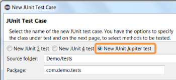
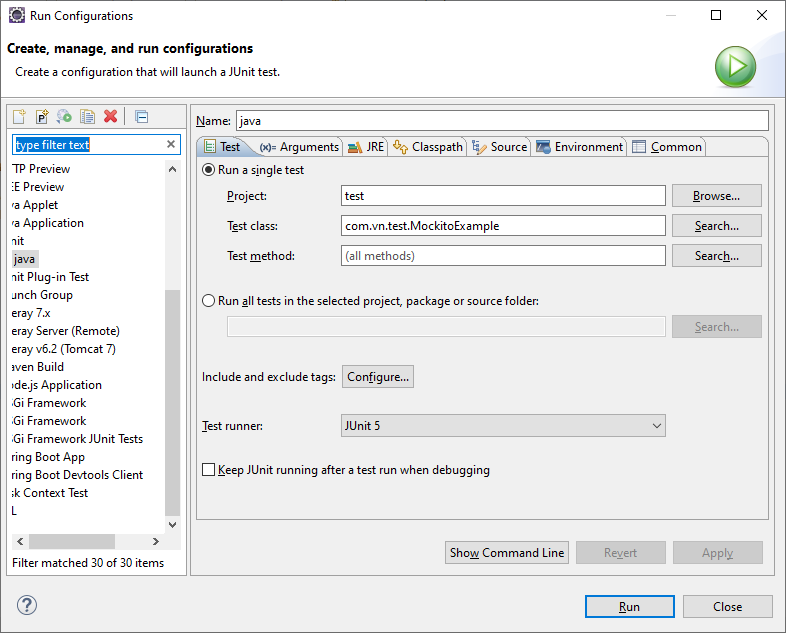
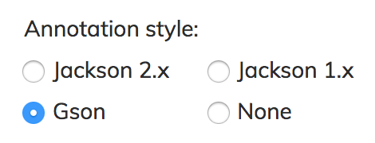
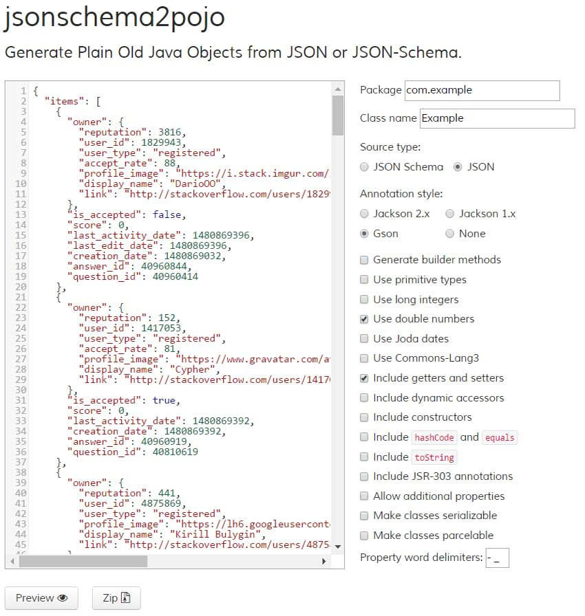
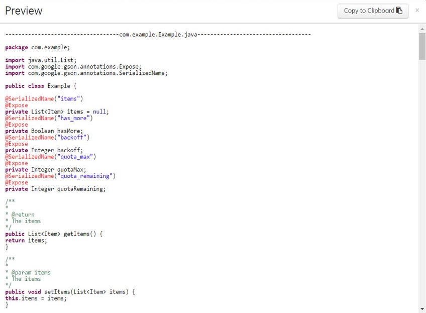

[TOC]

---

https://howtodoinjava.com/junit-5-tutorial/

https://www.eclipse.org/community/eclipse_newsletter/2017/october/article5.php

## JUnit 5 Architecture

As [compared to JUnit 4](https://howtodoinjava.com/junit-5/junit-5-vs-junit-4/), JUnit 5 is composed of several different modules from three different sub-projects:

```
JUnit 5 = JUnit Platform + JUnit Jupiter + JUnit Vintage
```

## What can I do with JUnit 5?

### Create a new JUnit Jupiter test

Create a new JUnit Jupiter test via **New JUnit Test Case** wizard:

[](https://www.eclipse.org/community/eclipse_newsletter/2017/october/images/junit_test.png)

Sau đó right click vào Run configurations replace test runner thay thành **Junit 5**:


On this page, you can specify the lifecycle method stubs to be generated for this test case. It also lets you select a class under test and on the next page, you can select the methods from this class to generate test stubs.

## Installation

You can use JUnit 5 in your maven or gradle project by including minimum two dependencies i.e. Jupiter Engine Dependency and Platform Runner Dependency.

```xml
<properties>
		<project.build.sourceEncoding>UTF-8</project.build.sourceEncoding>
		<maven.compiler.source>1.8</maven.compiler.source>
		<maven.compiler.target>${maven.compiler.source}</maven.compiler.target>
		<junit.jupiter.version>5.5.2</junit.jupiter.version>
		<junit.platform.version>1.5.2</junit.platform.version>
	</properties>

	<dependencies>
		<dependency>
			<groupId>org.junit.jupiter</groupId>
			<artifactId>junit-jupiter-engine</artifactId>
			<version>${junit.jupiter.version}</version>
			<scope>test</scope>
		</dependency>
		<dependency>
			<groupId>org.junit.platform</groupId>
			<artifactId>junit-platform-runner</artifactId>
			<version>${junit.platform.version}</version>
			<scope>test</scope>
		</dependency>
	</dependencies>

	//build.gradle

testRuntime("org.junit.jupiter:junit-jupiter-engine:5.5.2")
testRuntime("org.junit.platform:junit-platform-runner:1.5.2")
```

## JUnit 5 Annotations

JUnit 5 offers following annotations to write tests.

| ANNOTATION     | DESCRIPTION                                                                                             |
| -------------- | ------------------------------------------------------------------------------------------------------- |
| `@BeforeEach`  | The annotated method will be run before each test method in the test class.                             |
| `@AfterEach`   | The annotated method will be run after each test method in the test class.                              |
| `@BeforeAll`   | The annotated method will be run before all test methods in the test class. This method must be static. |
| `@AfterAll`    | The annotated method will be run after all test methods in the test class. This method must be static.  |
| `@Test`        | It is used to mark a method as junit test                                                               |
| `@DisplayName` | Used to provide any custom display name for a test class or test method                                 |
| `@Disable`     | It is used to disable or ignore a test class or method from test suite.                                 |
| `@Nested`      | Used to create nested test classes                                                                      |
| `@Tag`         | Mark test methods or test classes with tags for test discovering and filtering                          |
| `@TestFactory` | Mark a method is a test factory for dynamic tests                                                       |

## Writing Tests in JUnit 5

There is not much changed between JUnit 4 and JUnit 5 in test writing styles. Here is sample tests with their [life cycle](https://howtodoinjava.com/junit-5/junit-5-test-lifecycle/) methods.

```java
package com.vn.test;

import static org.junit.jupiter.api.Assertions.*;

import org.junit.jupiter.api.AfterAll;
import org.junit.jupiter.api.AfterEach;
import org.junit.jupiter.api.Assertions;
import org.junit.jupiter.api.BeforeAll;
import org.junit.jupiter.api.BeforeEach;
import org.junit.jupiter.api.Disabled;
import org.junit.jupiter.api.Tag;
import org.junit.jupiter.api.Test;

class TestExample {

	@Test
	void test() {
		System.out.println("======TEST ZERO EXECUTED FAIL=======");
		fail("Not yet implemented");
	}

	@BeforeAll
	static void setup() {
		System.out.println("\n@BeforeAll executed");
	}

	@BeforeEach
	void setupThis() {
		System.out.println("\n--------");
		System.out.println("@BeforeEach executed");
	}

	@Tag("DEV")
	@Test
	void testCalcOne() {
		System.out.println("======TEST ONE EXECUTED=======");
		Assertions.assertEquals(4, 4);
	}

	@Tag("PROD")
	@Disabled
	@Test
	void testCalcTwo() {
		System.out.println("======TEST TWO EXECUTED=======");
		Assertions.assertEquals(6, 6);
	}

	@AfterEach
	void tearThis() {
		System.out.println("@AfterEach executed");
	}

	@AfterAll
	static void tear() {
		System.out.println("\n@AfterAll executed");
	}

}

```

## Test Suites

Using **JUnit 5 test suites**, you can run tests spread into multiple test classes and different packages. JUnit 5 provides two annotations: [@SelectPackages](http://junit.org/junit5/docs/current/api/index.html?org/junit/platform/runner/SelectPackages.html) and [@SelectClasses](http://junit.org/junit5/docs/current/api/index.html?org/junit/platform/runner/SelectClasses.html) to create test suites.

To execute the suite, you will use `@RunWith(JUnitPlatform.class)`.

```java
@RunWith(JUnitPlatform.class)
@SelectPackages("com.howtodoinjava.junit5.examples")
public class JUnit5TestSuiteExample
{
}
```

Additionally, you can use following annotations for filtering test packages, classes or even test methods.

1. `@IncludePackages` and `@ExcludePackages` to filter packages
2. `@IncludeClassNamePatterns` and `@ExcludeClassNamePatterns` to filter test classes
3. `@IncludeTags` and `@ExcludeTags` to filter test methods

```java
@RunWith(JUnitPlatform.class)
@SelectPackages("com.howtodoinjava.junit5.examples")
@IncludePackages("com.howtodoinjava.junit5.examples.packageC")
@ExcludeTags("PROD")
public class JUnit5TestSuiteExample
{
}
```

## Assertions

Assertions help in validating the expected output with actual output of a testcase. To keep things simple, all JUnit Jupiter assertions are static methods in the [org.junit.jupiter.Assertions](http://junit.org/junit5/docs/current/api/org/junit/jupiter/api/Assertions.html) class e.g. `assertEquals()`, `assertNotEquals()`.

```java
void testCase()
{
    //Test will pass
    Assertions.assertNotEquals(3, Calculator.add(2, 2));

    //Test will fail
    Assertions.assertNotEquals(4, Calculator.add(2, 2), "Calculator.add(2, 2) test failed");

    //Test will fail
    Supplier<String> messageSupplier  = ()-> "Calculator.add(2, 2) test failed";
    Assertions.assertNotEquals(4, Calculator.add(2, 2), messageSupplier);
}
```

## JUnit 5 @BeforeAll annotation example

`@BeforeAll` **annotated method MUST be a [static](https://howtodoinjava.com/java/basics/java-static-keyword/) method** otherwise it will throw runtime error.

https://www.petrikainulainen.net/programming/testing/junit-5-tutorial-writing-assertions-with-junit-5-api/

## JAVA ALL

https://mkyong.com/all-tutorials-on-mkyong-com/

https://www.vogella.com/tutorials/JUnit/article.html

| Statement                                            | Description                                                                                                                                                                                  |
| :--------------------------------------------------- | :------------------------------------------------------------------------------------------------------------------------------------------------------------------------------------------- |
| fail([message])                                      | Let the method fail. Might be used to check that a certain part of the code is not reached or to have a failing test before the test code is implemented. The message parameter is optional. |
| assertTrue([message,] boolean condition)             | Checks that the boolean condition is true.                                                                                                                                                   |
| assertFalse([message,] boolean condition)            | Checks that the boolean condition is false.                                                                                                                                                  |
| assertEquals([message,] expected, actual)            | Tests that two values are the same. Note: for arrays the reference is checked not the content of the arrays.                                                                                 |
| assertEquals([message,] expected, actual, tolerance) | Test that float or double values match. The tolerance is the number of decimals which must be the same.                                                                                      |
| assertNull([message,] object)                        | Checks that the object is null.                                                                                                                                                              |
| assertNotNull([message,] object)                     | Checks that the object is not null.                                                                                                                                                          |
| assertSame([message,] expected, actual)              | Checks that both variables refer to the same object.                                                                                                                                         |
| assertNotSame([message,] expected, actual)           | Checks that both variables refer to different objects                                                                                                                                        |

## Mockito

https://howtodoinjava.com/mockito/junit-mockito-example/

https://www.vogella.com/tutorials/java.html

https://www.tutorialspoint.com/mockito/mockito_environment.htm

https://www.baeldung.com/mockito-annotations

https://examples.javacodegeeks.com/core-java/mockito/mockito-maven-dependency-example/

### Adding dependencies

Dependencies can be added in two ways. Either directly specifying the dependencies in the pom.xml tab or using ‘Dependencies’ tab to add dependencies. We will use the later.

Open the pom.xml file and click on the ‘Dependencies’ tab. Click on the ‘Add…’ button. Eclipse will open a popup where you can define dependencies. Enter the details as below:

**Group Id**: org.mockito

**Artifact Id**: mockito-all

pom.xml

```xml
<project xmlns="http://maven.apache.org/POM/4.0.0"
	xmlns:xsi="http://www.w3.org/2001/XMLSchema-instance"
	xsi:schemaLocation="http://maven.apache.org/POM/4.0.0 http://maven.apache.org/xsd/maven-4.0.0.xsd">
	<modelVersion>4.0.0</modelVersion>

	<groupId>com.vn</groupId>
	<artifactId>test</artifactId>
	<version>0.0.1-SNAPSHOT</version>
	<packaging>jar</packaging>

	<name>test</name>
	<url>http://maven.apache.org</url>

	<properties>
		<project.build.sourceEncoding>UTF-8</project.build.sourceEncoding>
		<maven.compiler.source>1.8</maven.compiler.source>
		<maven.compiler.target>${maven.compiler.source}</maven.compiler.target>
		<junit.jupiter.version>5.5.2</junit.jupiter.version>
		<junit.platform.version>1.5.2</junit.platform.version>
	</properties>

	<dependencies>
		<dependency>
			<groupId>org.junit.jupiter</groupId>
			<artifactId>junit-jupiter-engine</artifactId>
			<version>${junit.jupiter.version}</version>
			<scope>test</scope>
		</dependency>
		<dependency>
			<groupId>org.junit.platform</groupId>
			<artifactId>junit-platform-runner</artifactId>
			<version>${junit.platform.version}</version>
			<scope>test</scope>
		</dependency>
		<!-- https://mvnrepository.com/artifact/org.mockito/mockito-all -->
		<dependency>
			<groupId>org.mockito</groupId>
			<artifactId>mockito-all</artifactId>
			<version>1.10.19</version>
			<scope>test</scope>
		</dependency>

	</dependencies>
</project>

```

Run with a class:



Now we will test if our maven project has been set up correctly or not. We will create a simple test class to test this.

_MockitoExample.java_

```java
package mockito;

import java.util.List;

import org.junit.Test;

import static org.mockito.Mockito.*;
import static org.junit.Assert.*;

public class MockitoExample {

  @Test
  public void test() {
    List<String> mockList = mock(List.class);
    mockList.add("First");
    when(mockList.get(0)).thenReturn("Mockito");
    when(mockList.get(1)).thenReturn("JCG");
    assertEquals("Mockito", mockList.get(0));
    assertEquals("JCG", mockList.get(1));
  }
}
```

Run this class as JUnit test and it should run successfully. This will prove that your dependencies are setup correctly.

Test

```java
import static org.junit.Assert.assertEquals;

import java.util.ArrayList;
import java.util.List;

import org.junit.jupiter.api.Test;
import org.junit.runner.RunWith;
import org.mockito.Mockito;
import org.mockito.runners.MockitoJUnitRunner;

@RunWith(MockitoJUnitRunner.class)
public class MockitoTest
{
	@Test
	public void whenNotUseMockAnnotation_thenCorrect() {
	    List mockList = Mockito.mock(ArrayList.class);

	    mockList.add("one");
	    Mockito.verify(mockList).add("one");
	    System.out.println(mockList.size());
	    assertEquals(0, mockList.size());

	    Mockito.when(mockList.size()).thenReturn(100);
	    System.out.println(mockList.size());
	    assertEquals(100, mockList.size());
	}
}

```

https://www.baeldung.com/tag/mockito/

https://codepills.com/2018/05/10/3-basic-mistakes-for-nullpointerexception-when-mock/

---

## Jersey test

https://www.baeldung.com/jersey-test

https://gpcoder.com/6028-lam-the-nao-de-test-jersey-rest-api-voi-junit/

---

https://www.avajava.com/tutorials/categories/design-patterns

https://examples.javacodegeeks.com/core-java/java-8-filter-null-values-stream-example/

https://www.geeksforgeeks.org/java-8-stream/

---

# Gson – How to convert Java object to / from JSON

https://mkyong.com/java/how-to-parse-json-with-gson/?utm_source=mkyong.com&utm_medium=referral&utm_campaign=footer-left&utm_content=link5

https://mkyong.com/java/how-do-convert-java-object-to-from-json-format-gson-api/

## 1. Download Gson

pom.xml

```xml
	<dependency>
		<groupId>com.google.code.gson</groupId>
		<artifactId>gson</artifactId>
		<version>2.8.5</version>
	</dependency>
```

## 2. Gson Basic

`toJson()` – Convert Java objects to JSON

```java
Gson gson = new Gson();

	Staff obj = new Staff();

	// 1. Java object to JSON file
	gson.toJson(obj, new FileWriter("C:\\projects\\staff.json"));

	// 2. Java object to JSON string
	String jsonInString = gson.toJson(obj);
Copy
```

`fromJson()` – Convert JSON to Java objects

```java
	Gson gson = new Gson();

	// 1. JSON file to Java object
	Staff staff = gson.fromJson(new FileReader("C:\\projects\\staff.json"), Staff.class);

	// 2. JSON string to Java object
	String json = "{'name' : 'mkyong'}";
	Staff staff = gson.fromJson(json, Staff.class);

	// 3. JSON file to JsonElement, later String
	JsonElement json = gson.fromJson(new FileReader("C:\\projects\\staff.json"), JsonElement.class);
    String result = gson.toJson(json);
```

## 3. Java Objects to JSON

3.1 A Java POJO, later uses this for conversion.

Staff.java

```java
package com.mkyong;

import java.math.BigDecimal;
import java.util.Arrays;
import java.util.List;
import java.util.Map;

public class Staff {

    private String name;
    private int age;
    private String[] position;              // array
    private List<String> skills;            // list
    private Map<String, BigDecimal> salary; // map

    //getters and setters
}
Copy
```

3.2 In Gson, we can use `gson.toJson()` to convert Java objects to JSON.

GsonExample1.java

```java
package com.mkyong;

import com.google.gson.Gson;

import java.io.FileWriter;
import java.io.IOException;
import java.math.BigDecimal;
import java.util.Arrays;
import java.util.HashMap;
import java.util.Map;

public class GsonExample1 {

    public static void main(String[] args) {

        Gson gson = new Gson();

        Staff staff = createStaffObject();

        // Java objects to String
        // String json = gson.toJson(staff);

        // Java objects to File
        try (FileWriter writer = new FileWriter("C:\\projects\\staff.json")) {
            gson.toJson(staff, writer);
        } catch (IOException e) {
            e.printStackTrace();
        }

    }

    private static Staff createStaffObject() {

        Staff staff = new Staff();

        staff.setName("mkyong");
        staff.setAge(35);
        staff.setPosition(new String[] { "Founder", "CTO", "Writer" });
		Map<String, BigDecimal> salary = new HashMap<>();
		salary.put("2010", new BigDecimal(10000));
		salary.put("2012", new BigDecimal(12000));
		salary.put("2012", new BigDecimal(12000));
        staff.setSalary(salary);
        staff.setSkills(Arrays.asList("java", "python", "node", "kotlin"));

        return staff;

    }

}
Copy
```

By default, Gson write JSON in compact mode.

C:\\projects\\staff.json

```bash
{"name":"mkyong","age":35,"position":["Founder","CTO","Writer"],"skills":["java","python","node","kotlin"],"salary":{"2018":14000,"2012":12000,"2010":10000}}
Copy
```

To enable the pretty print mode :

```undefined
import com.google.gson.Gson;
import com.google.gson.GsonBuilder;

	Gson gson = new GsonBuilder().setPrettyPrinting().create();
Copy
```

Output

C:\\projects\\staff.json

```bash
{
  "name": "mkyong",
  "age": 35,
  "position": [
    "Founder",
    "CTO",
    "Writer"
  ],
  "skills": [
    "java",
    "python",
    "node",
    "kotlin"
  ],
  "salary": {
    "2018": 14000,
    "2012": 12000,
    "2010": 10000
  }
}
Copy
```

## 4. JSON to Java Objects

4.1 In Gson, we can use `gson.fromJson` to convert JSON back to Java objects.

GsonExample2.java

```java
package com.mkyong;

import com.google.gson.Gson;

import java.io.FileReader;
import java.io.IOException;
import java.io.Reader;

public class GsonExample2 {

    public static void main(String[] args) {

        Gson gson = new Gson();

        try (Reader reader = new FileReader("c:\\projects\\staff.json")) {

            // Convert JSON File to Java Object
            Staff staff = gson.fromJson(reader, Staff.class);

			// print staff object
            System.out.println(staff);

        } catch (IOException e) {
            e.printStackTrace();
        }

    }

}
Copy
```

Output

```bash
Staff{name='mkyong', age=35, position=[Founder, CTO, Writer], skills=[java, python, node, kotlin], salary={2018=14000, 2012=12000, 2010=10000}}
Copy
```

4.2 Convert to `JsonElement`

GsonExample3.java

```java
package com.mkyong;

import com.google.gson.Gson;
import com.google.gson.GsonBuilder;
import com.google.gson.JsonElement;

import java.io.FileReader;
import java.io.IOException;
import java.io.Reader;

public class GsonExample3 {

    public static void main(String[] args) {

		// pretty print
        Gson gson = new GsonBuilder().setPrettyPrinting().create();

        try (Reader reader = new FileReader("c:\\projects\\staff.json")) {

            // Convert JSON to JsonElement, and later to String
            JsonElement json = gson.fromJson(reader, JsonElement.class);

            String jsonInString = gson.toJson(json);

            System.out.println(jsonInString);

        } catch (IOException e) {
            e.printStackTrace();
        }


    }

}
Copy
```

Output

```bash
{
  "name": "mkyong",
  "age": 35,
  "position": [
    "Founder",
    "CTO",
    "Writer"
  ],
  "skills": [
    "java",
    "python",
    "node",
    "kotlin"
  ],
  "salary": {
    "2018": 14000,
    "2012": 12000,
    "2010": 10000
  }
}
Copy
```

## 5. Pretty Print JSON

5.1 The default JSON output is compact mode.

5.2 To enable pretty print.

GsonExample4.java

```java
package com.mkyong;

import com.google.gson.Gson;
import com.google.gson.GsonBuilder;

public class GsonExample4 {

    public static void main(String[] args) {

        // pretty print
        Gson gson = new GsonBuilder().setPrettyPrinting().create();

        String[] lang = {"Java", "Node", "Kotlin", "JavaScript"};
        String json = gson.toJson(lang);

        System.out.println(json);

    }

}
Copy
```

Output

```json
["Java", "Node", "Kotlin", "JavaScript"]
```

## 6. Exclude Fields

In Gson, there are many ways to exclude certain fields.

6.1 By default, `transient` and `static` fields will be excluded. We can override the default by `excludeFieldsWithModifiers`

If we want to exclude static fields only.

```java
import java.lang.reflect.Modifier;

	Gson gson = new GsonBuilder()
			.excludeFieldsWithModifiers(Modifier.STATIC)
			.create();
Copy
```

If we want to exclude transient and static fields, default.

```java
import java.lang.reflect.Modifier;

	Gson gson = new GsonBuilder()
			.excludeFieldsWithModifiers(Modifier.STATIC, Modifier.TRANSIENT)
			.create();
Copy
```

In this configuration, static and transient fields will be included.

```java
	Gson gson = new GsonBuilder()
			.excludeFieldsWithModifiers()
			.create();
Copy
```

6.2 Exclude fields by `@Expose`

The `@Expose` define which fields to be excluded from serialization and deserialization to JSON. To use `@Expose`, we need to create Gson object like this:

```java
	Gson gson = new GsonBuilder()
			.excludeFieldsWithoutExposeAnnotation()
			.create();
Copy
```

If `.excludeFieldsWithoutExposeAnnotation()` mode is enabled, all fields without `@Expose` will be excluded. For example,

```java
import com.google.gson.annotations.Expose;

public class Staff {

    @Expose(serialize = true, deserialize = true)
    private String name;
    @Expose
    private int age;
    @Expose(serialize = false, deserialize = true)

    private String[] position;
    private List<String> skills;
    private Map<String, BigDecimal> salary;
Copy
```

If convert above Java object to JSON, the output will be like this

```bash
{
  "name": "mkyong",
  "age": 35
}
Copy
```

6.3 Exclude fields by `ExclusionStrategies`, annotation, type, field name and etc. Gson is flexible.

A custom annotation `@ExcludeField`

ExcludeField.java

```java
package com.mkyong;

import java.lang.annotation.ElementType;
import java.lang.annotation.Retention;
import java.lang.annotation.RetentionPolicy;
import java.lang.annotation.Target;

@Retention(RetentionPolicy.RUNTIME)
@Target({ElementType.FIELD})
public @interface ExcludeField {
}
Copy
```

A `ExclusionStrategy` to define what fields should be excluded or skipped.

CustomExclusionStrategy.java

```java
package com.mkyong;

import com.google.gson.ExclusionStrategy;
import com.google.gson.FieldAttributes;

public class CustomExclusionStrategy implements ExclusionStrategy {

    private final Class<?> typeToSkip;

    public CustomExclusionStrategy(Class<?> typeToSkip) {
        this.typeToSkip = typeToSkip;
    }

    @Override
    public boolean shouldSkipField(FieldAttributes f) {

        // if field name 'salary`, skip
        if ("salary".equals(f.getName())) {
            return true;
        }

        // if found @ExcludeField, skip
        if (f.getAnnotation(ExcludeField.class) != null) {
            return true;
        }

        return false;
    }

    @Override
    public boolean shouldSkipClass(Class<?> clazz) {
        return (clazz == typeToSkip);
    }

}
Copy
```

Review the `staff` object again.

Staff.java

```java
public class Staff {


    private String name;
    private int age;
    @ExcludeField
    private String[] position;
    private List<String> skills;
    private Map<String, BigDecimal> salary;
Copy
```

Enable the `ExclusionStrategy` mode.

```java
	Gson gson = new GsonBuilder()
		.setExclusionStrategies(new CustomExclusionStrategy(List.class)) // exclude all List fields.
		.create();
Copy
```

Output, this example, field name `salary`, `@ExcludeField` fields and `List` type fields will be excluded.

```bash
{"name":"mkyong","age":35}
Copy
```

## 7. Null Object Support

`null` object fields are ignored.

GsonExample5.java

```java
package com.mkyong;

import com.google.gson.Gson;

public class GsonExample5 {

    public static void main(String[] args) {

        Gson gson = new Gson();

        Staff staff = createStaffObject();

        String json = gson.toJson(staff);

        System.out.println(json);

    }

    private static Staff createStaffObject() {

        Staff staff = new Staff();

        staff.setName("mkyong");
        staff.setAge(35);

        return staff;

    }

}
Copy
```

Output

```bash
{"name":"mkyong","age":35}
Copy
```

To display the null value.

```java
	Gson gson = new GsonBuilder().serializeNulls().create();
Copy
```

Output

```bash
{"name":"mkyong","age":35,"position":null,"skills":null,"salary":null}
Copy
```

## 8. JSON Field Naming Support

Default

```java
public class Staff {

    private String name;
Copy
```

Output

```bash
{"name":"abc"}
Copy
```

Custom field name with `@SerializedName`

```java
public class Staff {

    @SerializedName("mkyong_name")
    private String name;
Copy
```

Output

```bash
{"mkyong_name":"abc"}
Copy
```

## 9. Versioning Support

```java
import com.google.gson.annotations.Since;

import java.math.BigDecimal;
import java.util.Arrays;
import java.util.List;
import java.util.Map;

public class Staff {

    @Since(1.0)
    private String name;

    @Since(2.0)
    private int age;

    @Since(3.0)
    private String[] position;

    private List<String> skills;
    private Map<String, BigDecimal> salary;
Copy
```

In this example, the field `position` (version 3) will be excluded.

```java
Gson gson = new GsonBuilder()
                .serializeNulls()
                .setVersion(2.0) // version <= 2.0 will be included.
                .create();
Copy
```

Output

```bash
{"name":null,"age":0,"skills":null,"salary":null}
Copy
```

## 10. FAQs

Some commonly ask questions.

10.1 Convert a JSON Array to a List of object, using `TypeToken`

GsonExample4.java

```java
package com.mkyong;

import com.google.gson.Gson;
import com.google.gson.reflect.TypeToken;

import java.util.List;

public class GsonExample4 {

    public static void main(String[] args) {

        Gson gson = new Gson();
        String json = "[{\"name\":\"mkyong\"}, {\"name\":\"laplap\"}]";
        List<Staff> list = gson.fromJson(json, new TypeToken<List<Staff>>() {}.getType());
        list.forEach(x -> System.out.println(x));

    }

}
Copy
```

Output

```bash
Staff{name='mkyong', age=0, position=null, skills=null, salary=null}
Staff{name='laplap', age=0, position=null, skills=null, salary=null}
Copy
```

10.2 Convert a JSON to a `Map`

GsonExample5.java

```java
package com.mkyong;

import com.google.gson.Gson;
import com.google.gson.reflect.TypeToken;

import java.util.Map;

public class GsonExample5 {

    public static void main(String[] args) {

        Gson gson = new Gson();

        String json = "{\"name\":\"mkyong\", \"age\":33}";
        Map<String, Object> map = gson.fromJson(json, new TypeToken<Map<String, Object>>() {}.getType());
        map.forEach((x, y) -> System.out.println("key : " + x + " , value : " + y));

    }

}
Copy
```

Output

```bash
key : name , value : mkyong
key : age , value : 33.0
Copy
```

**Note**
Read more [Gson user guide](https://github.com/google/gson/blob/master/UserGuide.md)

**Note**
More [Gson examples](https://www.mkyong.com/java/how-to-parse-json-with-gson/)

## References

- [Gson github link](https://github.com/google/gson)
- [Gson – How to parse JSON](https://www.mkyong.com/java/how-to-parse-json-with-gson/)
- [JSON Official site](http://www.json.org/)
- [Wikipedia – JSON](https://en.wikipedia.org/wiki/JSON)
- [Gson – How to enable pretty print JSON output](https://www.mkyong.com/java/how-to-enable-pretty-print-json-output-gson/)

---

# Jackson – Convert JSON array string to List

https://mkyong.com/java/jackson-convert-json-array-string-to-list/?utm_source=mkyong.com&utm_medium=referral&utm_campaign=footer-middle&utm_content=link8

Few Jackson examples to convert a JSON array string to a `List`

```java
	// JSON array string
	// [{"name":"mkyong", "age":37}, {"name":"fong", "age":38}]

	ObjectMapper mapper = new ObjectMapper();
	String json = "[{\"name\":\"mkyong\", \"age\":37}, {\"name\":\"fong\", \"age\":38}]";

	// 1. convert JSON array to Array objects
	Person[] pp1 = mapper.readValue(json, Person[].class);

	// 2. convert JSON array to List of objects
	List<Person> ppl2 = Arrays.asList(mapper.readValue(json, Person[].class));
Copy
```

pom.xml

```markup
	<dependency>
		<groupId>com.fasterxml.jackson.core</groupId>
		<artifactId>jackson-databind</artifactId>
		<version>2.9.8</version>
	</dependency>
Copy
```

_P.S Tested with Jackson 2.9.8_

## 1. Convert JSON array string to List

1.1 JSON array string

```bash
[{"name":"mkyong", "age":37}, {"name":"fong", "age":38}]
Copy
```

1.2 Create an object to map the above JSON fields.

```java
package com.mkyong;

public class Person {

    String name;
    Integer age;

    //getters and setters
}
Copy
```

1.3 Convert the JSON array string to a `List`

JacksonArrayExample.java

```java
package com.mkyong;

import com.fasterxml.jackson.core.type.TypeReference;
import com.fasterxml.jackson.databind.ObjectMapper;

import java.io.IOException;
import java.util.Arrays;
import java.util.List;

public class JacksonArrayExample {

    public static void main(String[] args) {

        ObjectMapper mapper = new ObjectMapper();
        String json = "[{\"name\":\"mkyong\", \"age\":37}, {\"name\":\"fong\", \"age\":38}]";

        try {

            // 1. convert JSON array to Array objects
            Person[] pp1 = mapper.readValue(json, Person[].class);

            System.out.println("JSON array to Array objects...");
            for (Person person : pp1) {
                System.out.println(person);
            }

            // 2. convert JSON array to List of objects
            List<Person> ppl2 = Arrays.asList(mapper.readValue(json, Person[].class));

            System.out.println("\nJSON array to List of objects");
            ppl2.stream().forEach(x -> System.out.println(x));

            // 3. alternative
            List<Person> pp3 = mapper.readValue(json, new TypeReference<List<Person>>() {});

            System.out.println("\nAlternative...");
            pp3.stream().forEach(x -> System.out.println(x));

        } catch (IOException e) {
            e.printStackTrace();
        }

    }
}
Copy
```

Output

```bash
1. JSON array to Array objects...
Person{name='mkyong', age=37}
Person{name='fong', age=38}

2. JSON array to List of objects
Person{name='mkyong', age=37}
Person{name='fong', age=38}

3. Alternative...
Person{name='mkyong', age=37}
Person{name='fong', age=38}
```

---

https://mkyong.com/java/how-to-convert-java-object-to-from-json-jackson/?utm_source=mkyong.com&utm_medium=referral&utm_campaign=afterpost-related&utm_content=link6

## 1. Quick Reference

1.1 Convert Java object to JSON, `writeValue(...)`

```java
ObjectMapper mapper = new ObjectMapper();
User user = new User();

//Object to JSON in file
mapper.writeValue(new File("c:\\user.json"), user);

//Object to JSON in String
String jsonInString = mapper.writeValueAsString(user);
Copy
```

1.2 Convert JSON to Java object, `readValue(...)`

```java
ObjectMapper mapper = new ObjectMapper();
String jsonInString = "{'name' : 'mkyong'}";

//JSON from file to Object
User user = mapper.readValue(new File("c:\\user.json"), User.class);

//JSON from String to Object
User user = mapper.readValue(jsonInString, User.class);
```

## References

---

https://mkyong.com/java/jackson-2-convert-java-object-to-from-json/?utm_source=mkyong.com&utm_medium=referral&utm_campaign=afterpost-related&utm_content=link5

https://mkyong.com/java/jackson-2-convert-java-object-to-from-json/

---

# Android and retrofit

https://code.tutsplus.com/vi/tutorials/getting-started-with-retrofit-2--cms-27792

https://yellowcodebooks.com/category/lap-trinh-android/android-co-ban-bai-hoc-theo-chuong-trinh/bai-hoc-theo-chuong-trinh/?fbclid=IwAR3_Zx5yujca1n9h42iH3gboWFLw2SLfwiCiTpf7Y0WMT3tnEiBCRFOK4eI

## 1.Declaring Dependencies

After creating a new project, declare the following dependencies in your `build.gradle`**.** The dependencies include a recycler view, the Retrofit library, and also Google's Gson library to convert JSON to POJO (Plain Old Java Objects) as well as Retrofit's Gson integration.

```bash
// Retrofit
compile 'com.squareup.retrofit2:retrofit:2.1.0'

// JSON Parsing
compile 'com.google.code.gson:gson:2.6.1'
compile 'com.squareup.retrofit2:converter-gson:2.1.0'

```

Don't forget to sync the project to download these libraries.

pom.xml

```xml
<dependency>
			<groupId>com.google.code.gson</groupId>
			<artifactId>gson</artifactId>
			<version>2.8.5</version>
		</dependency>

		<dependency>
			<groupId>com.fasterxml.jackson.core</groupId>
			<artifactId>jackson-databind</artifactId>
			<version>2.9.8</version>
		</dependency>

		<!-- https://mvnrepository.com/artifact/com.squareup.retrofit2/retrofit -->
		<dependency>
			<groupId>com.squareup.retrofit2</groupId>
			<artifactId>retrofit</artifactId>
			<version>2.3.0</version>
		</dependency>

		<!-- https://mvnrepository.com/artifact/com.squareup.retrofit2/converter-gson -->
		<dependency>
			<groupId>com.squareup.retrofit2</groupId>
			<artifactId>converter-gson</artifactId>
			<version>2.3.0</version>
		</dependency>

```

## 2.Tạo ra các Model một cách tự động

### Ánh xạ dữ liệu JSON vào Java

Bây giờ hãy truy cập vào [jsonschema2pojo](http://www.jsonschema2pojo.org/) và dán các dữ liệu JSON trả về vào hộp nhập liệu.

Chọn Source type là **JSON**, Annotation style là **Gson**, và bỏ chọn **Allow additional properties**.

Nhớ chọn Source type: JSON và Annotation style:GSON

#### Automated approach - Auto-generating the Java classes

Assuming you have the JSON response already, go to [jsonschema2pojo](http://www.jsonschema2pojo.org/). Make sure to select `JSON` as the Source Type:


Set the Annotation style to `Gson`.





Sau đó nhấp vào nút **Preview** để tạo ra các đối tượng Java.



Bạn có thể thắc mắc là các chú thích `@SerializedName` và `@Expose` làm gì trong đoạn code được tạo ra này. Đừng lo, tôi sẽ giải thích tất cả!

`@SerializedName` cần thiết cho Gson để ánh xạ các khoá JSON với các trường dữ liệu của chúng ta. Để phù hợp với quy ước đặt tên kiểu camelCase của Java cho các thuộc tính thành viên của lớp, bạn không nên sử dụng dấu gạch dưới để tách các từ ngữ trong một biến. `@SerializedName` giúp chuyển đổi giữa hai cái này.

```java
@SerializedName("quota_remaining")
@Expose
private Integer quotaRemaining;
```

Trong ví dụ trên, chúng ta đang nói cho Gson của chúng ta biết rằng khoá JSON `quota_remaining` nên được ánh xạ tới trường dữ liệu `quotaRemaining` trong Java. Nếu cả hai giá trị này như nhau, tức là nếu khóa JSON của chúng ta là `quotaRemaining` giống trường dữ liệu Java, thì sau đó không cần chú thích `@SerializedName` trên trường dữ liệu vì Gson sẽ ánh xạ chúng một cách tự động.

Chú thích `@Expose` chỉ ra rằng thành viên này nên được trình bày với JSON serialization hoặc deserialization.

## 3.Tạo đối tượng Retrofit

Để gởi các yêu cầu trên mạng đến một API REST với Retrofit, chúng ta cần tạo ra một đối tượng bằng cách sử dụng lớp [`Retrofit.Builder`](http://square.github.io/retrofit/2.x/retrofit/retrofit2/Retrofit.Builder.html) và cấu hình nó với một URL cơ sở.

Tạo một gói con mới bên trong gói `data` và đặt tên cho nó là `remote`. Bây giờ bên trong `remote`, tạo một lớp Java và đặt tên nó là `RetrofitClient`. Lớp này sẽ tạo ra một singleton của Retrofit. Retrofit cần một URL cơ sở để xây dựng đối tượng của nó, do đó, chúng ta sẽ truyền qua một URL khi gọi `RetrofitClient.getClient (String baseUrl)`. URL này sau đó sẽ được sử dụng để xây dựng đối tượng ở dòng 13. Chúng ta cũng xác định bộ chuyển đổi JSON mà chúng ta cần (Gson) trong dòng số 14.

```java
import retrofit2.Retrofit;
import retrofit2.converter.gson.GsonConverterFactory;

public class RetrofitClient {

    private static Retrofit retrofit = null;

    public static Retrofit getClient(String baseUrl) {
        if (retrofit==null) {
            retrofit = new Retrofit.Builder()
                    .baseUrl(baseUrl)
                    .addConverterFactory(GsonConverterFactory.create())
                    .build();
        }
        return retrofit;
    }
}
```

## 4. Tạo API Interface

Bên trong gói remote, tạo ra một interface và gọi nó là `SOService`. Đối tượng này chứa các phương thức mà chúng ta sẽ sử dụng để thực thi các yêu cầu HTTP như `GET`, `POST`, `PUT`, `PATCH`, và `DELETE`. Đối với hướng dẫn này, chúng ta sẽ thực hiện một yêu cầu `GET`.

```java
import com.chikeandroid.retrofittutorial.data.model.SOAnswersResponse;

import java.util.List;

import retrofit2.Call;
import retrofit2.http.GET;

public interface SOService {

   @GET("/answers?order=desc&sort=activity&site=stackoverflow")
   Call<List<SOAnswersResponse>> getAnswers();

   @GET("/answers?order=desc&sort=activity&site=stackoverflow")
   Call<List<SOAnswersResponse>> getAnswers(@Query("tagged") String tags);
}
```

Chú thích `@GET` định nghĩa rõ ràng rằng yêu cầu `GET` sẽ được thực hiện một khi phương thức được gọi. Mỗi phương pháp trong interface này phải có một chú thích HTTP cung cấp phương thức yêu cầu và URL tương đối. Có năm chú thích được tích hợp sẵn gồm: `@GET`, `@POST`, `@PUT`, `@DELETE` và `@HEAD`.

Trong định nghĩa của phương thức thứ hai, chúng ta đã thêm một tham số truy vấn cho chúng ta để lọc dữ liệu từ máy chủ. Retrofit có chú thích `@Query("key")` để sử dụng thay vì thiết lập bằng tay ở trong endpoint. Giá trị khoá đại diện cho tên tham số trong URL. Nó sẽ được thêm vào URL bởi Retrofit. Ví dụ, nếu chúng ta truyền qua giá trị `"android"` như là đối số cho phương thức `getAnswers(String tags)`, URL đầy đủ sẽ là:

```
https://api.stackexchange.com/2.2/answers?order=desc&sort=activity&site=stackoverflow&tagged=android
```

Các tham số của các phương thức của interface có thể có các chú thích sau đây:

| `@Path`   | biến thay thế cho API endpoint                                    |
| --------- | ----------------------------------------------------------------- |
| `@Query`  | xác định tên khoá truy vấn với giá trị của tham số được chú thích |
| `@Body`   | payload cho việc gọi POST                                         |
| `@Header` | thiết lập header với giá trị của tham số được chú thích           |

## 5. Tạo các tiện ích API

Bây giờ chúng ta sẽ tạo ra một lớp tiện ích. Chúng ta sẽ đặt tên nó `ApiUtils`. Lớp này sẽ có URL cơ sở như là một biến tĩnh và đồng thời cung cấp interface `SOService` đến ứng dụng của chúng ta thông qua phương thức tĩnh `getSOService()`.

```java
public class ApiUtils {

    public static final String BASE_URL = "https://api.stackexchange.com/2.2";

    public static SOService getSOService() {
        return RetrofitClient.getClient(BASE_URL).create(SOService.class);
    }
}
```

## 6.Call API

```java
package com.vn.retrofit;

import com.vn.retrofit.test.model.SOAnswersResponse;

import retrofit2.Call;
import retrofit2.Callback;
import retrofit2.Response;

public class Main {
	public static void main(String[] args) {
		SOService mService = ApiUtils.getSOService();
		loadAnswers(mService);
		loadAnswersAndroid(mService);
	}

	public static void loadAnswers(SOService mService) {
		mService.getAnswers().enqueue(new Callback<SOAnswersResponse>() {
			@Override
			public void onResponse(Call<SOAnswersResponse> call, Response<SOAnswersResponse> response) {

				if (response.isSuccessful()) {
					System.out.println("posts loaded from API");
					System.out.println(response.body());
				} else {
					int statusCode = response.code();
					// handle request errors depending on status code
					System.out.println(statusCode);
				}
			}

			@Override
			public void onFailure(Call<SOAnswersResponse> call, Throwable t) {
				System.out.println("error loading from API");

			}
		});
	}

	public static void loadAnswersAndroid(SOService mService) {
		String tagged = "android";
		mService.getAnswers(tagged).enqueue(new Callback<SOAnswersResponse>() {
			@Override
			public void onResponse(Call<SOAnswersResponse> call, Response<SOAnswersResponse> response) {

				if (response.isSuccessful()) {
					System.out.println("posts loaded from API");
					System.out.println(response.body());
				} else {
					int statusCode = response.code();
					// handle request errors depending on status code
					System.out.println(statusCode);
				}
			}

			@Override
			public void onFailure(Call<SOAnswersResponse> call, Throwable t) {
				System.out.println("error loading from API");

			}
		});
	}

}

```

## Reference

https://www.vogella.com/tutorials/Retrofit/article.html

https://futurestud.io/tutorials/retrofit-2-passing-multiple-parts-along-a-file-with-partmap

https://guides.codepath.com/android/consuming-apis-with-retrofit#setup

Node

https://wanago.io/courses/node-js-typescript/

https://www.lynda.com/Node-js-tutorials/Parsing-multipartform-data/661808/757509-4.html

https://wanago.io/2019/03/18/node-js-typescript-6-sending-http-requests-understanding-multipart-form-data/

Webpack 4

https://wanago.io/courses/webpack-4-course/
