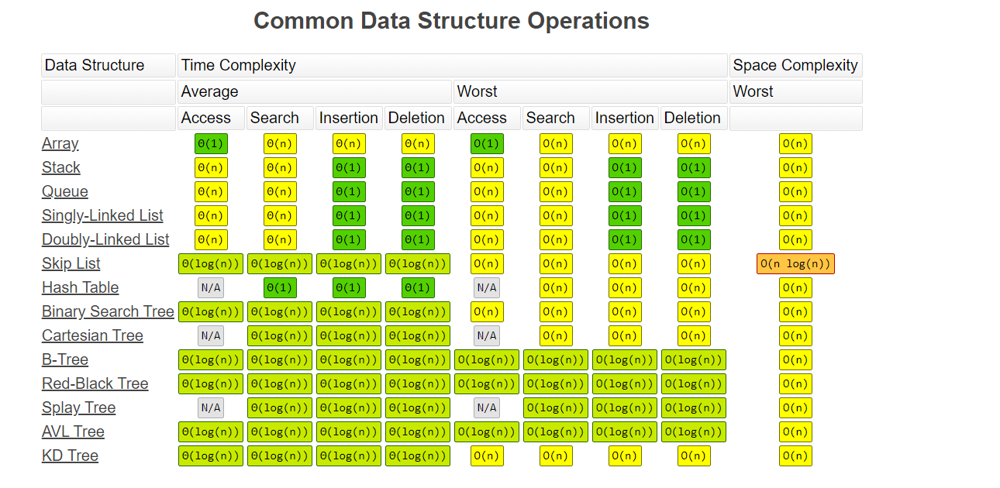
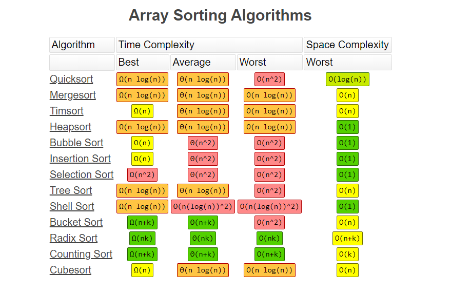

​                                   

Tài liệu

​     

# Kiến thức

## TCP and UDP:

 

https://viblo.asia/p/tim-hieu-giao-thuc-tcp-va-udp-jvEla11xlkw?fbclid=IwAR3exaDe33LbNGDRF-8OOKfLj7s7ZyNTPC8ClJxpvgtS9RfR6J415pmdjQQ

https://viblo.asia/p/dependency-inversion-inversion-of-control-and-dependency-injection-qzakzNYBkyO

## Session và cookie:

Điểm giống nhau

Session hay cookie đơn giản là những cách để chúng ta (các lập trình viên) lưu lại dữ liệu của người dùng sử dụng website.

 

Local storage:

·    Khả năng lưu trữ vô thời hạn: Có nghĩa là chỉ bị xóa bằng JavaScript, hoặc xóa bộ nhớ trình duyệt, hoặc xóa bằng localStorage API.

·    Lưu trữ được 5MB: Local Storage cho phép bạn lưu trữ thông tin tương đối lớn lên đến 5MB, lưu được lượng thông tin lớn nhất trong 3 loại.

·    Không gửi thông tin lên server như Cookie nên bảo mật tốt hơn.

Kiểm tra:

if (typeof(Storage) !== 'undefined') {

  //Nếu có hỗ trợ

  //Thực hiện thao tác với Storage

  alert('Trình duyệt của bạn hỗ trợ Storage');

} else {

  //Nếu không hỗ trợ

  alert('Trình duyệt của bạn không hỗ trợ Storage');

}

Sử dụng

- Khởi     tạo localStorage

```
localStorage.setItem('key', 'value');
// hoặc
localStorage.key = 'value';
// hoặc
localStorage['key'] = 'value';
```

Trong đó: `key` là tên biến, `value` là giá trị của biến muốn gán vào.

- Để     lấy giá trị localStorage và sử dụng, ta dùng `getItem`

```
localStorage.getItem('key');
// hoặc
localStorage.key;
```

- Để lấy số lượng localStorage đã     có trong trình duyệt, sử dụng length như     sau:

localStorage.length();

- Để xóa 1 biến trong     localStorage, sử dụng removeItem(tên_key)

localStorage.removeItem(key);

Hoặc xóa tất cả các biến trong localStorage, sử dụng clear

localStorage.clear();

Session:

- Mất dữ liệu khi đóng tab: Dữ     liệu của sessionStorage sẽ mất khi bạn đóng trình duyệt.
- Thông tin lưu trữ nhiều hơn cookie     (ít nhất 5MB)
- Là phiên làm việc để lưu trữ 1     biến và biến đó có thể tồn tại từ trang này đến trang khác(cùng tên miền)
- Session     được lưu trữ trên server

Sử dụng

sessionStorage cũng có cú pháp và cách sử dụn các thuộc tính, phương thức như localStorage:

```
if ( typeof(Storage) !== 'undefined') {
    // Khởi tạo sesionStorage
    sessionStorage.setItem('name', 'Ted Mosby');
    // get sessionStorage
    sessionStorage.getItem('name');
    // lấy ra số lượng session đã lưu trữ
    sessionStorage.length;
    // xóa 1 item localStorage
    sessionStorage.removeItem('name');
    // xóa tất cả item trong sessionStorage
    sessionStorage.clear();
} else {
    alert('Trình duyệt của bạn không hỗ trợ!');
}
```

Cookie

**Giới thiệu:**

- Thông     tin được gửi lên server: Cookie sẽ được truyền từ server tới browser và được     lưu trữ trên máy tính của bạn khi bạn truy cập vào ứng dụng, mỗi khi người     dùng tải ứng dụng, trình duyệt sẽ gửi cookie để thông báo cho ứng dụng về     hoạt động trước đó của bạn. Vì vậy đừng bao giờ lưu trữ những thông tin     quan trọng, yêu cầu tính bảo mật cao vào cookie vì nó hoàn toàn có thể bị     sửa đổi và đánh cắp, thấp chí có thể lợi dụng điều này để tấn công website     của bạn.
- Cookie     chủ yếu là để đọc phía máy chủ (cũng có thể được đọc ở phía máy khách),     localStorage và sessionStorage chỉ có thể được đọc ở phía máy khách.
- Có     thời gian sống: Mỗi cookie thường có khoảng thời gian timeout nhất định do     lập trình viên xác định trước.
- Lưu     trữ: cho phép lưu trữ tối đa 4KB và vài chục cookie cho một domain.
- Cookies là 1 phần dữ liệu được     lưu trên máy khách, mỗi khi máy khách yêu cầu đến máy chủ nào đó, thì nó     sẽ gửi phần dữ liệu được lưu trong cookies tương ứng tới máy chủ đó
- Cookie là một đoạn dữ liệu được     truyền từ server tới browser, được browser lưu trữ và gửi ngược lại server     mỗi khi nó gửi request.

**Xem cookie bằng trình duyệt**

Tương tự như localStorage, có thể chọn mở rộng mục Cookies để xem các giá trị cookie được lưu trữ

https://viblo.asia/p/local-storage-session-storage-va-cookie-ORNZqN3bl0n

Xác định người dùng với cookies

- Với     Cookies, có 3 bước để xác định người dùng cũ:
       
       

- - Server      gửi 1 tập tin bao gồm thông tin của người dung(tên, tuổi, ....)
  - Trình      duyệt sẽ lưu lại trên local để sử dụng trong tương lai
  - Khi      trình duyệt gửi bất cứ request nào đến server thì nó sẽ gửi luôn thông      tin của cookies đó lên server và server đó sẽ sử dụng thông tin đó để xác      thực người dùng này

## Sử dụng Session hay Cookies?

https://topdev.vn/blog/session-la-gi-cookie-la-gi/

- Sử     dụng Session hoặc Cookie là tuỳ vào lựa chọn của Lập trình viên, tuy nhiên     Session thường được ưa chuộng hơn Cookie vì một số lý do sau:

- Trong một số     trường hợp Cookie không sử dụng được. Có thể browser đã được thiết lập để     không chấp nhận cookie, lúc đó session vẫn sử dụng được bằng cách truyền     session ID giữa các trang web qua URL.
- Lượng data truyền     tải giữa browser và server: chỉ mỗi session ID được truyền giữa browser và     server, data thực sự được website lưu trữ trên server.
- Bảo mật: càng     ít thông tin được truyền tải qua lại giữa browser và client càng tốt, và     càng ít thông tin được lưu trữ tại client càng tốt.

## Phương thức GET và POST

Trong lập trình web, 2 phương thức GET và POST không có gì xa lạ. Tuy nhiên, khi nào dùng POST và khi nào dùng GET??? Chỉ biết là dùng cái nào thì cũng chạy được hết =)) Hy vọng bài viết này sẽ giúp các bạn hiểu rõ hơn về 2 khái niệm này và có cách sử dụng chúng sao cho phù hợp.

## 1. Khái niệm

GET và POST là hai phương thức của giao thức HTTP, đều là gửi dữ liệu về server xử lí sau khi người dùng nhập thông tin vào form và thực hiện submit. Trước khi gửi thông tin, nó sẽ được mã hóa bằng cách sử dụng một giản đồ gọi là url encoding. Giản đồ này là các cặp name/value được kết hợp với các kí hiệu = và các kí hiệu khác nhau được ngăn cách bởi dấu &.

```
name=value1&name1=value2&name2=value3 
```

GET

Phương thức GET gửi thông tin người dùng đã được mã hóa thêm vào trên yêu cầu trang:

```
http://www.example.com/index.htm?name=value1&name1=value1
```

Chúng ta thấy rằng GET lộ thông tin trên đường dẫn URL. Băng thông của nó chỉ khoảng 1024 kí tự vì vây GET hạn chế về số kí tự được gửi đi. GET không thể gửi dữ liệu nhị phân , hình ảnh ... Có thể cached và được bookmark (đánh dấu trên trình duyệt). Lưu trong browser history.

POST

Phương thức POST truyền thông tin thông qua HTTP header, thông tin này được mã hóa như phương thức GET. Dữ liệu đươc gửi bởi phương thức POST rất bảo mật vì dữ liệu được gửi ngầm, không đưa lên URL, bằng việc sử dụng Secure HTTP, bạn có thể chắc chắn rằng thông tin của mình là an toàn. Parameters được truyền trong request body nên có thể truyền dữ liệu lớn, hạn chế tùy thuộc vào cấu hình của Server. Không cache và bookmark được cũng như không được lưu lại trong browser history. POST không có bất kì hạn chế nào về kích thước dữ liệu sẽ gửi, có thể gửi dữ liệu nhị phân, hình ảnh.

## 2. So sánh

**Lưu trữ (cache)** Dữ liệu gửi bằng phương thức GET sẽ được lưu trữ lại trong query string và có thể được xem trong lịch sử trình duyệt. Ngược lại thì dữ liệu và địa chỉ URL của các request gửi bằng POST không được trình duyệt lưu lại. **Tốc độ** GET nhanh hơn rất nhiều so với POST về quá trình thực thi vì dữ liệu gửi đi luôn được webrowser cached lại, khi dùng phương thức POST thì server luôn thực thi và trả kết quả cho client, còn dùng GET thì webrowser cached sẽ kiểm tra có kết quả tương ứng đó trong cached chưa, nếu có thì trả về ngay mà không cần đưa tới server. **Đánh dấu (bookmark)** Đối với request gửi bằng phương thức GET người dùng có thể bookmark lại được trên trình duyệt. Ngược lại các request gửi bằng POST sẽ không thể bookmark được. **Gửi lại form**Với form gửi đi bằng phương thức GET bạn có thể gửi lại bằng cách bấm phím F5 hoặc Ctrl + R. Tuy nhiên với phương thức POST, nếu bạn muốn thực hiện việc gửi lại dữ liệu của form thì trình duyệt sẽ hiển thị một hộp thoại cảnh báo. **Trở lại trang trước** Trong trường hợp bạn đã gửi form dữ liệu đi rồi sau đó bấm phím Backspace để quay lại trang trước thì với phương thức GET bạn sẽ vẫn được cùng một nội dụng (chứa form). Ngược lại với POST thì bạn sẽ thấy một trang trống. **Bảo mật** Phương thức POST bảo mật hơn GET vì dữ liệu được gửi ngầm, không xuất hiện trên URL, dữ liệu cũng không được lưu lại trong khi đó với GET thì bạn có thể hiển thị lại được các dữ liệu này. **Dữ liệu** Phương thức POST không giới hạn dung lượng dữ liệu gửi đi cũng như loại nhữ liệu (văn bản thông thường hay file nhị phân như upload tập tin hay hình ảnh, video...). Ngược lại, với phương thức GET dữ liệu gửi đi bị giới hạn sử dụng các ký tự chữ có trong bộ ký tự ASCII. Đồng thời dữ liệu của GET được gửi trong URL thông qua query string nên sẽ bị giới hạn bởi số lượng ký tự tối đa cho phép trong URL.

## 3. Sự lựa chọn

Qua những phân tích trên, GET và POST nên được sử dụng như sau:

- Khi     lấy dữ liệu nên dùng GET để truy xuất và xử lí nhanh hơn.
- Khi     tạo dữ liệu nên dùng POST để bảo mật dữ liệu hơn. Một ví dụ cụ thể như     trong trường hợp bạn cần tạo một form để người dùng upload avatar hay     video thì chúng ta thường sẽ sử dụng phương thức POST. Tuy nhiên khi tải về     avatar hoặc video thì bạn lại nên sử dụng phương thức GET. Ngoài ra khi cần     xử lý các thông tin nhạy cảm ví dụ như email, password thì bạn cần sử dụng     POST thay vì GET.

 

## Định nghĩa về HTTP và HTTPS

 

HTTP là tên viết tắt của HyperText Transfer Protocol (giao thức truyền tải siêu văn bản), là một giao thức cơ bản dùng cho World Wide Web (www) để truyền tải dữ liệu dưới dạng văn bản, hình ảnh, video, âm thanh và các tập tin khác từ Web server đến các trình duyệt web và ngược lại.

 

Còn HTTPS là viết tắt của từ HyperText Transfer Protocol Secure và chính là giao thức HTTP có sử dụng thêm các chứng chỉ SSL (secure Sockets Layer) giúp mã hóa dữ liệu truyền tải nhằm gia bảo mật giữa Web sever đến các trình duyệt web. Nói cách khác HTTPS là phiên bản HTTP nhưng an toàn hơn, bảo mật hơn.

 

HTTP hoạt động trên mô hình Client (máy khách) –Server (máy chủ). Các máy khách sẽ gửi yêu cầu đến máy chủ và chờ sự hồi đáp của máy chủ. Để có thể trao đổi thông tin được với nhau, các mảy chủ và máy khách phải thực hiện trên một giao thức thống nhất, đó chính là HTTP.

 

Nói dễ hiểu hơn khi bạn nhập một địa chỉ web và ấn Enter, một lệnh HTTP sẽ được gửi lên máy chủ để yêu cầu tìm website bạn đã nhập. Sau khi máy chủ nhận được yêu cầu , nó sẽ trả lại tìm đến website được yêu cầu đó, và trả lại kết quả cho bạn bằng việc hiển thị website đó lên trình duyệt web của bạn. Quá trình này diễn ra nhanh hay chậm tùy thuộc vào tốc độ Internet của bạn.

 

HTTPS hoạt động tương tự như HTTP nhưng được bổ sung thêm SSL và giao thức TSL. Các giao thức này đảm bảo rằng không ai khác ngoài các máy khách và máy chủ có thể hack thông tin, dữ liệu ra ngoài. Cho dù bạn sử dụng máy tính cá nhân hay công cộng đi chăng nữa, các chứng chỉ SSL vẫn đảm bảo thông tin liên lạc của máy khách với máy chủ luôn được an toàn và chống bị dòm ngó.

 

HTTPS hiển nhiên là an toàn hơn so với HTTP rất nhiều trong việc mã hóa dữ liệu, bảo mật thông tin cá nhân. Tuy nhiên ưu điểm của HTTP là tốc độ phản hồi của website truy cập nhanh hơn HTTPS rất nhiều và được sử dụng cho các trang tin tức cần thông tin nhanh, còn phải nhập dữ liệu như tài khỏa ngân hàng, email cá nhân thì nên sử dụng HTTPS. Ngoài ra chúng ta cũng dễ dàng nhận biết với biểu tượng khóa ở thanh địa chỉ để phân biệt website đó có sử dụng HTTPs hay không.

 

https://loigiaihay.com/ly-thuyet-logarit-c47a4158.html

 

 

https://www.diffen.com/difference/TCP_vs_UDP

 

 

 

 

 

 

 

 

# Java

 

## JDK, JRE, JVM

Biến: 

\1.  Biến local:

\2.  Biến toàn cục

\3.  Biến static

**Biến local:**

·    Vị trí: nằm trong constructor, hàm, block

·    Lưu: stack

·    Sử dụng: phải khởi tạo

·    Hủy: Khi kết thúc block

·    Access modifier: không

**Biến toàn cục:**

·    Vị trí: nằm trong class ngoài constructor, hàm, block

·    Lưu: heap

·    Sử dụng: không phải khởi tạo đối với kiểu dl nguyên thủy và bằng new với obj

·    Hủy: Khi obj bị hủy

·    Access modifier: có, mặc định là default

**Biến static :**

·    Khai báo vs từ khóa static

·    Lưu: bộ nhớ static riêng

·    Sử dụng: không phải khởi tạo đối với kiểu dl nguyên thủy và bằng new với obj

·    

## Cách để tối ưu hóa câu query:

https://viblo.asia/p/toi-uu-hoa-cau-lenh-sql-znVGLY1QvZOe

https://viblo.asia/p/mot-vai-cach-toi-uu-hoa-truy-van-don-gian-trong-sql-Az45bx2oZxY

**Tạo index:**

Tăng tốc độ đọc dữ liệu nhanh hơn, nhưng các thao tác update đồ thì lâu hơn

Bài toán đọc sách

Gồn clusteredindex(sắp theo thứ tự, lưu trữ dữ liệu thật kiểu vật lý, trên bảng sao thì nó sẽ như vậy) và non-…(cây B-tree tách biệt với dữ liệu của table, trỏ tới dl thật)

 

https://viblo.asia/p/su-dung-index-trong-sql-query-1ZnbRlPQR2Xo

 

 

**Chỉ lấy ra những dữ liệu cần thiết**

Hạn chế dùng bảng tạm, dùng join nếu có

 

 ### Kiểu dữ liệu java:

https://o7planning.org/vi/11571/cac-kieu-du-lieu-trong-java

## Linked list

https://hackernoon.com/top-20-linked-list-coding-problems-from-programming-job-interviews-756d4a2bf652

**Một danh sách liên kết** là một cấu trúc dữ liệu phổ biến khác bổ sung cho cấu trúc dữ liệu mảng. Tương tự như mảng, nó cũng là một cấu trúc dữ liệu tuyến tính và lưu trữ các phần tử theo kiểu tuyến tính.

Tuy nhiên, không giống như mảng, nó không lưu trữ chúng ở các vị trí tiếp giáp nhau; thay vào đó, chúng nằm rải rác ở mọi nơi trong bộ nhớ, được kết nối với nhau bằng các nút.

Danh sách được liên kết không là gì ngoài danh sách các nút trong đó mỗi nút chứa giá trị được lưu trữ và địa chỉ của nút tiếp theo.

Do cấu trúc này, thật dễ dàng để thêm và xóa các thành phần trong danh sách được liên kết, vì bạn chỉ cần thay đổi liên kết thay vì tạo mảng, nhưng việc tìm kiếm rất khó khăn và thường cần thời gian O (n) để tìm một phần tử trong danh sách liên kết đơn.

 

How to Find Middle Element of Linked List in Java in Single Pass

 Read more: https://javarevisited.blogspot.com/2012/12/how-to-find-middle-element-of-linked-list-one-pass.html#ixzz5wrLG3l8b

 

**import** test.LinkedList.Node;

 /**
 \* **Java program to find middle element of linked list in one pass**.
 \* In order to find middle element of a linked list 
 \* we need to find the length first but since we can only 
 \* traverse [linked list](https://javarevisited.blogspot.com/2017/07/top-10-linked-list-coding-questions-and.html) one time, we will have to use two pointers
 \* one which we will increment on each iteration while 
 \* other which will be incremented every second iteration.
 \* So when the first pointer will point to the end of a 
 \* linked list, second will be pointing to the middle 
 \* element of a linked list
 *
 \* @author Javin Paul
 */
 **public** **class** LinkedListTest {


   **public** **static** **void** main(**String** args[]) {
     *//creating LinkedList with 5 elements including head*
    **LinkedList** linkedList = **new** **LinkedList**();
    **LinkedList**.**Node** head = linkedList.head();
    linkedList.add( **new** **LinkedList**.**Node**("1"));
    linkedList.add( **new** **LinkedList**.**Node**("2"));
    linkedList.add( **new** **LinkedList**.**Node**("3"));
    linkedList.add( **new** **LinkedList**.**Node**("4"));

    *//finding middle element of LinkedList in single pass*
    **LinkedList**.**Node** current = head;
    **int** length = 0;
    **LinkedList**.**Node** middle = head;
       
    while(current.next() != **null**){
      length++;
      if(length%2 ==0){
        middle = middle.next();
      }
      current = current.next();
    }
       
    if(length%2 == 1){ // nếu là số lẻ lấy ở giữa
      middle = middle.next();
    }
     
    **System**.out.println("length of LinkedList: " + length);
    **System**.out.println("middle element of LinkedList : "                 + middle);

   } 

 }

 **class** **LinkedList**{
   **private** **Node** head;
   **private** **Node** tail;

   **public** **LinkedList**(){
     **this**.head = **new** **Node**("head");
     tail = head;
   }

   **public** **Node** head(){
     **return** head;
   }

   **public** **void** add(**Node** node){
     tail.next = node;
     tail = node;
   }

   **public** **static** **class** **Node**{
     **private** **Node** next;
     **private** **String** data;

     **public** **Node**(**String** data){
       **this**.data = data;
     }
    
     **public** **String** data() {
       **return** data;
     }
     
     **public** **void** setData(**String** data) {
       **this**.data = data;
     }
     
     **public** **Node** next() {
       **return** next;
     }
     
     **public** **void** setNext(**Node** next) {
       **this**.next = next;
     }
    
     **public** **String** toString(){
       **return** **this**.data;
     }
   }
 }
 *
\* **Output:**
 length of LinkedList: 4
 middle element of LinkedList: 2

## Thuật toán

https://www.bigocheatsheet.com/

https://github.com/srsandy/Data-Structures-and-Algorithms-in-Java-2nd-Edition-by-Robert-Lafore/blob/master/data_structures_and_algorithms_in_javatqw_darksiderg.pdf

https://github.com/srsandy/Data-Structures-and-Algorithms-in-Java-2nd-Edition-by-Robert-Lafore/blob/master/Chapter-03/bubbleSort.java

  



### swap 2 số


```js
int a = 10;
int b = 20;

System.out.println("value of a and b before swapping, a: " + a +" b: " + b);

//swapping value of two numbers without using temp variable
a = a+ b; //now a is 30 and b is 20
b = a -b; //now a is 30 but b is 10 (original value of a)
a = a -b; //now a is 20 and b is 10, numbers are swapped


Read more: https://javarevisited.blogspot.com/2013/02/swap-two-numbers-without-third-temp-variable-java-program-example-tutorial.html#ixzz6E53aCjyi
```
Cach 2: XOR: cả 2 khác dấu thì là 1, cùng dấu thì là 0
```java
A       B       A^B (A XOR B)
0       0       0 (zero because operands are same)
0       1       1
1       0       1 (one because operands are different)
1       1       0

int a = 2; //0010 in binary
int b = 4; //0100 in binary
      
System.out.println("value of a and b before swapping, a: " + a +" b: " + b);
       
//swapping value of two numbers without using temp variable and XOR bitwise operator     
a = a^b; //now a is 6 and b is 4
b = a^b; //now a is 6 but b is 2 (original value of a)
a = a^b; //now a is 4 and b is 2, numbers are swapped
      
System.out.println("value of a and b after swapping using XOR bitwise operation, a: " + a +" b: " + b);

value of a and b before swapping, a: 2 b: 4
value of a and b after swapping using XOR bitwise operation, a: 4 b: 2


Read more: https://javarevisited.blogspot.com/2013/02/swap-two-numbers-without-third-temp-variable-java-program-example-tutorial.html#ixzz6E547efOh
```
Cach 3
```java
int a = 6;
int b = 3;

System.out.println("value of a and b before swapping, a: " + a +" b: " + b);

//swapping value of two numbers without using temp variable using multiplication and division
a = a*b; //now a is 18 and b is 3
b = a/b; //now a is 18 but b is 6 (original value of a)
a = a/b; //now a is 3 and b is 6, numbers are swapped

System.out.println("value of a and b after swapping using multiplication and division, a: " + a +" b: " + b);


Read more: https://javarevisited.blogspot.com/2013/02/swap-two-numbers-without-third-temp-variable-java-program-example-tutorial.html#ixzz6E54VJXFZ
```

### Bubble sort

https://www.java67.com/2012/12/bubble-sort-in-java-program-to-sort-integer-array-example.html

Đưa số lớn nhất về cuối dần dần

Mảng  có n-1 phần tử nên chỉ cần duyệt n-2 lần swap là xong, duyệt từ j = 1 so sánh a[j-1] với a[j] rồi so sánh đến phần tử đã sắp xếp rồi thì dừng là n-i

i = 0; => j = 1 -> j = n-1 vì j < n- 0

​		so sánh a[0] ? a[1], a[1] ? a[2] tới a[n-2] ? a[n-1]

i = 1; => j = 2 -> j = n-2 vì j < n- 1

​		so sánh a[0] ? a[1], a[1] ? a[2]  tới a[n-3] ? a[n-2]

Độ phức tạp thuật toán

- Trường hợp tốt: O(n)
- Trung bình: O(n^2)
- Trường hợp xấu: O(n^2)

Không gian bộ nhớ sử dụng: O(1)

```java
package test;

import java.util.Arrays;

/**
 * Java program to sort integer array using bubble sort sorting algorithm.
 * bubble sort is one of the simplest sorting algorithm but performance
 * of bubble sort is not good, its average and worst case performance
 * ranges in O(n2) and that's why it is not used to sort large set of
 * unsorted data. Bubble sort can be used for educational and testing
 * purpose to sort small number of data to avoid performance penalty.
 * This program is also a good example of how to print contents of Array in Java
 *
 * @author http://java67.blogspot.com
 */
public class BubbleSort {
 
 
    public static void main(String args[]) {
        //testing our bubble sort method in Java
        int[] unsorted = {32, 39,21, 45, 23, 3};
        bubbleSort(unsorted);
     
        //one more testing of our bubble sort code logic in Java
        int[] test = { 5, 3, 2, 1};
        bubbleSort(test);
     
    }  
 
    /*
     * In bubble sort we need n-1 iteration to sort n elements
     * at end of first iteration larget number is sorted and subsequently numbers smaller
     * than that.
     */
    public static void bubbleSort(int[] unsorted){
        System.out.println("unsorted array before sorting : " + Arrays.toString(unsorted));
     
        // Outer loop - need n-1 iteration to sort n elements
        for(int i=0; i<unsorted.length -1; i++){
         
            //Inner loop to perform comparision and swapping between adjacent numbers
            //After each iteration one index from last is sorted
            for(int j= 1; j<unsorted.length -i; j++){
             
                //If current number is greater than swap those two
                if(unsorted[j-1] > unsorted[j]){
                    int temp = unsorted[j];
                    unsorted[j] = unsorted[j-1];
                    unsorted[j-1] = temp;
                }
            }
            System.out.printf("unsorted array after %d pass %s: %n", i+1, Arrays.toString(unsorted));
        }
    }

}

Output:
unsorted array before sorting : [32, 39, 21, 45, 23, 3]
unsorted array after 1 pass [32, 21, 39, 23, 3, 45]:
unsorted array after 2 pass [21, 32, 23, 3, 39, 45]:
unsorted array after 3 pass [21, 23, 3, 32, 39, 45]:
unsorted array after 4 pass [21, 3, 23, 32, 39, 45]:
unsorted array after 5 pass [3, 21, 23, 32, 39, 45]:
unsorted array before sorting : [5, 3, 2, 1]
unsorted array after 1 pass [3, 2, 1, 5]:
unsorted array after 2 pass [2, 1, 3, 5]:
unsorted array after 3 pass [1, 2, 3, 5]
    
// cach 2
  public void bubbleSort() {
		int out, in;
		for(out=nElems-1; out>1; out--)
			for(in=0; in<out; in++)
				if( a[in] > a[in+1] )
					swap(in, in+1);
	}

hay
public static void bubbleSort2(int[] unsorted, int n){
        System.out.println("unsorted array before sorting : " + Arrays.toString(unsorted));
     
        for(int i=unsorted.length - 1; i > 1; i--){
        	System.out.println("- i: " + i);
         
            for(int j= 0; j < i; j++){
                if(unsorted[j] > unsorted[j+1]){
                    int temp = unsorted[j];
                    unsorted[j] = unsorted[j+1];
                    unsorted[j+1] = temp;
                }
                System.out.println("loop: " + j);

            }
            System.out.printf("unsorted array after %d pass %s: %n", i+1, Arrays.toString(unsorted));
        }
    }
```


 

### Quick sort

https://javarevisited.blogspot.com/2014/08/quicksort-sorting-algorithm-in-java-in-place-example.html

```java
package com.java.vn;

import java.util.Arrays;

public class QuickSortDemo {
	public static void main(String args[]) {
		// unsorted integer array
		int[] unsorted = { 6, 5, 3, 1, 8, 7, 2, 4 };
		System.out.println("Unsorted array :" + Arrays.toString(unsorted));
		QuickSort algorithm = new QuickSort();
		// sorting integer array using quicksort algorithm 
		algorithm.sort(unsorted);
		// printing sorted array
		System.out.println("Sorted array :" + Arrays.toString(unsorted));
	}
}

=========================
package com.java.vn;

class QuickSort {
	private int input[];
	private int length;

	public void sort(int[] numbers) {
		if (numbers == null || numbers.length == 0) {
			return;
		}
		this.input = numbers;
		length = numbers.length;
		quickSort(0, length - 1);
	}

	/** This method implements in-place quicksort algorithm recursively. */
	private void quickSort(int low, int high) {
		int i = low;
		int j = high;
		// pivot is middle index
		int pivot = input[low + (high - low) / 2];
		// Divide into two arrays
		while (i <= j) {
			/**
			 * * As shown in above image, In each iteration, we will identify a number from
			 * left side which is greater then the pivot value, and a number from right side
			 * which is less then the pivot value. Once search is complete, we can swap both
			 * numbers.
			 */
			while (input[i] < pivot) {
				i++;
			}
			while (input[j] > pivot) {
				j--;
			}
			if (i <= j) {
				swap(i, j);
				// move index to next position on both sides
				i++;
				j--;
			}

			// calls quickSort() method recursively
			if (low < j) {
				quickSort(low, j);
			}
			if (i < high) {
				quickSort(i, high);
			}
		}
	}

	private void swap(int i, int j) {
		int temp = input[i];
		input[i] = input[j];
		input[j] = temp;
	}

}
```


### Insertion sort

Giả sử trước phần tử thứ 1 đã được sắp xếp, duyệt từ sau về đầu tìm vt thích hợp để insert

https://javarevisited.blogspot.com/2014/12/insertion-sort-algorithm-in-java-to-array-example.html

```java
import java.util.Arrays; 

/** * Java program to implement insertion sort in Java. In this example, we will 
* sort an integer array using insertion sort algorithm. This logic can be used 
* to sort array of String, or any other object which implements Comparable or 
* Comparator interface in Java. 
* * @author Javin Paul 
*/ 
public class Pattern { public static void main(String args[]) { 
    // unsorted integer array 
    int[] unsorted = { 32, 23, 45, 87, 92, 31, 19 }; 
    
    System.out.println("integer array before sorting : " + Arrays.toString(unsorted)); 
    
    insertionSort(unsorted); 
    
    System.out.println("integer array after sorting : " + Arrays.toString(unsorted)); } 
/* * Sort given integer array using Insertion sort algorithm. only good for 
* small arrays. 
*/ 

	public static void insertionSort(int[] a) { 
	    for (int i = 1; i < a.length; i++) { 
	        int x = a[i]; 
	        int j = i; 
	        // create right place by moving elements 
	        while (j > 0 && a[j - 1] > x) { 
	            // move 
	            a[j] = a[j - 1]; 
	            j--; 
	        } 
	        // found the right place, insert now 
	        a[j] = x; 
	    } 
	} 
}

Output integer array before sorting : [32, 23, 45, 87, 92, 31, 19] integer array after sorting : [19, 23, 31, 32, 45, 87, 92]

Read more: https://javarevisited.blogspot.com/2014/12/insertion-sort-algorithm-in-java-to-array-example.html#ixzz6E5S1Js5a
```


binary search

https://javarevisited.blogspot.com/2017/04/recursive-binary-search-algorithm-in-java-example.html

### Linear search

https://www.java67.com/2016/10/how-to-implement-linear-search-in-java.html

Xóa các phần tử trùng nhau trong 1 mảng

https://www.java67.com/2019/04/how-to-remove-duplicates-from-unsorted-array-in-java.html

 

**private** Integer[] **removeDuplicates**(Integer[] input) {

  **if** (input == **null** || input.length <= **0**) {

   **return** input;

  }

 

  Set<Integer> aSet = **new** HashSet<>(input.length);

 

  // set will reject all duplicates

  **for** (**int** i : input) {

   aSet.add(i);

  }

 

  **return** aSet.toArray(**new** Integer[aSet.size()]);

 }

 

 Mảng và dslk

### Reverse an array

https://www.java67.com/2016/10/3-ways-to-reverse-array-in-java-coding-interview-question.html

 https://o7planning.org/vi/10319/access-modifier-trong-java

Reverse a linked list

https://www.java67.com/2016/07/how-to-reverse-singly-linked-list-in-java-example.html?source=post_page---------------------------

add

https://www.java67.com/2015/07/how-to-add-element-at-first-and-last-position-of-linked-list-java.html

https://javarevisited.blogspot.com/2017/07/top-10-linked-list-coding-questions-and.html

https://www.java67.com/2018/02/10-examples-of-array-in-java-tutorial.html

https://www.java67.com/2014/08/4-examples-to-sort-array-in-java.html

https://javarevisited.blogspot.com/2017/09/java-8-sorting-hashmap-by-values-in.html?fbclid=IwAR2280pAUIygB2Fc0Se5IxlBxfqr_Rj1ssDNa5Ia_cIMRBTS7KOJTlTEv6A#ixzz5jIBUxXD1

 

 Sha và base64


10 sự khác biệt giữa stringbuffer và stringbuilder trong java

Đọc thêm: [https://javarevisited.blogspot.com/2017/08/10-differences-between-stringbuffer-and-StringBuilder-in-java.html#ixzz5vWjip2kZ](https://javarevisited.blogspot.com/2017/08/10-differences-between-stringbuffer-and-StringBuilder-in-java.html?fbclid=IwAR1aRzi0YO5-O5kz0jZ4Bm41kRYOj4hi7fWoCjzPvp3dF6UX5AY1GD1qwDk#ixzz5vWjip2kZ)

 

### NoSQL và SQL:

https://viblo.asia/p/nhung-diem-khac-biet-giua-sql-va-nosql-gGJ59b4rKX2

 https://javarevisited.blogspot.com/2017/06/2-books-to-prepare-for-spring-certification-exam.html?fbclid=IwAR1Dx4QMqtnnzG-hNhoniuBnmDB-2JcrRQYKkMxenNItociCCcwVSXPWzoo#ixzz6CglDUyIE

 https://medium.com/javarevisited/top-21-string-programming-interview-questions-for-beginners-and-experienced-developers-56037048de45

https://javarevisited.blogspot.com/2013/02/swap-two-numbers-without-third-temp-variable-java-program-example-tutorial.html

https://www.java67.com/2016/10/3-ways-to-convert-string-to-json-object-in-java.html#at_pco=smlwn-1.0&at_si=5e48ab578b1efbe1&at_ab=per-2&at_pos=0&at_tot=1


js

https://topdev.vn/blog/javascript-vuot-qua-cac-bai-phong-van-javascript/?fbclid=IwAR2t8BXGiNqsWiRxLlBPu44-D5nrNsRB23OXIYO77dt3qSdDIMYUoBmPlcs

https://viblo.asia/p/tim-hieu-ve-hooks-trong-react-p3-m68Z07g2KkG?fbclid=IwAR2zq7MEfttB7VsFS0LBY-gHG2JKPUYTm78mPzzGVDb3uIS0ZNg_EPxHad4

 index

count 1 in sql

### SOLID

https://toidicodedao.com/2015/03/24/solid-la-gi-ap-dung-cac-nguyen-ly-solid-de-tro-thanh-lap-trinh-vien-code-cung/

 https://viblo.asia/p/spring-mvc-framework-tutorial-part-1-DbmvmQMVvAg

https://viblo.asia/p/dependency-inversion-inversion-of-control-and-dependency-injection-qzakzNYBkyO

### Hook react

 https://viblo.asia/p/tim-hieu-ve-hooks-trong-react-p3-m68Z07g2KkG?fbclid=IwAR2zq7MEfttB7VsFS0LBY-gHG2JKPUYTm78mPzzGVDb3uIS0ZNg_EPxHad4

https://viblo.asia/p/tim-hieu-ve-hooks-trong-react-Ljy5VzGG5ra

 ### Design Pattern

https://sourcemaking.com/design_patterns

 https://javarevisited.blogspot.com/2017/03/how-to-find-largest-and-smallest-number.html?fbclid=IwAR0MutCfJApnyTtB8VTVI9fPJ0-Ra3JJoVJl5QcKvNZJDWf3j-jLYz6IQIc#ixzz6CgpaQfDt

https://viblo.asia/p/functional-programming-trong-javascript-voi-lodashfp-naQZRD3v5vx?fbclid=IwAR34hKnEUpNkDMdUixHW10_AFMPEuA6W3f8GAfU8uJjJ8fCZ0hEFfH1EMsM

https://www.udemy.com/course/git-expert-4-hours/?LSNPUBID=JVFxdTr9V80&ranEAID=JVFxdTr9V80&ranMID=39197&ranSiteID=JVFxdTr9V80-8puDy.n2m9OwLHt5q.lJ.Q

https://javarevisited.blogspot.com/2016/12/how-to-count-number-of-leaf-nodes-in-java-recursive-iterative-algorithm.html?fbclid=IwAR1P1bJJrTVQi6jESO7DC7IEkJFKxv26zZkV1aThJpOpXMZRl4pb4wXgviQ#ixzz6CgpSSCRw

Js

https://www.youtube.com/watch?v=qUccVA11dOY&fbclid=IwAR1mdYP50rtUDG_z-u1LNVmfsoB3iXILFwJEw0XD_CW57zK6N77heE3ICUg


 

 

 

 

 

 

 

 

 

 

 

 

 

 

 

 

 

 

 

 

 

 

 

 

 

 

 

 

 

 

 

 