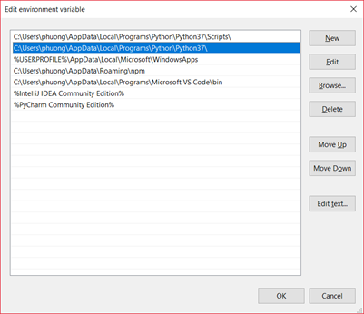

https://pythonbestcourses.com/deep-learning-with-python-course/?fbclid=IwAR1cEjJrdFT9264XczbnVKCOZRs5Np_fWXqU0VAxwMblP4tiakseEvLTV14

# Python for Beginners - The Complete Course

---

# Python Object Oriented Programming

### 1. Classes Intro.html

In the real world you are surrounded by objects. Why not in programming?

- Objects can be represented digitally.
- You can describe objects by their object variables.
- Objects have a "parent" which is a class. A class is used to create an object.

### 10. Exercises.html

### 2. Class and Objects

```py
class Vehicle:
    wheel = 2
    name = 'abc'


car = Vehicle()
car.wheel = 4

print('car wheel: {}'.format(car.wheel))
```

### 3. Lecture Notes.html

Key facts

Objects are created from a class
A class defines the objects variables
An object can have one ore more variables
To create an object use obj = Class()
The line obj.variable is an objects variable

### 4. Class Attributes

### 5. Lecture Notes.html

Key facts

Objects variables are defined in a Class
You can have more than one class in a program.

Example:
Create Objects Car, Motorbike with class Vehicle.
Create Object Bob with the class Human.
If a Motorbike would be created from class Human, it would have eyes and legs. Classes define the objects variables.

### 6. Object Types

### 8. Class Methods

Key facts

Classes can have methods

```py
class Car:
    def drive():
        ...
    def accelerate():
        ....

```

Objects will have the same class methods available

```py
obj1.drive()
obj2.drive()
obj3.drive()

```

### 9. Lecture Notes.html

## 3. More on Classes

### 1. Constructor

Key facts

A constructor is the first method called upon creating an object
A constructor is defined as def `__init__():`
If a constructor is not defined, Python creates an empty constructor

```py
class Vehicle:
    wheel = 2
    name = 'abc'
    __key = ''

    def __init__(self):
        # def __init__(self, name): with param
        print('constructor')

    def __del__(self):
        print('destructor')

    def run(self):
        print('run')

    def get_key(self):
        return self.__key

    def set_key(self, key):
        self.__key = key


car = Vehicle()
car.wheel = 4

print('car wheel: {}'.format(car.wheel))
car.run()
car.set_key(5)
print('key: {}'.format(car.get_key()))

```

### 3. Destructor

### 5. Private Variables

Key facts
A variable can be private. Private variables cannot directly be accessed
Getter and setter methods can be used to interact with private variables

## 4. Inheritance

### 1. Inheritance

```py
class Person:
  def __init__(self, fname, lname):
    self.firstname = fname
    self.lastname = lname

  def printname(self):
    print(self.firstname, self.lastname)

class Student(Person):
  pass

x = Student("Mike", "Olsen")
x.printname()

```

### 3. Inherit Methods

### 4. Multiple Inheritance

```
class Student(Person, Man):
  pass
```

### 5. Lecture Notes.html

Classes can inherit from one of more parent classes
Example: Class Bob can inherit from parent classes Human and Superman

class Bob(Human, Superman):
....

### 6. Override Methods

redefine func in subclass

## 5. Advanced OOP

### 1. Method Overloading

```py
def hello(name=None):
    if name is not None:
        print('hello {}'.format(name))
    else:
        print('hello')

hello()
hello('Phuong')
```

### 2. Lecture Notes.html

### 3. Interface

```py
from abc import ABC, abstractmethod

class VehicleInterface(ABC):
    @abstractmethod
    def run(self):
        print('run')


class Truck(Vehicle):
    def run(self):
        print('truck run')


truck = Truck()
truck.run()
```

### 5. Factory Method

```py
class MyFactory:
    def factory(self, type):
        if type == 'Word':
            return Word()
        else:
            return PDF()


class Word:
    version = 1

class PDF:
    version = 2


the_factory = MyFactory()
word = the_factory.factory('Word')
print('version: {}'.format(word.version))
```

### 7. Exercises.html

## 6. Object Serialization

What is serialization?

Objects can be serialized: converted into a text string

This "text string" can be stored into a file. Then you can load that text again later and reconstruct the object.

There are some standard formats to convert objects into text

- JSON format
- YAML format
- Pickle format (not human readable)

### 2. Object Serialization with JSON

https://jsonpickle.github.io/

```py
class Thing(object):
    def __init__(self, name):
        self.name = name

obj = Thing('Awesome')
# Use jsonpickle to transform the object into a JSON string:

import jsonpickle
frozen = jsonpickle.encode(obj)
# Use jsonpickle to recreate a Python object from a JSON string:

thawed = jsonpickle.decode(frozen)

## save to file
with open("thing.obj", "wb") as f:
f.write(frozen)

data = ""
with open("thing.obj", "rb") as fo:
data = fo.readline()
```

https://www.pythonforbeginners.com/files/reading-and-writing-files-in-python

### 3. Object Serialization with YAML

http://zetcode.com/python/yaml/

```py
import yaml

users = {'name': 'John Doe', 'occupation': 'gardener'}
s = yaml.dump(users)
print(s)
print(s.load().name)
```

### 4. Object Serialization with Pickle

```py
import pickle

bin_file = open('dump.bin', mode='wb')
dump = pickle.dump(car, bin_file)
bin_file.close()

with open('dump.bin') as f:
    obj = pickle.load()
    print(obj.name)
```

## 7. Counter OOP

### 2. Class Method

```py
class Utils:
    version = 1

    @classmethod
    def hello(cls):
        print(cls.version)

    @staticmethod
    def run(self):
        print('static method')


Utils.hello()  # access class field
Utils.run()
```

### 3. Static Method

---

# The Complete Python 3 Course Go from Beginner to Advanced!

## 02 Setting Up Python On Your Computer

### 002 Get Started by Installing Python 3_5

Search python/ open file location


copy path
Search: envi
System vari...
Add into PATH: C:\Users\phuong\AppData\Local\Programs\Python\Python37
Add into PATH: C:\Users\phuong\AppData\Local\Programs\Python\Python37\python.exe


Check

```py
python --version
```

### 003 Setting up Sublime Text to Build Python

/_use your own path in the cmd portion. Be sure to delete this line! _/

```json
{
  "cmd": [
    "C:\\Users\\Test\\AppData\\Local\\Programs\\Python\\Python35-32\\python.exe",
    "-u",
    "$file"
  ],
  "file_regex": "^[ ]*File \"(...*?)\", line ([0-9]*) ",
  "selector": "source.python"
}
```

## 03 Introduction to your first program with Python data types and variables

### 004 First Program in Python

### 005 Data Types

Check use `print(type(2.2))`

### 006 Variables

```py
a, b, c = 1.5, 2, 3
a = b = c = 1
num = 1
s = "abc"
num = s

import keyword
# list keyword
print(keyword.kwlist)
```

### 007 Indentation

Ham phai nam trong cac Indentation(Tab vao)

### 008 How to Clear Screen

```py
# cmd
import os
clear = lambda: os.system('cls')
clear()
```

## 04 Comments in Python

### 009 Single-line Comments

### 010 Multi-line Comments

```py
'''
comment in multiple lines
'''
```

## 05 Expressions in Python

### 011 Basic Arithmetic

### 012 Division Characteristics

// chia lay phan nguyen
% chia lay phan du

### 013 Operator Precedence

### 014 Complex Arithmetic

### 015 Binary Number Manipulation

## 06 Learn about Strings

### 016 Basic String Manipulation

```py
string = "abc"
string = 'def1234'
print(len(string))
print('character: {}'.format(string[-2]))
print(string[:5])

a = '1'
b = '2'
c = 2 * a + b
print(c)

# 7
# character: 3
# def12
# 112
```

### 017 Using the format Method

```py
print('Today I have {0} cup {1}'.format('a', 'coffee'))
print('x = {x}; y = {y}'.format(x = 1, y = 2))
print('The {vehicle} is {0}'.format('car', vehicle = 'vehicle'))
print('{:<20}'.format('text'))
print('{:>20}'.format('text')) #                 text
print('{:b}'.format(20)) # 10100
print('{:x}'.format(20)) # hexan: 14
```

### 018 Specific Characters

```py
print("""Hello
 Phuong""")
print(r'c:\a\b') # c:\a\b

```

## 07 Branching in Python

### 019 Logical Operators and Conditional Statements

### 020 if Statement

### 021 if else Statement

```py
x = 41

if x > 10:
  print("Above ten,")
  if x > 20:
    print("and also above 20!")
  else:
    print("but not above 20.")
```

### 022 ifelif Statement

### 023 Ternary Operator

```py
a = 7 if c == '' else 14
```

## 08 Loops in Python

range(start, stop, step)

```py
for i in range(0,10,1):
    print(i)


```

### 024 for Loop Part 1

```py
str = 'abc'

for i in str:
    print(i)

for i in range(0, 5):
    print('{:<3}|'.format(i), end="")
# 0  |1  |2  |3  |4  |
```

### 025 for Loop Part 2

### 026 for Loop Part 3

### 027 while Loop

### 028 break and continue Statements

## 09 Functions in Python

### 030 Passing Arguments Default Parameters Scope and Nested Functions

### 031 Recursive Functions

### 032 Lambda Functions

## 10 Exception Handling

### 034 Handling Exceptions

```py
try:
    x = 5 / 0
except Exception as e:
  print(e)
```

### 035 Throwing Exceptions

```py
a = 1
def raise_exception(a):
    try:
        if type(a) != type('a'):
            raise ValueError('this is not a string!')
    except ValueError as e:
        print(e)


raise_exception(a)
```

## 11 Data Input

Install package control in sublime text

```py
age = input('Nhap: ')
```

### 036 Data Input Setup and Input Function

### 037 File Management Reading

w3school

```py
f = open("demofile.txt", "r")
print(f.readline())
f.close()

Return the 5 first characters of the file:

f = open("demofile.txt", "r")
print(f.read(5))

# Loop through the file line by line:
f = open("demofile.txt", "r")
for x in f:
  print(x)

f.tell()
f.seek(5)
print(f.name)
print(str(f.closed))
```

### 038 File Management Writing

```py
f = open('test.txt', 'w+')
f.write('hello')
f.seek(0)
f.write('fff')
f.seek(0)
print(f.read())
# ffflo
```

## 12 Useful Data Structures

### 039 Tuples

```ts
tup = (1, 2, 'a', 4, 5)
print(tup[1])
print(tup[:3]) # (1, 2, 'a')
tup = tup[:3] + (,5)
print(tup[1]*4)
print(5 in tup) # True

```

cannot set tup[1] = 3

### 040 Tuple Functions

len, max, min

### 041 Lists

```
list = [1, 2]
print(5 in list) # True
list.append(6)
```

### 042 List Functions

map
lambda

```py
list(filter(lambda x: x < 4, [1, 2, 3, 4]))

# [1, 2, 3]
reduce => import functools
```

### 043 Dictionaries

### 044 Shallow Copies

### 045 Sets

### 046 Set Functions

## 13 Modules and Packages

### 047 Modules

### 048 Packages

### 049 Built-in Modules

## 14 All About Object Oriented Programming (OOP)

### 050 Introduction to OOP

### 051 Class Definition and Object Instantiation

### 052 Class Methods Part 1

### 053 Class Methods Part 2

### 054 Operator Overloading

### 055 Class Inheritance Part 1

### 056 Class Inheritance Part 2

### 057 Extra Notes in Python

## 15 Data Visualization

### 058 Installing Modules for Visualization

### 059 Visualization Part 1

### 060 Visualization Part 2

### 061 Visualization Part 3

### 062 Pandas Library

## 16 Numpy Library

### 063 Installing the Numpy Library

### 064 Creating Numpy Objects

### 065 Useful Functions from the Numpy Library

### 066 Basic Operations with Numpy Library

## 17 Debugging

### 067 The pdb Module

### 068 Commands for Debugging Part 1

### 069 Commands for Debugging Part 2

## 18 Regular Expressions

### 070 Creating Evaluating and Compiling Regular Expressions

### 071 Patterns

### 072 Division and Grouping the Results

### 073 Setting the Search Parameters


---

# The Complete Python 3 Course Go from Beginner to Advanced

## Cài đặt:

python

Tải python về sau đó vào environment variables/ system var… / rồi vào windows gõ python/ open file location => new Path: link vừa copy

 

C:\Users\phuong\AppData\Local\Programs\Python\Python37\

C:\Users\phuong\AppData\Local\Programs\Python\Python37\python.exe

 

​                               

 

Có thể click vào add path cho nhanh

Kiểm tra: $ python –version

jupyter

Python A-Z™ Python For Data Science With Real Exercises!

https://pymi.vn/blog/jupyter-notebook/

Install anaconda cho windows

Vào command line gõ: jupyter notebook

## Kiến thức :

Kiểu dữ liệu : dùng hàm type(a) để kiểm tra kiểu dữ liệu của biến a là gì

A, b, c = ‘1’, 2, True 

\# biến tương ứng với giá trị được gán

A = b = c = 1

A = 1

B = ‘str’

A = B

type(a) # <str>

Trong python các block được hiểu bằng cách thụt vào 1 khoảng

Cách clear màn hình cmd:

import os

clear = lambda: os.system(‘cls’)

clear

‘’’

Comment

‘’’

String:

Str[0]

Str[-3]

Str[2:5]

A = 2 * ‘con’

print(a) #concon

 

format method :

print(‘Today i had a {0} and {1}’.format(3, ‘cup’))

print(‘prices: {x}’.format(x=3.0))

\# có thể sd kết hợp lại

print(‘{:<20}’.format(‘text’))

print(‘{:>20}’.format(‘text’)) # chèn thêm khoảng trắng ở bên trái

print(‘{:b}’.format(21)) => binary 

 

 

Toán tử: and or not > < ==

Condition(python k có switch):

**if** condition1 :
 indentedStatementBlockForTrueCondition1
 **elif** condition2 :
 indentedStatementBlockForFirstTrueCondition2
 **elif** condition3 :
 indentedStatementBlockForFirstTrueCondition3
 **elif** condition4 :
 indentedStatementBlockForFirstTrueCondition4
 **else**:
 indentedStatementBlockForEachConditionFalse

Loop(có thể SD while như for)

**for** iterating_var in sequence:
   statements(s)

range(start:stop:step)

break

continue

for I in range(0:10):

  print(i) # 0 -> 9

Hàm:

**def** functionname(param, param2,..):
 statements(s)

 

\# default params

def func(a, c = 2)

 

\# lambda function

F = lambda x, y: x + y

F = lambda a : lambda b: lambda c: a + b + c

F(2)(3)(0)

Từ khóa pass ngầm hiểu là k làm gì cả

Exception:

try: 

except Exception as e:

except IOError:

finally:

 

\# throw

If 1==2:

   raise ValueError(‘’)

Example:

def Test(a, b):

   assert a > b, ‘err’

try: 

   Test(2, 1)

except AssetionError as e:

   

 

Data input: 

Age = input(‘input: ’)

 

File:

File = open(‘filename.txt’, ‘r’)

File.read() # đọc hết

File.read(4) # đọc 4 ký tự

File.tell() # vt con trỏ hiện tại

File.seek(5) # move con trỏ

File.close()

 

Kiểu dữ liệu:

Tuple: không thay đổi được, nằm trong dấu (), truy cập thông qua chỉ số

Có thể SD toán tử += để nối thêm tuples

Tup += ((1,‘a’),)

Các hàm: min(x), max, len

List: có thể sử dụng hàm append để thêm phần tử, pop để lấy phần tử trên cùng nếu k chỉ ra vt, len(list), 

Dictionary: có thể sử dụng số như 1 key vd: a_dic[0]

Shallow copy

Set : chứa các phần tử duy nhất

| # hợp

^ # giao

\- # hiệu

Modules

import file

file.isPrime(3)

 

cách 2 : import file as f

cách 3 : form file import isPrime

isPrime(3)

 

in ra list hàm: print(dir(file))

Package: có file ___init__.py thì xem như là 1 package

Import copy

Dic = copy.deepcopy(dic1) # k ảnh hưởng

Class

**class** myclass([parentclass]):
 assignments
 **def** __init__(self):
 statements
 **def** method():
 statements
 **def** method2():
 statements

 

__init__ là hàm khởi tạo

__del__ là hàm hủy

__bien : là biến private, truy cập ở ngoài sẽ gây exception

class Animal():

  name = 'Amy'

  noise = "Grunt"

  size = "Large"

  color = "Brown"

  hair = 'Covers body'

  def get_color(self, abc):

​    return self.color + " " + abc

  @property

  def make_noise(self):

​    return self.noise

 

dog = Animal()

print(dog.get_color("red"))

 

print(dog.make_noise)

Tính kế thừa

 

The Complete Python 3 Course Go from Beginner to Advanced!\15 Data Visualization + nummy: nâng cao

 

Regular expression in python:

Import re

match = re.search(‘pp’, ‘The content pp’)

print(match)

print(match.re.pattern) # pp

print(match.string) # chuỗi tìm kiếm

print(match.start()) # vt bd khớp vd 8

\# cách 2

regex = re.compile(‘pp’)

print(regex.search(‘pp in pp..’).start()) # 0 

print(regex.findall(‘pp in pp..’)) # [‘pp’,’pp’]

print(re.match(‘pp’, ‘pp in pp..’)) # pp nếu match đầu

còn tiếp…

 

 

 

 

 

# 30 Days of Python Unlock your Python Potential

## Source

joincfe.com/github

https://github.com/codingforentrepreneurs

search: https://github.com/codingforentrepreneurs/30-Days-of-Python

Python, Angular 4, Django: joincfe.com/github - joincfe.com/youtube -joincfe.com/suggest 

https://www.codingforentrepreneurs.com/projects/#setup https://www.codingforentrepreneurs.com/suggest https://www.youtube.com/user/CodingEntrepreneurs/playlists

Trong cmd gõ … để viết tiếp ở dòng khác

Python send email & csv

Smtplib: xem sau

021 Day 13 - Using External Template Files with Context Data in Python

\hi\this\ois\a\file.txt => window path

** means format a string base on dictionaries

CSV:

import csv

with open("data.csv", "w+") as csvfile:

  writer = csv.writer(csvfile)

  writer.writerow(["Col 1", "Col 2"])

  writer.writerow(["Data 1", "Data 2"])

 

with open("data.csv", "r") as csvfile:

  reader = csv.reader(csvfile)

  for row in reader:

​    print(row)

https://github.com/codingforentrepreneurs/30-Days-of-Python/blob/master/PythonCheatSheet.md

Edit csv: day 16

import shutil

from tempfile import NamedTemporaryFile

 

def edit_data(edit_id=None, email=None, amount=None, sent=None):

  filename = "data.csv"

  temp_file = NamedTemporaryFile(delete=False)

 

  with open(filename, "rb") as csvfile, temp_file:

​    reader = csv.DictReader(csvfile)

​     fieldnames = ['id', 'name', 'email', 'amount', 'sent', 'date']

​    writer = csv.DictWriter(temp_file, fieldnames=fieldnames)

​    writer.writeheader()

​    for row in reader:

​      \#print(row['id'] == 4)

​      if edit_id is not None:

​        if int(row['id']) == int(edit_id):

​          row['amount'] = amount

​          row['sent'] = sent

​      elif email is not None and edit_id is None:

​        if str(row['email']) == str(email):

​          row['amount'] = amount

​          row['sent'] = sent

​      else:

​        pass

​      writer.writerow(row)

​    

​    shutil.move(temp_file.name, filename)

​    return True

  return False

 

 

\#edit_data(8, 9992.32, "")

edit_data(email='hello@teamcfe.com', amount=99.99, sent='')

Read data from csv: day 17 read_data()

Day 18: Để chạy lệnh python hungry phải có hàm file main trước

Đối với file được import vào module phải có:

\#file_item_path = os.path.join(os.getcwd(), "data.csv")

file_item_path = os.path.join(os.path.dirname(__file__), "data.csv")

run: python hungry --user_id 10

python hungry -id 3

python hungry view -id 3

python hungry message -id 3

 

 

 

 

 

 

Web Scraping with Python 3 Python Requests BeautifulSoup

Text Messaging (SMSMMS) with Python Twilio

Twitter API python

Read Email Inbox using Python Gmail