- [Spring & Hibernate for Beginners (includes Spring Boot)](#spring--hibernate-for-beginners-includes-spring-boot)
	- [Tai lieu](#tai-lieu)
	- [2. Spring Overview](#2-spring-overview)
		- [1. Why Spring - part 1](#1-why-spring---part-1)
		- [2. Why Spring - part 2](#2-why-spring---part-2)
		- [3. Spring 5 Update](#3-spring-5-update)
		- [4. Spring Core Framework - Part 1](#4-spring-core-framework---part-1)
		- [5. Spring Core Framework - Part 2](#5-spring-core-framework---part-2)
		- [6. Spring Platform](#6-spring-platform)
	- [3. Setting Up Your Development Environment](#3-setting-up-your-development-environment)
		- [2. Installing Tomcat](#2-installing-tomcat)
		- [4. Connecting Tomcat to Eclipse](#4-connecting-tomcat-to-eclipse)
		- [5 Add jar files](#5-add-jar-files)
	- [4. Spring Inversion of Control - XML Configuration](#4-spring-inversion-of-control---xml-configuration)
		- [1. What is Inversion of Control](#1-what-is-inversion-of-control)
		- [4. Spring Inversion of Control - Overview](#4-spring-inversion-of-control---overview)
				- [Spring Container](#spring-container)
				- [IOC & XML Configuration](#ioc--xml-configuration)
				- [Configuring Spring Container](#configuring-spring-container)
				- [Spring Development Process](#spring-development-process)
			- [FAQ: What is a Spring Bean?](#faq-what-is-a-spring-bean)
			- [8. HEADS UP - Add Logging Messages in Spring 5.1](#8-heads-up---add-logging-messages-in-spring-51)
			- [9. FAQ Why do we specify the Coach interface in getBean().html](#9-faq-why-do-we-specify-the-coach-interface-in-getbeanhtml)
	- [5. Spring Dependency Injection - XML Configuration](#5-spring-dependency-injection---xml-configuration)
		- [Các nguyên tắc đảo ngược phụ thuộc.](#c%c3%a1c-nguy%c3%aan-t%e1%ba%afc-%c4%91%e1%ba%a3o-ng%c6%b0%e1%bb%a3c-ph%e1%bb%a5-thu%e1%bb%99c)
			- [Spring Injection Types(pdf)](#spring-injection-typespdf)
			- [Development Process - Constructor Injection](#development-process---constructor-injection)
			- [FAQ: What is the purpose for the no arg constructor?](#faq-what-is-the-purpose-for-the-no-arg-constructor)
			- [Development Process - Setter Injection](#development-process---setter-injection)
			- [Injecting Literal Values Development Process](#injecting-literal-values-development-process)
			- [Question:](#question)
			- [Injecting Values from a Properties File](#injecting-values-from-a-properties-file)
			- [Practice Activity #2 - Dependency Injection with XML Configuration](#practice-activity-2---dependency-injection-with-xml-configuration)
	- [6. Spring Bean Scopes and Lifecycle](#6-spring-bean-scopes-and-lifecycle)
		- [1. Bean scope](#1-bean-scope)
		- [2. Bean Lifecycle](#2-bean-lifecycle)
			- [Special Note about init and destroy Method Signatures](#special-note-about-init-and-destroy-method-signatures)
	- [7. Spring Configuration with Java Annotations - Inversion of Control](#7-spring-configuration-with-java-annotations---inversion-of-control)
		- [1. Annotations Overview - Component Scanning](#1-annotations-overview---component-scanning)
		- [2. Annotations Project Setup](#2-annotations-project-setup)
		- [3. Explicit Component Names - Write Some Code](#3-explicit-component-names---write-some-code)
		- [4. Default Component Names - Overview](#4-default-component-names---overview)
	- [8. Spring Configuration with Java Annotations - Dependency Injection](#8-spring-configuration-with-java-annotations---dependency-injection)
		- [1. Constructor Injection - Overview](#1-constructor-injection---overview)
			- [FAQ: What if there are multiple FortuneService implementations?](#faq-what-if-there-are-multiple-fortuneservice-implementations)
			- [I have finished the video "Constructor Injection - Writing Code part2".](#i-have-finished-the-video-%22constructor-injection---writing-code-part2%22)
		- [2. Setter Injection - Overview](#2-setter-injection---overview)
		- [3. Method Injection](#3-method-injection)
		- [4. Field Injection - Overview](#4-field-injection---overview)
		- [5. Which Injection Type Should You Use](#5-which-injection-type-should-you-use)
		- [12. Qualifiers for Dependency Injection - Overview](#12-qualifiers-for-dependency-injection---overview)
		- [13. Qualifiers for Dependency Injection - Write Some Code - Part 1](#13-qualifiers-for-dependency-injection---write-some-code---part-1)
		- [14. Qualifiers for Dependency Injection - Write Some Code - Part 2](#14-qualifiers-for-dependency-injection---write-some-code---part-2)
			- [Annotations - Default Bean Names ... and the Special Case](#annotations---default-bean-names--and-the-special-case)
			- [FAQ: How to inject properties file using Java annotations](#faq-how-to-inject-properties-file-using-java-annotations)
	- [9. Spring Configuration with Java Annotations - Bean Scopes and Lifecycle Methods](#9-spring-configuration-with-java-annotations---bean-scopes-and-lifecycle-methods)
		- [1. @Scope Annotation - Overview](#1-scope-annotation---overview)
		- [2. @Scope Annotation - Write Some Code](#2-scope-annotation---write-some-code)
			- [Special Note about @PostConstruct and @PreDestroy Method Signatures](#special-note-about-postconstruct-and-predestroy-method-signatures)
		- [3. Bean Lifecycle Method Annotations - Overview](#3-bean-lifecycle-method-annotations---overview)
			- [HEADS UP - FOR JAVA 9, 10 and 11 USERS - @PostConstruct and @PreDestroy](#heads-up---for-java-9-10-and-11-users---postconstruct-and-predestroy)
	- [10. Spring Configuration with Java Code (no xml)](#10-spring-configuration-with-java-code-no-xml)
		- [1. Spring Configuration with Java Code (no xml) – Overview](#1-spring-configuration-with-java-code-no-xml-%e2%80%93-overview)
		- [4. Defining Spring Beans with Java Code (no xml) - Overview](#4-defining-spring-beans-with-java-code-no-xml---overview)
			- [3. Heads Up - Add Logging Messages in Spring 5.1 - All Java Config Version](#3-heads-up---add-logging-messages-in-spring-51---all-java-config-version)
			- [During All Java Configuration, how does the @Bean annotation work in the background?](#during-all-java-configuration-how-does-the-bean-annotation-work-in-the-background)
		- [10. Injecting Values from Properties File - Write Some Code - Part 2](#10-injecting-values-from-properties-file---write-some-code---part-2)
		- [FAQ: Problems with Injecting Values - Value not returning from \${foo.email}](#faq-problems-with-injecting-values---value-not-returning-from-fooemail)
		- [4. Defining Spring Beans with Java Code (no xml) - Overview](#4-defining-spring-beans-with-java-code-no-xml---overview-1)
	- [11. Spring MVC - Building Spring Web Apps](#11-spring-mvc---building-spring-web-apps)
		- [1. Spring MVC Overview](#1-spring-mvc-overview)
		- [2. Spring MVC - Behind the Scenes](#2-spring-mvc---behind-the-scenes)
		- [3. Development Environment Checkpoint](#3-development-environment-checkpoint)
		- [4. Download Spring MVC Starter Files.html](#4-download-spring-mvc-starter-fileshtml)
		- [5. Spring MVC Configuration - Overview](#5-spring-mvc-configuration---overview)
		- [6. Spring MVC Configuration - JAR Files](#6-spring-mvc-configuration---jar-files)
		- [7. Spring MVC Configuration - Config Files](#7-spring-mvc-configuration---config-files)
			- [8. How to configure the Spring Dispatcher Servlet using all Java Code (no xml)?](#8-how-to-configure-the-spring-dispatcher-servlet-using-all-java-code-no-xml)
	- [12. Spring MVC - Creating Controllers and Views](#12-spring-mvc---creating-controllers-and-views)
		- [1. Creating a Spring Home Controller and View – Overview](#1-creating-a-spring-home-controller-and-view-%e2%80%93-overview)
		- [3. Creating a Spring Home Controller and View - Write Some Code - Part 2](#3-creating-a-spring-home-controller-and-view---write-some-code---part-2)
		- [4. FAQ HELP! My Spring MVC Controller is not working. What to do.html](#4-faq-help-my-spring-mvc-controller-is-not-working-what-to-dohtml)
		- [5. FAQ HELP! - Can't Start Tomcat - Ports are in Use!.html](#5-faq-help---cant-start-tomcat---ports-are-in-usehtml)
		- [6. FAQ How Does Component Scan Work - Your Package Names are Different!.html](#6-faq-how-does-component-scan-work---your-package-names-are-differenthtml)
		- [7. Reading HTML Form Data - Overview](#7-reading-html-form-data---overview)
		- [8. Reading HTML Form Data - Write Some Code - Part 1](#8-reading-html-form-data---write-some-code---part-1)
		- [9. Reading HTML Form Data - Write Some Code - Part 2](#9-reading-html-form-data---write-some-code---part-2)
		- [10. Reading HTML Form Data - Write Some Code - Part 3](#10-reading-html-form-data---write-some-code---part-3)
		- [11. Adding Data to the Spring Model - Overview](#11-adding-data-to-the-spring-model---overview)
		- [12. Adding Data to the Spring Model - Write Some Code - Part 1](#12-adding-data-to-the-spring-model---write-some-code---part-1)
		- [13. Adding Data to the Spring Model - Write Some Code - Part 2](#13-adding-data-to-the-spring-model---write-some-code---part-2)
		- [14. FAQ How to use CSS, JavaScript and Images in Spring MVC Web App.html](#14-faq-how-to-use-css-javascript-and-images-in-spring-mvc-web-apphtml)
		- [15. Bonus Deploying To Tomcat using WAR files.html](#15-bonus-deploying-to-tomcat-using-war-fileshtml)
		- [Question: HELP! My Spring MVC Controller is not working. What to do?](#question-help-my-spring-mvc-controller-is-not-working-what-to-do)
		- [Can't Start Tomcat - Ports are in Use](#cant-start-tomcat---ports-are-in-use)
		- [How Does Component Scan Work - Your Package Names are Different!](#how-does-component-scan-work---your-package-names-are-different)
		- [How do I use CSS, JavaScript and Images in a Spring MVC Web App?](#how-do-i-use-css-javascript-and-images-in-a-spring-mvc-web-app)
	- [13. Spring MVC - Request Params and Request Mappings](#13-spring-mvc---request-params-and-request-mappings)
		- [1. Binding Request Params - Overview](#1-binding-request-params---overview)
		- [2. Binding Request Params - Write Some Code](#2-binding-request-params---write-some-code)
		- [3. Controller Level Request Mapping - Overview](#3-controller-level-request-mapping---overview)
		- [4. Controller Level Request Mapping - Write Some Code - Part 1](#4-controller-level-request-mapping---write-some-code---part-1)
		- [5. Controller Level Request Mapping - Write Some Code - Part 2](#5-controller-level-request-mapping---write-some-code---part-2)
		- [6. FAQ How does processForm work for hello.html](#6-faq-how-does-processform-work-for-hellohtml)
	- [14. Spring MVC - Form Tags and Data Binding](#14-spring-mvc---form-tags-and-data-binding)
		- [2. Text Fields - Overview](#2-text-fields---overview)
		- [6. Drop-Down Lists - Overview](#6-drop-down-lists---overview)
		- [9. FAQ Use properties file to load country options.html](#9-faq-use-properties-file-to-load-country-optionshtml)
		- [11. Radio Buttons - Overview](#11-radio-buttons---overview)
		- [12. FAQ How to populate radiobuttons with items from Java class.html](#12-faq-how-to-populate-radiobuttons-with-items-from-java-classhtml)
			- [FAQ: How to populate radiobuttons with items from Java class like we did with selectlist?](#faq-how-to-populate-radiobuttons-with-items-from-java-class-like-we-did-with-selectlist)
		- [5. Checkboxes - Overview](#5-checkboxes---overview)
	- [15. Spring MVC Form Validation - Applying Built-In Validation Rules](#15-spring-mvc-form-validation---applying-built-in-validation-rules)
		- [1. Spring MVC Form Validation Overview](#1-spring-mvc-form-validation-overview)
		- [2. Setting Up Dev Environment for Form Validation](#2-setting-up-dev-environment-for-form-validation)
		- [3. Installing Validation Files](#3-installing-validation-files)
		- [4. Checking for Required Fields Overview](#4-checking-for-required-fields-overview)
		- [5. Special Note about BindingResult Parameter Order.html](#5-special-note-about-bindingresult-parameter-orderhtml)
		- [6. Add Validation Rule to Customer Class](#6-add-validation-rule-to-customer-class)
		- [7. Display Validation Error Messages on HTML Form](#7-display-validation-error-messages-on-html-form)
		- [8. Perform Validation in Controller Class - Part 1](#8-perform-validation-in-controller-class---part-1)
		- [9. Perform Validation in Controller Class - Part 2](#9-perform-validation-in-controller-class---part-2)
		- [10. Update Confirmation Page](#10-update-confirmation-page)
		- [11. Test the Validation Rule for Required Fields](#11-test-the-validation-rule-for-required-fields)
		- [12. Add Pre-processing Code with @InitBinder - Overview](#12-add-pre-processing-code-with-initbinder---overview)
	- [16. Spring MVC Form Validation - Validating Number Ranges and Regular Expressions](#16-spring-mvc-form-validation---validating-number-ranges-and-regular-expressions)
		- [1. Validating a Number Range - Overview](#1-validating-a-number-range---overview)
		- [2. Validating a Number Range - Write Some Code](#2-validating-a-number-range---write-some-code)
		- [3. Applying Regular Expressions - Overview](#3-applying-regular-expressions---overview)
		- [4. Applying Regular Expressions - Write Some Code](#4-applying-regular-expressions---write-some-code)
		- [5. How to make Integer Field Required freePasses](#5-how-to-make-integer-field-required-freepasses)
		- [6. How to Handle String input for Integer Fields - Custom Message](#6-how-to-handle-string-input-for-integer-fields---custom-message)
		- [7. How to Handle String input for Integer Fields - Configure Resource Bundle](#7-how-to-handle-string-input-for-integer-fields---configure-resource-bundle)
		- [8. How to Handle String input for Integer Fields - Deep Dive](#8-how-to-handle-string-input-for-integer-fields---deep-dive)
		- [FAQ: How to Make Integer field required and handle Strings: freePasses?](#faq-how-to-make-integer-field-required-and-handle-strings-freepasses)
		- [Handle String Input for Integer Fields](#handle-string-input-for-integer-fields)
	- [17. Spring MVC Form Validation - Creating Custom Validation Rules](#17-spring-mvc-form-validation---creating-custom-validation-rules)
		- [1. Custom Form Validation - Overview - Part 1](#1-custom-form-validation---overview---part-1)
		- [2. Custom Form Validation - Overview - Part 2](#2-custom-form-validation---overview---part-2)
		- [5. Developing the ConstraintValidator](#5-developing-the-constraintvalidator)
		- [6. Adding Validation Rule to the Entity and Form](#6-adding-validation-rule-to-the-entity-and-form)
			- [Spring MVC Custom Validation - FAQ: Is it possible to integrate multiple validation string in one annotation?](#spring-mvc-custom-validation---faq-is-it-possible-to-integrate-multiple-validation-string-in-one-annotation)
	- [18. Introduction to Hibernate](#18-introduction-to-hibernate)
	- [19. Setting Up Hibernate Development Environment](#19-setting-up-hibernate-development-environment)
		- [2. Hibernate Development Environment Overview](#2-hibernate-development-environment-overview)
		- [3. Installing MySQL on MS Windows](#3-installing-mysql-on-ms-windows)
		- [4. Setting Up Database Table](#4-setting-up-database-table)
		- [5. Setting up Hibernate in Eclipse](#5-setting-up-hibernate-in-eclipse)
		- [6. Testing Your JDBC Connection](#6-testing-your-jdbc-connection)
	- [20. Hibernate Configuration with Annotations](#20-hibernate-configuration-with-annotations)
		- [1. Creating the Hibernate Configuration File](#1-creating-the-hibernate-configuration-file)
		- [2. Hibernate Annotations - Part 1](#2-hibernate-annotations---part-1)
		- [4. HEADS UP - FOR JAVA 9 USERS.html](#4-heads-up---for-java-9-usershtml)
		- [5. HEADS UP - JAVA 9 USERS - Eclipse Generate toString() fails.html](#5-heads-up---java-9-users---eclipse-generate-tostring-failshtml)
		- [JUST A HEADS UP - FOR JAVA 9, 10 and 11 USERS](#just-a-heads-up---for-java-9-10-and-11-users)
		- [HEADS UP - JAVA 9 USERS - Eclipse Generate toString() fails](#heads-up---java-9-users---eclipse-generate-tostring-fails)
		- [6. Hibernate Annotations - Part 2](#6-hibernate-annotations---part-2)
		- [7. FAQ Why we are using JPA Annotation instead of Hibernate.html](#7-faq-why-we-are-using-jpa-annotation-instead-of-hibernatehtml)
		- [FAQ: Why we are using JPA Annotation instead of Hibernate ?](#faq-why-we-are-using-jpa-annotation-instead-of-hibernate)
	- [21. Hibernate CRUD Features Create, Read, Update and Delete](#21-hibernate-crud-features-create-read-update-and-delete)
		- [1. Creating and Saving Java Objects - Part 1](#1-creating-and-saving-java-objects---part-1)
		- [2. Creating and Saving Java Objects - Part 2](#2-creating-and-saving-java-objects---part-2)
		- [3. Primary Keys - Overview](#3-primary-keys---overview)
		- [5. Primary Keys - Changing the Starting Index](#5-primary-keys---changing-the-starting-index)
		- [6. Reading Objects with Hibernate](#6-reading-objects-with-hibernate)
		- [7. Querying Objects with Hibernate - Overview](#7-querying-objects-with-hibernate---overview)
		- [8. Special Note about Deprecated Method in Hibernate 5.2.html](#8-special-note-about-deprecated-method-in-hibernate-52html)
		- [9. Querying Objects with Hibernate - Write Some Code - Part 1](#9-querying-objects-with-hibernate---write-some-code---part-1)
		- [10. Querying Objects with Hibernate - Write Some Code - Part 2](#10-querying-objects-with-hibernate---write-some-code---part-2)
		- [11. FAQ How To View Hibernate SQL Parameter Values.html](#11-faq-how-to-view-hibernate-sql-parameter-valueshtml)
- [Root logger option](#root-logger-option)
- [Redirect log messages to console](#redirect-log-messages-to-console)
		- [12. Updating Objects with Hibernate - Overview](#12-updating-objects-with-hibernate---overview)
		- [13. Updating Objects with Hibernate - Write Some Code](#13-updating-objects-with-hibernate---write-some-code)
		- [14. Deleting Objects with Hibernate - Overview](#14-deleting-objects-with-hibernate---overview)
		- [15. Deleting Objects with Hibernate - Write Some Code](#15-deleting-objects-with-hibernate---write-some-code)
		- [16. Practice Activity #8 - Hibernate Development.html](#16-practice-activity-8---hibernate-developmenthtml)
		- [17. FAQ How to read Dates with Hibernate.html](#17-faq-how-to-read-dates-with-hibernatehtml)
	- [22. Hibernate Advanced Mappings](#22-hibernate-advanced-mappings)
		- [1. Advanced Mappings Overview](#1-advanced-mappings-overview)
		- [2. Database Concepts](#2-database-concepts)
	- [23. Hibernate Advanced Mappings - @OneToOne](#23-hibernate-advanced-mappings---onetoone)
		- [1. @OneToOne - Overview - Part 1](#1-onetoone---overview---part-1)
		- [2. @OneToOne - Overview - Part 2](#2-onetoone---overview---part-2)
		- [3. @OneToOne - Overview - Part 3](#3-onetoone---overview---part-3)
		- [4. @OneToOne - Run Database Scripts](#4-onetoone---run-database-scripts)
		- [5. @OneToOne - Write Some Code - Prep Work](#5-onetoone---write-some-code---prep-work)
		- [6. @OneToOne - Write Some Code - Create InstructorDetail class](#6-onetoone---write-some-code---create-instructordetail-class)
		- [7. @OneToOne - Write Some Code - Create Instructor class](#7-onetoone---write-some-code---create-instructor-class)
		- [8. @OneToOne - Write Some Code - Build Main App - Part 1](#8-onetoone---write-some-code---build-main-app---part-1)
		- [9. @OneToOne - Write Some Code - Build Main App - Part 2](#9-onetoone---write-some-code---build-main-app---part-2)
		- [10. @OneToOne - Delete an Entity](#10-onetoone---delete-an-entity)
		- [11. @OneToOne - Bi-Directional Overview](#11-onetoone---bi-directional-overview)
		- [12. @OneToOne - Bi-Directional - Create Relationship](#12-onetoone---bi-directional---create-relationship)
		- [13. @OneToOne - Bi-Directional - Develop Main App](#13-onetoone---bi-directional---develop-main-app)
		- [14. @OneToOne - Refactoring and Exception Handling](#14-onetoone---refactoring-and-exception-handling)
		- [15. @OneToOne - Bi-Directional - Cascade Delete](#15-onetoone---bi-directional---cascade-delete)
		- [16. @OneToOne - Bi-Directional - Delete Only InstructorDetail - Part 1](#16-onetoone---bi-directional---delete-only-instructordetail---part-1)
		- [17. @OneToOne - Bi-Directional - Delete Only InstructorDetail - Part 2](#17-onetoone---bi-directional---delete-only-instructordetail---part-2)
	- [24. Hibernate Advanced Mappings - @OneToMany](#24-hibernate-advanced-mappings---onetomany)
		- [1. @OneToMany - Bi-Directional Overview - Part 1](#1-onetomany---bi-directional-overview---part-1)
		- [2. @OneToMany - Bi-Directional Overview - Part 2](#2-onetomany---bi-directional-overview---part-2)
		- [3. @OneToMany - Bi-Directional - Database Prep Work](#3-onetomany---bi-directional---database-prep-work)
		- [4. @OneToMany - Bi-Directional - Create Course Mapping](#4-onetomany---bi-directional---create-course-mapping)
		- [5. @OneToMany - Bi-Directional - Define Course Relationship](#5-onetomany---bi-directional---define-course-relationship)
		- [6. @OneToMany - Bi-Directional - Update Instructor](#6-onetomany---bi-directional---update-instructor)
		- [7. @OneToMany - Bi-Directional - Add Instructor to Database](#7-onetomany---bi-directional---add-instructor-to-database)
		- [8. @OneToMany - Bi-Directional - Create Courses for Instructor](#8-onetomany---bi-directional---create-courses-for-instructor)
		- [9. @OneToMany - Bi-Directional - Retrieve Instructor Courses](#9-onetomany---bi-directional---retrieve-instructor-courses)
		- [10. @OneToMany - Bi-Directional - Delete a Course](#10-onetomany---bi-directional---delete-a-course)
	- [25. Hibernate Advanced Mappings - Eager vs Lazy Loading](#25-hibernate-advanced-mappings---eager-vs-lazy-loading)
		- [1. Eager vs Lazy Loading - Overview - Part 1](#1-eager-vs-lazy-loading---overview---part-1)
		- [2. Eager vs Lazy Loading - Overview - Part 2](#2-eager-vs-lazy-loading---overview---part-2)
		- [3. Eager vs Lazy Loading - Coding - Eager](#3-eager-vs-lazy-loading---coding---eager)
		- [4. Eager vs Lazy Loading - Coding - Lazy](#4-eager-vs-lazy-loading---coding---lazy)
		- [5. Eager vs Lazy Loading - Coding - Closing the Session](#5-eager-vs-lazy-loading---coding---closing-the-session)
		- [6. Eager vs Lazy Loading - Coding - Resolve Lazy Loading Issue](#6-eager-vs-lazy-loading---coding---resolve-lazy-loading-issue)
		- [7. Eager vs Lazy Loading - Coding - HQL JOIN FETCH](#7-eager-vs-lazy-loading---coding---hql-join-fetch)
		- [8. FAQ How to load the courses at a later time in the application.html](#8-faq-how-to-load-the-courses-at-a-later-time-in-the-applicationhtml)
	- [26. Hibernate Advanced Mappings - @OneToMany - Unidirectional](#26-hibernate-advanced-mappings---onetomany---unidirectional)
		- [1. @OneToMany - Uni-Directional - Overview - Part 1](#1-onetomany---uni-directional---overview---part-1)
		- [2. @OneToMany - Uni-Directional - Overview - Part 2](#2-onetomany---uni-directional---overview---part-2)
		- [3. FAQ @JoinColumn ... where does it find the column.html](#3-faq-joincolumn--where-does-it-find-the-columnhtml)
		- [4. @OneToMany - Uni-Directional - Set up database tables](#4-onetomany---uni-directional---set-up-database-tables)
		- [5. @OneToMany - Uni-Directional - Create Review Class](#5-onetomany---uni-directional---create-review-class)
		- [6. @OneToMany - Uni-Directional - Configure Fetch Type](#6-onetomany---uni-directional---configure-fetch-type)
		- [7. @OneToMany - Uni-Directional - Create Course Reviews](#7-onetomany---uni-directional---create-course-reviews)
		- [8. @OneToMany - Uni-Directional - Get Course Reviews](#8-onetomany---uni-directional---get-course-reviews)
		- [9. @OneToMany - Uni-Directional - Delete Course Reviews](#9-onetomany---uni-directional---delete-course-reviews)
	- [27. Hibernate Advanced Mappings - @ManyToMany](#27-hibernate-advanced-mappings---manytomany)
		- [1. @ManyToMany - Overview - Part 1](#1-manytomany---overview---part-1)
		- [2. @ManyToMany - Overview - Part 2](#2-manytomany---overview---part-2)
		- [3. @ManyToMany - Set up database tables](#3-manytomany---set-up-database-tables)
		- [4. @ManyToMany - Update Course class](#4-manytomany---update-course-class)
		- [5. @ManyToMany - Configure Course for many-to-many](#5-manytomany---configure-course-for-many-to-many)
		- [6. @ManyToMany - Configure Student for many-to-many](#6-manytomany---configure-student-for-many-to-many)
		- [7. @ManyToMany - Create a Main App](#7-manytomany---create-a-main-app)
		- [8. @ManyToMany - Review app output](#8-manytomany---review-app-output)
		- [9. @ManyToMany - Add more courses for a student](#9-manytomany---add-more-courses-for-a-student)
		- [10. @ManyToMany - Verify Data in Join Table](#10-manytomany---verify-data-in-join-table)
		- [11. @ManyToMany - Get Courses for Student](#11-manytomany---get-courses-for-student)
		- [12. @ManyToMany - Delete a Course](#12-manytomany---delete-a-course)
		- [13. @ManyToMany - Delete a Student](#13-manytomany---delete-a-student)
	- [28. Build a Database Web App - Spring MVC and Hibernate Project - Part 1](#28-build-a-database-web-app---spring-mvc-and-hibernate-project---part-1)
		- [1. Project Overview and Demo](#1-project-overview-and-demo)
		- [2. Source Files for Spring MVC + Hibernate Web App.html](#2-source-files-for-spring-mvc--hibernate-web-apphtml)
		- [3. Set up Sample Data for Database](#3-set-up-sample-data-for-database)
		- [4. Test Database Connection - Part 1](#4-test-database-connection---part-1)
		- [5. Test Database Connection - Part 2](#5-test-database-connection---part-2)
		- [6. Set Up Dev Environment - Part 1](#6-set-up-dev-environment---part-1)
		- [7. HEADS UP - FOR JAVA 9 and higher USERS - Spring MVC CRUD.html](#7-heads-up---for-java-9-and-higher-users---spring-mvc-crudhtml)
		- [8. Set Up Dev Environment - Part 2](#8-set-up-dev-environment---part-2)
		- [9. Set Up Dev Environment - Part 3](#9-set-up-dev-environment---part-3)
		- [10. Test Spring MVC Controller - Part 1](#10-test-spring-mvc-controller---part-1)
		- [11. Test Spring MVC Controller - Part 2](#11-test-spring-mvc-controller---part-2)
	- [30. Build a Database Web App - Spring MVC and Hibernate Project - Part 2](#30-build-a-database-web-app---spring-mvc-and-hibernate-project---part-2)
		- [1. List Customers - Overview](#1-list-customers---overview)
		- [2. List Customers - Overview of Development Process](#2-list-customers---overview-of-development-process)
		- [3. List Customers - Creating Hibernate Entity - Part 1](#3-list-customers---creating-hibernate-entity---part-1)
		- [4. List Customers - Creating Hibernate Entity - Part 2](#4-list-customers---creating-hibernate-entity---part-2)
		- [5. List Customers - Developing Hibernate DAO - Overview - Part 1](#5-list-customers---developing-hibernate-dao---overview---part-1)
		- [6. List Customers - Developing Hibernate DAO - Overview - Part 2](#6-list-customers---developing-hibernate-dao---overview---part-2)
		- [7. List Customers - Developing Hibernate DAO - Write Some Code - Part 1](#7-list-customers---developing-hibernate-dao---write-some-code---part-1)
		- [8. List Customers - Developing Hibernate DAO - Write Some Code - Part 2](#8-list-customers---developing-hibernate-dao---write-some-code---part-2)
		- [9. List Customers - Injecting DAO into Controller](#9-list-customers---injecting-dao-into-controller)
		- [10. List Customers - Developing JSP View Page](#10-list-customers---developing-jsp-view-page)
		- [11. Making it Pretty with CSS - Overview](#11-making-it-pretty-with-css---overview)
		- [12. Making it Pretty with CSS - Write Some Code - Part 1](#12-making-it-pretty-with-css---write-some-code---part-1)
		- [13. Making it Pretty with CSS - Write Some Code - Part 2](#13-making-it-pretty-with-css---write-some-code---part-2)
		- [14. Adding a Welcome File](#14-adding-a-welcome-file)
	- [31. Setting Up Your Development Environment](#31-setting-up-your-development-environment)
	- [32. Build a Database Web App - Spring MVC and Hibernate Project - Part 3](#32-build-a-database-web-app---spring-mvc-and-hibernate-project---part-3)
	- [33. Build a Database Web App - Spring MVC and Hibernate Project - Part 4](#33-build-a-database-web-app---spring-mvc-and-hibernate-project---part-4)
	- [34. Build a Database Web App - Spring MVC and Hibernate Project - Part 5](#34-build-a-database-web-app---spring-mvc-and-hibernate-project---part-5)
	- [35. Build a Database Web App - Spring MVC and Hibernate Project - Part 6](#35-build-a-database-web-app---spring-mvc-and-hibernate-project---part-6)
	- [34. AOP Aspect-Oriented Programming Overview](#34-aop-aspect-oriented-programming-overview)
			- [1. AOP - The Business Problem](#1-aop---the-business-problem)
			- [2. AOP Solution and AOP Use Cases](#2-aop-solution-and-aop-use-cases)
			- [3. Comparing Spring AOP and AspectJ](#3-comparing-spring-aop-and-aspectj)
	- [35. AOP @Before Advice Type](#35-aop-before-advice-type)
			- [1. AOP @Before Advice Overview](#1-aop-before-advice-overview)
			- [2. AOP AOP Project Setup](#2-aop-aop-project-setup)
			- [3. AOP @Before Advice - Write Some Code](#3-aop-before-advice---write-some-code)
			- [4. AOP @Before Advice - Add and Test AOP Aspect](#4-aop-before-advice---add-and-test-aop-aspect)
	- [36. AOP Pointcut Expressions - Match Methods and Return Types](#36-aop-pointcut-expressions---match-methods-and-return-types)
			- [1. AOP - Pointcut Expressions Overview](#1-aop---pointcut-expressions-overview)
			- [2. AOP - Pointcut Expressions - Match any addAccount Method - Part 2](#2-aop---pointcut-expressions---match-any-addaccount-method---part-2)
			- [3. AOP - Pointcut Expressions - Match only DAO addAccount - Match any add Method](#3-aop---pointcut-expressions---match-only-dao-addaccount---match-any-add-method)
			- [4. AOP - Pointcut Expressions - Match any Return Type](#4-aop---pointcut-expressions---match-any-return-type)
	- [37. AOP Pointcut Expressions - Match Method Parameter Types](#37-aop-pointcut-expressions---match-method-parameter-types)
			- [1. AOP Pointcut Expressions - Match Method Parameter Types Overview](#1-aop-pointcut-expressions---match-method-parameter-types-overview)
			- [2. AOP Pointcut Expressions - Match Method with Account and more Params](#2-aop-pointcut-expressions---match-method-with-account-and-more-params)
			- [3. AOP Pointcut Expressions - Match Method Any Params - Match Method in a Package](#3-aop-pointcut-expressions---match-method-any-params---match-method-in-a-package)
	- [38. AOP Pointcut Declarations](#38-aop-pointcut-declarations)
			- [1. AOP Pointcut Declarations - Overview](#1-aop-pointcut-declarations---overview)
			- [2. AOP Pointcut Declarations - Write Some Code](#2-aop-pointcut-declarations---write-some-code)
			- [3. AOP Combining Pointcuts - Overview](#3-aop-combining-pointcuts---overview)
			- [4. AOP Combining Pointcuts - Write Some Code - Part 1](#4-aop-combining-pointcuts---write-some-code---part-1)
			- [5. AOP Combining Pointcuts - Write Some Code - Part 2](#5-aop-combining-pointcuts---write-some-code---part-2)
	- [39. AOP Ordering Aspects](#39-aop-ordering-aspects)
	- [40. AOP JoinPoints](#40-aop-joinpoints)
	- [41. AOP @AfterReturning Advice Type](#41-aop-afterreturning-advice-type)
	- [42. AOP @AfterThrowing Advice Type](#42-aop-afterthrowing-advice-type)
	- [43. AOP @After Advice Type](#43-aop-after-advice-type)
	- [44. AOP @Around Advice Type](#44-aop-around-advice-type)
	- [45. AOP Add AOP Logging to Spring MVC App - Real-Time Project](#45-aop-add-aop-logging-to-spring-mvc-app---real-time-project)

---

# Spring & Hibernate for Beginners (includes Spring Boot)

## Tai lieu

Download Source Code:

This only includes the source files, no JAR files. You will need to add JAR files separately on your own.

http://www.luv2code.com/downloads/udemy-spring-hibernate/spring-hibernate-source-code-v26.zip

---

Download PDF Files

All slides which are shown during the course are available also as a reference and can be downloaded here:

http://www.luv2code.com/download-spring-hibernate-pdfs

**free**
https://freecoursesite.com/1-spring-hibernate-for-beginners/

## 2. Spring Overview

### 1. Why Spring - part 1

### 2. Why Spring - part 2

pdf

### 3. Spring 5 Update

**Spring 5 update**
https://github.com/spring-projects/spring-framework/wiki/What%27s-New-in-Spring-Framework-5.x

- Updated minimum requirements for Java 8 or higher

- Deprecated legacy integration for: Tiles, Velocity, Portlet, Guava etc

- Upgraded Spring MVC to use new versions of Servlet API 4.0

- Added new reactive programming framework: Spring WebFlux

### 4. Spring Core Framework - Part 1

Core container:

- Factory for creating beans
- Manage bean dependencies

AOP

- logging, security, transactions

### 5. Spring Core Framework - Part 2

### 6. Spring Platform

https://spring.io/projects

## 3. Setting Up Your Development Environment

You Must Have the Java Development Kit (JDK) Installed

1. Check out my YouTube video for this:
   http://www.luv2code.com/install-java

Nhấn New để tạo mới một biến môi trường có tên JAVA_HOME.
  
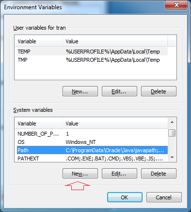

Nhập vào đường dẫn tới thư mục JDK.
• Variable name: JAVA_HOME
• Variable value: C:\DevPrograms\Java\jdk1.8.0_45
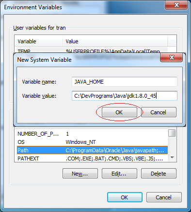  
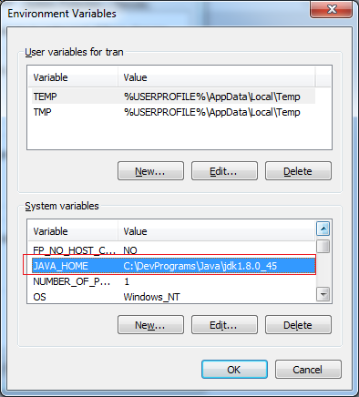
Tiếp theo sửa đổi biến môi trường path
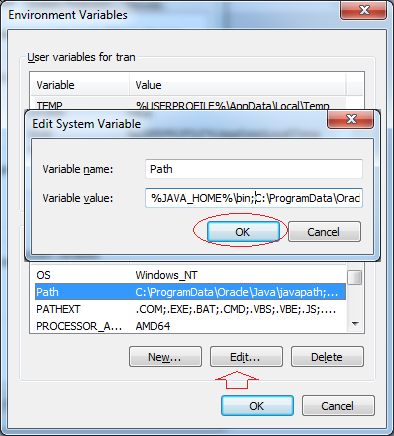
Thêm vào phía trước giá trị của biến môi trường path:
• %JAVA_HOME%\bin;

Bạn đã cài đặt và cấu hình Java thành công.
Check: java -version

### 2. Installing Tomcat

Install apache: https://tomcat.apache.org/
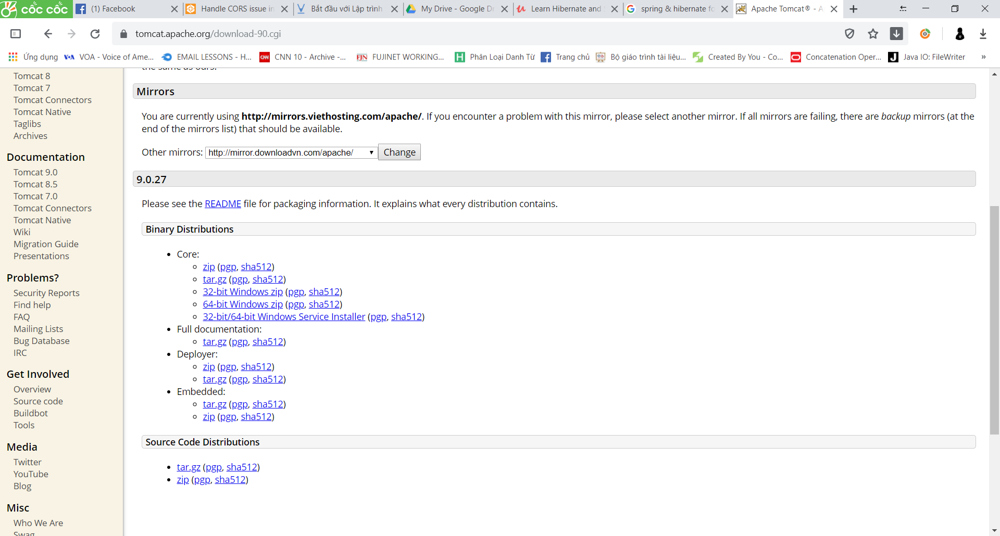
Chọn version Tomcat9/ Chọn 32-bit/64-bit Windows Service Installer
Sau đó cài đặt Apache : an next/ Chon type of Install la **FULL** /
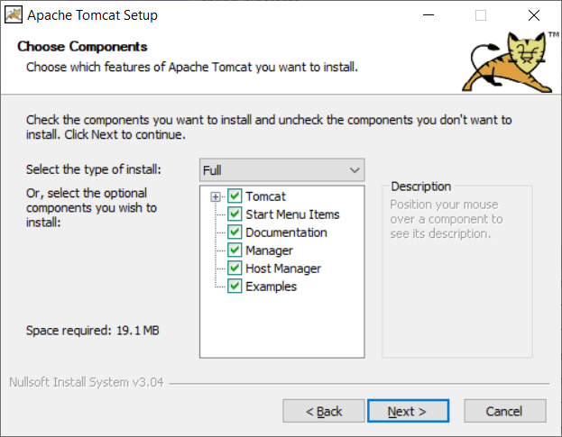
Lưu ý : phải chọn full, và nhập tên và pass cho admin
admin - admin
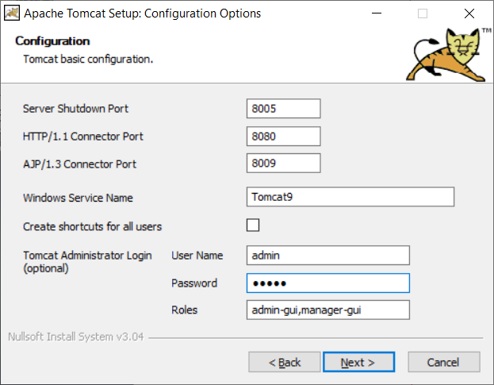
Bỏ chọn Show Readme và click Finish
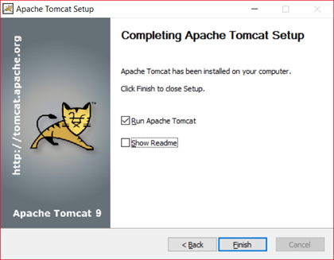
Verify install bằng cách vào link: http://localhost:8080/
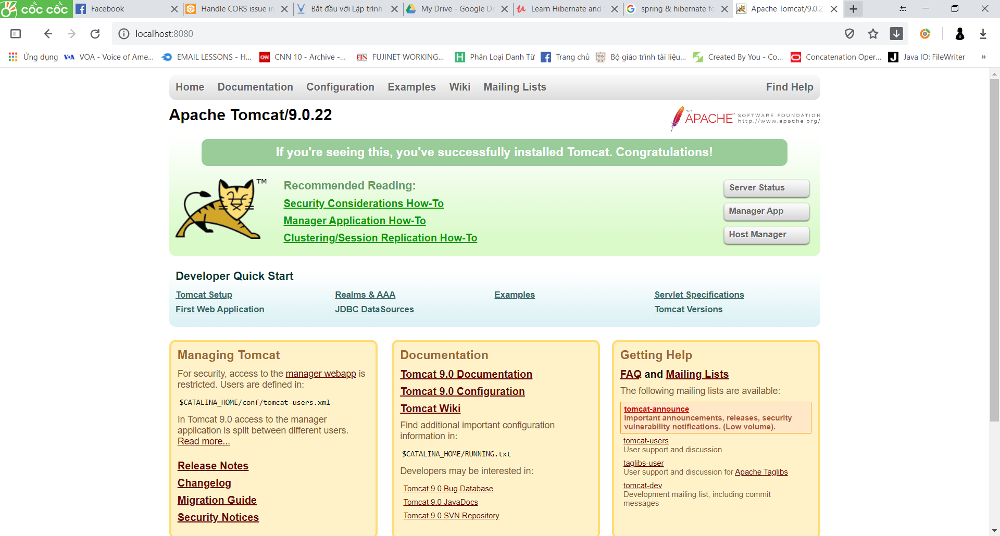
**Image**
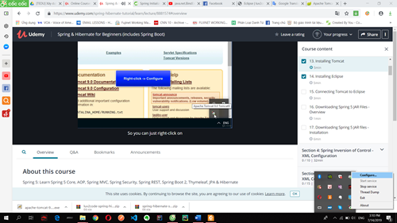
Vào windows gõ service: tomcat => stop
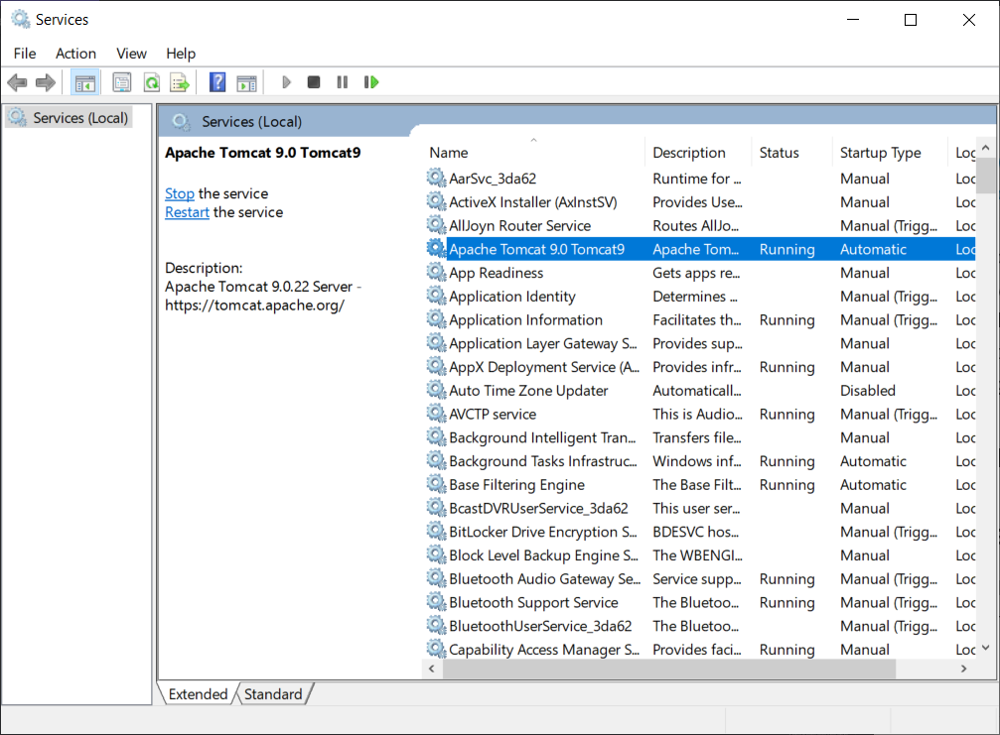
Install eclipse: chọn download packages => eclipse for Java EE
Try the Eclipse Installer 2019 06 R
The easiest way to install and update your Eclipse Development Environment.

### 4. Connecting Tomcat to Eclipse

Connect apache to eclipse
Vào tab server của eclipse/ chọn click link to add new server/ chọn Apache/ Tomcat 09/ rồi chọn đường link ở trong ổ C
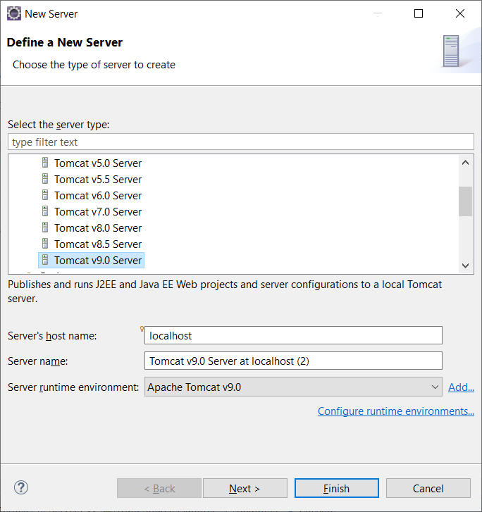  
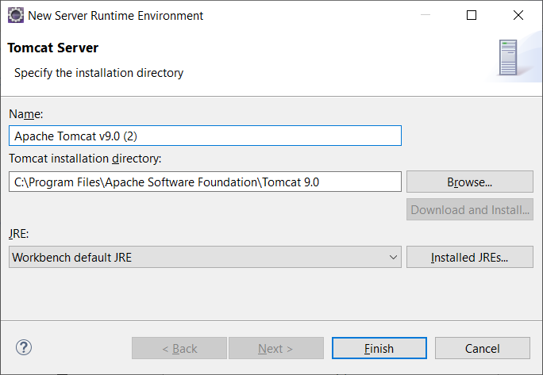  
**Program File/ Apache Sofware Foundation/ Tomcat 9**

### 5 Add jar files

Core container : Factory for creating bean and manage bean dependences
Thêm thủ công vào:
http://www.luv2code.com/downloadspring =>
http://repo.spring.io/release/org/springframework/spring/
chọn version release ở dưới cùng rồi chọn **spring-framework-5.1.8.RELEASE-dist.zip** để tải
Tạo project java bình thường, sau đó tạo thư mục lib trong java project rồi copy tất các các thư viện trong lib đã tải paste vào
**Rightclick/ properties/ Java build path/ libraries/ classpath/** ấn add jar rồi chon đến thư mục lib trong project mà ta vừa tạo chọn hết tất cả các file
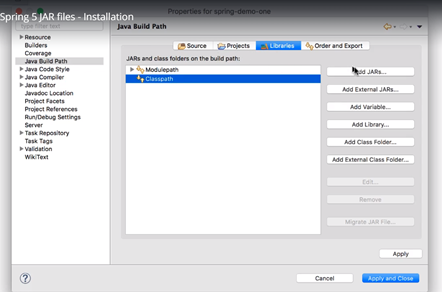  
**Nếu đúng sẽ xuất hiện Referenced libraries:**

## 4. Spring Inversion of Control - XML Configuration

### 1. What is Inversion of Control

The approach of outsourcing the construction and management of objects.

App should be configurable
• Easily change the coach for another sport
• Hockey, Cricket, Tennis, Gymnastics etc

```java
    public static void main(String[] args) {

		// create the object
		// Coach theCoach = new BaseballCoach();
		Coach theCoach = new TrackCoach();

		// use the object
		System.out.println(theCoach.getDailyWorkout());
    }
```

F:\Backup\DISK\D\Docs\spring-hiberante\spring-hibernate-source-code-v26

### 4. Spring Inversion of Control - Overview

##### Spring Container

Primary functions
• Create and manage objects (Inversion of Control)
• Inject object’s dependencies (Dependency Injection)

##### IOC & XML Configuration

Ioc: tạo và quản lý object(xem pdf)
Tạo interface Coach(HLV) và các môn thể thao tương ứng => làm sao để dễ dàng chuyển đổi giữa các môn thể thao và không phải code cứng mà chỉ dùng file config

##### Configuring Spring Container

• XML configuration file (legacy, but most legacy apps still use this)
• Java Annotations (modern)
• Java Source Code (modern)
Spring container is generically known as ApplicationContext

##### Spring Development Process

1. Configure your Spring Beans
2. Create a Spring Container
3. Retrieve Beans from Spring Container

```java
        // load the spring configuration file
		ClassPathXmlApplicationContext context =
				new ClassPathXmlApplicationContext("applicationContext.xml");

		// retrieve bean from spring container
		Coach theCoach = context.getBean("myCoach", Coach.class);

		// call methods on the bean
		System.out.println(theCoach.getDailyWorkout());

		// close the context
		context.close();
```

#### FAQ: What is a Spring Bean?

A "Spring Bean" is simply a Java object.

When Java objects are created by the Spring Container, then Spring refers to them as "Spring Beans".

Spring Beans are created from normal Java classes .... just like Java objects.

---

Here's a blurb from the Spring Reference Manual:

In Spring, the objects that form the backbone of your application and that are managed by the Spring IoC container are called beans. A bean is an object that is instantiated, assembled, and otherwise managed by a Spring IoC container. Otherwise, a bean is simply one of many objects in your application. Beans, and the dependencies among them, are reflected in the configuration metadata used by a container.

Source: https://docs.spring.io/spring/docs/current/spring-framework-reference/core.html#beans-introduction

---

In the early days, there was a term called "Java Beans". Spring Beans have a similar concept but Spring Beans do not follow all of the rigorous requirements of Java Beans.

---

In summary, whenever you see "Spring Bean", just think Java object. :-)

#### 8. HEADS UP - Add Logging Messages in Spring 5.1

**The Problem**

In Spring 5.1, the Spring Development team changed the logging levels internally. As a result, by default you will no longer see the red logging messages at the INFO level. This is different than in the videos.

**The Solution**

If you would like to configure your app to show similar logging messages as in the video, you can make the following updates listed below. Note, you will not see the EXACT same messages, since the Spring team periodically changes the text of the internal logging messages. However, this should give you some additional logging data.

**Overview of the steps**

1. Create a bean to configure the parent logger and console handler

2. Configure the bean in the Spring XML config file

Detailed Steps

1. Create a bean to configure the parent logger and console handler

This class will set the parent logger level for the application context. It will also set the logging level for console handler. It sets the logger level to FINE. For more detailed logging info, you can set the logging level to level to FINEST. You can read more about the logging levels at http://www.vogella.com/tutorials/Logging/article.html

This class also has an init method to handle the actual configuration. The init method is executed after the bean has been created and dependencies injected.

File: MyLoggerConfig.java

```java
package com.luv2code.springdemo;

import java.util.logging.ConsoleHandler;
import java.util.logging.Level;
import java.util.logging.Logger;
import java.util.logging.SimpleFormatter;

import org.springframework.context.annotation.AnnotationConfigApplicationContext;

public class MyLoggerConfig {

    private String rootLoggerLevel;
    private String printedLoggerLevel;

    public void setRootLoggerLevel(String rootLoggerLevel) {
    	this.rootLoggerLevel = rootLoggerLevel;
    }

    public void setPrintedLoggerLevel(String printedLoggerLevel) {
    	this.printedLoggerLevel = printedLoggerLevel;
    }

    public void initLogger() {

    	// parse levels
    	Level rootLevel = Level.parse(rootLoggerLevel);
    	Level printedLevel = Level.parse(printedLoggerLevel);

    	// get logger for app context
    	Logger applicationContextLogger = Logger.getLogger(AnnotationConfigApplicationContext.class.getName());

    	// get parent logger
    	Logger loggerParent = applicationContextLogger.getParent();

    	// set root logging level
    	loggerParent.setLevel(rootLevel);

    	// set up console handler
    	ConsoleHandler consoleHandler = new ConsoleHandler();
    	consoleHandler.setLevel(printedLevel);
    	consoleHandler.setFormatter(new SimpleFormatter());

    	// add handler to the logger
    	loggerParent.addHandler(consoleHandler);
    }

 }
```

2. Configure the bean in the Spring XML config file

In your XML config file, add the following bean entry. Make sure to list this as the first bean so that it is initialized first. Since the bean is initialized first, then you will get all of the logging traffic. If you move it later in the config file after the other beans, then you will miss out on some of the initial logging messages.

File: applicationContext.xml (snippet)

```xml
<!-- Add a logger config to see logging messages.
	- For more detailed logs, set values to "FINEST"
	- For info on logging levels, see: http://www.vogella.com/tutorials/Logging/article.html
-->

    <bean id="myLoggerConfig" class="com.luv2code.springdemo.MyLoggerConfig" init-method="initLogger">
    	<property name="rootLoggerLevel" value="FINE" />
    	<property name="printedLoggerLevel" value="FINE"/>
    </bean>

```

Source code is available here.
https://gist.github.com/darbyluv2code/cfb16c2fd1825a947d8faca3724b47a9
file html

Once you make these updates, then you will be able to see additional logging data. :-)

**Question**

#### 9. FAQ Why do we specify the Coach interface in getBean().html

For example:

```java
Coach theCoach = context.getBean("myCoach", Coach.class);

```

---

**Answer**

When we pass the interface to the method, behind the scenes Spring will cast the object for you.

```java
context.getBean("myCoach", Coach.class)
```

However, there are some slight differences than normal casting.

From the Spring docs:

Behaves the same as getBean(String), but provides a measure of type safety by throwing a BeanNotOfRequiredTypeException if the bean is not of the required type. This means that ClassCastException can't be thrown on casting the result correctly, as can happen with getBean(String).

Source: http://docs.spring.io/spring-framework/docs/current/javadoc-api/org/springframework/beans/factory/BeanFactory.html#getBean-java.lang.String-java.lang.Class-

## 5. Spring Dependency Injection - XML Configuration

### Các nguyên tắc đảo ngược phụ thuộc.

Client ủy quyền để gọi cho đối tượng khác có trách nhiệm cung cấp các phụ thuộc của nó
Ví dụ như request car thì car factory sẽ inject các component của nó vào để tạo thành object

#### Spring Injection Types(pdf)

• Constructor Injection
• Setter Injection(Phải có hàm khởi tạo không tham số)
• Will talk about “auto-wiring” in the Annotations section later
Injecting Literal Values

#### Development Process - Constructor Injection

1. Define the dependency interface and class
2. Create a constructor in your class for injections
3. Configure the dependency injection in Spring config file

#### FAQ: What is the purpose for the no arg constructor?

Question:
I was wondering why you created a no arg constructor? I thought that they are implied by Java and only required when you also have an overloaded constructor. Or is this a Spring specific thing?

---

**Answered by: Oleksandr Palamarchuk**
When you don’t define any constructor in your class, compiler defines default one for you, however when you declare any constructor (in your example you have already defined a parameterized constructor), compiler doesn’t do it for you.
Since you have defined a constructor in class code, compiler didn’t create default one. While creating object you are invoking default one, which doesn’t exist in class code. Then the code gives an compilation error.

#### Development Process - Setter Injection

1. Create setter method(s) in your class for injections( must create no-arg constructor)
2. Configure the dependency injection in Spring config file

#### Injecting Literal Values Development Process

1. Create setter method(s) in your class for injections
2. Configure the injection in Spring config file

Tao ham setter de khi khai bao trong file config no se tu dong goi

#### Question:

For the CricketCoach example with Setter Injection, why do we use the CricketCoach class instead of the Coach interface?
**Answer**:
The getTeam() method is only defined in the CricketCoach class. It is not part of the Coach interface.
As a result, you would need the following code:

```java
CricketCoach theCricketCoach = context.getBean("myCricketCoach", CricketCoach.class);

```

---

The Coach interface has two methods: getDailyWorkout and getDailyFortune
The CricketCoach class has four methods: getDailyWorkout, getDailyFortune, getTeam and setTeam

---

When you retrieve a bean from the Spring container using the Coach interface:

```java
Coach theCricketCoach = context.getBean("myCricketCoach", Coach.class);

```

You only have access to the methods defined in the Coach interface: getDailyWorkout and getDailyFortune. Even though the actual implementation has additional methods, you only have visibility to methods that are defined at the Coach interface level.

---

When you retrieve a bean from the Spring container using the CricketCoach class:

```java
CricketCoach theCricketCoach = context.getBean("myCricketCoach", CricketCoach.class);

```

You have access to the methods defined in the Coach interface: getDailyWorkout and getDailyFortune.
ALSO, you have access to the additional methods defined in the CricketCoach class: getTeam, setTeam.

---

The bottom line is it depends on how you retrieve the object and assign it ... that determines the visibility you have to the methods.

#### Injecting Values from a Properties File

1. Create Properties File in src
2. Load Properties File in Spring config file
3. Reference values from Properties File

#### Practice Activity #2 - Dependency Injection with XML Configuration

Compare your code to the solution. The solution is available here:

- http://www.luv2code.com/downloads/udemy-spring-hibernate/solution-practice-activities.zip

## 6. Spring Bean Scopes and Lifecycle

### 1. Bean scope

Spring Container creates only one instance of the bean, by default
• It is cached in memory
• All requests for the bean
• will return a SHARED reference to the SAME bean
**Explicitly Specify Bean Scope and type - pdf**
singleton and prototype

### 2. Bean Lifecycle

1. Define your methods for init and destroy
2. Configure the method names in Spring config file

#### Special Note about init and destroy Method Signatures

When using XML configuration, I want to provide additional details regarding the method signatures of the init-method and destroy-method .

**Access modifier**
The method can have any access modifier (public, protected, private)

**Return type**
The method can have any return type. However, "void' is most commonly used. If you give a return type just note that you will not be able to capture the return value. As a result, "void" is commonly used.

**Method name**
The method can have any method name.

**Arguments**
The method can not accept any arguments. The method should be no-arg.

**There is a subtle point you need to be aware of with "prototype" scoped beans.**

**For "prototype" scoped beans, Spring does not call the destroy method. Gasp!**

---

\_In contrast to the other scopes, Spring does not manage the complete lifecycle of a prototype bean: the container instantiates, configures, and otherwise assembles a prototype object, and hands it to the client, with no further record of that prototype instance.

Thus, although initialization lifecycle callback methods are called on all objects regardless of scope, in the case of prototypes, configured destruction lifecycle callbacks are not called. The client code must clean up prototype-scoped objects and release expensive resources that the prototype bean(s) are holding.\_

---

This also applies to both XML configuration and Annotation-based configuration.

## 7. Spring Configuration with Java Annotations - Inversion of Control

Spring will scan your Java classes for special annotations
Automatically register the beans in the Spring container

### 1. Annotations Overview - Component Scanning

**Development Process**

1. Enable component scanning in Spring config file
2. Add the @Component Annotation to your Java classes
3. Retrieve bean from Spring container

@Component(“beanID”)

applicationContext

```xml
<?xml version="1.0" encoding="UTF-8"?>
<beans xmlns="http://www.springframework.org/schema/beans"
    xmlns:xsi="http://www.w3.org/2001/XMLSchema-instance"
    xmlns:context="http://www.springframework.org/schema/context"
    xsi:schemaLocation="http://www.springframework.org/schema/beans
    http://www.springframework.org/schema/beans/spring-beans.xsd
    http://www.springframework.org/schema/context
    http://www.springframework.org/schema/context/spring-context.xsd">

	<!-- add entry to enable component scanning -->

	<context:component-scan base-package="com.luv2code.springdemo" />

</beans>

```

solution-code-spring-annotation-explicit-component-names

```java
package com.luv2code.springdemo;

import org.springframework.stereotype.Component;

@Component("thatSillyCoach")
public class TennisCoach implements Coach {


	@Override
	public String getDailyWorkout() {
		return "Practice your backhand volley";
	}

}

```

Demo

```java
package com.luv2code.springdemo;

import org.springframework.context.support.ClassPathXmlApplicationContext;

public class AnnotationDemoApp {

	public static void main(String[] args) {

		// read spring config file
		ClassPathXmlApplicationContext context =
				new ClassPathXmlApplicationContext("applicationContext.xml");

		// get the bean from spring container
		Coach theCoach = context.getBean("thatSillyCoach", Coach.class);

		// call a method on the bean
		System.out.println(theCoach.getDailyWorkout());

		// close the context
		context.close();

	}

}


```

### 2. Annotations Project Setup

### 3. Explicit Component Names - Write Some Code

### 4. Default Component Names - Overview

Default bean id: the class name, make first letter lower-case

## 8. Spring Configuration with Java Annotations - Dependency Injection

### 1. Constructor Injection - Overview

For dependency injection, Spring can use auto wiring
• Spring will look for a class that matches the property
• matches by type: class or interface
• Spring will inject it automatically … hence it is autowired

**Autowiring Injection Types**
• Constructor Injection
• Setter Injection
• Field Injections

**Development Process - Constructor Injection**

1. Define the dependency interface and class
2. Create a constructor in your class for injections
3. Configure the dependency injection with @Autowired Annotation

Spring will auto find that inplements FoturneService

AUTOWIRING

#### FAQ: What if there are multiple FortuneService implementations?

When using autowiring, what if there are multiple FortuneService implementations? Like in the image below?

---

ANSWER

Spring has special support to handle this case. Use the **@Qualifier** annotation. We'll cover this later in the course with slides and code examples. But don't worry, we will address all scenarios :-)

**Question**

https://docs.spring.io/spring/docs/current/spring-framework-reference/core.html#beans-autowired-annotation

#### I have finished the video "Constructor Injection - Writing Code part2".

I have commented the Autowired annotation. But still it worked. How did it work?

```java
    //@Autowired
    public TennisCoach(FortuneService theFortuneService) {
        System.out.println(" theFortuneService " + theFortuneService);
        fortuneService = theFortuneService;
    }

```

===

Answer

This is a new feature of Spring 4.3.

Here is the snippet from the Spring Docs.

Section 1.9.2: Autowired

As of Spring Framework 4.3, an **@Autowired** annotation on such a constructor is no longer necessary if the target bean only defines one constructor to begin with. However, if several constructors are available, at least one must be annotated to teach the container which one to use.

**I personally prefer to use the @Autowired annotation because it makes the code more readable. But as mentioned, the @Autowired is not required for this scenario.**

See link to the docs.
https://docs.spring.io/spring/docs/current/spring-framework-reference/core.html#beans-autowired-annotation

### 2. Setter Injection - Overview

1. Create setter method(s) in your class for injections (có constructor)
2. Configure the dependency injection with @Autowired Annotation

### 3. Method Injection

Thu tu chay la:

- Default Contructor
- Inject value auto

### 4. Field Injection - Overview

### 5. Which Injection Type Should You Use

Chon 1 cai va SD thong nhat trong project

### 12. Qualifiers for Dependency Injection - Overview

Nho them annotation @Component
Bean id phai trung voi Class name

```java
@Autowired
@Qualifier("happyFortuneService")
private FortuneService fortuneService;
```

### 13. Qualifiers for Dependency Injection - Write Some Code - Part 1

### 14. Qualifiers for Dependency Injection - Write Some Code - Part 2

#### Annotations - Default Bean Names ... and the Special Case

In general, when using Annotations, for the default bean name, Spring uses the following rule.

If the annotation's value doesn't indicate a bean name, an appropriate name will be built based on the short name of the class (with the first letter lower-cased).  
For example:

HappyFortuneService --> happyFortuneService

---

However, for the special case of **when BOTH the first and second characters of the class name are upper case**, then the name is **NOT converted**.

For the case of RESTFortuneService

RESTFortuneService --> RESTFortuneService

No conversion since the first two characters are upper case.

Behind the scenes, Spring uses the Java Beans Introspector to generate the default bean name. Here's a screenshot of the documentation for the key method.

Also, here's a link to the documentation.

- https://docs.oracle.com/javase/8/docs/api/java/beans/Introspector.html#decapitalize(java.lang.String)

---

As always, you can give explicity names to your beans.

@Component("foo")
public class RESTFortuneService .... {

}

Then you can access it using the name of "foo". Nothing tricky to worry about :-)

Hope this helps. Happy Coding! :-)

**XEM THEM HTML**

16. Using @Qualifier with Constructors

**@Qualifier** is a nice feature, but it is tricky when used with Constructors.

The syntax is much different from other examples and not exactly intuitive. Consider this the "deep end of the pool" when it comes to Spring configuration LOL :-)

You have to place the @Qualifier annotation inside of the constructor arguments.

Here's an example from our classroom example. I updated it to make use of constructor injection, with @Autowired and @Qualifier. Make note of the code in bold below:

---

```java
package com.luv2code.springdemo;

import org.springframework.beans.factory.annotation.Autowired;
import org.springframework.beans.factory.annotation.Qualifier;
import org.springframework.stereotype.Component;

@Component
public class TennisCoach implements Coach {

    private FortuneService fortuneService;

    // define a default constructor
    public TennisCoach() {
        System.out.println(">> TennisCoach: inside default constructor");
    }

    @Autowired
    public TennisCoach(@Qualifier("randomFortuneService") FortuneService theFortuneService) {

        System.out.println(">> TennisCoach: inside constructor using @autowired and @qualifier");

        fortuneService = theFortuneService;
    }


    /*
    @Autowired
    public void doSomeCrazyStuff(FortuneService theFortuneService) {
        System.out.println(">> TennisCoach: inside doSomeCrazyStuff() method");
        fortuneService = theFortuneService;
    }
    */

    /*
    @Autowired
    public TennisCoach(FortuneService theFortuneService) {
        fortuneService = theFortuneService;
    }
    */

    @Override
    public String getDailyWorkout() {
        return "Practice your backhand volley";
    }

    @Override
    public String getDailyFortune() {
        return fortuneService.getFortune();
    }

}

```

---

For detailed documentation on using @Qualified with Constructors, see this link in the Spring Reference Manual

https://docs.spring.io/spring/docs/current/spring-framework-reference/core.html#beans-autowired-annotation-qualifiers

#### FAQ: How to inject properties file using Java annotations

**Answer**:

This solution will show you how inject values from a properties file using annotatons. The values will no longer be hard coded in the Java code.

1. Create a properties file to hold your properties. It will be a name value pair.

New text file: src/sport.properties

```properties
foo.email=myeasycoach@luv2code.com
foo.team=Silly Java Coders

```

Note the location of the properties file is very important. It must be stored in src/sport.properties

2. Load the properties file in the XML config file.

File: applicationContext.xml

Add the following lines:

```xml
    <context:property-placeholder location="classpath:sport.properties"/>

This should appear just after the <context:component-scan .../> line

```

3. Inject the properties values into your Swim Coach: SwimCoach.java

@Value("${foo.email}")
private String email;
    
@Value("${foo.team}")
private String team;

---

DOWNLOAD FULL SOURCE CODE

You can download entire code from here:

- http://www.luv2code.com/downloads/spring-hibernate/spring-props-annotation-demo.zip

## 9. Spring Configuration with Java Annotations - Bean Scopes and Lifecycle Methods

### 1. @Scope Annotation - Overview

Default scope is singleton

### 2. @Scope Annotation - Write Some Code

#### Special Note about @PostConstruct and @PreDestroy Method Signatures

I want to provide additional details regarding the method signatures of @PostContruct and @PreDestroy methods.

**Access modifier**

The method can have any access modifier (public, protected, private)

**Return type**
The method can have any return type. However, "void' is most commonly used. If you give a return type just note that you will not be able to capture the return value. As a result, "void" is commonly used.

**Method name**
The method can have any method name.

**Arguments**
The method can not accept any arguments. The method should be no-arg.

### 3. Bean Lifecycle Method Annotations - Overview

Development Process

1. Define your methods for init and destroy
2. Add annotations: @PostConstruct and @PreDestroy

#### HEADS UP - FOR JAVA 9, 10 and 11 USERS - @PostConstruct and @PreDestroy

If you are using Java 9, 10 or 11, then you will encounter an error when using @PostConstruct and @PreDestroy in your code.

These are the steps to resolve it. Come back to the lecture if you hit the error.

**Error**

Eclipse is unable to import @PostConstruct or @PreDestroy

This happens because of Java 9 and higher.

When using Java 9 and higher, javax.annotation has been removed from its default classpath. That's why we Eclipse can't find it.

---

**Solution**

1. Download the javax.annotation-api-1.2.jar from

http://central.maven.org/maven2/javax/annotation/javax.annotation-api/1.2/javax.annotation-api-1.2.jar

2. Copy the JAR file to the lib folder of your project

---

Use the following steps to add it to your Java Build Path.

3. Right-click your project, select Properties

4. On left-hand side, click Java Build Path

5. In top-center of dialog, click Libraries

6. Click Classpath and then Click Add JARs ...

7. Navigate to the JAR file <your-project>/lib/javax.annotation-api-1.2.jar

8. Click OK then click Apply and Close

Eclipse will perform a rebuild of your project and it will resolve the related build errors.

## 10. Spring Configuration with Java Code (no xml)

### 1. Spring Configuration with Java Code (no xml) – Overview

Instead of configuring Spring container using XML
Configure the Spring container with Java code
**Development Process**

1. Create a Java class and annotate as @Configuration
2. Add component scanning support: @ComponentScan (optional)
3. Read Spring Java configuration class
4. Retrieve bean from Spring container

---

### 4. Defining Spring Beans with Java Code (no xml) - Overview

solution-code-spring-java-config
SportConfig

#### 3. Heads Up - Add Logging Messages in Spring 5.1 - All Java Config Version

**The Problem**

In Spring 5.1, the Spring Development team changed the logging levels internally. As a result, by default you will no longer see the red logging messages at the INFO level. This is different than in the videos.

**The Solution**

If you would like to configure your app to show similar logging messages as in the video, you can make the following updates. Note, you will not see the EXACT same messages, since the Spring team periodically changes the text of the internal logging messages. However, this should give you some additional logging data.

Overview of the steps

0. Create a logging properties file

1. Create a configuration class to configure the parent logger and console handler

Detailed Steps

**0. Create a logging properties file**

This properties file will define the logging levels for the application. The props file sets the logger level to FINE. For more detailed logging info, you can set the logging level to level to FINEST. You can read more about the logging levels at http://www.vogella.com/tutorials/Logging/article.html

File: src/mylogger.properties

root.logger.level=FINE
printed.logger.level=FINE

---

**1. Create a configuration class to configure the parent logger and console handler**

This class will set the parent logger level for the application context. It will also set the logging level for console handler. The logging levels are loaded from the configuration file using the @PropertySource annotation. The fields are injected using the @Value annotation. This class also has a @PostConstruct method to handle the actual configuration.

File: MyLoggerConfig.java

```java
package com.luv2code.springdemo;

import java.util.logging.ConsoleHandler;
import java.util.logging.Level;
import java.util.logging.Logger;
import java.util.logging.SimpleFormatter;

import javax.annotation.PostConstruct;

import org.springframework.beans.factory.annotation.Value;
import org.springframework.context.annotation.AnnotationConfigApplicationContext;
import org.springframework.context.annotation.Configuration;
import org.springframework.context.annotation.PropertySource;

@Configuration
@PropertySource("classpath:mylogger.properties")
public class MyLoggerConfig {

	@Value("${root.logger.level}")
	private String rootLoggerLevel;

	@Value("${printed.logger.level}")
	private String printedLoggerLevel;

	@PostConstruct
	public void initLogger() {

		// parse levels
		Level rootLevel = Level.parse(rootLoggerLevel);
		Level printedLevel = Level.parse(printedLoggerLevel);

		// get logger for app context
		Logger applicationContextLogger = Logger.getLogger(AnnotationConfigApplicationContext.class.getName());

		// get parent logger
		Logger loggerParent = applicationContextLogger.getParent();

		// set root logging level
		loggerParent.setLevel(rootLevel);

		// set up console handler
		ConsoleHandler consoleHandler = new ConsoleHandler();
		consoleHandler.setLevel(printedLevel);
		consoleHandler.setFormatter(new SimpleFormatter());

		// add handler to the logger
		loggerParent.addHandler(consoleHandler);
	}

}

```

---

Source code is available at the following link

https://gist.github.com/darbyluv2code/a49009fe1f92f95a30d2d5f7ac987ce5

---

Once you make these updates, then you will be able to see additional logging data. :-)

Question:

#### During All Java Configuration, how does the @Bean annotation work in the background?

**Answer**

This is an advanced concept. But I'll walk through the code line-by-line.

For this code:

```java
@Bean
public Coach swimCoach() {
 SwimCoach mySwimCoach = new SwimCoach();
 return mySwimCoach;
}

```

At a high-level, Spring creates a bean component manually. By default the scope is singleton. So any request for a "swimCoach" bean, will get the same instance of the bean since singleton is the default scope.

However, let's break it down line-by-line

**@Bean**

The @Bean annotation tells Spring that we are creating a bean component manually. We didn't specify a scope so the default scope is singleton.

**public Coach swimCoach(){**
This specifies that the bean will bean id of "swimCoach". The method name determines the bean id. The return type is the Coach interface. This is useful for dependency injection. This can help Spring find any dependencies that implement the Coach interface.

The @Bean annotation will intercept any requests for "swimCoach" bean. Since we didn't specify a scope, the bean scope is singleton. As a result, it will give the same instance of the bean for any requests.

SwimCoach mySwimCoach = new SwimCoach();
This code will create a new instance of the SwimCoach.

return mySwimCoach;
This code returns an instance of the swimCoach.

---

Now let's step back and look at the method in it's entirety.

```java
@Bean
public Coach swimCoach() {
 SwimCoach mySwimCoach = new SwimCoach();
 return mySwimCoach;
}

```

It is important to note that this method has the @Bean annotation. The annotation will intercept ALL calls to the method "swimCoach()". Since no scope is specified the @Bean annotation uses singleton scope. Behind the scenes, during the @Bean interception, it will check in memory of the Spring container (applicationContext) and see if this given bean has already been created.

If this is the first time the bean has been created then it will execute the method as normal. It will also register the bean in the application context. So that is knows that the bean has already been created before. Effectively setting a flag.

The next time this method is called, the @Bean annotation will check in memory of the Spring container (applicationContext) and see if this given bean has already been created. Since the bean has already been created (previous paragraph) then it will immediately return the instance from memory. It will not execute the code inside of the method. Hence this is a singleton bean.

The code for

SwimCoach mySwimCoach = new SwimCoach();
return mySwimCoach;
is not executed for subsequent requests to the method public Coach swimCoach() . This code is only executed once during the initial bean creation since it is singleton scope.

That explains how @Bean annotation works for the swimCoach example.

====

Now let's take it one step further.

Here's your other question

> > Please explain in detail whats happening behind the scene for this statement.

return new SwimCoach(sadFortuneService())

The code for this question is slightly different. It is injecting a dependency.

In this example, we are creating a SwimCoach and injecting the sadFortuneService().

```java
         // define bean for our sad fortune service
        @Bean
        public FortuneService sadFortuneService() {
            return new SadFortuneService();
        }

        // define bean for our swim coach AND inject dependency
        @Bean
        public Coach swimCoach() {
            SwimCoach mySwimCoach = new SwimCoach(sadFortuneService());

            return mySwimCoach;
        }

```

Using the same information presented earlier

The code

        // define bean for our sad fortune service
        @Bean
        public FortuneService sadFortuneService() {
            return new SadFortuneService();
        }

In the code above, we define a bean for the sad fortune service. Since the bean scope is not specified, it defaults to singleton.

Any calls for sadFortuneService, the @Bean annotation intercepts the call and checks to see if an instance has been created. First time through, no instance is created so the code executes as desired. For subsequent calls, the singleton has been created so @Bean will immediately return with the singleton instance.

Now to the main code based on your question.

return new SwimCoach(sadFortuneService())
This code creates an instance of SwimCoach. Note the call to the method sadFortuneService(). We are calling the annotated method above. The @Bean will intercept and return a singleton instance of sadFortuneService. The sadFortuneService is then injected into the swim coach instance.

This is effectively dependency injection. It is accomplished using all Java configuration (no xml).

---

This concludes the line-by-line discussion of the source code. All of the behind the scenes work.

I hope this clears your doubt. :-)

### 10. Injecting Values from Properties File - Write Some Code - Part 2

### FAQ: Problems with Injecting Values - Value not returning from \${foo.email}

Question

I am running the code for Java Configuration and injecting values from props file. However, I'm getting:

${foo.email}
${foo.team}

Instead of the actual property values. How can I resolve this?

Answer

This is an issue with Spring versions.

If you are using Spring 4.2 and lower, you will need to add the code in bold.

---

```java
package com.luv2code.springdemo;

import org.springframework.context.annotation.Bean;
import org.springframework.context.annotation.Configuration;
import org.springframework.context.annotation.PropertySource;
import org.springframework.context.support.PropertySourcesPlaceholderConfigurer;

@Configuration
// @ComponentScan("com.luv2code.springdemo")
@PropertySource("classpath:sport.properties")
public class SportConfig {

 // bold
 // add support to resolve \${...} properties
@Bean
public static PropertySourcesPlaceholderConfigurer
propertySourcesPlaceHolderConfigurer() {

 return new PropertySourcesPlaceholderConfigurer();
}

 // define bean for our sad fortune service
@Bean
public FortuneService sadFortuneService() {
return new SadFortuneService();
}

 // define bean for our swim coach AND inject dependency
@Bean
public Coach swimCoach() {
SwimCoach mySwimCoach = new SwimCoach(sadFortuneService());

 return mySwimCoach;
}

}

```

---

In Spring 4.3 and higher, they removed this requirement. As a result, you don't need this code.

In the video, I show Spring 4.3, that's why this code is not displayed.

Let me know if that clears it up.

:-)

### 4. Defining Spring Beans with Java Code (no xml) - Overview

Trong file SportConfig, ten method trung voi bean ID

```java
@Bean
	public FortuneService sadFortuneService() {
		return new SadFortuneService();
	}
    //sadFortuneService la bean id
```

## 11. Spring MVC - Building Spring Web Apps

http://luv2code.com/spring-mvc-docs =>
https://docs.spring.io/spring/docs/current/spring-framework-reference/web.html

### 1. Spring MVC Overview

### 2. Spring MVC - Behind the Scenes

http://luv2code.com/spring-mvc-views =>
https://docs.spring.io/spring/docs/current/spring-framework-reference/web.html#mvc-view

### 3. Development Environment Checkpoint

### 4. Download Spring MVC Starter Files.html

In the following videos for Spring MVC, I provide a collection of starter files.
Download these files from the link below.
http://www.luv2code.com/downloads/udemy-spring-hibernate/solution-code-spring-mvc-config-files.zip
You will need these in the following videos.
Cheers :-)

### 5. Spring MVC Configuration - Overview

**Spring MVC Configuration Process - Part 1**
Add configurations to file: WEB-INF/web.xml

1. Configure Spring MVC Dispatcher Servlet
2. Set up URL mappings to Spring MVC Dispatcher Servlet
3. Add support for Spring component scanning
4. Add support for conversion, formatting and validation
5. Configure Spring MVC View Resolver

```xml
web.xml
<?xml version="1.0" encoding="UTF-8"?>
<web-app xmlns:xsi="http://www.w3.org/2001/XMLSchema-instance"
	xmlns="http://xmlns.jcp.org/xml/ns/javaee"
	xsi:schemaLocation="http://xmlns.jcp.org/xml/ns/javaee http://xmlns.jcp.org/xml/ns/javaee/web-app_3_1.xsd"
	id="WebApp_ID" version="3.1">

	<display-name>spring-mvc-demo</display-name>

	<absolute-ordering />

	<!-- Step 1: Configure Spring MVC Dispatcher Servlet -->
	<servlet>
		<servlet-name>dispatcher</servlet-name>
		<servlet-class>org.springframework.web.servlet.DispatcherServlet</servlet-class>
		<init-param>
			<param-name>contextConfigLocation</param-name>
			<param-value>/WEB-INF/spring-mvc-demo-servlet.xml</param-value>
		</init-param>
		<load-on-startup>1</load-on-startup>
	</servlet>

	<!-- Step 2: Set up URL mapping for Spring MVC Dispatcher Servlet -->
	<servlet-mapping>
		<servlet-name>dispatcher</servlet-name>
		<url-pattern>/</url-pattern>
	</servlet-mapping>

</web-app>

----------------------------------
<?xml version="1.0" encoding="UTF-8"?>
<beans xmlns="http://www.springframework.org/schema/beans"
	xmlns:xsi="http://www.w3.org/2001/XMLSchema-instance"
	xmlns:context="http://www.springframework.org/schema/context"
	xmlns:mvc="http://www.springframework.org/schema/mvc"
	xsi:schemaLocation="
		http://www.springframework.org/schema/beans
    	http://www.springframework.org/schema/beans/spring-beans.xsd
    	http://www.springframework.org/schema/context
    	http://www.springframework.org/schema/context/spring-context.xsd
    	http://www.springframework.org/schema/mvc
        http://www.springframework.org/schema/mvc/spring-mvc.xsd">

	<!-- Step 3: Add support for component scanning -->
	<context:component-scan base-package="com.luv2code.springdemo" />

	<!-- Step 4: Add support for conversion, formatting and validation support -->
	<mvc:annotation-driven/>

	<!-- Step 5: Define Spring MVC view resolver -->
	<bean
		class="org.springframework.web.servlet.view.InternalResourceViewResolver">
		<property name="prefix" value="/WEB-INF/view/" />
		<property name="suffix" value=".jsp" />
	</bean>

</beans>

```

### 6. Spring MVC Configuration - JAR Files

**File/ New/ Dynamic web project/Finish**
Copy spring jar files vào thư mục WebContent/ WEB-INF/ lib
Copy thêm 2 file jstl():

- javax.servlet.jsp.jstl-1.2.1.jar
- javax.servlet.jsp.jstl-api-1.2.1

### 7. Spring MVC Configuration - Config Files

Copy 2 file xml vao WEB-INF
Question:

#### 8. How to configure the Spring Dispatcher Servlet using all Java Code (no xml)?

Answer:

Good question!

For Spring MVC, we cover all Java config (no xml) later in the course, complete with videos/explanation and everything.

However, if you just need the code, here are the steps

1. Delete the files: web.xml file and spring-mvc-demo-servlet.xml files

2. Create a new Java package: com.luv2code.springdemo.config

3. Add the following Java files in your package

File: DemoAppConfig.java

```java
package com.luv2code.springdemo.config;

import org.springframework.context.annotation.Bean;
import org.springframework.context.annotation.ComponentScan;
import org.springframework.context.annotation.Configuration;
import org.springframework.web.servlet.ViewResolver;
import org.springframework.web.servlet.config.annotation.EnableWebMvc;
import org.springframework.web.servlet.view.InternalResourceViewResolver;

@Configuration
@EnableWebMvc
@ComponentScan(basePackages="com.luv2code.springdemo")
public class DemoAppConfig {

    // define a bean for ViewResolver

    @Bean
    public ViewResolver viewResolver() {

    	InternalResourceViewResolver viewResolver = new InternalResourceViewResolver();

    	viewResolver.setPrefix("/WEB-INF/view/");
    	viewResolver.setSuffix(".jsp");

    	return viewResolver;
    }

 }

```

**File: MySpringMvcDispatcherServletInitializer.java**

```java
package com.luv2code.springdemo.config;

import org.springframework.web.servlet.support.AbstractAnnotationConfigDispatcherServletInitializer;

public class MySpringMvcDispatcherServletInitializer extends AbstractAnnotationConfigDispatcherServletInitializer {

    @Override
    protected Class<?>[] getRootConfigClasses() {
    	// TODO Auto-generated method stub
    	return null;
    }

    @Override
    protected Class<?>[] getServletConfigClasses() {
    	return new Class[] { DemoAppConfig.class };
    }

    @Override
    protected String[] getServletMappings() {
    	return new String[] { "/" };
    }

}

```

4. Test your app

Your app should work as desired.

---

I also uploaded a full project implementation with code here

https://drive.google.com/open?id=1_5__2SggzgFHt7Rs2YYsv5JHRVX5Orq3

---

For a discussion on how this code works, you can skip ahead to the following video

Video 403 - Spring MVC All Java Config

https://www.udemy.com/spring-hibernate-tutorial/learn/v4/t/lecture/8355870?start=148

Skip ahead to time marker [02:28]

---

let me know if you need anything else.

:-)

## 12. Spring MVC - Creating Controllers and Views

### 1. Creating a Spring Home Controller and View – Overview

**Development Process**

1. Create Controller class
2. Define Controller method
3. Add Request Mapping to Controller method
4. Return View Name
5. Develop View Page

- Khi chạy vào **run as/ run on server/ chọn server Tomcat/ tick Always use this server….**

---

### 3. Creating a Spring Home Controller and View - Write Some Code - Part 2

If error run
http://luv2code.com/spring-mvc-helps

Display data in jsp files
Student name: \${param.studentName}

---

solution-code-spring-mvc-create-home-controller-and-view

### 4. FAQ HELP! My Spring MVC Controller is not working. What to do.html

### 5. FAQ HELP! - Can't Start Tomcat - Ports are in Use!.html

### 6. FAQ How Does Component Scan Work - Your Package Names are Different!.html

### 7. Reading HTML Form Data - Overview

solution-code-spring-mvc-reading-html-form-data

### 8. Reading HTML Form Data - Write Some Code - Part 1

### 9. Reading HTML Form Data - Write Some Code - Part 2

process Form

```
<!DOCTYPE html>
<html>

<body>

Hello World of Spring!

<br><br>

Student name: ${param.studentName}

</body>

</html>

```

### 10. Reading HTML Form Data - Write Some Code - Part 3

```java
package com.luv2code.springdemo.mvc;

import org.springframework.stereotype.Controller;
import org.springframework.web.bind.annotation.RequestMapping;

@Controller
public class HomeController {

	@RequestMapping("/")
	public String showPage() {
		return "main-menu";
	}
}

```

### 11. Adding Data to the Spring Model - Overview

The Model is a container for your application data

• In your Controller

• You can put anything in the model

• strings, objects, info from database, etc...

• Your View page (JSP) can access data from the model

solution-code-spring-mvc-adding-data-to-the-spring-model

```java
// need a controller method to show the initial HTML form

	@RequestMapping("/showForm")
	public String showForm() {
		return "helloworld-form";
	}

	// need a controller method to process the HTML form

	@RequestMapping("/processForm")
	public String processForm() {
		return "helloworld";
	}

	// new a controller method to read form data and
	// add data to the model

	@RequestMapping("/processFormVersionTwo")
	public String letsShoutDude(HttpServletRequest request, Model model) {

		// read the request parameter from the HTML form
		String theName = request.getParameter("studentName");

		// convert the data to all caps
		theName = theName.toUpperCase();

		// create the message
		String result = "Yo! " + theName;

		// add message to the model
		model.addAttribute("message", result);

		return "helloworld";
	}
```

Result:

```jsp
Student name: ${param.studentName}

<br><br>

The message: ${message}
```

### 12. Adding Data to the Spring Model - Write Some Code - Part 1

### 13. Adding Data to the Spring Model - Write Some Code - Part 2

### 14. FAQ How to use CSS, JavaScript and Images in Spring MVC Web App.html

### 15. Bonus Deploying To Tomcat using WAR files.html

---

JUST A HEADS UP ...

IN THE VIDEOS YOUR SPRING MVC CONTROLLER CODE MAY NOT WORK

THIS IS AN ECLIPSE CACHING BUG

IF YOUR CONTROLLER DOESN'T WORK THEN TRY THE STEPS BELOW

---

### Question: HELP! My Spring MVC Controller is not working. What to do?

Answer: **File html have images**!!!!!

Debug Tip #0: Make sure you are accessing the correct URL

You need to access the correct URL, localhost:8080/spring-mvc-demo/

Note: Do not attempt to run the JSP files directly. This will not work due to MVC.

---

Debug Tip #1: Make Sure your Package Names is consistent

The Spring configuration file used in the videos expects for your controller to be in the package:

package com.luv2code.springdemo.mvc;

Make sure your controller is this package.

---

Debug Tip #2: Reimport Project into Eclipse

Sometimes the Eclipse project settings can become corrupted. One possible solution is to remove the Eclipse project and reimport into Eclipse.

Here are the steps.

1. Remove the project from Eclipse.

2) Open the project in file system and remove the files/ folders except src and WebContent.

3. Open the project in Eclipse again using File > Import ... > General > Existing Projects into Workspace

4. Check the project properties(Right click on the project and click on Properties),

5. Check the Java Build Path, Java Compiler and Project Facets and make sure that the Java version is same in all the windows.

5) Build the project and try again.

---

Debug Tip #3: Clear Tomcat Cache
This is normally a caching issue with the cache.

Here are some steps to clear the Eclipse cache and Tomcat cache.

1. In the Server's tab in Eclipse, Stop the Tomcat server

2. Right-click the server and select "Clean..."

3. Right-click the server again and select "Clean Tomcat Work Directory..."

---

4. In the Eclipse, select the top-level menu option, Project > Clean ...

5. Be sure your project is selected and click Ok

6. Restart Eclipse

Retest your application. If you continue to have problems try Debug Tip #2

---

Debug Tip #4: Import the Project in a new workspace

1. Copy your project to a new directory on your computer like, c:\foobar

2. In Eclipse, open a new workspace: Create a new workspace in Eclipse: File > Switch Workspace > Other ... > give any name

3. In Eclipse, import the project

3a. Use File > Import > General > Existing Projects into Workspace

3b. Browse to directory: c:\foobar

4. In your new workspace, add a reference to the Tomcat server

5. Test your app in the new workspace

---

If you still have problems, then post your code to the classroom discussion forum.

Be sure to include the following files:

- spring-mvc-demo-servlet.xml
- your controller .java
- your view page .jsp

### Can't Start Tomcat - Ports are in Use

You may have a problem starting Tomcat. You may see this ugly error message about ports in use.

Solution

You can use the troubleshooting tips below.

Troubleshooting Tip #1

1. Exit Eclipse

2. Open a web web browser and visit, http://localhost:8080

3. If you see a "Tomcat" web page then that means Tomcat is running as a Windows service. To stop Tomcat running as a Windows services, open your Windows Control Panel. Find the service "Apache Tomcat" and stop it.

4. If you don't see a "Tomcat" web page, then stop the appropriate process displayed.

--
Troubleshooting Tip #2 - GUI Option

Steps to free port which is already used to run Tomcat server in Eclipse

1. On MS Windows, select Start > All Programs > Accessories > System Tools >Resource Monitor

2. Expand the Network Tab

3. Move to the section for Listening Ports

4. Look in the Port column and scroll to find entry for port 8080

5. Select the given process and delete/kill the process

6. Return back to Eclipse and start the Tomcat Server, it should start up now.

---

Troubleshooting Tip #3 - Command-Line Option

Steps to free port which is already used to run Tomcat server in Eclipse

For example , suppose 8080 port is used , we need to make free 8080 to run tomcat

Step 1: (open the CMD command)

C:\Users\username>netstat -o -n -a | findstr 0.0:8080

TCP 0.0.0.0:3000 0.0.0.0:0 LISTENING 3116

Now , we can see that LISTENING port is 3116 for 8080 ,

We need to kill 3116 now

Step 2:

C:\Users\username>taskkill /F /PID 3116

Step 3: Return back to Eclipse and start the Tomcat Server, it should start up now.

====

Mac/Linux SOLUTION

Step 0: Exit Eclipse

Step 1: Open a terminal window

Step 2: Enter the following command to find the process id

lsof -i :8080
This will give output of the application that is running on port 8080

Step 3: Enter the following command to kill the process

kill \$(lsof -t -i :8080)

Step 4: Return back to Eclipse and start the Tomcat Server, it should start up now.

---

### How Does Component Scan Work - Your Package Names are Different!

Question

How does component scan work in this example? You have different package names.

You listed the component scan package as: com.luv2code.springdemo

But the our MVC controllers are defined in com.luv2code.springdemo.mvc

Answer
For the Spring attribute: base-package="com.luv2code.springdemo"

Spring will recursively scan for components starting at the base package: "com.luv2code.springdemo"

When I say "recursive", it means that Spring will start at the base package and scan all sub packages.

The package com.luv2code.springdemo.mvc is a sub package because of naming structure, just like folders on a file system.

As a result, it will be included in the scan.

---

Question

### How do I use CSS, JavaScript and Images in a Spring MVC Web App?

Answer

Here are the steps on how to access static resources in a Spring MVC. For example, you can use this to access images, css, JavaScript files etc.

Any static resource is processed as a URL Mapping in Spring MVC. You can configure references to static resources in the spring-mvc-demo-servlet.xml.

In my example, I'm going to have the following directory structure:

I chose to put everything in the "resources" directory. But you can use any name for "resources", such as "assets", "foobar" etc. Also, you can give any name that you want for the subdirectories under "resources".

---

Step 1: Add the following entry to your Spring MVC configuration file: spring-mvc-demo-servlet.xml

You can place this entry anywhere in your Spring MVC config file.

```xml
<mvc:resources mapping="/resources/\*\*" location="/resources/"></mvc:resources>

```

Step 2: Now in your view pages, you can access the static files using this syntax:

```java


```

You need to use the JSP expression \${pageContext.request.contextPath} to access the correct root directory for your web application.

Apply the same technique for reading CSS and JavaScript.

---

Here's a full example that reads CSS, JavaScript and images.

```html
<!DOCTYPE html>
<html>
  <head>
    <link
      rel="stylesheet"
      type="text/css"
      href="${pageContext.request.contextPath}/resources/css/my-test.css"
    />

    <script src="${pageContext.request.contextPath}/resources/js/simple-test.js"></script>
  </head>

  <body>
    <h2>Spring MVC Demo - Home Page</h2>

    <a href="showForm">Plain Hello World</a>

    <br /><br />

    

    <br /><br />

    <input type="button" onclick="doSomeWork()" value="Click Me" />
  </body>
</html>
```

---

Source code for this example are available here:

- https://gist.github.com/darbyluv2code/9a09543a226baeedc04b9a5037ca52ec

## 13. Spring MVC - Request Params and Request Mappings

### 1. Binding Request Params - Overview

```java
@RequestMapping("/processFormVersionThree")
	public String processFormVersionThree(
			@RequestParam("studentName") String theName,
			Model model) {

		// convert the data to all caps
		theName = theName.toUpperCase();

		// create the message
		String result = "Hey My Friend from v3! " + theName;

		// add message to the model
		model.addAttribute("message", result);

		return "helloworld";
	}
```

### 2. Binding Request Params - Write Some Code

### 3. Controller Level Request Mapping - Overview

### 4. Controller Level Request Mapping - Write Some Code - Part 1

### 5. Controller Level Request Mapping - Write Some Code - Part 2

```java

@Controller
@RequestMapping("/hello")
public class HelloWorldController
```

main-menu

```ts
<a href="hello/showForm">Hello World form</a>
```

### 6. FAQ How does processForm work for hello.html

FAQ:

Question: Can you please clarify how /hello is getting appended to the jsp file action for "processForm"?

Answer

You can use "processForm" because it is a relative path to the controller "/hello" request mapping. Here is how it works.

1. When you wish to view the form, the HTML link points to "hello/showForm". This calls the controller and it displays the form.

2. At this point the browser URL/path is: http://localhost:8080/spring-mvc-demo/hello

3. The HTML form uses "processForm" for the form action. Notice that it does not have a forward slash, as a result, this will be relative to the current browser URL. Since the current browser URL is

http://localhost:8080/spring-mvc-demo/hello

Then the actual form URL submission will send it to

http://localhost:8080/spring-mvc-demo/hello/processForm

The part in bold with map to the controller with top-level request mapping "/hello" and then map to request mapping in that class "/processForm"

The key here is relative path of showing the form and then submitting to relative path.

## 14. Spring MVC - Form Tags and Data Binding

http://luv2code.com/spring-mvc-form-tags
**Specify the Spring namespace at beginning of JSP file**
<%@ taglib prefix="form" uri="http://www.springframework.org/tags/form" %>

### 2. Text Fields - Overview

Model is used to pass data betweens controllers and views

file pdf
main menu

```ts
<a href="student/showForm">Student form</a>
```

StudentController

```java
package com.luv2code.springdemo.mvc;

import org.springframework.stereotype.Controller;
import org.springframework.ui.Model;
import org.springframework.web.bind.annotation.ModelAttribute;
import org.springframework.web.bind.annotation.RequestMapping;

@Controller
@RequestMapping("/student")
public class StudentController {

	@RequestMapping("/showForm")
	public String showForm(Model theModel) {

		// create a student object
		Student theStudent = new Student();

		// add student object to the model
		theModel.addAttribute("student", theStudent);

		return "student-form";
	}

	@RequestMapping("/processForm")
	public String processForm(@ModelAttribute("student") Student theStudent) {

		// log the input data
		System.out.println("theStudent: " + theStudent.getFirstName()
							+ " " + theStudent.getLastName());

		return "student-confirmation";
	}

}


```

studentform

```ts
<%@ taglib prefix="form" uri="http://www.springframework.org/tags/form" %>

<!DOCTYPE html>

<html>

<head>
	<title>Student Registration Form</title>
</head>

<body>

	<form:form action="processForm" modelAttribute="student">

		First name: <form:input path="firstName" />

		<br><br>

		Last name: <form:input path="lastName" />

		<br><br>

		<input type="submit" value="Submit" />

	</form:form>


</body>

</html>

```

student-confirmation

```ts
The student is confirmed: ${student.firstName} ${student.lastName}

```

### 6. Drop-Down Lists - Overview

Co 2 cach:

- Lay data static in jsp file (`<form:options value="" label=""></form:options>`)
- Lay data tu HashMap

### 9. FAQ Use properties file to load country options.html

Question:

How to use properties file to load country options

Answer:

This solution will show you how to place the country options in a properties file. The values will no longer be hard coded in the Java code.

1. Create a properties file to hold the countries. It will be a name value pair. Country code is name. Country name is the value.

New text file: WEB-INF/countries.properties

BR=Brazil
FR=France
CO=Colombia
IN=India
Note the location of the properties file is very important. It must be stored in WEB-INF/countries.properties

2. Update header section for Spring config file

We are going to use a new set of Spring tags for <util>. As a result, you need to update the header information in the Spring config file.

File: spring-mvc-dmo-servlet.xml

Remove the previous header and add this.

```xml
<?xml version="1.0" encoding="UTF-8"?>

<beans xmlns="http://www.springframework.org/schema/beans"
        xmlns:context="http://www.springframework.org/schema/context"
        xmlns:mvc="http://www.springframework.org/schema/mvc"
        xmlns:util="http://www.springframework.org/schema/util"
        xmlns:xsi="http://www.w3.org/2001/XMLSchema-instance"
        xsi:schemaLocation="
            http://www.springframework.org/schema/beans
            http://www.springframework.org/schema/beans/spring-beans.xsd
            http://www.springframework.org/schema/context
            http://www.springframework.org/schema/context/spring-context.xsd
            http://www.springframework.org/schema/mvc
            http://www.springframework.org/schema/mvc/spring-mvc.xsd
            http://www.springframework.org/schema/util
            http://www.springframework.org/schema/util/spring-util.xsd">

```

3. Load the country options properties file in the Spring config file. Bean id: countryOptions

File: spring-mvc-dmo-servlet.xml

Add the following lines:

<util:properties id="countryOptions" location="classpath:../countries.properties" />

4. Inject the properties values into your Spring Controller: StudentController.java

```java
@Value("#{countryOptions}")
private Map<String, String> countryOptions;

```

5. Add the country options to the Spring MVC model. Attribute name: theCountryOptions

```java
@RequestMapping("/showForm")
public String showForm(Model theModel) {

    // create a student object Student
    Student theStudent = new Student();

    // add student object to the model
    theModel.addAttribute("student", theStudent);

    // add the country options to the model
    theModel.addAttribute("theCountryOptions", countryOptions);

    return "student-form";
}

```

6. Update the JSP page, student-form.jsp, to use the new model attribute for the drop-down list: theCountryOptions

```jsp
<form:select path="country">
 <form:options items="${theCountryOptions}" />
</form:select>

```

7. Remove all references to country option from your Student.java.

---

DOWNLOAD FULL SOURCE CODE

You can download entire code from here:

- http://www.luv2code.com/downloads/spring-hibernate/spring-props-mvc-demo.zip

### 11. Radio Buttons - Overview

`<form:radiobutton path="favoriteLanguage" value="Java" />`

### 12. FAQ How to populate radiobuttons with items from Java class.html

#### FAQ: How to populate radiobuttons with items from Java class like we did with selectlist?

You can follow a similar approach that we used for the drop-down list.

Here are the steps

1. Set up the data in your Student class

Add a new field

    private LinkedHashMap<String, String> favoriteLanguageOptions;

In your constructor, populate the data

```java
        // populate favorite language options
        favoriteLanguageOptions = new LinkedHashMap<>();

        // parameter order: value, display label
        //
        favoriteLanguageOptions.put("Java", "Java");
        favoriteLanguageOptions.put("C#", "C#");
        favoriteLanguageOptions.put("PHP", "PHP");
        favoriteLanguageOptions.put("Ruby", "Ruby");

```

Add getter method

    public LinkedHashMap<String, String> getFavoriteLanguageOptions() {
        return favoriteLanguageOptions;
    }

2.  Reference the data in your form

        Favorite Language:

        <form:radiobuttons path="favoriteLanguage" items="${student.favoriteLanguageOptions}"  />

Source code is available here:

- https://gist.github.com/darbyluv2code/debb69b1bf8010d84d50e0542e809ffb

### 5. Checkboxes - Overview

TH Chon nhieu checkbox

## 15. Spring MVC Form Validation - Applying Built-In Validation Rules

### 1. Spring MVC Form Validation Overview

### 2. Setting Up Dev Environment for Form Validation

Bean validation
Tải file zip từ trang chủ hibernate
http://hibernate.org/validator/

### 3. Installing Validation Files

Copy all file jar cua hibernate tu trong folder lib va lib/required/

### 4. Checking for Required Fields Overview

customer-form

```ts
<%@ taglib prefix="form" uri="http://www.springframework.org/tags/form" %>

<html>

<head>
	<title>Customer Registration Form</title>

	<style>
		.error {color:red}
	</style>
</head>
<body>

<i>Fill out the form. Asterisk (*) means required.</i>
<br><br>

	<form:form action="processForm" modelAttribute="customer">

		First name: <form:input path="firstName" />

		<br><br>

		Last name (*): <form:input path="lastName" />
		<form:errors path="lastName" cssClass="error" />

		<br><br>

		Free passes  (*): <form:input path="freePasses" />
		<form:errors path="freePasses" cssClass="error" />

		<br><br>

		Postal Code: <form:input path="postalCode" />
		<form:errors path="postalCode" cssClass="error" />

		<br><br>

		<input type="submit" value="Submit" />

	</form:form>

</body>

</html>


```

Customer

```java
package com.luv2code.springdemo.mvc;

import javax.validation.constraints.Max;
import javax.validation.constraints.Min;
import javax.validation.constraints.NotNull;
import javax.validation.constraints.Pattern;
import javax.validation.constraints.Size;

public class Customer {

	private String firstName;

	@NotNull(message="is required")
	@Size(min=1, message="is required")
	private String lastName;

	@NotNull(message="is required")
	@Min(value=0, message="must be greater than or equal to zero")
	@Max(value=10, message="must be less than or equal to 10")
	private Integer freePasses;

	@Pattern(regexp="^[a-zA-Z0-9]{5}", message="only 5 chars/digits")
	private String postalCode;

	public String getPostalCode() {
		return postalCode;
	}

	public void setPostalCode(String postalCode) {
		this.postalCode = postalCode;
	}

	public Integer getFreePasses() {
		return freePasses;
	}

	public void setFreePasses(Integer freePasses) {
		this.freePasses = freePasses;
	}

	public String getFirstName() {
		return firstName;
	}

	public void setFirstName(String firstName) {
		this.firstName = firstName;
	}

	public String getLastName() {
		return lastName;
	}

	public void setLastName(String lastName) {
		this.lastName = lastName;
	}


}


```

### 5. Special Note about BindingResult Parameter Order.html

When performing Spring MVC validation, the location of the **BindingResult** parameter is very important. In the method signature, the BindingResult parameter must appear immediately after the model attribute.

If you place it in any other location, Spring MVC validation will not work as desired. In fact, your validation rules will be ignored.

```java
        @RequestMapping("/processForm")
        public String processForm(
                @Valid @ModelAttribute("customer") Customer theCustomer,
                BindingResult theBindingResult) {
            ...
        }

```

Here is the relevant section from the Spring Reference Manual

---

Defining @RequestMapping methods

@RequestMapping handler methods have a flexible signature and can choose from a range of supported controller method arguments and return values.
...

The Errors or BindingResult parameters have to follow the model object that is being
bound immediately ...

Source: https://docs.spring.io/spring/docs/current/spring-framework-reference/web.html#mvc-ann-methods

### 6. Add Validation Rule to Customer Class

### 7. Display Validation Error Messages on HTML Form

### 8. Perform Validation in Controller Class - Part 1

### 9. Perform Validation in Controller Class - Part 2

### 10. Update Confirmation Page

### 11. Test the Validation Rule for Required Fields

TH space cung cho pass

### 12. Add Pre-processing Code with @InitBinder - Overview

pdf

```java
// add an initbinder ... to convert trim input strings
	// remove leading and trailing whitespace
	// resolve issue for our validation

	@InitBinder
	public void initBinder(WebDataBinder dataBinder) {

		StringTrimmerEditor stringTrimmerEditor = new StringTrimmerEditor(true);

		dataBinder.registerCustomEditor(String.class, stringTrimmerEditor);
	}
// true mean trim to null
```

## 16. Spring MVC Form Validation - Validating Number Ranges and Regular Expressions

### 1. Validating a Number Range - Overview

@Min, @Max
Class Customer

### 2. Validating a Number Range - Write Some Code

### 3. Applying Regular Expressions - Overview

If not, then plenty of free tutorials available
• https://docs.oracle.com/javase/tutorial/essential/regex/

### 4. Applying Regular Expressions - Write Some Code

Kiểu dữ liệu khi validate phải là object và có đầy đủ get set

### 5. How to make Integer Field Required freePasses

```java
// Chuyen tu int sang Integer de check NotNull tranh Exception khi nhap text vao o co chua number
@NotNull(message="is required")
	@Min(value=0, message="must be greater than or equal to zero")
	@Max(value=10, message="must be less than or equal to 10")
	private Integer freePasses;
```

### 6. How to Handle String input for Integer Fields - Custom Message

pdf
tao folder resource/
Tao file messages.properties
typeMismatch.customer.freePasses=Invalid number
errorType.Class.field

### 7. How to Handle String input for Integer Fields - Configure Resource Bundle

Vao file xml

```xml
Load resource messsage
    <bean id="messageSource"
          class="org.springframework.context.support.ResourceBundleMessageSource">

        <property name="basenames" value="resources/messages" />

    </bean>
```

### 8. How to Handle String input for Integer Fields - Deep Dive

Vao print ra theBindingResult de co the biet error code de override **typeMismatch.customer.freePasses**

```java
@RequestMapping("/processForm")
	public String processForm(
			@Valid @ModelAttribute("customer") Customer theCustomer,
			BindingResult theBindingResult) {

        // print to know type of error
		System.out.println("Last name: |" + theCustomer.getLastName() + "|");
		System.out.println(theBindingResult);
		if (theBindingResult.hasErrors()) {
			return "customer-form";
		}
		else {
			return "customer-confirmation";
		}
	}
```

Xem them file html

### FAQ: How to Make Integer field required and handle Strings: freePasses?

Question:

I am getting the following error when i submit the form with an empty value for customer "freePasses". I am using @NotNull on the field "freePasses". It is not throwing "is required" after validation after submit.

How to fix this? Please help.

Also, how do I handle validation if the user enters String input for the integer field?

---

Answer:

Great question!

The root cause is the freePasses field is using a primitive type: int. In order to check for null we must use the appropriate wrapper class: Integer.

To resolve this, In Customer.java, replace "int" with "Integer"

```java
@NotNull(message="is required")
@Min(value=0, message="must be greater than or equal to zero")
@Max(value=10, message="must be less than or equal to 10")
private Integer freePasses;


```

Then update your getter/setter methods to use "Integer"

```java
    public Integer getFreePasses() {
        return freePasses;
    }

    public void setFreePasses(Integer freePasses) {
        this.freePasses = freePasses;
    }

```

Save everything and retest.

=====

Here is the full source code.

```java
package com.luv2code.springdemo.mvc;
import javax.validation.constraints.Max;
import javax.validation.constraints.Min;
import javax.validation.constraints.NotNull;
import javax.validation.constraints.Pattern;
import javax.validation.constraints.Size;

public class Customer {

    private String firstName;

    @NotNull(message="is required")
    @Size(min=1, message="is required")
    private String lastName;

    @NotNull(message="is required")
    @Min(value=0, message="must be greater than or equal to zero")
    @Max(value=10, message="must be less than or equal to 10")
    private Integer freePasses;

    @Pattern(regexp="^[a-zA-Z0-9]{5}", message="only 5 chars/digits")
    private String postalCode;


    public String getPostalCode() {
        return postalCode;
    }

    public void setPostalCode(String postalCode) {
        this.postalCode = postalCode;
    }

    public String getFirstName() {
        return firstName;
    }

    public void setFirstName(String firstName) {
        this.firstName = firstName;
    }

    public String getLastName() {
        return lastName;
    }

    public void setLastName(String lastName) {
        this.lastName = lastName;
    }

    public Integer getFreePasses() {
        return freePasses;
    }

    public void setFreePasses(Integer freePasses) {
        this.freePasses = freePasses;
    }

}

```

### Handle String Input for Integer Fields

If the user enters String input such as "abcde" for the Free Passes integer field, we'd like to give a descriptive error message.

We basically need to override the default Spring MVC validation messages.

Follow these steps.

1. In your Eclipse project, expand the node: Java Resources

2. Right-click the src directory and create a new sub-directory: resources

3. Right-click the resources sub-directory and create a new file named: messages.properties

Your directory structure should look like this:

4. Add the following entry to the messages.properties file

typeMismatch.customer.freePasses=Invalid number

5. Save file

---

This file contains key/value pairs for the error message type

For a basic example:

typeMismatch.customer.freePasses=Invalid number

**The format of the error key is**: code + "." + object name + "." + field

To find out the given error code, in your Spring controller, you can log the details of the binding result

System.out.println("Binding result: " + theBindingResult);

For details, see the docs here

- http://docs.spring.io/spring/docs/current/javadoc-api/org/springframework/validation/DefaultMessageCodesResolver.html

---

6. Edit your config file: WEB-INF/spring-mvc-demo-servlet.xml

Add the following:

```xml
<bean id="messageSource"
      class="org.springframework.context.support.ResourceBundleMessageSource">

    <property name="basenames" value="resources/messages" />

</bean>

```

7. Save the file. Restart the Tomcat server

8. Run your app and add bad data for the "Free Passes" field. You will see the error message from our properties file.

## 17. Spring MVC Form Validation - Creating Custom Validation Rules

### 1. Custom Form Validation - Overview - Part 1

Custom validation returns boolean value for pass/fail (true/false)

### 2. Custom Form Validation - Overview - Part 2

Create custom validation rule
a. Create @CourseCode annotation
b. Create CourseCodeConstraintValidator

```java
@Constraint(validatedBy = CourseCodeConstraintValidator.class)
@Target( { ElementType.METHOD, ElementType.FIELD } )
@Retention(RetentionPolicy.RUNTIME)
public @interface CourseCode {

	// define default course code
	public String value() default "LUV";

	// define default error message
	public String message() default "must start with LUV";

	// define default groups
	public Class<?>[] groups() default {};

	// define default payloads
	public Class<? extends Payload>[] payload() default {};
}

---
public class CourseCodeConstraintValidator
	implements ConstraintValidator<CourseCode, String> { // String is type of data validate against

	private String coursePrefix;

	@Override
	public void initialize(CourseCode theCourseCode) {
		coursePrefix = theCourseCode.value();
	}

	@Override
	public boolean isValid(String theCode,
						ConstraintValidatorContext theConstraintValidatorContext) {

		boolean result;

		if (theCode != null) {
			result = theCode.startsWith(coursePrefix);
		}
		else {
			result = true;
		}

		return result;
	}
}
// can add additional error msg in theConstraintValidatorContext
```

### 5. Developing the ConstraintValidator

### 6. Adding Validation Rule to the Entity and Form

#### Spring MVC Custom Validation - FAQ: Is it possible to integrate multiple validation string in one annotation?

**Question**:

Is it possible to integrate multiple validation string in one annotation? For example, validate against both LUV and TOPS.

**Answer**:

Yes, you can do this. In your validation, you will make use of an array of strings.

Here's an overview of the steps.

1. Update CourseCode.java to use an array of strings

2. Update CourseCodeConstraintValidator.java to validate against array of strings

3. Update Customer.java to validate using array of strings

---

**Detailed Steps**

1. Update CourseCode.java to use an array of strings

Change the value entry to an array of Strings:

    // define default course code
    public String[] value() default {"LUV"};

Note the use of square brackets for the array of Strings. Also, the initialized value uses curley-braces for array data.

2. Update CourseCodeConstraintValidator.java to validate against array of strings

Change the field for coursePrefixes to an array

private String[] coursePrefixes;

Update the isValid(...) method to loop through the course prefixes. In the loop, check to see if the code matches any of the course prefixes.

```java
    @Override
    public boolean isValid(String theCode,
                        ConstraintValidatorContext theConstraintValidatorContext) {
        boolean result = false;

        if (theCode != null) {

            //
            // loop thru course prefixes
            //
            // check to see if code matches any of the course prefixes
            //
            for (String tempPrefix : coursePrefixes) {
                result = theCode.startsWith(tempPrefix);

                // if we found a match then break out of the loop
                if (result) {
                    break;
                }
            }
        }
        else {
            result = true;
        }

        return result;
  }

```

3.  Update Customer.java to validate using array of strings

        @CourseCode(value={"TOPS", "LUV"}, message="must start with TOPS or LUV")
        private String courseCode;

    Note the use of curley braces.

---

Complete Source Code:

https://gist.github.com/darbyluv2code/0275ddb6e70e085a10fd464e36a42739

---

That's it. This provides a solution to integrate multiple validation string in one annotation. In this example, the code validates against both LUV and TOPS.

## 18. Introduction to Hibernate

A framework for persisting / saving Java objects in a database
• www.hibernate.org
**Benefits of Hibernate**
• Hibernate handles all of the low-level SQL  
• Minimizes the amount of JDBC code you have to develop  
• Hibernate provides the Object-to-Relational Mapping (ORM)

## 19. Setting Up Hibernate Development Environment

To Build Hibernate Applications, you need the following:

1. Java Integrated Development Environment (IDE)
2. Database Server
3. Hibernate JAR files and JDBC Driver

This course uses Hibernate 5.2.

Hibernate 5.2 requires Java 8.

In order to run the examples in this course, you will need have Java 8 installed.

### 2. Hibernate Development Environment Overview

### 3. Installing MySQL on MS Windows

Vao trang chu Mysql de tai mysql community server
mysql-installer-community-8.0.16.0
chi tiet xem file word
Installing the MySQL Database on Mac.html

### 4. Setting Up Database Table

user id: hbstudent
password: hbstudent

Create a connection/ Test Connection ok

```sql
CREATE USER 'hbstudent'@'localhost' IDENTIFIED BY 'hbstudent';

GRANT ALL PRIVILEGES ON * . * TO 'hbstudent'@'localhost';


```

### 5. Setting up Hibernate in Eclipse

To Do List

1. Create Eclipse Project
2. Download Hibernate Files
3. Download MySQL JDBC Driver
4. Add JAR files to Eclipse Project … Build Path

https://hibernate.org/orm/
Tải version 5.4
Copy tất cả file trong \hibernate-release-5.4.6.Final\lib\required
Tải jdbc connector: https://dev.mysql.com/downloads/connector/j/5.1.html
Rồi copy 1 file jar đó vào eclipse

### 6. Testing Your JDBC Connection

```java
Tạo file TestJdbc
useSLL: get rid of Mysql SSL warning
import java.sql.Connection;
import java.sql.DriverManager;

public static void main(String[] args) {

   String jdbcUrl = "jdbc:mysql://localhost:3306/hb_student_tracker?useSSL=false&serverTimezone=UTC";
   String user = "hbstudent";
   String pass = "hbstudent";

   try {
      System.out.println("Connecting to database: " + jdbcUrl);

      Connection myConn =
            DriverManager.getConnection(jdbcUrl, user, pass);

      System.out.println("Connection successful!!!");

   }
   catch (Exception exc) {
      exc.printStackTrace();
   }

}


```

## 20. Hibernate Configuration with Annotations

### 1. Creating the Hibernate Configuration File

http://luv2code.com/hibernate-tutorial

```xml
<!DOCTYPE hibernate-configuration PUBLIC
        "-//Hibernate/Hibernate Configuration DTD 3.0//EN"
        "http://www.hibernate.org/dtd/hibernate-configuration-3.0.dtd">

<hibernate-configuration>

    <session-factory>

        <!-- JDBC Database connection settings -->
        <property name="connection.driver_class">com.mysql.cj.jdbc.Driver</property>
        <property name="connection.url">jdbc:mysql://localhost:3306/hb_student_tracker?useSSL=false&amp;serverTimezone=UTC</property>
        <property name="connection.username">hbstudent</property>
        <property name="connection.password">hbstudent</property>

        <!-- JDBC connection pool settings ... using built-in test pool -->
        <property name="connection.pool_size">1</property>

        <!-- Select our SQL dialect -->
        <property name="dialect">org.hibernate.dialect.MySQLDialect</property>

        <!-- Echo the SQL to stdout -->
        <property name="show_sql">true</property>

		<!-- Set the current session context -->
		<property name="current_session_context_class">thread</property>

    </session-factory>

</hibernate-configuration>
```

### 2. Hibernate Annotations - Part 1

Two Options for Mapping
• Option 1: XML config file (legacy)
• Option 2: Java Annotations (modern, preferred)

Java Annotations
• Step 1: Map class to database table
• Step 2: Map fields to database columns

```java
package com.luv2code.hibernate.demo.entity;

import javax.persistence.Column;
import javax.persistence.Entity;
import javax.persistence.GeneratedValue;
import javax.persistence.GenerationType;
import javax.persistence.Id;
import javax.persistence.Table;

@Entity
@Table(name="student")
public class Student {

	@Id
	@GeneratedValue(strategy=GenerationType.IDENTITY)
	@Column(name="id")
	private int id;

	@Column(name="first_name")
	private String firstName;

	@Column(name="last_name")
	private String lastName;

	@Column(name="email")
	private String email;

	public Student() {

	}

	public Student(String firstName, String lastName, String email) {
		this.firstName = firstName;
		this.lastName = lastName;
		this.email = email;
	}

	// get set

	@Override
	public String toString() {
		return "Student [id=" + id + ", firstName=" + firstName + ", lastName=" + lastName + ", email=" + email + "]";
	}

}

```

### 4. HEADS UP - FOR JAVA 9 USERS.html

### 5. HEADS UP - JAVA 9 USERS - Eclipse Generate toString() fails.html

### JUST A HEADS UP - FOR JAVA 9, 10 and 11 USERS

If you are using Java 9, 10 or 11, then you will encounter an error when you run your Hibernate program.

These are the steps to resolve it. Come back to the lecture if you hit the error.

---

Error: Exception in thread "main" java.lang.NoClassDefFoundError: javax/xml/bind/JAXBException

This happens because of Java 9 and higher.

Java 9 and higher has removed java.xml.bind from its default classpath. That's why we get the class not found exception. We have to explicitly add JAR files to the build path.

---

Solution

For Java 9 and higher, you need to additional JAR files.

You need to download the following JAR files:

javax.activation-1.2.0.jar
jaxb-api-2.3.0.jar
jaxb-core-2.3.0.jar
jaxb-impl-2.3.0.jar

---

1. Download the files using links below:

javax.activation-1.2.0.jar

jaxb-api-2.3.0.jar

jaxb-core-2.3.0.jar

jaxb-impl-2.3.0.jar

---

2. Copy the JAR files to the lib folder of your project

javax.activation-1.2.0.jar
jaxb-api-2.3.0.jar
jaxb-core-2.3.0.jar
jaxb-impl-2.3.0.jar

---

Use the following steps to add the JAR files to your Java Build Path.

3. Right-click your project, select Properties

4. On left-hand side, click Java Build Path

5. In top-center of dialog, click Libraries

6. Click Classpath and then Click Add JARs ...

7. Navigate to the JAR files <your-project>/lib

Select the files:
javax.activation-1.2.0.jar
jaxb-api-2.3.0.jar
jaxb-core-2.3.0.jar
jaxb-impl-2.3.0.jar

8. Click OK then click Apply and Close

Eclipse will perform a rebuild of your project and it will resolve the related build/runtime errors.

====

Error: import of the javax.persistance.GenerationType saying its not accessible

You may still encounter problems for "import of the javax.persistance.GenerationType saying its not accessible"

To resolve this, apply the following steps

1. Right Click on the Project -> Properties - > Java Build Path.

2. Follow the steps as showed in the images below.

3. In Module Properties -> Select All in Available modules and move to Explicitly included modules.

4. Project->Clean... and Rebuild the Project and try again.

====

Note, if you are using Maven then you can add this to your POM file

```xml
<dependency>
   <groupId>javax.xml.bind</groupId>
   <artifactId>jaxb-api</artifactId>
   <version>2.2.8</version>
</dependency>

<dependency>
   <groupId>com.sun.xml.bind</groupId>
   <artifactId>jaxb-core</artifactId>
   <version>2.2.8</version>
</dependency>

<dependency>
   <groupId>com.sun.xml.bind</groupId>
   <artifactId>jaxb-impl</artifactId>
   <version>2.2.8</version>
</dependency>

<dependency>
   <groupId>com.sun.activation</groupId>
   <artifactId>javax.activation</artifactId>
   <version>1.2.0</version>
</dependency>

```

---

file html

### HEADS UP - JAVA 9 USERS - Eclipse Generate toString() fails

Problem:

The Generate toString() process fails in Eclipse with Java 9.

When clicking on Generate toString() an error message pops up saying:-

Cannot Create method Implementations

Reason:

C:\Program Files\Java\jre 9.04\lib\jrt-fs.jar\java.base[java.base is not in project's build path]

====

Answer

This is a bug in Eclipse when using Java 9.

It is a known issue and logged here by the Eclipse team.

Bug link: https://bugs.eclipse.org/bugs/show_bug.cgi?id=521995

---

As a work around, you will need to manually write the code for toString(). You can move ahead in the video and then pause the video where you see the toString() code.

### 6. Hibernate Annotations - Part 2

### 7. FAQ Why we are using JPA Annotation instead of Hibernate.html

### FAQ: Why we are using JPA Annotation instead of Hibernate ?

QUESTION:
Why we are using JPA Annotation instead of Hibernate ?

For example, why we are not using this org.hibernate.annotations.Entity?

ANSWER:
JPA is a standard specification. Hibernate is an implementation of the JPA specification.

Hibernate implements all of the JPA annotations.

The Hibernate team recommends the use of JPA annotations as a best practice.

## 21. Hibernate CRUD Features Create, Read, Update and Delete

### 1. Creating and Saving Java Objects - Part 1

**SessionFactory**
Reads the hibernate config file
Creates Session objects
Heavy-weight object
Only create once in your app
**Session**
Wraps a JDBC connection
Main object used to save/retrieve objects
Short-lived object
Retrieved from SessionFactory

Deault name: hibernate.cfg.xml
Sửa file config thành để chạy được:
<property name="connection.driver_class">com.mysql.jdbc.Driver
</property>
https://o7planning.org/vi/10201/huong-dan-lap-trinh-java-hibernate-cho-nguoi-moi-bat-dau#a77418

### 2. Creating and Saving Java Objects - Part 2

### 3. Primary Keys - Overview

ID Generation Strategies
**GenerationType.AUTO**:
Pick an appropriate strategy for the particular database
**GenerationType.IDENTITY**: Assign primary keys using database identity column
**GenerationType.SEQUENCE**: Assign primary keys using a database sequence
**GenerationType.TABLE**: Assign primary keys using an underlying
database table to ensure uniqueness

### 5. Primary Keys - Changing the Starting Index

Bat dau tu 200:
ALERT TABLE hb.student AUTO_INCREMENT=200
Cách reset
Truncate hn.student

2. Reading Objects with Hibernate
   Sửa file config thành để chạy được:
   <property name="connection.driver_class">com.mysql.jdbc.Driver
   </property>
   https://o7planning.org/vi/10201/huong-dan-lap-trinh-java-hibernate-cho-nguoi-moi-bat-dau#a77418

3. Querying Objects with Hibernate - Overview

```java
@Id
@GeneratedValue(strategy=GenerationType.IDENTITY)
@Column(name="id")
private int id;

```

### 6. Reading Objects with Hibernate

```java
package com.luv2code.hibernate.demo;

import org.hibernate.Session;
import org.hibernate.SessionFactory;
import org.hibernate.cfg.Configuration;

import com.luv2code.hibernate.demo.entity.Student;

public class ReadStudentDemo {

	public static void main(String[] args) {

		// create session factory
		SessionFactory factory = new Configuration()
								.configure("hibernate.cfg.xml")
								.addAnnotatedClass(Student.class)
								.buildSessionFactory();

		// create session
		Session session = factory.getCurrentSession();

		try {
			// create a student object
			System.out.println("Creating new student object...");
			Student tempStudent = new Student("Daffy", "Duck", "daffy@luv2code.com");

			// start a transaction
			session.beginTransaction();

			// save the student object
			System.out.println("Saving the student...");
			System.out.println(tempStudent);
			session.save(tempStudent);

			// commit transaction
			session.getTransaction().commit();

			// MY NEW CODE

			// find out the student's id: primary key
			System.out.println("Saved student. Generated id: " + tempStudent.getId());

			// now get a new session and start transaction
			session = factory.getCurrentSession();
			session.beginTransaction();

			// retrieve student based on the id: primary key
			System.out.println("\nGetting student with id: " + tempStudent.getId());

			Student myStudent = session.get(Student.class, tempStudent.getId());

			System.out.println("Get complete: " + myStudent);

			// commit the transaction
			session.getTransaction().commit();

			System.out.println("Done!");
		}
		finally {
			factory.close();
		}
	}

}


```

### 7. Querying Objects with Hibernate - Overview

```java
package com.luv2code.hibernate.demo;

import java.util.List;

import org.hibernate.Session;
import org.hibernate.SessionFactory;
import org.hibernate.cfg.Configuration;

import com.luv2code.hibernate.demo.entity.Student;

public class QueryStudentDemo {

	public static void main(String[] args) {

		// create session factory
		SessionFactory factory = new Configuration()
								.configure("hibernate.cfg.xml")
								.addAnnotatedClass(Student.class)
								.buildSessionFactory();

		// create session
		Session session = factory.getCurrentSession();

		try {

			// start a transaction
			session.beginTransaction();

			// query students
			List<Student> theStudents = session.createQuery("from Student").getResultList();

			// display the students
			displayStudents(theStudents);

      // lastName is name of attr in java, it is not column name
			// query students: lastName='Doe'
			theStudents = session.createQuery("from Student s where s.lastName='Doe'").getResultList();

			// display the students
			System.out.println("\n\nStudents who have last name of Doe");
			displayStudents(theStudents);

			// query students: lastName='Doe' OR firstName='Daffy'
			theStudents =
					session.createQuery("from Student s where"
							+ " s.lastName='Doe' OR s.firstName='Daffy'").getResultList();

			System.out.println("\n\nStudents who have last name of Doe OR first name Daffy");
			displayStudents(theStudents);

			// query students where email LIKE '%gmail.com'
			theStudents = session.createQuery("from Student s where"
					+ " s.email LIKE '%gmail.com'").getResultList();

			System.out.println("\n\nStudents whose email ends with gmail.com");
			displayStudents(theStudents);


			// commit transaction
			session.getTransaction().commit();

			System.out.println("Done!");
		}
		finally {
			factory.close();
		}
	}

	private static void displayStudents(List<Student> theStudents) {
		for (Student tempStudent : theStudents) {
			System.out.println(tempStudent);
		}
	}

}


```

### 8. Special Note about Deprecated Method in Hibernate 5.2.html

If you are using Hibernate 5.2 or higher, then the Query list() method has been deprecated.
In your code you should make the following update:
Replace
session.createQuery("from Student").list()
With
session.createQuery("from Student").getResultList()

### 9. Querying Objects with Hibernate - Write Some Code - Part 1

### 10. Querying Objects with Hibernate - Write Some Code - Part 2

### 11. FAQ How To View Hibernate SQL Parameter Values.html

FAQ: How To View Hibernate SQL Parameter Values

Question:

I see hibernate printing out the query parameters as ? in the console.
Is it possible to printout the value that was actually queried on the
database. Asking as this would help in the debugging purpose.

Answer:

When using Hibernate, if you log the Hibernate SQL statements, you will see this:

Hibernate: insert into student (email, first_name, last_name, id) values (?, ?, ?, ?)

However, for debugging your application, you want to see the actual parameter values in the Hibernate logs. Basically, you want to get rid of the question marks in the Hibernate logs.

You can view the actual parameters by viewing the low-level trace of the Hibernate logs. This is not set up by default. However, we can add log4j to allow us to see these low-level logs.

Here is an overview of the process:

1. Add log4j to your project classpath

2. Add log4j.properties to your “src” directory

Here are the detailed steps:

1. Add log4j to your project classpath

1a. Download log4j v1.2.17 from this link: – http://central.maven.org/maven2/log4j/log4j/1.2.17/log4j-1.2.17.jar

1b. Copy this file to your project’s lib directory

1c. Right-click your Eclipse project and select Properties

1d. Select Build Path > Libraries > Add JARS…

1e. Select the log4j-1.2.17.jar file from the lib directory

2. Add log4j.properties to your “src” directory

2a. Copy the text from below

# Root logger option

log4j.rootLogger=DEBUG, stdout

# Redirect log messages to console

log4j.appender.stdout=org.apache.log4j.ConsoleAppender
log4j.appender.stdout.Target=System.out
log4j.appender.stdout.layout=org.apache.log4j.PatternLayout
log4j.appender.stdout.layout.ConversionPattern=%d{yyyy-MM-dd HH:mm:ss} %-5p %c{1}:%L - %m%n

log4j.logger.org.hibernate=TRACE
2b. Save this file as "log4j.properties" in your “src” directory

Note: This file has an important setting:

log4j.logger.org.hibernate=TRACE

This allows you see a low-level trace of Hibernate and this allows you see the real SQL parameter values.

Now run your application. You will see a lot of low-level TRACE logs in the Eclipse Console window.

Right-click in the Eclipse Console window and select Find/Replace…

Search for: binding parameter

or search for: extracted value

(the search string changes depending on which version of Hibernate you are using)

You will see the logs with the real parameter values. Congrats!

### 12. Updating Objects with Hibernate - Overview

### 13. Updating Objects with Hibernate - Write Some Code

```java
package com.luv2code.hibernate.demo;

import org.hibernate.Session;
import org.hibernate.SessionFactory;
import org.hibernate.cfg.Configuration;

import com.luv2code.hibernate.demo.entity.Student;

public class UpdateStudentDemo {

	public static void main(String[] args) {

		// create session factory
		SessionFactory factory = new Configuration()
								.configure("hibernate.cfg.xml")
								.addAnnotatedClass(Student.class)
								.buildSessionFactory();

		// create session
		Session session = factory.getCurrentSession();

		try {
			int studentId = 1;

			// now get a new session and start transaction
			session = factory.getCurrentSession();
			session.beginTransaction();

			// retrieve student based on the id: primary key
			System.out.println("\nGetting student with id: " + studentId);

			Student myStudent = session.get(Student.class, studentId);

			System.out.println("Updating student...");
			myStudent.setFirstName("Scooby");

			// commit the transaction
			session.getTransaction().commit();

			// NEW CODE

			session = factory.getCurrentSession();
			session.beginTransaction();

			// update email for all students
			System.out.println("Update email for all students");

			session.createQuery("update Student set email='foo@gmail.com'")
				.executeUpdate();

			// commit the transaction
			session.getTransaction().commit();


			System.out.println("Done!");
		}
		finally {
			factory.close();
		}
	}

}


```

### 14. Deleting Objects with Hibernate - Overview

### 15. Deleting Objects with Hibernate - Write Some Code

```java
package com.luv2code.hibernate.demo;

import org.hibernate.Session;
import org.hibernate.SessionFactory;
import org.hibernate.cfg.Configuration;

import com.luv2code.hibernate.demo.entity.Student;

public class DeleteStudentDemo {

	public static void main(String[] args) {

		// create session factory
		SessionFactory factory = new Configuration()
								.configure("hibernate.cfg.xml")
								.addAnnotatedClass(Student.class)
								.buildSessionFactory();

		// create session
		Session session = factory.getCurrentSession();

		try {
			int studentId = 1;

			// now get a new session and start transaction
			session = factory.getCurrentSession();
			session.beginTransaction();

			// retrieve student based on the id: primary key
			System.out.println("\nGetting student with id: " + studentId);

			Student myStudent = session.get(Student.class, studentId);

			// delete the student
			// System.out.println("Deleting student: " + myStudent);
			// session.delete(myStudent);

			// delete student id=2
			System.out.println("Deleting student id=2");

			session.createQuery("delete from Student where id=2").executeUpdate();

			// commit the transaction
			session.getTransaction().commit();

			System.out.println("Done!");
		}
		finally {
			factory.close();
		}
	}

}

```

### 16. Practice Activity #8 - Hibernate Development.html

### 17. FAQ How to read Dates with Hibernate.html

## 22. Hibernate Advanced Mappings

### 1. Advanced Mappings Overview

Xem pdf

### 2. Database Concepts

## 23. Hibernate Advanced Mappings - @OneToOne

### 1. @OneToOne - Overview - Part 1

pdf sql create table

### 2. @OneToOne - Overview - Part 2

```java
package com.luv2code.hibernate.demo.entity;

import javax.persistence.CascadeType;
import javax.persistence.Column;
import javax.persistence.Entity;
import javax.persistence.GeneratedValue;
import javax.persistence.GenerationType;
import javax.persistence.Id;
import javax.persistence.JoinColumn;
import javax.persistence.OneToOne;
import javax.persistence.Table;

@Entity
@Table(name="instructor")
public class Instructor {

	// annotate the class as an entity and map to db table

	// define the fields

	// annotate the fields with db column names

	// ** set up mapping to InstructorDetail entity

	// create constructors

	// generate getter/setter methods

	// generate toString() method

	@Id
	@GeneratedValue(strategy=GenerationType.IDENTITY)
	@Column(name="id")
	private int id;

	@Column(name="first_name")
	private String firstName;

	@Column(name="last_name")
	private String lastName;

	@Column(name="email")
	private String email;

	@OneToOne(cascade=CascadeType.ALL)
	@JoinColumn(name="instructor_detail_id")
	private InstructorDetail instructorDetail;

	public Instructor() {

	}

	public Instructor(String firstName, String lastName, String email) {
		this.firstName = firstName;
		this.lastName = lastName;
		this.email = email;
	}
// getter setter

	@Override
	public String toString() {
		return "Instructor [id=" + id + ", firstName=" + firstName + ", lastName=" + lastName + ", email=" + email
				+ ", instructorDetail=" + instructorDetail + "]";
	}


}

```

```java
package com.luv2code.hibernate.demo.entity;

import javax.persistence.Column;
import javax.persistence.Entity;
import javax.persistence.GeneratedValue;
import javax.persistence.GenerationType;
import javax.persistence.Id;
import javax.persistence.Table;

@Entity
@Table(name="instructor_detail")
public class InstructorDetail {

	// annotate the class as an entity and map to db table

	// define the fields

	// annotate the fields with db column names

	// create constructors

	// generate getter/setter methods

	// generate toString() method

	@Id
	@GeneratedValue(strategy=GenerationType.IDENTITY)
	@Column(name="id")
	private int id;

	@Column(name="youtube_channel")
	private String youtubeChannel;

	@Column(name="hobby")
	private String hobby;

	public InstructorDetail() {

	}

	public InstructorDetail(String youtubeChannel, String hobby) {
		this.youtubeChannel = youtubeChannel;
		this.hobby = hobby;
	}

	// getter setter

	@Override
	public String toString() {
		return "InstructorDetail [id=" + id + ", youtubeChannel=" + youtubeChannel + ", hobby=" + hobby + "]";
	}

}


```

### 3. @OneToOne - Overview - Part 3

Nếu không chỉ rõ thì k có operation nào được cascaded

### 4. @OneToOne - Run Database Scripts

test connect by jdbc using another schema
hb-01-0ne-to-one-uni

### 5. @OneToOne - Write Some Code - Prep Work

Xem file word

### 6. @OneToOne - Write Some Code - Create InstructorDetail class

### 7. @OneToOne - Write Some Code - Create Instructor class

```java
package com.luv2code.hibernate.demo;

import org.hibernate.Session;
import org.hibernate.SessionFactory;
import org.hibernate.cfg.Configuration;

import com.luv2code.hibernate.demo.entity.Instructor;
import com.luv2code.hibernate.demo.entity.InstructorDetail;
import com.luv2code.hibernate.demo.entity.Student;

public class CreateDemo {

	public static void main(String[] args) {

		// create session factory
		SessionFactory factory = new Configuration()
								.configure("hibernate.cfg.xml")
								.addAnnotatedClass(Instructor.class)
								.addAnnotatedClass(InstructorDetail.class)
								.buildSessionFactory();

		// create session
		Session session = factory.getCurrentSession();

		try {

			// create the objects
			/*
			Instructor tempInstructor =
					new Instructor("Chad", "Darby", "darby@luv2code.com");

			InstructorDetail tempInstructorDetail =
					new InstructorDetail(
							"http://www.luv2code.com/youtube",
							"Luv 2 code!!!");
			*/

			Instructor tempInstructor =
					new Instructor("Madhu", "Patel", "madhu@luv2code.com");

			InstructorDetail tempInstructorDetail =
					new InstructorDetail(
							"http://www.youtube.com",
							"Guitar");

			// associate the objects
			tempInstructor.setInstructorDetail(tempInstructorDetail);

			// start a transaction
			session.beginTransaction();

			// save the instructor
			//
			// Note: this will ALSO save the details object
			// because of CascadeType.ALL
			//
			System.out.println("Saving instructor: " + tempInstructor);
			session.save(tempInstructor);

			// commit transaction
			session.getTransaction().commit();

			System.out.println("Done!");
		}
		finally {
			factory.close();
		}
	}

}


```

### 8. @OneToOne - Write Some Code - Build Main App - Part 1

### 9. @OneToOne - Write Some Code - Build Main App - Part 2

### 10. @OneToOne - Delete an Entity

```java
package com.luv2code.hibernate.demo;


import org.hibernate.Session;
import org.hibernate.SessionFactory;
import org.hibernate.cfg.Configuration;

import com.luv2code.hibernate.demo.entity.Instructor;
import com.luv2code.hibernate.demo.entity.InstructorDetail;

public class DeleteDemo {

	public static void main(String[] args) {

		// create session factory
		SessionFactory factory = new Configuration()
								.configure("hibernate.cfg.xml")
								.addAnnotatedClass(Instructor.class)
								.addAnnotatedClass(InstructorDetail.class)
								.buildSessionFactory();

		// create session
		Session session = factory.getCurrentSession();

		try {

			// start a transaction
			session.beginTransaction();

			// get instructor by primary key / id
			int theId = 1;
			Instructor tempInstructor =
					session.get(Instructor.class, theId);

			System.out.println("Found instructor: " + tempInstructor);

			// delete the instructors
			if (tempInstructor != null) {

				System.out.println("Deleting: " + tempInstructor);

				// Note: will ALSO delete associated "details" object
				// because of CascadeType.ALL
				//
				session.delete(tempInstructor);
			}

			// commit transaction
			session.getTransaction().commit();

			System.out.println("Done!");
		}
		finally {
			factory.close();
		}
	}

}

```

### 11. @OneToOne - Bi-Directional Overview

pdf

```java
package com.luv2code.hibernate.demo.entity;

import javax.persistence.CascadeType;
import javax.persistence.Column;
import javax.persistence.Entity;
import javax.persistence.GeneratedValue;
import javax.persistence.GenerationType;
import javax.persistence.Id;
import javax.persistence.OneToOne;
import javax.persistence.Table;

@Entity
@Table(name="instructor_detail")
public class InstructorDetail {

	// annotate the class as an entity and map to db table

	// define the fields

	// annotate the fields with db column names

	// create constructors

	// generate getter/setter methods

	// generate toString() method

	@Id
	@GeneratedValue(strategy=GenerationType.IDENTITY)
	@Column(name="id")
	private int id;

	@Column(name="youtube_channel")
	private String youtubeChannel;

	@Column(name="hobby")
	private String hobby;

	// add new field for instructor (also add getter/setters)

	// add @OneToOne annotation

	@OneToOne(mappedBy="instructorDetail",
			cascade={CascadeType.DETACH, CascadeType.MERGE, CascadeType.PERSIST,
						CascadeType.REFRESH})
	private Instructor instructor;


	public Instructor getInstructor() {
		return instructor;
	}

	public void setInstructor(Instructor instructor) {
		this.instructor = instructor;
	}

	public InstructorDetail() {

	}

	public InstructorDetail(String youtubeChannel, String hobby) {
		this.youtubeChannel = youtubeChannel;
		this.hobby = hobby;
	}

	public int getId() {
		return id;
	}

	public void setId(int id) {
		this.id = id;
	}

	public String getYoutubeChannel() {
		return youtubeChannel;
	}

	public void setYoutubeChannel(String youtubeChannel) {
		this.youtubeChannel = youtubeChannel;
	}

	public String getHobby() {
		return hobby;
	}

	public void setHobby(String hobby) {
		this.hobby = hobby;
	}

	@Override
	public String toString() {
		return "InstructorDetail [id=" + id + ", youtubeChannel=" + youtubeChannel + ", hobby=" + hobby + "]";
	}

}


```

### 12. @OneToOne - Bi-Directional - Create Relationship

Main

```java
package com.luv2code.hibernate.demo;


import org.hibernate.Session;
import org.hibernate.SessionFactory;
import org.hibernate.cfg.Configuration;

import com.luv2code.hibernate.demo.entity.Instructor;
import com.luv2code.hibernate.demo.entity.InstructorDetail;

public class GetInstructorDetailDemo {

	public static void main(String[] args) {

		// create session factory
		SessionFactory factory = new Configuration()
								.configure("hibernate.cfg.xml")
								.addAnnotatedClass(Instructor.class)
								.addAnnotatedClass(InstructorDetail.class)
								.buildSessionFactory();

		// create session
		Session session = factory.getCurrentSession();

		try {

			// start a transaction
			session.beginTransaction();

			// get the instructor detail object
			int theId = 2999;
			InstructorDetail tempInstructorDetail =
					session.get(InstructorDetail.class, theId);

			// print the instructor detail
			System.out.println("tempInstructorDetail: " + tempInstructorDetail);

			// print  the associated instructor
			System.out.println("the associated instructor: " +
								tempInstructorDetail.getInstructor());

			// commit transaction
			session.getTransaction().commit();

			System.out.println("Done!");
		}
		catch (Exception exc) {
			exc.printStackTrace();
		}
		finally {
			// handle connection leak issue
			session.close();

			factory.close();
		}
	}

}


```

### 13. @OneToOne - Bi-Directional - Develop Main App

```java
package com.luv2code.hibernate.demo;


import org.hibernate.Session;
import org.hibernate.SessionFactory;
import org.hibernate.cfg.Configuration;

import com.luv2code.hibernate.demo.entity.Instructor;
import com.luv2code.hibernate.demo.entity.InstructorDetail;

public class DeleteInstructorDetailDemo {

	public static void main(String[] args) {

		// create session factory
		SessionFactory factory = new Configuration()
								.configure("hibernate.cfg.xml")
								.addAnnotatedClass(Instructor.class)
								.addAnnotatedClass(InstructorDetail.class)
								.buildSessionFactory();

		// create session
		Session session = factory.getCurrentSession();

		try {

			// start a transaction
			session.beginTransaction();

			// get the instructor detail object
			int theId = 3;
			InstructorDetail tempInstructorDetail =
					session.get(InstructorDetail.class, theId);

			// print the instructor detail
			System.out.println("tempInstructorDetail: " + tempInstructorDetail);

			// print  the associated instructor
			System.out.println("the associated instructor: " +
								tempInstructorDetail.getInstructor());

			// now let's delete the instructor detail
			System.out.println("Deleting tempInstructorDetail: "
											+ tempInstructorDetail);

			// remove the associated object reference
			// break bi-directional link

			tempInstructorDetail.getInstructor().setInstructorDetail(null);

			session.delete(tempInstructorDetail);

			// commit transaction
			session.getTransaction().commit();

			System.out.println("Done!");
		}
		catch (Exception exc) {
			exc.printStackTrace();
		}
		finally {
			// handle connection leak issue
			session.close();

			factory.close();
		}
	}

}


```

### 14. @OneToOne - Refactoring and Exception Handling

Get them

```java
}
		catch (Exception exc) {
			exc.printStackTrace();
		}
		finally {
			// handle connection leak issue
			session.close();

			factory.close();
		}
```

### 15. @OneToOne - Bi-Directional - Cascade Delete

```java
package com.luv2code.hibernate.demo;


import org.hibernate.Session;
import org.hibernate.SessionFactory;
import org.hibernate.cfg.Configuration;

import com.luv2code.hibernate.demo.entity.Instructor;
import com.luv2code.hibernate.demo.entity.InstructorDetail;

public class DeleteInstructorDetailDemo {

	public static void main(String[] args) {

		// create session factory
		SessionFactory factory = new Configuration()
								.configure("hibernate.cfg.xml")
								.addAnnotatedClass(Instructor.class)
								.addAnnotatedClass(InstructorDetail.class)
								.buildSessionFactory();

		// create session
		Session session = factory.getCurrentSession();

		try {

			// start a transaction
			session.beginTransaction();

			// get the instructor detail object
			int theId = 3;
			InstructorDetail tempInstructorDetail =
					session.get(InstructorDetail.class, theId);

			// print the instructor detail
			System.out.println("tempInstructorDetail: " + tempInstructorDetail);

			// print  the associated instructor
			System.out.println("the associated instructor: " +
								tempInstructorDetail.getInstructor());

			// now let's delete the instructor detail
			System.out.println("Deleting tempInstructorDetail: "
											+ tempInstructorDetail);

			// remove the associated object reference
			// break bi-directional link

			// tempInstructorDetail.getInstructor().setInstructorDetail(null);

			session.delete(tempInstructorDetail);

			// commit transaction
			session.getTransaction().commit();

			System.out.println("Done!");
		}
		catch (Exception exc) {
			exc.printStackTrace();
		}
		finally {
			// handle connection leak issue
			session.close();

			factory.close();
		}
	}

}


```

=> Delete all

### 16. @OneToOne - Bi-Directional - Delete Only InstructorDetail - Part 1

InstructorDetail

```java
// select all except REMOVE
@OneToOne(mappedBy="instructorDetail",
			cascade={CascadeType.DETACH, CascadeType.MERGE, CascadeType.PERSIST,
						CascadeType.REFRESH})
```

### 17. @OneToOne - Bi-Directional - Delete Only InstructorDetail - Part 2

tempInstructorDetail.getInstructor().setInstructorDetail(null);

## 24. Hibernate Advanced Mappings - @OneToMany

http://luv2code.com/hibernate-mapping-database-scripts
Download db scripts

### 1. @OneToMany - Bi-Directional Overview - Part 1

### 2. @OneToMany - Bi-Directional Overview - Part 2

### 3. @OneToMany - Bi-Directional - Database Prep Work

### 4. @OneToMany - Bi-Directional - Create Course Mapping

Chu y: import javax.persistence...;

```java
package com.luv2code.hibernate.demo.entity;

import javax.persistence.CascadeType;
import javax.persistence.Column;
import javax.persistence.Entity;
import javax.persistence.GeneratedValue;
import javax.persistence.GenerationType;
import javax.persistence.Id;
import javax.persistence.JoinColumn;
import javax.persistence.ManyToOne;
import javax.persistence.Table;

@Entity
@Table(name="course")
public class Course {

	// define our fields

	// define constructors

	// define getter setters

	// define tostring

	// annotate fields

	@Id
	@GeneratedValue(strategy=GenerationType.IDENTITY)
	@Column(name="id")
	private int id;

	@Column(name="title")
	private String title;

	@ManyToOne(cascade= {CascadeType.PERSIST, CascadeType.MERGE,
						 CascadeType.DETACH, CascadeType.REFRESH})
	@JoinColumn(name="instructor_id")
	private Instructor instructor;

	public Course() {

	}

	public Course(String title) {
		this.title = title;
	}

	public int getId() {
		return id;
	}

	public void setId(int id) {
		this.id = id;
	}

	public String getTitle() {
		return title;
	}

	public void setTitle(String title) {
		this.title = title;
	}

	public Instructor getInstructor() {
		return instructor;
	}

	public void setInstructor(Instructor instructor) {
		this.instructor = instructor;
	}

	@Override
	public String toString() {
		return "Course [id=" + id + ", title=" + title + "]";
	}


}

```

### 5. @OneToMany - Bi-Directional - Define Course Relationship

### 6. @OneToMany - Bi-Directional - Update Instructor

```java
// Instructor
@OneToMany(mappedBy="instructor",
			   cascade= {CascadeType.PERSIST, CascadeType.MERGE,
						 CascadeType.DETACH, CascadeType.REFRESH})
	private List<Course> courses;

	public List<Course> getCourses() {
		return courses;
	}

	public void setCourses(List<Course> courses) {
		this.courses = courses;
	}

	// add convenience methods for bi-directional relationship

	public void add(Course tempCourse) {

		if (courses == null) {
			courses = new ArrayList<>();
		}

		courses.add(tempCourse);

		tempCourse.setInstructor(this);
	}
```

### 7. @OneToMany - Bi-Directional - Add Instructor to Database

```java
package com.luv2code.hibernate.demo;

import org.hibernate.Session;
import org.hibernate.SessionFactory;
import org.hibernate.cfg.Configuration;

import com.luv2code.hibernate.demo.entity.Course;
import com.luv2code.hibernate.demo.entity.Instructor;
import com.luv2code.hibernate.demo.entity.InstructorDetail;

public class CreateInstructorDemo {

	public static void main(String[] args) {

		// create session factory
		SessionFactory factory = new Configuration()
								.configure("hibernate.cfg.xml")
								.addAnnotatedClass(Instructor.class)
								.addAnnotatedClass(InstructorDetail.class)
								.addAnnotatedClass(Course.class)
								.buildSessionFactory();

		// create session
		Session session = factory.getCurrentSession();

		try {

			// create the objects
			Instructor tempInstructor =
					new Instructor("Susan", "Public", "susan.public@luv2code.com");

			InstructorDetail tempInstructorDetail =
					new InstructorDetail(
							"http://www.youtube.com",
							"Video Games");

			// associate the objects
			tempInstructor.setInstructorDetail(tempInstructorDetail);

			// start a transaction
			session.beginTransaction();

			// save the instructor
			//
			// Note: this will ALSO save the details object
			// because of CascadeType.ALL
			//
			System.out.println("Saving instructor: " + tempInstructor);
			session.save(tempInstructor);

			// commit transaction
			session.getTransaction().commit();

			System.out.println("Done!");
		}
		finally {

			// add clean up code
			session.close();

			factory.close();
		}
	}

}


```

Link to new schema

### 8. @OneToMany - Bi-Directional - Create Courses for Instructor

```java
package com.luv2code.hibernate.demo;

import org.hibernate.Session;
import org.hibernate.SessionFactory;
import org.hibernate.cfg.Configuration;

import com.luv2code.hibernate.demo.entity.Course;
import com.luv2code.hibernate.demo.entity.Instructor;
import com.luv2code.hibernate.demo.entity.InstructorDetail;

public class CreateCoursesDemo {

	public static void main(String[] args) {

		// create session factory
		SessionFactory factory = new Configuration()
								.configure("hibernate.cfg.xml")
								.addAnnotatedClass(Instructor.class)
								.addAnnotatedClass(InstructorDetail.class)
								.addAnnotatedClass(Course.class)
								.buildSessionFactory();

		// create session
		Session session = factory.getCurrentSession();

		try {

			// start a transaction
			session.beginTransaction();

			// get the instructor from db
			int theId = 1;
			Instructor tempInstructor = session.get(Instructor.class, theId);

			// create some courses
			Course tempCourse1 = new Course("Air Guitar - The Ultimate Guide");
			Course tempCourse2 = new Course("The Pinball Masterclass");

			// add courses to instructor
			tempInstructor.add(tempCourse1);
			tempInstructor.add(tempCourse2);

			// save the courses
			session.save(tempCourse1);
			session.save(tempCourse2);

			// commit transaction
			session.getTransaction().commit();

			System.out.println("Done!");
		}
		finally {

			// add clean up code
			session.close();

			factory.close();
		}
	}

}

```

### 9. @OneToMany - Bi-Directional - Retrieve Instructor Courses

```java
package com.luv2code.hibernate.demo;

import org.hibernate.Session;
import org.hibernate.SessionFactory;
import org.hibernate.cfg.Configuration;

import com.luv2code.hibernate.demo.entity.Course;
import com.luv2code.hibernate.demo.entity.Instructor;
import com.luv2code.hibernate.demo.entity.InstructorDetail;

public class GetInstructorCoursesDemo {

	public static void main(String[] args) {

		// create session factory
		SessionFactory factory = new Configuration()
								.configure("hibernate.cfg.xml")
								.addAnnotatedClass(Instructor.class)
								.addAnnotatedClass(InstructorDetail.class)
								.addAnnotatedClass(Course.class)
								.buildSessionFactory();

		// create session
		Session session = factory.getCurrentSession();

		try {

			// start a transaction
			session.beginTransaction();

			// get the instructor from db
			int theId = 1;
			Instructor tempInstructor = session.get(Instructor.class, theId);

			System.out.println("Instructor: " + tempInstructor);

			// get courses for the instructor
			System.out.println("Courses: " + tempInstructor.getCourses());

			// commit transaction
			session.getTransaction().commit();

			System.out.println("Done!");
		}
		finally {

			// add clean up code
			session.close();

			factory.close();
		}
	}

}


```

### 10. @OneToMany - Bi-Directional - Delete a Course

```java
package com.luv2code.hibernate.demo;

import org.hibernate.Session;
import org.hibernate.SessionFactory;
import org.hibernate.cfg.Configuration;

import com.luv2code.hibernate.demo.entity.Course;
import com.luv2code.hibernate.demo.entity.Instructor;
import com.luv2code.hibernate.demo.entity.InstructorDetail;

public class DeleteCourseDemo {

	public static void main(String[] args) {

		// create session factory
		SessionFactory factory = new Configuration()
								.configure("hibernate.cfg.xml")
								.addAnnotatedClass(Instructor.class)
								.addAnnotatedClass(InstructorDetail.class)
								.addAnnotatedClass(Course.class)
								.buildSessionFactory();

		// create session
		Session session = factory.getCurrentSession();

		try {

			// start a transaction
			session.beginTransaction();

			// get a course
			int theId = 10;
			Course tempCourse = session.get(Course.class, theId);

			// delete course
			System.out.println("Deleting course: " + tempCourse);

			session.delete(tempCourse);

			// commit transaction
			session.getTransaction().commit();

			System.out.println("Done!");
		}
		finally {

			// add clean up code
			session.close();

			factory.close();
		}
	}

}

```

## 25. Hibernate Advanced Mappings - Eager vs Lazy Loading

### 1. Eager vs Lazy Loading - Overview - Part 1

### 2. Eager vs Lazy Loading - Overview - Part 2

Xem pdf
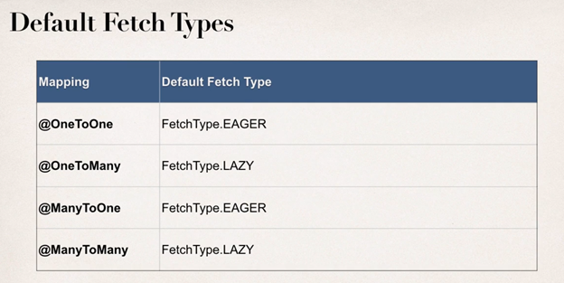

### 3. Eager vs Lazy Loading - Coding - Eager

Instructor

```java

	@OneToMany(fetch=FetchType.LAZY,
			   mappedBy="instructor",
			   cascade= {CascadeType.PERSIST, CascadeType.MERGE,
						 CascadeType.DETACH, CascadeType.REFRESH})
	private List<Course> courses;


	public Instructor() {
```

```java
package com.luv2code.hibernate.demo;

import org.hibernate.Session;
import org.hibernate.SessionFactory;
import org.hibernate.cfg.Configuration;

import com.luv2code.hibernate.demo.entity.Course;
import com.luv2code.hibernate.demo.entity.Instructor;
import com.luv2code.hibernate.demo.entity.InstructorDetail;

public class EagerLazyDemo {

	public static void main(String[] args) {

		// create session factory
		SessionFactory factory = new Configuration()
								.configure("hibernate.cfg.xml")
								.addAnnotatedClass(Instructor.class)
								.addAnnotatedClass(InstructorDetail.class)
								.addAnnotatedClass(Course.class)
								.buildSessionFactory();

		// create session
		Session session = factory.getCurrentSession();

		try {

			// start a transaction
			session.beginTransaction();

			// get the instructor from db
			int theId = 1;
			Instructor tempInstructor = session.get(Instructor.class, theId);

			System.out.println("luv2code: Instructor: " + tempInstructor);

			System.out.println("luv2code: Courses: " + tempInstructor.getCourses());

			// commit transaction
			session.getTransaction().commit();

			// close the session
			session.close();

			System.out.println("\nluv2code: The session is now closed!\n");

			// option 1: call getter method while session is open

			// get courses for the instructor
			System.out.println("luv2code: Courses: " + tempInstructor.getCourses());

			System.out.println("luv2code: Done!");
		}
		finally {

			// add clean up code
			session.close();

			factory.close();
		}
	}

}


```

### 4. Eager vs Lazy Loading - Coding - Lazy

Debug moi thay duoc khi co get ra no moi query

### 5. Eager vs Lazy Loading - Coding - Closing the Session

Dat `session.close();` truoc getCourse => exception

### 6. Eager vs Lazy Loading - Coding - Resolve Lazy Loading Issue

Option 1:

```java
      // get truoc 1 lan
			System.out.println("luv2code: Courses: " + tempInstructor.getCourses());

			// commit transaction
			session.getTransaction().commit();

			// close the session
			session.close();

			System.out.println("\nluv2code: The session is now closed!\n");

			// option 1: call getter method while session is open

			// get courses for the instructor
			System.out.println("luv2code: Courses: " + tempInstructor.getCourses());
```

### 7. Eager vs Lazy Loading - Coding - HQL JOIN FETCH

Option 2:

```java
package com.luv2code.hibernate.demo;

import org.hibernate.Session;
import org.hibernate.SessionFactory;
import org.hibernate.cfg.Configuration;
import org.hibernate.query.Query;

import com.luv2code.hibernate.demo.entity.Course;
import com.luv2code.hibernate.demo.entity.Instructor;
import com.luv2code.hibernate.demo.entity.InstructorDetail;

public class FetchJoinDemo {

	public static void main(String[] args) {

		// create session factory
		SessionFactory factory = new Configuration()
								.configure("hibernate.cfg.xml")
								.addAnnotatedClass(Instructor.class)
								.addAnnotatedClass(InstructorDetail.class)
								.addAnnotatedClass(Course.class)
								.buildSessionFactory();

		// create session
		Session session = factory.getCurrentSession();

		try {

			// start a transaction
			session.beginTransaction();

			// option 2: Hibernate query with HQL

			// get the instructor from db
			int theId = 1;

			Query<Instructor> query =
					session.createQuery("select i from Instructor i "
									+ "JOIN FETCH i.courses "
									+ "where i.id=:theInstructorId",
							Instructor.class);

			// set parameter on query
			query.setParameter("theInstructorId", theId);

			// execute query and get instructor
			Instructor tempInstructor = query.getSingleResult();

			System.out.println("luv2code: Instructor: " + tempInstructor);

			// commit transaction
			session.getTransaction().commit();

			// close the session
			session.close();

			System.out.println("\nluv2code: The session is now closed!\n");

			// get courses for the instructor
			System.out.println("luv2code: Courses: " + tempInstructor.getCourses());

			System.out.println("luv2code: Done!");
		}
		finally {

			// add clean up code
			session.close();

			factory.close();
		}
	}

}


```

=> Get all course and instructor

### 8. FAQ How to load the courses at a later time in the application.html

FAQ: How load the courses at a later time in the application?

Question
I've watched your 2 solutions for loading related data after session closing. Both, either getting related courses before closing session and using JOIN FETCH seem to be negating of lazy loading (using those solutions we completely resign of lazy loading.

Is there any good solution to load these data somewhere else in the app? Should I open new session?

---

Answer
Yes, you can load it later with using a new session, just make use of HQL

Here's the code snippet. Make note of HQL in bold

```java
    session = factory.getCurrentSession();

    session.beginTransaction();

    // get courses for a given instructor
    Query<Course> query = session.createQuery("select c from Course c " + "where c.instructor.id=:theInstructorId",  Course.class);

    query.setParameter("theInstructorId", theId);

    List<Course> tempCourses = query.getResultList();

    System.out.println("tempCourses: " + tempCourses);

```

---

Here's the full example.

:-)

---

```java
package com.luv2code.hibernate.demo;

import java.util.List;

import org.hibernate.Session;
import org.hibernate.SessionFactory;
import org.hibernate.cfg.Configuration;
import org.hibernate.query.Query;

import com.luv2code.hibernate.demo.entity.Course;
import com.luv2code.hibernate.demo.entity.Instructor;
import com.luv2code.hibernate.demo.entity.InstructorDetail;

public class GetCoursesLater {

    public static void main(String[] args) {

        // create session factory
        SessionFactory factory = new Configuration()
          .configure("hibernate.cfg.xml")
          .addAnnotatedClass(Instructor.class)
          .addAnnotatedClass(InstructorDetail.class)
          .addAnnotatedClass(Course.class)
          .buildSessionFactory();

        // create session
        Session session = factory.getCurrentSession();

        try {

            // start a transaction
            session.beginTransaction();

            // get the instructor from db
            int theId = 1;
            Instructor tempInstructor = session.get(Instructor.class, theId);

            System.out.println("luv2code: Instructor: " + tempInstructor);

            // commit transaction
            session.getTransaction().commit();

            // close the session
            session.close();

            System.out.println("\nluv2code: The session is now closed!\n");

            //
            // THIS HAPPENS SOMEWHERE ELSE / LATER IN THE PROGRAM

            // YOU NEED TO GET A NEW SESSION
            //

            System.out.println("\n\nluv2code: Opening a NEW session \n");

            session = factory.getCurrentSession();

            session.beginTransaction();

            // get courses for a given instructor
            Query<Course> query = session.createQuery("select c from Course c "                 + "where c.instructor.id=:theInstructorId",         Course.class);

            query.setParameter("theInstructorId", theId);

            List<Course> tempCourses = query.getResultList();

            System.out.println("tempCourses: " + tempCourses);

            // now assign to instructor object in memory
            tempInstructor.setCourses(tempCourses);

            System.out.println("luv2code: Courses: " + tempInstructor.getCourses());

            session.getTransaction().commit();

            System.out.println("luv2code: Done!");
        }
        finally {

            // add clean up code
            session.close();

            factory.close();
        }
    }

}

```

## 26. Hibernate Advanced Mappings - @OneToMany - Unidirectional

@JoinColumn o table Course

### 1. @OneToMany - Uni-Directional - Overview - Part 1

### 2. @OneToMany - Uni-Directional - Overview - Part 2

### 3. FAQ @JoinColumn ... where does it find the column.html

@JoinColum ... where does it find the column?

Question

In the Course class,we have OneToMany relation with reviews with join column course_id.

But in course table we do not have column course_id.

Ideally when we say @JoinColumn a new column should be created in course table ... isn't it?

How does @JoinColum know where to find the join column?

---

Answer

The JoinColumn is actually fairly complex and it goes through a number of advanced steps to find the desired column.

This info below is from the documentation

Source: http://docs.oracle.com/javaee/7/api/javax/persistence/JoinColumn.html#name--

---

The table in which it is found depends upon the context.

- If the join is for a OneToOne or ManyToOne mapping using a foreign key mapping strategy, the foreign key column is in the table of the source entity or embeddable.

- If the join is for a unidirectional OneToMany mapping using a foreign key mapping strategy, the foreign key is in the table of the target entity.

- If the join is for a ManyToMany mapping or for a OneToOne or bidirectional ManyToOne/OneToMany mapping using a join table, the foreign key is in a join table.

- If the join is for an element collection, the foreign key is in a collection table.

--

So as you can see, it depends on the context.

In our training video, we are using @OneToMany uni-directional (course has one-to-many reviews).

As a result, the join column / foreign key column is in the target entity. In this case, the target entity is the Review class. So, you will find the join column "course_id" in the "review" table.

### 4. @OneToMany - Uni-Directional - Set up database tables

### 5. @OneToMany - Uni-Directional - Create Review Class

```java
package com.luv2code.hibernate.demo.entity;

import javax.persistence.Column;
import javax.persistence.Entity;
import javax.persistence.GeneratedValue;
import javax.persistence.GenerationType;
import javax.persistence.Id;
import javax.persistence.Table;

@Entity
@Table(name="review")
public class Review {

	// define fields

	// define constructors

	// define getter/setters

	// define tostring

	// annotate fields

	@Id
	@GeneratedValue(strategy=GenerationType.IDENTITY)
	@Column(name="id")
	private int id;

	@Column(name="comment")
	private String comment;

	public Review() {

	}

	public Review(String comment) {
		this.comment = comment;
	}

	public int getId() {
		return id;
	}

	public void setId(int id) {
		this.id = id;
	}

	public String getComment() {
		return comment;
	}

	public void setComment(String comment) {
		this.comment = comment;
	}

	@Override
	public String toString() {
		return "Review [id=" + id + ", comment=" + comment + "]";
	}

}

```

### 6. @OneToMany - Uni-Directional - Configure Fetch Type

```java

	@OneToMany(fetch=FetchType.LAZY, cascade=CascadeType.ALL)
	@JoinColumn(name="course_id")
	private List<Review> reviews;

	public Course() {

	}

  public List<Review> getReviews() {
		return reviews;
	}

	public void setReviews(List<Review> reviews) {
		this.reviews = reviews;
	}

	// add a convenience method

	public void addReview(Review theReview) {

		if (reviews == null) {
			reviews = new ArrayList<>();
		}

		reviews.add(theReview);
	}

```

### 7. @OneToMany - Uni-Directional - Create Course Reviews

```java
package com.luv2code.hibernate.demo;

import org.hibernate.Session;
import org.hibernate.SessionFactory;
import org.hibernate.cfg.Configuration;

import com.luv2code.hibernate.demo.entity.Course;
import com.luv2code.hibernate.demo.entity.Instructor;
import com.luv2code.hibernate.demo.entity.InstructorDetail;
import com.luv2code.hibernate.demo.entity.Review;

public class CreateCourseAndReviewsDemo {

	public static void main(String[] args) {

		// create session factory
		SessionFactory factory = new Configuration()
								.configure("hibernate.cfg.xml")
								.addAnnotatedClass(Instructor.class)
								.addAnnotatedClass(InstructorDetail.class)
								.addAnnotatedClass(Course.class)
								.addAnnotatedClass(Review.class) // add
								.buildSessionFactory();

		// create session
		Session session = factory.getCurrentSession();

		try {

			// start a transaction
			session.beginTransaction();


			// create a course
			Course tempCourse = new Course("Pacman - How To Score One Million Points");

			// add some reviews
			tempCourse.addReview(new Review("Great course ... loved it!"));
			tempCourse.addReview(new Review("Cool course, job well done"));
			tempCourse.addReview(new Review("What a dumb course, you are an idiot!"));

			// save the course ... and leverage the cascade all :-)
			System.out.println("Saving the course");
			System.out.println(tempCourse);
			System.out.println(tempCourse.getReviews());

			session.save(tempCourse);

			// commit transaction
			session.getTransaction().commit();

			System.out.println("Done!");
		}
		finally {

			// add clean up code
			session.close();

			factory.close();
		}
	}

}

```

### 8. @OneToMany - Uni-Directional - Get Course Reviews

GetCourseAndReviewsDemo

```java
try {

			// start a transaction
			session.beginTransaction();

			// get the course
			int theId = 10;
			Course tempCourse = session.get(Course.class, theId);

			// print the course
			System.out.println(tempCourse);

			// print the course reviews
			System.out.println(tempCourse.getReviews());

			// commit transaction
			session.getTransaction().commit();

			System.out.println("Done!");
		}
```

### 9. @OneToMany - Uni-Directional - Delete Course Reviews

DeleteCourseAndReviewsDemo

```java
try {

			// start a transaction
			session.beginTransaction();

			// get the course
			int theId = 10;
			Course tempCourse = session.get(Course.class, theId);

			// print the course
			System.out.println("Deleting the course ... ");
			System.out.println(tempCourse);

			// print the course reviews
			System.out.println(tempCourse.getReviews());

			// delete the course
			session.delete(tempCourse);

			// commit transaction
			session.getTransaction().commit();

			System.out.println("Done!");
		}
```

## 27. Hibernate Advanced Mappings - @ManyToMany

### 1. @ManyToMany - Overview - Part 1

Course

```java
@JoinTable(
			name="course_student",
			joinColumns=@JoinColumn(name="course_id"),
			inverseJoinColumns=@JoinColumn(name="student_id")
			)
	private List<Student> students;

	// add a convenience method

	public void addStudent(Student theStudent) {

		if (students == null) {
			students = new ArrayList<>();
		}

		students.add(theStudent);
	}
```

### 2. @ManyToMany - Overview - Part 2

### 3. @ManyToMany - Set up database tables

create table course_student

### 4. @ManyToMany - Update Course class

### 5. @ManyToMany - Configure Course for many-to-many

Student

```java
@ManyToMany(fetch=FetchType.LAZY,
			cascade= {CascadeType.PERSIST, CascadeType.MERGE,
			 CascadeType.DETACH, CascadeType.REFRESH})
	@JoinTable(
			name="course_student",
			joinColumns=@JoinColumn(name="student_id"),
			inverseJoinColumns=@JoinColumn(name="course_id")
			)
	private List<Course> courses;
```

### 6. @ManyToMany - Configure Student for many-to-many

### 7. @ManyToMany - Create a Main App

```java
package com.luv2code.hibernate.demo;

import org.hibernate.Session;
import org.hibernate.SessionFactory;
import org.hibernate.cfg.Configuration;

import com.luv2code.hibernate.demo.entity.Course;
import com.luv2code.hibernate.demo.entity.Instructor;
import com.luv2code.hibernate.demo.entity.InstructorDetail;
import com.luv2code.hibernate.demo.entity.Review;
import com.luv2code.hibernate.demo.entity.Student;

public class CreateCourseAndStudentsDemo {

	public static void main(String[] args) {

		// create session factory
		SessionFactory factory = new Configuration()
								.configure("hibernate.cfg.xml")
								.addAnnotatedClass(Instructor.class)
								.addAnnotatedClass(InstructorDetail.class)
								.addAnnotatedClass(Course.class)
								.addAnnotatedClass(Review.class)
								.addAnnotatedClass(Student.class)
								.buildSessionFactory();

		// create session
		Session session = factory.getCurrentSession();

		try {

			// start a transaction
			session.beginTransaction();

			// create a course
			Course tempCourse = new Course("Pacman - How To Score One Million Points");

			// save the course
			System.out.println("\nSaving the course ...");
			session.save(tempCourse);
			System.out.println("Saved the course: " + tempCourse);

			// create the students
			Student tempStudent1 = new Student("John", "Doe", "john@luv2code.com");
			Student tempStudent2 = new Student("Mary", "Public", "mary@luv2code.com");

			// add students to the course
			tempCourse.addStudent(tempStudent1);
			tempCourse.addStudent(tempStudent2);

			// save the students
			System.out.println("\nSaving students ...");
			session.save(tempStudent1);
			session.save(tempStudent2);
			System.out.println("Saved students: " + tempCourse.getStudents());

			// commit transaction
			session.getTransaction().commit();

			System.out.println("Done!");
		}
		finally {

			// add clean up code
			session.close();

			factory.close();
		}
	}

}


```

### 8. @ManyToMany - Review app output

### 9. @ManyToMany - Add more courses for a student

```java
package com.luv2code.hibernate.demo;

import org.hibernate.Session;
import org.hibernate.SessionFactory;
import org.hibernate.cfg.Configuration;

import com.luv2code.hibernate.demo.entity.Course;
import com.luv2code.hibernate.demo.entity.Instructor;
import com.luv2code.hibernate.demo.entity.InstructorDetail;
import com.luv2code.hibernate.demo.entity.Review;
import com.luv2code.hibernate.demo.entity.Student;

public class AddCoursesForMaryDemo {

	public static void main(String[] args) {

		// create session factory
		SessionFactory factory = new Configuration()
								.configure("hibernate.cfg.xml")
								.addAnnotatedClass(Instructor.class)
								.addAnnotatedClass(InstructorDetail.class)
								.addAnnotatedClass(Course.class)
								.addAnnotatedClass(Review.class)
								.addAnnotatedClass(Student.class)
								.buildSessionFactory();

		// create session
		Session session = factory.getCurrentSession();

		try {

			// start a transaction
			session.beginTransaction();

			// get the student mary from database
			int studentId = 2;
			Student tempStudent = session.get(Student.class, studentId);

			System.out.println("\nLoaded student: " + tempStudent);
			System.out.println("Courses: " + tempStudent.getCourses());

			// create more courses
			Course tempCourse1 = new Course("Rubik's Cube - How to Speed Cube");
			Course tempCourse2 = new Course("Atari 2600 - Game Development");

			// add student to courses
			tempCourse1.addStudent(tempStudent);
			tempCourse2.addStudent(tempStudent);

			// save the courses
			System.out.println("\nSaving the courses ...");

			session.save(tempCourse1);
			session.save(tempCourse2);

			// commit transaction
			session.getTransaction().commit();

			System.out.println("Done!");
		}
		finally {

			// add clean up code
			session.close();

			factory.close();
		}
	}

}


```

### 10. @ManyToMany - Verify Data in Join Table

### 11. @ManyToMany - Get Courses for Student

```java
try {

			// start a transaction
			session.beginTransaction();

			// get the student from database
			int studentId = 1;
			Student tempStudent = session.get(Student.class, studentId);

			System.out.println("\nLoaded student: " + tempStudent);
			System.out.println("Courses: " + tempStudent.getCourses());

			// commit transaction
			session.getTransaction().commit();

			System.out.println("Done!");
		}
```

### 12. @ManyToMany - Delete a Course

```java
try {

			// start a transaction
			session.beginTransaction();

			// get the pacman course from db
			int courseId = 10;
			Course tempCourse = session.get(Course.class, courseId);

			// delete the course
			System.out.println("Deleting course: " + tempCourse);

			session.delete(tempCourse);

			// commit transaction
			session.getTransaction().commit();

			System.out.println("Done!");
		}
```

### 13. @ManyToMany - Delete a Student

```java
try {

			// start a transaction
			session.beginTransaction();

			// get the student from database
			int studentId = 2;
			Student tempStudent = session.get(Student.class, studentId);

			System.out.println("\nLoaded student: " + tempStudent);
			System.out.println("Courses: " + tempStudent.getCourses());

			// delete student
			System.out.println("\nDeleting student: " + tempStudent);
			session.delete(tempStudent);

			// commit transaction
			session.getTransaction().commit();

			System.out.println("Done!");
		}
```

## 28. Build a Database Web App - Spring MVC and Hibernate Project - Part 1

### 1. Project Overview and Demo

### 2. Source Files for Spring MVC + Hibernate Web App.html

Source Files for Spring MVC + Hibernate Web App

In the following videos, you will need to use some starter files. The starter files include SQL scripts and JAR files.

The files are attached to each video. However, if you'd like, you can also download the entire bundle.

---

You can download the entire source code bundle from this link:

Section 1, Lecture 5
https://www.udemy.com/spring-hibernate-tutorial/learn/v4/t/lecture/5117038?start=0

Once you upzip, then you'll have this directory structure.

---

--

Then you can find the files that I use in this directory:

spring-hibernate-source-code-vXX/04-spring-mvc-crud/sql-scripts

and

spring-hibernate-source-code-vXX/04-spring-mvc-crud/web-customer-tracker-starter-files

Regarding the JAR files, they are in

spring-hibernate-source-code-vXX/04-spring-mvc-crud/web-customer-tracker-starter-files/WebContent/WEB-INF/lib

this directory includes commons-logging, jstl and mysql jdbc driver

---

You will still need to add the Spring and Hibernate files separately, but we'll cover that process in later videos. I'll walk you through the process.

### 3. Set up Sample Data for Database

pdf
scripts

```sql
CREATE USER 'springstudent'@'localhost' IDENTIFIED BY 'springstudent';

GRANT ALL PRIVILEGES ON * . * TO 'springstudent'@'localhost';

#
# Starting with MySQL 8.0.4, the MySQL team changed the
# default authentication plugin for MySQL server
# from mysql_native_password to caching_sha2_password.
#
# The command below will make the appropriate updates for your user account.
#
# See the MySQL Reference Manual for details:
# https://dev.mysql.com/doc/refman/8.0/en/caching-sha2-pluggable-authentication.html
#
ALTER USER 'springstudent'@'localhost' IDENTIFIED WITH mysql_native_password BY 'springstudent';
```

Create table customer

### 4. Test Database Connection - Part 1

Copy jdbc connector tolib folder
File new dynamic project/
create package testdb
File new Servlet TestDbServlet

```java
package com.luv2code.testdb;

import java.io.IOException;
import java.io.PrintWriter;

import javax.servlet.ServletException;
import javax.servlet.annotation.WebServlet;
import javax.servlet.http.HttpServlet;
import javax.servlet.http.HttpServletRequest;
import javax.servlet.http.HttpServletResponse;

import java.sql.*;

/**
 * Servlet implementation class TestDbServlet
 */
@WebServlet("/TestDbServlet")
public class TestDbServlet extends HttpServlet {
	private static final long serialVersionUID = 1L;

	/**
	 * @see HttpServlet#doGet(HttpServletRequest request, HttpServletResponse response)
	 */
	protected void doGet(HttpServletRequest request, HttpServletResponse response) throws ServletException, IOException {

		// setup connection variables
		String user = "springstudent";
		String pass = "springstudent";

		String jdbcUrl = "jdbc:mysql://localhost:3306/web_customer_tracker?useSSL=false&serverTimezone=UTC";
		// Update for mySQL 8
		String driver = "com.mysql.cj.jdbc.Driver";

		// get connection to database
		try {
			PrintWriter out = response.getWriter();

			out.println("Connecting to database: " + jdbcUrl);

			Class.forName(driver);

			Connection myConn = DriverManager.getConnection(jdbcUrl, user, pass);

			out.println("SUCCESS!!!");

			myConn.close();

		}
		catch (Exception exc) {
			exc.printStackTrace();
			throw new ServletException(exc);
		}


	}

}


```

run url: http://localhost:8080/web-custom-tracker/TestDbServlet

### 5. Test Database Connection - Part 2

file word and pdf

### 6. Set Up Dev Environment - Part 1

### 7. HEADS UP - FOR JAVA 9 and higher USERS - Spring MVC CRUD.html

JAVA 9 and higher HEADS UP- SPRING MVC CRUD
For Java 9 and higher, you need to additional JAR files.
You need to download the following JAR files:
javax.activation-1.2.0.jar
jaxb-api-2.3.0.jar
jaxb-core-2.3.0.jar
jaxb-impl-2.3.0.jar

---

1. Download the files using links below:
   javax.activation-1.2.0.jar
   jaxb-api-2.3.0.jar
   jaxb-core-2.3.0.jar
   jaxb-impl-2.3.0.jar

---

2. Copy the JAR files to the WEB-INF/lib folder of your project
   Clean project => start TOMCAT
   Run: http://localhost:8080/web-custom-tracker/customer/list

### 8. Set Up Dev Environment - Part 2

Configuration for Spring + Hibernate

1. Define database dataSource / connection pool
2. Setup Hibernate session factory
3. Setup Hibernate transaction manager
4. Enable configuration of transactional annotations

Config connection pool
spring-mvc-crud-demo-servlet.xml

```xml
<?xml version="1.0" encoding="UTF-8"?>
<beans xmlns="http://www.springframework.org/schema/beans"
	xmlns:xsi="http://www.w3.org/2001/XMLSchema-instance"
	xmlns:context="http://www.springframework.org/schema/context"
    xmlns:tx="http://www.springframework.org/schema/tx"
	xmlns:mvc="http://www.springframework.org/schema/mvc"
	xsi:schemaLocation="
		http://www.springframework.org/schema/beans
		http://www.springframework.org/schema/beans/spring-beans.xsd
		http://www.springframework.org/schema/context
		http://www.springframework.org/schema/context/spring-context.xsd
		http://www.springframework.org/schema/mvc
		http://www.springframework.org/schema/mvc/spring-mvc.xsd
		http://www.springframework.org/schema/tx
		http://www.springframework.org/schema/tx/spring-tx.xsd">

	<!-- Add support for component scanning -->
	<context:component-scan base-package="com.luv2code.springdemo" />

	<!-- Add support for conversion, formatting and validation support -->
	<mvc:annotation-driven/>

	<!-- Define Spring MVC view resolver -->
	<bean
		class="org.springframework.web.servlet.view.InternalResourceViewResolver">
		<property name="prefix" value="/WEB-INF/view/" />
		<property name="suffix" value=".jsp" />
	</bean>

    <!-- Step 1: Define Database DataSource / connection pool -->
	<bean id="myDataSource" class="com.mchange.v2.c3p0.ComboPooledDataSource"
          destroy-method="close">
        <property name="driverClass" value="com.mysql.cj.jdbc.Driver" />
        <property name="jdbcUrl" value="jdbc:mysql://localhost:3306/web_customer_tracker?useSSL=false&amp;serverTimezone=UTC" />
        <property name="user" value="springstudent" />
        <property name="password" value="springstudent" />

        <!-- these are connection pool properties for C3P0 -->
        <property name="minPoolSize" value="5" />
        <property name="maxPoolSize" value="20" />
        <property name="maxIdleTime" value="30000" />
	</bean>

    <!-- Step 2: Setup Hibernate session factory -->
	<bean id="sessionFactory"
		class="org.springframework.orm.hibernate5.LocalSessionFactoryBean">
		<property name="dataSource" ref="myDataSource" />
		<property name="packagesToScan" value="com.luv2code.springdemo.entity" />
		<property name="hibernateProperties">
		   <props>
		      <prop key="hibernate.dialect">org.hibernate.dialect.MySQLDialect</prop>
		      <prop key="hibernate.show_sql">true</prop>
		   </props>
		</property>
   </bean>

    <!-- Step 3: Setup Hibernate transaction manager -->
	<bean id="myTransactionManager"
            class="org.springframework.orm.hibernate5.HibernateTransactionManager">
        <property name="sessionFactory" ref="sessionFactory"/>
    </bean>

    <!-- Step 4: Enable configuration of transactional behavior based on annotations -->
	<tx:annotation-driven transaction-manager="myTransactionManager" />

</beans>


```

### 9. Set Up Dev Environment - Part 3

Spring

```xml
<!-- Add support for component scanning -->
	<context:component-scan base-package="com.luv2code.springdemo" />

	<!-- Add support for conversion, formatting and validation support -->
	<mvc:annotation-driven/>

	<!-- Define Spring MVC view resolver -->
	<bean
		class="org.springframework.web.servlet.view.InternalResourceViewResolver">
		<property name="prefix" value="/WEB-INF/view/" />
		<property name="suffix" value=".jsp" />
	</bean>
```

### 10. Test Spring MVC Controller - Part 1

### 11. Test Spring MVC Controller - Part 2

```java
package com.luv2code.springdemo.controller;

import org.springframework.stereotype.Controller;
import org.springframework.ui.Model;
import org.springframework.web.bind.annotation.RequestMapping;

@Controller
@RequestMapping("/customer")
public class CustomerController {

	@RequestMapping("/list")
	public String listCustomers(Model theModel) {

		return "list-customers";
	}

}


```

Clean project => start TOMCAT
Run: http://localhost:8080/web-custom-tracker/customer/list

## 30. Build a Database Web App - Spring MVC and Hibernate Project - Part 2

### 1. List Customers - Overview

### 2. List Customers - Overview of Development Process

### 3. List Customers - Creating Hibernate Entity - Part 1

```java
package com.luv2code.springdemo.entity;

import javax.persistence.Column;
import javax.persistence.Entity;
import javax.persistence.GeneratedValue;
import javax.persistence.GenerationType;
import javax.persistence.Id;
import javax.persistence.Table;

@Entity
@Table(name="customer")
public class Customer {

	@Id
	@GeneratedValue(strategy=GenerationType.IDENTITY)
	@Column(name="id")
	private int id;

	@Column(name="first_name")
	private String firstName;

	@Column(name="last_name")
	private String lastName;

	@Column(name="email")
	private String email;

	public Customer() {

	}

	public int getId() {
		return id;
	}

	public void setId(int id) {
		this.id = id;
	}

	public String getFirstName() {
		return firstName;
	}

	public void setFirstName(String firstName) {
		this.firstName = firstName;
	}

	public String getLastName() {
		return lastName;
	}

	public void setLastName(String lastName) {
		this.lastName = lastName;
	}

	public String getEmail() {
		return email;
	}

	public void setEmail(String email) {
		this.email = email;
	}

	@Override
	public String toString() {
		return "Customer [id=" + id + ", firstName=" + firstName + ", lastName=" + lastName + ", email=" + email + "]";
	}

}


```

### 4. List Customers - Creating Hibernate Entity - Part 2

### 5. List Customers - Developing Hibernate DAO - Overview - Part 1

### 6. List Customers - Developing Hibernate DAO - Overview - Part 2

### 7. List Customers - Developing Hibernate DAO - Write Some Code - Part 1

### 8. List Customers - Developing Hibernate DAO - Write Some Code - Part 2

```java
package com.luv2code.springdemo.dao;

import java.util.List;

import org.hibernate.Session;
import org.hibernate.SessionFactory;
import org.hibernate.query.Query;
import org.springframework.beans.factory.annotation.Autowired;
import org.springframework.stereotype.Repository;
import org.springframework.transaction.annotation.Transactional;

import com.luv2code.springdemo.entity.Customer;

@Repository
public class CustomerDAOImpl implements CustomerDAO {

	// need to inject the session factory
	@Autowired
	private SessionFactory sessionFactory;

	@Override
	@Transactional
	public List<Customer> getCustomers() {

		// get the current hibernate session
		Session currentSession = sessionFactory.getCurrentSession();

		// create a query
		Query<Customer> theQuery =
				currentSession.createQuery("from Customer", Customer.class);

		// execute query and get result list
		List<Customer> customers = theQuery.getResultList();

		// return the results
		return customers;
	}

}


```

### 9. List Customers - Injecting DAO into Controller

```java
package com.luv2code.springdemo.controller;

import java.util.List;

import org.springframework.beans.factory.annotation.Autowired;
import org.springframework.stereotype.Controller;
import org.springframework.ui.Model;
import org.springframework.web.bind.annotation.RequestMapping;

import com.luv2code.springdemo.dao.CustomerDAO;
import com.luv2code.springdemo.entity.Customer;

@Controller
@RequestMapping("/customer")
public class CustomerController {

	// need to inject the customer dao
	@Autowired
	private CustomerDAO customerDAO;

	@RequestMapping("/list")
	public String listCustomers(Model theModel) {

		// get customers from the dao
		List<Customer> theCustomers = customerDAO.getCustomers();

		// add the customers to the model
		theModel.addAttribute("customers", theCustomers);

		return "list-customers";
	}

}


```

### 10. List Customers - Developing JSP View Page

Run: http://localhost:8080/web-custom-tracker/customer/list

```ts
<%@ taglib uri="http://java.sun.com/jsp/jstl/core" prefix="c" %>

<!DOCTYPE html>

<html>

<head>
	<title>List Customers</title>

	<!-- reference our style sheet -->

	<link type="text/css"
		  rel="stylesheet"
		  href="${pageContext.request.contextPath}/resources/css/style.css" />

</head>

<body>

	<div id="wrapper">
		<div id="header">
			<h2>CRM - Customer Relationship Manager</h2>
		</div>
	</div>

	<div id="container">

		<div id="content">

			<!--  add our html table here -->

			<table>
				<tr>
					<th>First Name</th>
					<th>Last Name</th>
					<th>Email</th>
				</tr>

				<!-- loop over and print our customers -->
				<c:forEach var="tempCustomer" items="${customers}">

					<tr>
						<td> ${tempCustomer.firstName} </td>
						<td> ${tempCustomer.lastName} </td>
						<td> ${tempCustomer.email} </td>
					</tr>

				</c:forEach>

			</table>

		</div>

	</div>


</body>

</html>


```

### 11. Making it Pretty with CSS - Overview

Create resource folder in WEBCONTENT

```xml
	<!-- Add support for reading web resources: css, images, js, etc ... -->
	<mvc:resources location="/resources/" mapping="/resources/**"></mvc:resources>
```

reference our style sheet in JSP page

```ts
<!-- reference our style sheet -->

	<link type="text/css"
		  rel="stylesheet"
		  href="${pageContext.request.contextPath}/resources/css/style.css" />
```

### 12. Making it Pretty with CSS - Write Some Code - Part 1

### 13. Making it Pretty with CSS - Write Some Code - Part 2

### 14. Adding a Welcome File

Create file index.jsp in WEBCONTENT

```ts
<% response.sendRedirect("customer/list"); %>
```


## 30. Build a Database Web App - Spring MVC and Hibernate Project - Part 3

### 1. Refactor @GetMapping and @PostMapping - Overview

### 2. Refactor @GetMapping and @PostMapping - Write Some Code
```java
@GetMapping("/list")
	public String listCustomers(Model theModel) {
```
### 3. Refactor Add a Service Layer - Overview

### 4. Refactor Add a Service Layer - Write Some Code - Part 1
CustomerServiceImpl
```java
package com.luv2code.springdemo.service;

import java.util.List;

import org.springframework.beans.factory.annotation.Autowired;
import org.springframework.stereotype.Service;
import org.springframework.transaction.annotation.Transactional;

import com.luv2code.springdemo.dao.CustomerDAO;
import com.luv2code.springdemo.entity.Customer;

@Service
public class CustomerServiceImpl implements CustomerService {

	// need to inject customer dao
	@Autowired
	private CustomerDAO customerDAO;
	
	@Override
	@Transactional
	public List<Customer> getCustomers() {
		return customerDAO.getCustomers();
	}
}

```
Controller
```java
// need to inject our customer service
	@Autowired
	private CustomerService customerService;
```
### 5. Refactor Add a Service Layer - Write Some Code - Part 2

## 31. Build a Database Web App - Spring MVC and Hibernate Project - Part 4

### 1. Add Customer - Overview

### 2. Add Customer - Setting up the Add Button - Part 1
Call Controller
```ts
<!-- put new button: Add Customer -->
		
			<input type="button" value="Add Customer"
				   onclick="window.location.href='showFormForAdd'; return false;"
				   class="add-button"
			/>
```
### 3. Add Customer - Setting up the Add Button - Part 2
```java
@GetMapping("/showFormForAdd")
	public String showFormForAdd(Model theModel) {
		
		// create model attribute to bind form data
		Customer theCustomer = new Customer();
		
		theModel.addAttribute("customer", theCustomer);
		
		return "customer-form";
	}
```
### 4. Add Customer - Creating the HTML Form - Part 1
customer-form.jsp
```ts
<%@ taglib prefix="form" uri="http://www.springframework.org/tags/form" %>

<!DOCTYPE html>
<html>

<head>
	<title>Save Customer</title>

	<link type="text/css"
		  rel="stylesheet"
		  href="${pageContext.request.contextPath}/resources/css/style.css">

	<link type="text/css"
		  rel="stylesheet"
		  href="${pageContext.request.contextPath}/resources/css/add-customer-style.css">
</head>

<body>
	
	<div id="wrapper">
		<div id="header">
			<h2>CRM - Customer Relationship Manager</h2>
		</div>
	</div>

	<div id="container">
		<h3>Save Customer</h3>
	
		<form:form action="saveCustomer" modelAttribute="customer" method="POST">
		
			<table>
				<tbody>
					<tr>
						<td><label>First name:</label></td>
						<td><form:input path="firstName" /></td>
					</tr>
				
					<tr>
						<td><label>Last name:</label></td>
						<td><form:input path="lastName" /></td>
					</tr>

					<tr>
						<td><label>Email:</label></td>
						<td><form:input path="email" /></td>
					</tr>

					<tr>
						<td><label></label></td>
						<td><input type="submit" value="Save" class="save" /></td>
					</tr>

				
				</tbody>
			</table>
		
		
		</form:form>
	
		<div style="clear; both;"></div>
		
		<p>
			<a href="${pageContext.request.contextPath}/customer/list">Back to List</a>
		</p>
	
	</div>

</body>

</html>


```
### 5. Add Customer - Creating the HTML Form - Part 2

### 6. Add Customer - Creating the HTML Form - Part 3

### 7. Add Customer - Save to Database - Part 1
```java

	@PostMapping("/saveCustomer")
	public String saveCustomer(@ModelAttribute("customer") Customer theCustomer) {
		
		// save the customer using our service
		customerService.saveCustomer(theCustomer);
		
		
		return "redirect:/customer/list";
	}
```

Service
```java
@Override
	@Transactional
	public void saveCustomer(Customer theCustomer) {

		customerDAO.saveCustomer(theCustomer);
	}
```
### 8. Add Customer - Save to Database - Part 2
DAO
```java
@Override
	public void saveCustomer(Customer theCustomer) {

		// get current hibernate session
		Session currentSession = sessionFactory.getCurrentSession();
		
		// save the customer ... finally LOL
		currentSession.save(theCustomer);
		
	}
```
### 9. Sort Customer Data
```java
// create a query  ... sort by last name
		Query<Customer> theQuery = 
				currentSession.createQuery("from Customer order by lastName",
											Customer.class);
```
## 32. Build a Database Web App - Spring MVC and Hibernate Project - Part 5

### 1. Update Customer - Overview

### 2. Update Customer - Creating Update Link
```ts

				<!-- loop over and print our customers -->
				<c:forEach var="tempCustomer" items="${customers}">
				
					<!-- construct an "update" link with customer id -->
					<c:url var="updateLink" value="/customer/showFormForUpdate">
						<c:param name="customerId" value="${tempCustomer.id}" />
					</c:url>					
					
					<tr>
						<td> ${tempCustomer.firstName} </td>
						<td> ${tempCustomer.lastName} </td>
						<td> ${tempCustomer.email} </td>
						
						<td>
							<!-- display the update link -->
							<a href="${updateLink}">Update</a>
						</td>
						
					</tr>
				
				</c:forEach>
```
### 3. Update Customer - Prepopulating the Form - Part 1
```java
@GetMapping("/showFormForUpdate")
	public String showFormForUpdate(@RequestParam("customerId") int theId, Model theModel) {
		
		// get the customer from our service
		Customer theCustomer = customerService.getCustomer(theId);	
		
		// set customer as a model attribute to pre-populate the form
		theModel.addAttribute("customer", theCustomer);
		
		// send over to our form		
		return "customer-form";
	}
```
### 4. Update Customer - Prepopulating the Form - Part 2
DAO
```java
@Override
	public Customer getCustomer(int theId) {

		// get the current hibernate session
		Session currentSession = sessionFactory.getCurrentSession();
		
		// now retrieve/read from database using the primary key
		Customer theCustomer = currentSession.get(Customer.class, theId);
		
		return theCustomer;
	}
```
### 5. Update Customer - Prepopulating the Form - Part 3
Auto fill in form
### 6. Update Customer - Save Customer to Database - Part 1
Update if exist
customer-form.jsp
```ts
<form:form action="saveCustomer" modelAttribute="customer" method="POST">

// add new
<!-- need to associate this data with customer id -->
	<form:hidden path="id" />
```

DAO modify
```java
@Override
	public void saveCustomer(Customer theCustomer) {

		// get current hibernate session
		Session currentSession = sessionFactory.getCurrentSession();
		
		
		// save/upate the customer ... finally LOL
		currentSession.saveOrUpdate(theCustomer);
		
	}
```

add currentSession.saveOrUpdate => update if id != null
### 7. Update Customer - Save Customer to Database - Part 2
test ok
## 33. Build a Database Web App - Spring MVC and Hibernate Project - Part 6

### 1. Delete Customer - Overview

### 2. Delete Customer - Creating Delete Link - Part 1
```ts
<!-- construct an "delete" link with customer id -->
<c:url var="deleteLink" value="/customer/delete">
	<c:param name="customerId" value="${tempCustomer.id}" />
</c:url>	

<td>
	!-- display the update link -->
	<a href="${updateLink}">Update</a>
							|
	<a href="${deleteLink}"
	   onclick="if (!(confirm('Are you sure you want to delete this customer?'))) return false">Delete</a>
	</td>
```
### 3. Delete Customer - Creating Delete Link - Part 2
add confirm method
### 4. Delete Customer - Delete from Database - Part 1
Controller
```java

	@GetMapping("/delete")
	public String deleteCustomer(@RequestParam("customerId") int theId) {
		
		// delete the customer
		customerService.deleteCustomer(theId);
		
		return "redirect:/customer/list";
	}
```
### 5. Delete Customer - Delete from Database - Part 2
DAO
```java

	@Override
	public void deleteCustomer(int theId) {

		// get the current hibernate session
		Session currentSession = sessionFactory.getCurrentSession();
		
		// delete object with primary key
		Query theQuery = 
				currentSession.createQuery("delete from Customer where id=:customerId");
		theQuery.setParameter("customerId", theId);
		
		theQuery.executeUpdate();		
	}
```
### 6. Delete Customer - Delete from Database - Part 3

### 7. FAQ How to Add Search support.html
FAQ: How to add Search features to the App?

A number of students have asked how to add search features to the app? I'll walk through this process.

Basically, we will allow the user to search for a customer by name. We'll add a search box at to the screen and the user can enter a name. On the backend, we'll compare this name to the customer's first name or last name.


Overview of Development Process
1. Create the HTML form
2. Add mapping to the controller
3. Add methods in the service layer to delegate to DAO
4. Add method in the DAO to perfom search

Download Source Code
All of the complete solution code is available for download here. 

http://www.luv2code.com/downloads/udemy-spring-hibernate/crm-tracker-bonus-search.zip

I show you the detailed steps below so you can see what is added to each file.


Detailed Steps

1. Create the HTML form

You need to add a search form to read the user input and submit it to your Spring controller mapping

a. Edit the file: list-customers.jsp

b. We'll need to use Spring FORM tags, so at the  top of the file, add the following taglib reference

<%@ taglib prefix="form" uri="http://www.springframework.org/tags/form" %>

c. Now add a search form right after the search button

            <!--  add a search box -->
            <form:form action="search" method="GET">
                Search customer: <input type="text" name="theSearchName" />
                
                <input type="submit" value="Search" class="add-button" />
            </form:form>

---

2. Add mapping to the controller

You need to add a mapping to handle the search form submission

a. Edit the file: CustomerController.java

b. Add the new mapping and method

    @GetMapping("/search")
    public String searchCustomers(@RequestParam("theSearchName") String theSearchName,
                                    Model theModel) {

        // search customers from the service
        List<Customer> theCustomers = customerService.searchCustomers(theSearchName);
                
        // add the customers to the model
        theModel.addAttribute("customers", theCustomers);

        return "list-customers";        
    }

c. You may have syntax errors on the customerService, but we'll resolve that in the next section.

---

3. Add methods in the service layer to delegate to DAO

You need to add methods in the service layer to delegate calls to the DAO

a. Edit the file: CustomerService.java

b. Add the method declaration

    public List<Customer> searchCustomers(String theSearchName);

c. Edit the file: CustomerServiceImpl.java

d. Add the method:

    @Override
    @Transactional
    public List<Customer> searchCustomers(String theSearchName) {

        return customerDAO.searchCustomers(theSearchName);
    }

e. You may have syntax errors on the customerDAO, but we'll resolve that in the next section.

---

4. Add method in the DAO to perfom search

Now, we'll add methods in the DAO layer to search for a customer by first name or last name

a. Edit the file: CustomerDAO.java

b. Add the method declaration

    public List<Customer> searchCustomers(String theSearchName);

c. Edit the file: CustomerDAOImpl.java

d. Add the method:

    @Override
    public List<Customer> searchCustomers(String theSearchName) {

        // get the current hibernate session
        Session currentSession = sessionFactory.getCurrentSession();
        
        Query theQuery = null;
        
        //
        // only search by name if theSearchName is not empty
        //
        if (theSearchName != null && theSearchName.trim().length() > 0) {

            // search for firstName or lastName ... case insensitive
            theQuery =currentSession.createQuery("from Customer where lower(firstName) like :theName or lower(lastName) like :theName", Customer.class);
            theQuery.setParameter("theName", "%" + theSearchName.toLowerCase() + "%");

        }
        else {
            // theSearchName is empty ... so just get all customers
            theQuery =currentSession.createQuery("from Customer", Customer.class);            
        }
        
        // execute query and get result list
        List<Customer> customers = theQuery.getResultList();
                
        // return the results        
        return customers;
        
    }

In this method, we need to check "theSearchName", this is the user input. We need to make sure it is not empty. If it is not empty then we will use it in the search query.  If it is empty, then we'll just ignore it and simply return all of the customers.

For the condition when "theSearchName" is not empty, then we use it to compare against the first name or last name. We also make use of the "like" clause and the "%" wildcard characters. This will allow us to search for substrings. For example, if we have customers with last name of "Patel", "Patterson" ... then we can search for "Pat" and it will match on those names.  

Also, notice the query uses the lower case version of the values to make a case insensitive search. If you'd like to make a case sensitive search, then simply remove the lower references.

You can read more on the HQL "like" clause here:
http://docs.jboss.org/hibernate/orm/5.2/userguide/html_single/Hibernate_User_Guide.html#hql-like-predicate

---

5. Test the app

Once you've made all of the updates then you can test your application.

The app will now have the search form at the top. You can enter a name to search and they app will give you the desired results.

Congrats!

## 34. AOP Aspect-Oriented Programming Overview

### 1. AOP - The Business Problem

### 2. AOP Solution and AOP Use Cases

### 3. Comparing Spring AOP and AspectJ

## 35. AOP @Before Advice Type

### 1. AOP @Before Advice Overview
using pointcut expression in @Before
### 2. AOP AOP Project Setup

Khong chon beta version to download
After add jar to classpath
http://luv2code.com/download-aspectjweaver  

https://mvnrepository.com/artifact/org.aspectj/aspectjweaver
Sau đó vào buildpath add

### 3. AOP @Before Advice - Write Some Code
```java
package com.luv2code.aopdemo.dao;

import org.springframework.stereotype.Component;

@Component
public class AccountDAO {

	public void addAccount() {
		
		System.out.println(getClass() + ": DOING MY DB WORK: ADDING AN ACCOUNT");
		
	}
}

```

Config
```java
package com.luv2code.aopdemo;

import org.springframework.context.annotation.ComponentScan;
import org.springframework.context.annotation.Configuration;
import org.springframework.context.annotation.EnableAspectJAutoProxy;

@Configuration
@EnableAspectJAutoProxy
@ComponentScan("com.luv2code.aopdemo")
public class DemoConfig {

}

```
### 4. AOP @Before Advice - Add and Test AOP Aspect
```java
package com.luv2code.aopdemo.aspect;

import org.aspectj.lang.annotation.Aspect;
import org.aspectj.lang.annotation.Before;
import org.springframework.stereotype.Component;

@Aspect
@Component
public class MyDemoLoggingAspect {

	// this is where we add all of our related advices for logging
	
	// let's start with an @Before advice

	@Before("execution(public void addAccount())")
	public void beforeAddAccountAdvice() {
		
		System.out.println("\n=====>>> Executing @Before advice on addAccount()");
		
	}
}
```

Main
```java
package com.luv2code.aopdemo;

import org.springframework.context.annotation.AnnotationConfigApplicationContext;

import com.luv2code.aopdemo.dao.AccountDAO;

public class MainDemoApp {

	public static void main(String[] args) {

		// read spring config java class
		AnnotationConfigApplicationContext context =
				new AnnotationConfigApplicationContext(DemoConfig.class);
		
		// get the bean from spring container
		AccountDAO theAccountDAO = context.getBean("accountDAO", AccountDAO.class);
		
		// call the business method
		theAccountDAO.addAccount();

		// do it again!
		System.out.println("\nlet's call it again!\n");
		
		// call the business method again
		theAccountDAO.addAccount();
				
		// close the context
		context.close();
	}

}


```

## 36. AOP Pointcut Expressions - Match Methods and Return Types

### 1. AOP - Pointcut Expressions Overview
solution-code-spring-aop-match-method-basic.zip
### 2. AOP - Pointcut Expressions - Match any addAccount Method - Part 2
```java
package com.luv2code.aopdemo.aspect;

import org.aspectj.lang.annotation.Aspect;
import org.aspectj.lang.annotation.Before;
import org.aspectj.lang.annotation.Pointcut;
import org.springframework.stereotype.Component;

@Aspect
@Component
public class MyDemoLoggingAspect {

	@Before("execution(public void addAccount())")
	public void beforeAddAccountAdvice() {
		
		System.out.println("\n=====>>> Executing @Before advice on method");
		
	}
	
}


```

```java
package com.luv2code.aopdemo;

import org.springframework.context.annotation.AnnotationConfigApplicationContext;

import com.luv2code.aopdemo.dao.AccountDAO;

public class MainDemoApp {

	public static void main(String[] args) {

		// read spring config java class
		AnnotationConfigApplicationContext context =
				new AnnotationConfigApplicationContext(DemoConfig.class);
		
		// get the bean from spring container
		AccountDAO theAccountDAO = context.getBean("accountDAO", AccountDAO.class);
		
		// call the business method
		theAccountDAO.addAccount();

		// do it again!
		System.out.println("\nlet's call it again!\n");
		
		// call the business method again
		theAccountDAO.addAccount();
				
		// close the context
		context.close();
	}

}


```
### 3. AOP - Pointcut Expressions - Match only DAO addAccount - Match any add Method

In eclipse using copy qualified name in class java
```java
@Before("execution(public void com.luv2code.aopdemo.dao.AccountDAO.addAccount())")
	public void beforeAddAccountAdvice() {
		
		System.out.println("\n=====>>> Executing @Before advice on method");
		
	}

// step 2

@Before("execution(public void add*())")
	public void beforeAddAccountAdvice() {
		
		System.out.println("\n=====>>> Executing @Before advice on method");
		
	}
```
### 4. AOP - Pointcut Expressions - Match any Return Type
```java
@Before("execution(* add*())")
	public void beforeAddAccountAdvice() {
		
		System.out.println("\n=====>>> Executing @Before advice on method");
		
	}
```
## 37. AOP Pointcut Expressions - Match Method Parameter Types

### 1. AOP Pointcut Expressions - Match Method Parameter Types Overview

### 2. AOP Pointcut Expressions - Match Method with Account and more Params
```java
@Before("execution(* add*(com.luv2code.aopdemo.Account, ..))")
	public void beforeAddAccountAdvice() {
		
		System.out.println("\n=====>>> Executing @Before advice on method");
		
	}
```
### 3. AOP Pointcut Expressions - Match Method Any Params - Match Method in a Package
```java
@Before("execution(* add*(..))")
	public void beforeAddAccountAdvice() {
		
		System.out.println("\n=====>>> Executing @Before advice on method");
		
	}

// step 2
@Before("execution(* com.luv2code.aopdemo.dao.*.*(..))")
	public void beforeAddAccountAdvice() {
		
		System.out.println("\n=====>>> Executing @Before advice on method");
		
	}
```
## 38. AOP Pointcut Declarations

### 1. AOP Pointcut Declarations - Overview
reuse
### 2. AOP Pointcut Declarations - Write Some Code
```java
package com.luv2code.aopdemo.aspect;

import org.aspectj.lang.annotation.Aspect;
import org.aspectj.lang.annotation.Before;
import org.aspectj.lang.annotation.Pointcut;
import org.springframework.stereotype.Component;

@Aspect
@Component
public class MyDemoLoggingAspect {

	@Pointcut("execution(* com.luv2code.aopdemo.dao.*.*(..))")
	private void forDaoPackage() {}
	
	@Before("forDaoPackage()")
	public void beforeAddAccountAdvice() {		
		System.out.println("\n=====>>> Executing @Before advice on method");		
	}
	
	@Before("forDaoPackage()")
	public void performApiAnalytics() {
		System.out.println("\n=====>>> Performing API analytics");		
	}
	
}

```
### 3. AOP Combining Pointcuts - Overview

### 4. AOP Combining Pointcuts - Write Some Code - Part 1
```java
package com.luv2code.aopdemo.aspect;

import org.aspectj.lang.annotation.Aspect;
import org.aspectj.lang.annotation.Before;
import org.aspectj.lang.annotation.Pointcut;
import org.springframework.stereotype.Component;

@Aspect
@Component
public class MyDemoLoggingAspect {

	@Pointcut("execution(* com.luv2code.aopdemo.dao.*.*(..))")
	private void forDaoPackage() {}
	
	// create pointcut for getter methods
	@Pointcut("execution(* com.luv2code.aopdemo.dao.*.get*(..))")
	private void getter() {}
	
	// create pointcut for setter methods
	@Pointcut("execution(* com.luv2code.aopdemo.dao.*.set*(..))")
	private void setter() {}
	
	// create pointcut: include package ... exclude getter/setter
	@Pointcut("forDaoPackage() && !(getter() || setter())")
	private void forDaoPackageNoGetterSetter() {}
	
	@Before("forDaoPackageNoGetterSetter()")
	public void beforeAddAccountAdvice() {		
		System.out.println("\n=====>>> Executing @Before advice on method");		
	}
	
	@Before("forDaoPackageNoGetterSetter()")
	public void performApiAnalytics() {
		System.out.println("\n=====>>> Performing API analytics");		
	}
	
}

```
### 5. AOP Combining Pointcuts - Write Some Code - Part 2

## 39. AOP Ordering Aspects

### 1. AOP Ordering Aspects - Overview

### 2. AOP Ordering Aspects - Write Some Code - Part 1
```java
package com.luv2code.aopdemo.aspect;

import org.aspectj.lang.annotation.Aspect;
import org.aspectj.lang.annotation.Before;
import org.springframework.core.annotation.Order;
import org.springframework.stereotype.Component;

@Aspect
@Component
@Order(123)
public class MyApiAnalyticsAspect {

	@Before("com.luv2code.aopdemo.aspect.LuvAopExpressions.forDaoPackageNoGetterSetter()")
	public void performApiAnalytics() {
		System.out.println("\n=====>>> Performing API analytics");		
	}

}

```

```java
package com.luv2code.aopdemo.aspect;

import org.aspectj.lang.annotation.Aspect;
import org.aspectj.lang.annotation.Pointcut;

@Aspect
public class LuvAopExpressions {

	@Pointcut("execution(* com.luv2code.aopdemo.dao.*.*(..))")
	public void forDaoPackage() {}
	
	// create pointcut for getter methods
	@Pointcut("execution(* com.luv2code.aopdemo.dao.*.get*(..))")
	public void getter() {}
	
	// create pointcut for setter methods
	@Pointcut("execution(* com.luv2code.aopdemo.dao.*.set*(..))")
	public void setter() {}
	
	// create pointcut: include package ... exclude getter/setter
	@Pointcut("forDaoPackage() && !(getter() || setter())")
	public void forDaoPackageNoGetterSetter() {}

}

```
### 3. AOP Ordering Aspects - Write Some Code - Part 2

## 40. AOP JoinPoints

### 1. AOP Read Method Arguments with JoinPoints - Overview

### 2. AOP Read Method Arguments with JoinPoints - Write Some Code
```java
package com.luv2code.aopdemo.aspect;

import org.aspectj.lang.JoinPoint;
import org.aspectj.lang.annotation.Aspect;
import org.aspectj.lang.annotation.Before;
import org.aspectj.lang.reflect.MethodSignature;
import org.springframework.core.annotation.Order;
import org.springframework.stereotype.Component;

import com.luv2code.aopdemo.Account;

@Aspect
@Component
@Order(2)
public class MyDemoLoggingAspect {
	
	@Before("com.luv2code.aopdemo.aspect.LuvAopExpressions.forDaoPackageNoGetterSetter()")
	public void beforeAddAccountAdvice(JoinPoint theJoinPoint) {
		
		System.out.println("\n=====>>> Executing @Before advice on method");	
		
		// display the method signature
		MethodSignature methodSig = (MethodSignature) theJoinPoint.getSignature();
		
		System.out.println("Method: " + methodSig);
		
		// display method arguments
		
		// get args
		Object[] args = theJoinPoint.getArgs();
		
		// loop thru args
		for (Object tempArg : args) {
			System.out.println(tempArg);
			
			if (tempArg instanceof Account) {
				
				// downcast and print Account specific stuff
				Account theAccount = (Account) tempArg;
				
				System.out.println("account name: " + theAccount.getName());
				System.out.println("account level: " + theAccount.getLevel());								

			}
		}
		
	}
	
}

```
## 41. AOP @AfterReturning Advice Type

### 1. AOP @AfterReturning Overview

### 2. AOP @AfterReturning - Write Some Code - Part 1
```java
// add a new method: findAccounts()
	
	public List<Account> findAccounts() {
		
		List<Account> myAccounts = new ArrayList<>();
		
		// create sample accounts
		Account temp1 = new Account("John", "Silver");
		Account temp2 = new Account("Madhu", "Platinum");
		Account temp3 = new Account("Luca", "Gold");
		
		// add them to our accounts list
		myAccounts.add(temp1);
		myAccounts.add(temp2);
		myAccounts.add(temp3);
		
		
		return myAccounts;		
	}
```
### 3. AOP @AfterReturning - Write Some Code - Part 2
```java
package com.luv2code.aopdemo;

import java.util.List;

import org.springframework.context.annotation.AnnotationConfigApplicationContext;

import com.luv2code.aopdemo.dao.AccountDAO;
import com.luv2code.aopdemo.dao.MembershipDAO;

public class AfterReturningDemoApp {

	public static void main(String[] args) {

		// read spring config java class
		AnnotationConfigApplicationContext context =
				new AnnotationConfigApplicationContext(DemoConfig.class);
		
		// get the bean from spring container
		AccountDAO theAccountDAO = context.getBean("accountDAO", AccountDAO.class);
		
		// call method to find the accounts
		List<Account> theAccounts = theAccountDAO.findAccounts();
		
		// display the accounts
		System.out.println("\n\nMain Program: AfterReturningDemoApp");
		System.out.println("----");
		
		System.out.println(theAccounts);
		
		System.out.println("\n");
		
		// close the context
		context.close();
	}

}


```

result: ten gi cung duoc mien phai trung nhau la ok
```java
package com.luv2code.aopdemo.aspect;

import java.util.List;

import org.aspectj.lang.JoinPoint;
import org.aspectj.lang.annotation.AfterReturning;
import org.aspectj.lang.annotation.Aspect;
import org.aspectj.lang.annotation.Before;
import org.aspectj.lang.reflect.MethodSignature;
import org.springframework.core.annotation.Order;
import org.springframework.stereotype.Component;

import com.luv2code.aopdemo.Account;

@Aspect
@Component
@Order(2)
public class MyDemoLoggingAspect {
		
	// add a new advice for @AfterReturning on the findAccounts method
	
	@AfterReturning(
			pointcut="execution(* com.luv2code.aopdemo.dao.AccountDAO.findAccounts(..))",
			returning="result")
	public void afterReturningFindAccountsAdvice(
					JoinPoint theJoinPoint, List<Account> result) {
		
		// print out which method we are advising on 
		String method = theJoinPoint.getSignature().toShortString();
		System.out.println("\n=====>>> Executing @AfterReturning on method: " + method);
				
		// print out the results of the method call
		System.out.println("\n=====>>> result is: " + result);
		
		// let's post-process the data ... let's modify it :-)
		
		// convert the account names to uppercase
		convertAccountNamesToUpperCase(result);

		System.out.println("\n=====>>> result is: " + result);
		
	}

	private void convertAccountNamesToUpperCase(List<Account> result) {

		// loop through accounts

		for (Account tempAccount : result) {
			
			// get uppercase version of name
			String theUpperName = tempAccount.getName().toUpperCase();
			
			// update the name on the account
			tempAccount.setName(theUpperName);
		}

	}


	@Before("com.luv2code.aopdemo.aspect.LuvAopExpressions.forDaoPackageNoGetterSetter()")
	public void beforeAddAccountAdvice(JoinPoint theJoinPoint) {
		
		System.out.println("\n=====>>> Executing @Before advice on method");	
		
		// display the method signature
		MethodSignature methodSig = (MethodSignature) theJoinPoint.getSignature();
		
		System.out.println("Method: " + methodSig);
		
		// display method arguments
		
		// get args
		Object[] args = theJoinPoint.getArgs();
		
		// loop thru args
		for (Object tempArg : args) {
			System.out.println(tempArg);
			
			if (tempArg instanceof Account) {
				
				// downcast and print Account specific stuff
				Account theAccount = (Account) tempArg;
				
				System.out.println("account name: " + theAccount.getName());
				System.out.println("account level: " + theAccount.getLevel());								

			}
		}
		
	}
	
}
```

### 4. AOP @AfterReturning - Write Some Code - Part 2

### 5. AOP @AfterReturning - Modifying Data - Write Some Code
To Uppercase
## 42. AOP @AfterThrowing Advice Type

### 1. AOP @AfterThrowing
AfterThrowingDemoApp
```java
// call method to find the accounts
		List<Account> theAccounts = null;
		
		try {
			// add a boolean flag to simulate exceptions
			boolean tripWire = true;
			theAccounts = theAccountDAO.findAccounts(tripWire);
		}
		catch (Exception exc) {
			System.out.println("\n\nMain Program ... caught exception: " + exc);
		}
		
		// display the accounts
		System.out.println("\n\nMain Program: AfterThrowingDemoApp");
		System.out.println("----");
		
		System.out.println(theAccounts);
```
### 2. AOP @AfterThrowing - Write Some Code
```java
public class MyDemoLoggingAspect {
	
	@AfterThrowing(
			pointcut="execution(* com.luv2code.aopdemo.dao.AccountDAO.findAccounts(..))",
			throwing="theExc")
	public void afterThrowingFindAccountsAdvice(
					JoinPoint theJoinPoint, Throwable theExc) {
		
		// print out which method we are advising on
		String method = theJoinPoint.getSignature().toShortString();
		System.out.println("\n=====>>> Executing @AfterThrowing on method: " + method);
		
		// log the exception
		System.out.println("\n=====>>> The exception is: " + theExc);
	
	}
```
## 43. AOP @After Advice Type

### 1. AOP @After Overview

### 2. AOP @After - Write Some Code
```java
@After("execution(* com.luv2code.aopdemo.dao.AccountDAO.findAccounts(..))")
	public void afterFinallyFindAccountsAdvice(JoinPoint theJoinPoint) {
		
		// print out which method we are advising on
		String method = theJoinPoint.getSignature().toShortString();
		System.out.println("\n=====>>> Executing @After (finally) on method: " 
							+ method);
	
	}
	
```
## 44. AOP @Around Advice Type

### 1. AOP @Around Advice Overview

### 2. AOP @Around - Write Some Code - Part 1

Create sevice
```java
package com.luv2code.aopdemo.service;

import java.util.concurrent.TimeUnit;

import org.springframework.stereotype.Component;

@Component
public class TrafficFortuneService {

	public String getFortune() {
		
		// simulate a delay

		try {
			
			TimeUnit.SECONDS.sleep(5);
			
		} catch (InterruptedException e) {
			// TODO Auto-generated catch block
			e.printStackTrace();
		}
		
		// return a fortune
		return "Expect heavy traffic this morning";
		
	}
}

```

```java
@Around("execution(* com.luv2code.aopdemo.service.*.getFortune(..))")	
	public Object aroundGetFortune(
			ProceedingJoinPoint theProceedingJoinPoint) throws Throwable {
		
		// print out method we are advising on
		String method = theProceedingJoinPoint.getSignature().toShortString();
		System.out.println("\n=====>>> Executing @Around on method: " + method);
		
		// get begin timestamp
		long begin = System.currentTimeMillis();
		
		// now, let's execute the method
		Object result = theProceedingJoinPoint.proceed();
		
		// get end timestamp
		long end = System.currentTimeMillis();
		
		// compute duration and display it
		long duration = end - begin;
		System.out.println("\n=====> Duration: " + duration / 1000.0 + " seconds");
		
		return result;
	}
```
### 3. AOP @Around - Write Some Code - Part 2
```java
// get the bean from spring container
		TrafficFortuneService theFortuneService = 
				context.getBean("trafficFortuneService", TrafficFortuneService.class);
		
		System.out.println("\nMain Program: AroundDemoApp");
		
		System.out.println("Calling getFortune");
		
		String data = theFortuneService.getFortune();
		
		System.out.println("\nMy fortune is: " + data);
		
		System.out.println("Finished");
		
		// close the context
		context.close();
```
### 4. AOP @Around Advice - Resolve Order Issue
Using Logger to print
```java

public class MyDemoLoggingAspect {
	
	private Logger myLogger = Logger.getLogger(getClass().getName());
	
	@Around("execution(* com.luv2code.aopdemo.service.*.getFortune(..))")	
	public Object aroundGetFortune(
			ProceedingJoinPoint theProceedingJoinPoint) throws Throwable {
		
		// print out method we are advising on
		String method = theProceedingJoinPoint.getSignature().toShortString();
		myLogger.info("\n=====>>> Executing @Around on method: " + method);
		
		// get begin timestamp
		long begin = System.currentTimeMillis();
		
		// now, let's execute the method
		Object result = theProceedingJoinPoint.proceed();
		
		// get end timestamp
		long end = System.currentTimeMillis();
		
		// compute duration and display it
		long duration = end - begin;
		myLogger.info("\n=====> Duration: " + duration / 1000.0 + " seconds");
		
		return result;
	}
```

Add in main
```java

public class AroundWithLoggerDemoApp {

	private static Logger myLogger = 
					Logger.getLogger(AroundWithLoggerDemoApp.class.getName());
```
### 5. AOP @Around Advice - Handling Exceptions - Overview

### 6. AOP @Around Advice - Handling Exceptions - Write Some Code
```java
@Around("execution(* com.luv2code.aopdemo.service.*.getFortune(..))")	
	public Object aroundGetFortune(
			ProceedingJoinPoint theProceedingJoinPoint) throws Throwable {
		
		// print out method we are advising on
		String method = theProceedingJoinPoint.getSignature().toShortString();
		myLogger.info("\n=====>>> Executing @Around on method: " + method);
		
		// get begin timestamp
		long begin = System.currentTimeMillis();
		
		// now, let's execute the method
		Object result = null;
		
		// add
		try {
			result = theProceedingJoinPoint.proceed();
		} catch (Exception e) {
			// log the exception
			myLogger.warning(e.getMessage());
			
			// give users a custom messagee
			result = "Major accident! But no worries, "
					+ "your private AOP helicopter is on the way!";
		}
		
		// get end timestamp
		long end = System.currentTimeMillis();
		
		// compute duration and display it
		long duration = end - begin;
		myLogger.info("\n=====> Duration: " + duration / 1000.0 + " seconds");
		
		return result;
	}
```
### 7. AOP @Around Advice - Rethrowing Exceptions
```java
@Around("execution(* com.luv2code.aopdemo.service.*.getFortune(..))")	
	public Object aroundGetFortune(
			ProceedingJoinPoint theProceedingJoinPoint) throws Throwable {
		
		// print out method we are advising on
		String method = theProceedingJoinPoint.getSignature().toShortString();
		myLogger.info("\n=====>>> Executing @Around on method: " + method);
		
		// get begin timestamp
		long begin = System.currentTimeMillis();
		
		// now, let's execute the method
		Object result = null;
		
		// add
		try {
			result = theProceedingJoinPoint.proceed();
		} catch (Exception e) {
			// log the exception
			myLogger.warning(e.getMessage());

			// rethrow exception
			throw e;
		}
		
		// get end timestamp
		long end = System.currentTimeMillis();
		
		// compute duration and display it
		long duration = end - begin;
		myLogger.info("\n=====> Duration: " + duration / 1000.0 + " seconds");
		
		return result;
	}
```
## 45. AOP Add AOP Logging to Spring MVC App - Real-Time Project

### 1. AOP AOP and Spring MVC App - Overview
Right click/ Properties/ Web project settings
chang Url to: web-custom-tracker-aop
### 2. AOP AOP and Spring MVC App - Write Some Code - Create Aspect
Config like pdf
solution-code-spring-aop-mvc-logging.zip

```java
package com.luv2code.springdemo.aspect;

import java.util.logging.Logger;

import org.aspectj.lang.JoinPoint;
import org.aspectj.lang.annotation.AfterReturning;
import org.aspectj.lang.annotation.Aspect;
import org.aspectj.lang.annotation.Before;
import org.aspectj.lang.annotation.Pointcut;
import org.springframework.stereotype.Component;

@Aspect
@Component
public class CRMLoggingAspect {

	// setup logger
	private Logger myLogger = Logger.getLogger(getClass().getName());
	
	// setup pointcut declarations
	@Pointcut("execution(* com.luv2code.springdemo.controller.*.*(..))")
	private void forControllerPackage() {}
	
	// do the same for service and dao
	@Pointcut("execution(* com.luv2code.springdemo.service.*.*(..))")
	private void forServicePackage() {}
	
	@Pointcut("execution(* com.luv2code.springdemo.dao.*.*(..))")
	private void forDaoPackage() {}
	
	@Pointcut("forControllerPackage() || forServicePackage() || forDaoPackage()")
	private void forAppFlow() {}
	
	// add @Before advice
	@Before("forAppFlow()")
	public void before(JoinPoint theJoinPoint) {
		
		// display method we are calling
		String theMethod = theJoinPoint.getSignature().toShortString();
		myLogger.info("=====>> in @Before: calling method: " + theMethod);
		
		// display the arguments to the method
		
		// get the arguments
		Object[] args = theJoinPoint.getArgs();
		
		// loop thru and display args
		for (Object tempArg : args) {
			myLogger.info("=====>> argument: " + tempArg);
		}
		
	}
	
	
	// add @AfterReturning advice
	@AfterReturning(
			pointcut="forAppFlow()",
			returning="theResult"
			)
	public void afterReturning(JoinPoint theJoinPoint, Object theResult) {
	
		// display method we are returning from
		String theMethod = theJoinPoint.getSignature().toShortString();
		myLogger.info("=====>> in @AfterReturning: from method: " + theMethod);
				
		// display data returned
		myLogger.info("=====>> result: " + theResult);
	
	}
	
	
}

```
### 3. AOP AOP and Spring MVC App - Write Some Code - Add @Before Advice

### 4. AOP AOP and Spring MVC App - Write Some Code - Add @AfterReturning Advice

## 46. Maven Crash Course

### 1. Maven Overview - Part 1
Free Maven Resources

• Maven Reference Manual

• www.luv2code.com/mavenreferencemanual

Maven eBooks

• www.luv2code.com/mavenebooks

Maven Cheat Sheet

• www.luv2code.com/mavencheatsheet

### 2. Maven Overview - Part 2

### 3. Maven Key Concepts - POM file and Coordinates
- Project meta data
- Dependencies
- Plug in
### 4. Maven - How to Find Dependencies

### 5. Maven Archetypes

### 6. Maven - Creating a Simple Project - Part 1

### 7. How to Install the m2eclipse Plugin.html

### 8. Maven - Creating a Simple Project - Part 2

### 9. Maven - Creating a Web App Project

### 10. Maven - Repositories Overview
Local Repository

• Located on developer’s computer

• MS Windows: c:\Users\<users-home-dir>\.m2\repository

• Mac and Linux: ~/.m2/repository

• Maven will search this local repository first

• Before going to Maven Central Repository

• Your local cache
### 11. Maven - Local Repository

### 12. Maven - Central Repository (remote)
Vao trang repo.mave search
Xem lai
### 13. Maven - Additional Repositories Overview
Xem lai
### 14. Maven - Additional Repositories Demo

### 15. Maven - Private Repositories

### 16. FAQ How to use Maven with customer-tracker project.html
xem pdf
### 16.1 maven-with-crm-app.pdf.pdf
## 47. Spring Security - Getting Started

### 1. Spring Security - Overview

### 2. Spring Security - Demo

### 3. Spring Security - All Java Configuration - Part 1

### 4. Spring Security - All Java Configuration - Part 2

### 5. Spring Security - Project Downloads and Setup

### 6. Spring Security - Maven Configuration

### 7. FAQ Maven can't find a class but I have it in pom.xml.html

### 8. Spring Security - Create Spring Java Config class

### 9. Spring Security - Create Spring Initializer class

### 10. Spring Security - Create Controller and View

### 11. Spring Security - Run the App

### 12. Spring Security - Add Spring Security Maven Dependencies

### 13. Spring Security - Latest Version.html

### 14. Spring Security - Add Spring Security Maven Dependencies - Demo

### 15. Spring Security - Basic Security (Users, Passwords and Roles)

### 16. Spring Security - Create Security Initializer

### 17. HEADS UP - New Spring Security 5.0.2 - Deprecated method.html

### 18. Spring Security - Create Security Config

## 48. Spring Security - Adding Custom Login Form

### 1. Spring Security - Rename Context Roots

### 10. Spring Security - Adding Login Error Message - Coding

### 2. Spring Security - Dev and Testing with New Private Window

### 3. Spring Security - Custom Login Form Overview - Part 1

### 4. Spring Security - Custom Login Form Overview - Part 2

### 5. Spring Security - Spring Config for Custom Login Form

### 6. Spring Security - Create Request Mapping for Login Form

### 7. Spring Security - Building Custom Login Form

### 8. Spring Security - Testing Custom Login Form

### 9. Spring Security - Adding Login Error Message - Overview

## 49. Spring Security - Boostrap CSS Login Form

### 1. Spring Security - Bootstrap CSS Login Form

### 2. Spring Security - Bootstrap CSS Login Form - Adding Form

### 3. Spring Security - Bootstrap CSS Login Form - Customizing Form

### 4. Spring Security - Bootstrap CSS Login Form - Testing

## 5. Spring Dependency Injection - XML Configuration

### 1. Spring Dependency Injection - Overview

### 10. Injecting Literal Values - Overview

### 11. Injecting Literal Values - Write Some Code

### 12. FAQ Why do we use CricketCoach class instead of Coach Interface.html

### 13. Injecting Values from a Properties File - Overview

### 14. Injecting Values from a Properties File - Write Some Code

### 15. Practice Activity #2 - Dependency Injection with XML Configuration.html

### 2. Spring Dependency Injection - Behind the Scenes

### 3. Spring Dependency Injection - Write Some Code - Part 1

### 4. Spring Dependency Injection - Write Some Code - Part 2

### 5. Spring Dependency Injection - Write Some Code - Part 3

### 6. FAQ What is the purpose for the no arg constructor.html

### 7. Setter Injection - Overview

### 8. Setter Injection - Write Some Code - Part 1

### 9. Setter Injection - Write Some Code - Part 2

## 50. Spring Security - Adding Logout Support

### 1. Spring Security - Logout Overview

### 2. Spring Security - Logout Configuration

### 3. Spring Security - Customizing Logout Message

## 51. Spring Security - Cross Site Request Forgery (CSRF)

### 1. Spring Security - Cross Site Request Forgery (CSRF)

### 2. Spring Security - Viewing CSRF Tokens

### 3. Spring Security - Manually Adding CSRF Tokens

## 52. Spring Security - User Roles

### 1. Spring Security - Displaying User ID and Roles - Overview

### 2. Spring Security - Displaying User ID and Roles - Write Some Code

### 3. Spring Security - Displaying User ID and Roles - Test the App

### 4. FAQ How to Add a Public Landing Page.html

## 53. Spring Security - Restrict Access Based on Role

### 1. Spring Security - Restrict Access - Overview

### 10. Spring Security - Display Content based on Roles - Write Some Code

### 11. Spring Security - Display Content based on Roles - Testing

### 2. Spring Security - Restrict Access - Update Home Page

### 3. Spring Security - Restrict Access - Create Controller and Views

### 4. Spring Security - Restrict Access - Security Configuration

### 5. Spring Security - Restrict Access - Test Admin Access

### 6. Spring Security - Create a Custom Access Denied Page - Overview

### 7. Spring Security - Create a Custom Access Denied Page - Configuration

### 8. Spring Security - Create a Custom Access Denied Page - Coding

### 9. Spring Security - Display Content based on Roles - Overview

## 54. Spring Security - Add JDBC Database Authentication

### 1. Spring Security JDBC - Overview - Defining Database Schema

### 10. Spring Security JDBC - Coding - Add JDBC Authentication

### 11. Spring Security JDBC - Coding - Test the App

### 2. Spring Security JDBC - Overview - DataSource Configuration

### 3. Spring Security JDBC - Overview - Add JDBC Authentication

### 4. Spring Security JDBC - Coding - Run SQL Script

### 5. Spring Security JDBC - Coding - Update Maven POM File

### 6. Spring Security JDBC - Coding - Add JDBC Properties File

### 7. Spring Security JDBC - Coding - Define DataSource

### 8. Spring Security JDBC - Coding - Reading Props File

### 9. Spring Security JDBC - Coding - Configure Data Source

## 55. Spring Security - Password Encryption

### 1. Spring Security - Password Encryption - Bcrypt Overview

### 1.1 Detailed bcrypt algorithm analysis.html

### 1.2 Why you should use bcrypt to hash password.html

### 1.3 Generate BCrypt Password.html

### 1.4 Password hashing - Best Practices.html

### 2. bcrypt Additional Resources.html

### 3. Spring Security - Password Encryption - Spring Configuration

### 4. Spring Security - Password Encryption - Setting up Database Schema

### 5. Spring Security - Password Encryption - Bcrypt Configuration

### 6. Spring Security - Password Encryption - Testing Passwords

### 7. Bonus Lecture Spring Security - User Registration.html

### 8. Bonus Lecture Adding Spring Security to CRM App.html

### 1.1 Why you should use bcrypt to hash password.html

### 1.2 Detailed bcrypt algorithm analysis.html

### 1.3 Password hashing - Best Practices.html

### 1.4 Generate BCrypt Password.html

## 56. Spring REST - Overview

### 1. Spring REST - What are REST Web Services - Part 1

### 2. Spring REST - What are REST Web Services - Part 2

## 57. Spring REST - JSON Data Binding

### 1. Spring REST - JSON Overview

### 2. Spring REST - JSON Data Binding with Jackson - Overview 1

### 3. Spring REST - JSON Data Binding with Jackson - Overview 2

### 4. Spring REST - JSON Jackson Demo - Set Up Maven Project

### 5. Spring REST - JSON Jackson Demo - Processing JSON

### 6. Spring REST - JSON Jackson Demo - Nested Objects and Arrays

### 7. Spring REST - JSON Jackson Demo - Display Nested and Arrays

### 8. Spring REST - JSON Jackson Demo - Ignore Properties

## 58. Spring REST - Create a Spring REST Controller

### 1. Spring REST - HTTP Overview

### 2. Spring REST - Install a REST Client

### 3. Spring REST - Creating a Spring REST Controller - Overview 1

### 4. Spring REST - Creating a Spring REST Controller - Overview 2

### 5. Spring REST - REST Controller Demo - Set Up Maven Project

### 6. Spring REST - REST Controller Demo - Set Up All Java Configuration

### 7. Spring REST - REST Controller Demo - Creating the REST Controller

### 8. Spring REST - App Enhancement with Default Page

## 59. Spring REST - Retrieve POJOs as JSON

### 1. Spring REST - Retrieve POJOs as JSON - Overview

### 2. Spring REST - Retrieve POJOs as JSON - Create POJO

### 3. Spring REST - Retrieve POJOs as JSON - Create REST Controller

### 4. Spring REST - Retrieve POJOs as JSON - Test REST Controller

## 6. Spring Bean Scopes and Lifecycle

### 1. Bean Scopes - Overview

### 2. Bean Scopes - Write Some Code - Part 1

### 3. Bean Scopes - Write Some Code - Part 2

### 4. Bean Lifecycle - Overview

### 5. Special Note Defining init and destroy methods - Method Signatures.html

### 6. Bean Lifecycle - Write Some Code

### 7. Special Note about Destroy Lifecycle and Prototype Scope.html

### 8. Practice Activity #3 - Bean Scopes with XML Configuration.html

## 60. Spring REST - Using @PathVariable for REST Endpoints

### 1. Spring REST - Using @PathVariable for REST Endpoints - Overview

### 2. Spring REST - Using @PathVariable for REST Endpoints - Refactoring Code

### 3. Spring REST - Using @PathVariable for REST Endpoints - Coding @PathVariable

## 61. Spring REST - Exception Handling

### 1. Spring REST - Exception Handling Overview - Part 1

### 2. Spring REST - Exception Handling Overview - Part 2

### 3. Spring REST - Exception Handling - Create Custom Error Response and Exception

### 4. Spring REST - Exception Handling - Update REST Service to throw Exception

### 5. Spring REST - Exception Handling - Add Exception Handler with @ExceptionHandler

### 6. Spring REST - Exception Handling - Test the App

### 7. Spring REST - Exception Handling - Adding Generic Exception Handler

### 8. Spring REST - Global Exception Handling Overview

### 9. Spring REST - Global Exception Handling with @ControllerAdvice

## 62. Spring REST - API Design Best Practices

### 1. Spring REST - API Design Best Practices

### 2. Spring REST - API Design of Real-Time Projects (PayPal, Github and SalesForce)

## 63. Spring REST - CRUD Database Real-Time Project - Overview

### 1. Spring REST - CRUD Database Real-Time Project - Overview

### 2. Spring REST - Import Maven Project

### 3. Spring REST - Maven POM file and All Java Config (no xml)

### 4. Spring REST - Project Service and DAO

### 5. Spring REST - Create Database Tables

## 64. Spring REST - CRUD Database Real-Time Project - Get Customers

### 1. Spring REST - CRUD Database Real-Time Project - Get Customers Overview

### 2. Spring REST - CRUD Database Real-Time Project - Create REST Controller

### 3. Spring REST - CRUD Database Real-Time Project - Testing in Postman

### 4. Spring REST - CRUD Database Real-Time Project - Get Single Customer Overview

### 5. Spring REST - CRUD Database Real-Time Project - Get Single Customer - Testing

## 65. Spring REST - CRUD Database Real-Time Project - Exception Handling

### 1. Spring REST - CRUD Database Real-Time Project - Exception Handling - Responses

### 2. Spring REST - CRUD Database Real-Time Project - Exception Handling - Refactor

### 3. Spring REST - CRUD Database Real-Time Project - Exception Handling - Annotation

### 4. Spring REST - CRUD Database Real-Time Project - Exception Handling - Catch All

## 66. Spring REST - CRUD Database Real-Time Project - Add Customer

### 1. Spring REST - CRUD Database Real-Time Project - Add Customer - Overview

### 2. Spring REST - CRUD Database Real-Time Project - Add Customer - Coding

### 3. Spring REST - CRUD Database Real-Time Project - Add Customer - Testing

## 67. Spring REST - CRUD Database Real-Time Project - Update Customer

### 1. Spring REST - CRUD Database Real-Time Project - Update Customer - Overview

### 2. Spring REST - CRUD Database Real-Time Project - Update Customer - Coding

## 68. Spring REST - CRUD Database Real-Time Project - Delete Customer

### 1. Spring REST - CRUD Database Real-Time Project - Delete Customer - Overview

### 2. Spring REST - CRUD Database Real-Time Project - Delete Customer - Coding

### 3. Spring REST - CRUD Database Real-Time Project - Delete Customer - Testing

## 69. Spring REST - Bonus Lectures

### 1. Bonus Lecture Creating a REST Client with Spring.html

### 1.1 crm-web-app-rest-client-demo.pdf.pdf

### 2. Bonus Lecture Securing REST API Endpoints.html

### 2.1 adding-spring-security-to-crm-rest-api.pdf.pdf

## 7. Spring Configuration with Java Annotations - Inversion of Control

### 1. Annotations Overview - Component Scanning

### 2. Annotations Project Setup

### 3. Explicit Component Names - Write Some Code - Part 1

### 4. Explicit Component Names - Write Some Code - Part 2

### 5. Default Component Names - Overview

### 6. Default Component Names - Write Some Code

### 7. Practice Activity #4 - Inversion of Control with Annotations.html

## 70. Spring Boot - Overview

### 1. Spring Boot - What is Spring Boot

### 2. Spring Boot - Creating a Project with Spring Boot Initializr

### 3. Spring Boot - Developing a REST API Controller with Spring Boot

### 4. Spring Boot - Exploring the Spring Boot Project Structure - Part 1

### 5. Spring Boot - Exploring the Spring Boot Project Structure - Part 2

### 6. Spring Boot - Spring Boot Starters - A Curated List of Dependencies

### 7. Spring Boot - Parents for Spring Boot Starters

## 71. Spring Boot - Spring Boot Dev Tools and Spring Boot Actuator

### 1. Spring Boot - Dev Tools

### 2. Spring Boot - Spring Boot Actuator - Overview

### 3. Spring Boot - Spring Boot Actuator - Accessing Actuator Endpoints

### 4. Spring Boot - Spring Boot Actuator - Applying Security to Actuator Endpoints

## 72. Spring Boot - Running Spring Boot Apps from the Command Line

### 1. Spring Boot - Running Spring Boot Apps from the Command Line - Overview

### 2. Spring Boot - Running Spring Boot Apps from the Command Line - Coding

## 73. Spring Boot - Application Properties

### 1. Spring Boot - Injecting Custom Application Properties

### 2. Spring Boot - Configuring the Spring Boot Server

## 74. Spring Boot - Build a REST CRUD API with Hibernate - Real-Time Project

### 1. Spring Boot - REST CRUD Real-Time Project Overview and Database Set Up

### 10. Spring Boot - REST Controller Methods to Update and Delete an Employee

### 2. Spring Boot - Create Project with Spring Initializr

### 3. Spring Boot - Integrating Hibernate and JPA

### 4. Spring Boot - Configuring the Spring Boot Data Source

### 5. Spring Boot - Developing the DAO Interface and Implementation

### 6. Spring Boot - Creating REST Controller Methods

### 7. Spring Boot - Additional CRUD Methods for DAO

### 8. Spring Boot - Refactoring the Code to use a Service Layer

### 9. Spring Boot - REST Controller Methods to Find and Add Employee

## 75. Spring Boot - Build a REST CRUD API with JPA - Real-Time Project

### 1. Spring Boot - REST JPA Overview

### 2. Spring Boot - Creating JPA DAO Implementation for REST API

### 3. Spring Boot - Testing the REST API with JPA DAO Implementation

## 76. Spring Boot - Spring Data JPA - Real-Time Project

### 1. Spring Boot - Spring Data JPA Overview

### 2. Spring Boot - Creating Spring Data JPA Repository

### 3. Spring Boot - Testing the REST API with Spring Data JPA Repository

## 77. Spring Boot - Spring Data REST - Real-Time Project

### 1. Spring Boot - Spring Data REST Overview

### 2. Spring Boot - Spring Data REST - Creating a REST API

### 3. Spring Boot - Spring Data REST - Configuration, Pagination and Sorting

## 78. Spring Boot - Thymeleaf

### 1. Spring Boot - Thymeleaf Overview

### 2. Spring Boot - Thymeleaf Helloworld - Create a Thymeleaf App

### 3. Spring Boot - Thymeleaf Helloworld - Apply CSS Stylesheets

## 79. Spring Boot - Thymeleaf - Build HTML Tables

### 1. Spring Boot - Thymeleaf - Build HTML Tables - Overview

### 2. Spring Boot - Thymeleaf - Build HTML Tables - Write Some Code

### 3. Spring Boot - Thymeleaf - Add Bootstrap CSS

## 8. Spring Configuration with Java Annotations - Dependency Injection

### 1. Constructor Injection - Overview

### 10. Field Injection - Write Some Code

### 11. Which Injection Type Should You Use

### 12. Qualifiers for Dependency Injection - Overview

### 13. Qualifiers for Dependency Injection - Write Some Code - Part 1

### 14. Qualifiers for Dependency Injection - Write Some Code - Part 2

### 15. Annotations - Default Bean Names - The Special Case.html

### 16. Using @Qualifier with Constructors.html

### 17. FAQ How to inject properties file using Java annotations.html

### 18. Practice Activity #5 - Dependency Injection with Annotations.html

### 2. Autowiring FAQ What if there are Multiple Implementations.html

### 3. Constructor Injection - Write Some Code - Part 1

### 4. Constructor Injection - Write Some Code - Part 2

### 5. FAQ Constructor Injection - Autowired Optional.html

### 5.1 Constructor Injection - Autowired.html

### 6. Setter Injection - Overview

### 7. Setter Injection - Write Some Code

### 8. Method Injection

### 9. Field Injection - Overview

## 80. Spring Boot - Thymeleaf - CRUD Database Real-Time Project

### 1. Spring Boot - Thymeleaf - CRUD Database Project - Get Employees - Part 1

### 2. Spring Boot - Thymeleaf - CRUD Database Project - Get Employees - Part 2

### 3. Spring Boot - Thymeleaf - CRUD Database Real-Time Project Add Employee - Part 1

### 4. Spring Boot - Thymeleaf - CRUD Database Real-Time Project Add Employee - Part 2

### 5. Spring Boot - Thymeleaf - CRUD Database Real-Time Project Add Employee - Part 3

### 6. Spring Boot - Thymeleaf - CRUD Database Real-Time Project Update Employee - 1

### 7. Spring Boot - Thymeleaf - CRUD Database Real-Time Project Update Employee - 2

### 8. Spring Boot - Thymeleaf - CRUD Database Real-Time Project Delete Employee

### 6. More Thymeleaf coming.html

## 81. Summary

### 1. Thank You and Please Leave a Rating for the Course

### 2. Direct Links to My Java Courses.html

## 82. Appendix

### 1. FAQ Spring Student Questions.html

## 83. Bonus Spring Boot Deployments on Tomcat

### 1. Deploying Spring Boot WAR file with JSP to Tomcat.html

### 2. Deploy Spring Boot WAR file with Thymeleaf to Tomcat.html

## 9. Spring Configuration with Java Annotations - Bean Scopes and Lifecycle Methods

### 1. @Scope Annotation - Overview

### 2. @Scope Annotation - Write Some Code

### 3. Bean Lifecycle Method Annotations - Overview

### 4. Special Note about @PostConstruct and @PreDestroy Method Signatures.html

### 5. HEADS UP - FOR JAVA 9 USERS - @PostConstruct and @PreDestroy.html

### 6. Bean Lifecycle Method Annotations - Write Some Code

### 7. Special Note about Destroy Lifecycle and Prototype Scope.html

### 8. Practice Activity #6 - Bean Scopes with Annotations.html

## 69. Spring REST - Bonus Lecture - Securing REST API Endpoints with Spring Security

### 1. Bonus Lecture Securing REST API Endpoints.html
