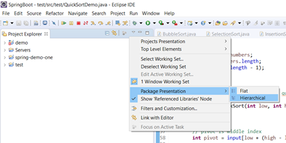
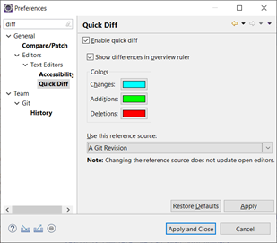

### open perspective

Window/ perspective/ open perspective/ Java

### Run config: maven clean, install

Tao maven config run
Goal: clean install

### Copy qualified name

right click/ select to copy full name of Obj
Co the tao class voi interface nhanh

Close Project va filter

### Xem list file

### Quick diff

